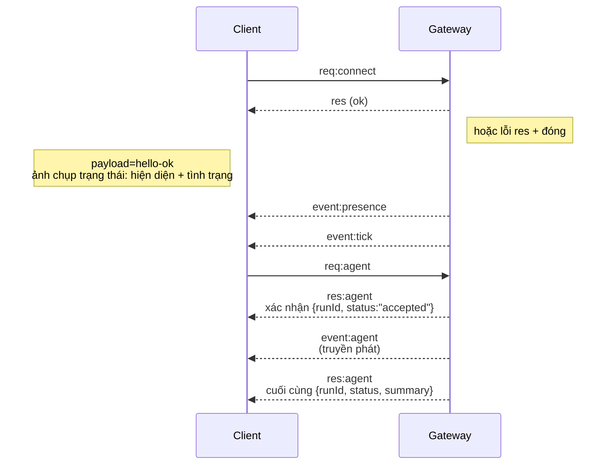

---
read_when:
    - Làm việc với giao thức Gateway, các ứng dụng khách hoặc các phương thức truyền tải
summary: Kiến trúc, các thành phần và luồng máy khách của Gateway WebSocket
title: Kiến trúc Gateway
x-i18n:
    generated_at: "2026-07-12T07:47:40Z"
    model: gpt-5.6
    postprocess_version: locale-links-v1
    provider: openai
    source_hash: f8054bd87f738b957c24f8d6965d55365de2293d44902530a9ba778afa597cc7
    source_path: concepts/architecture.md
    workflow: 16
---

## Tổng quan

- Một **Gateway** duy nhất hoạt động lâu dài quản lý tất cả các kênh nhắn tin (WhatsApp qua
  Baileys, Telegram qua grammY, Slack, Discord, Signal, iMessage, WebChat).
- Các máy khách của mặt phẳng điều khiển (ứng dụng macOS, CLI, giao diện web, tác vụ tự động hóa) kết nối với
  Gateway qua **WebSocket** trên máy chủ liên kết đã cấu hình (mặc định
  `127.0.0.1:18789`).
- Các **Node** (macOS/iOS/Android/không giao diện) cũng kết nối qua **WebSocket**, nhưng
  khai báo `role: node` cùng các khả năng/lệnh cụ thể.
- Mỗi máy chủ chỉ có một Gateway; đây là nơi duy nhất mở phiên WhatsApp.
- **Máy chủ canvas** được máy chủ HTTP của Gateway cung cấp tại:
  - `/__openclaw__/canvas/` (HTML/CSS/JS mà tác tử có thể chỉnh sửa)
  - `/__openclaw__/a2ui/` (máy chủ A2UI)

  Máy chủ này sử dụng cùng cổng với Gateway (mặc định `18789`).

## Thành phần và luồng

### Gateway (tiến trình nền)

- Duy trì các kết nối với nhà cung cấp.
- Cung cấp API WS có định kiểu (yêu cầu, phản hồi, sự kiện do máy chủ đẩy).
- Xác thực các khung dữ liệu đến theo JSON Schema.
- Phát các sự kiện như `agent`, `chat`, `presence`, `health`, `heartbeat`, `cron`.

### Máy khách (ứng dụng Mac / CLI / trang quản trị web)

- Mỗi máy khách có một kết nối WS.
- Gửi yêu cầu (`health`, `status`, `send`, `agent`, `system-presence`).
- Đăng ký nhận sự kiện (`tick`, `agent`, `presence`, `shutdown`).

### Node (macOS / iOS / Android / không giao diện)

- Kết nối với **cùng máy chủ WS** bằng `role: node`.
- Cung cấp danh tính thiết bị trong `connect`; quá trình ghép đôi **dựa trên thiết bị** (vai trò `node`) và
  việc phê duyệt được lưu trong kho ghép đôi thiết bị.
- Cung cấp các lệnh như `canvas.*`, `camera.*`, `screen.record`, `location.get`.

Chi tiết giao thức: [Giao thức Gateway](/vi/gateway/protocol)

### WebChat

- Giao diện tĩnh sử dụng API WS của Gateway để truy xuất lịch sử trò chuyện và gửi tin nhắn.
- Trong các thiết lập từ xa, kết nối qua cùng đường hầm SSH/Tailscale như các
  máy khách khác.

## Vòng đời kết nối (một máy khách)



## Giao thức truyền dẫn (tóm tắt)

- Phương thức truyền tải: WebSocket, các khung văn bản chứa tải trọng JSON.
- Khung đầu tiên **phải** là `connect`.
- Sau khi bắt tay:
  - Yêu cầu: `{type:"req", id, method, params}` → `{type:"res", id, ok, payload|error}`
  - Sự kiện: `{type:"event", event, payload, seq?, stateVersion?}`
- `hello-ok.features.methods` / `events` là siêu dữ liệu khám phá, không phải
  bản kết xuất được tạo ra của mọi tuyến trợ giúp có thể gọi.
- Xác thực bằng bí mật dùng chung sử dụng `connect.params.auth.token` hoặc
  `connect.params.auth.password`, tùy theo chế độ xác thực Gateway đã cấu hình.
- Các chế độ mang danh tính như Tailscale Serve
  (`gateway.auth.allowTailscale: true`) hoặc `gateway.auth.mode: "trusted-proxy"`
  không phải loopback đáp ứng yêu cầu xác thực bằng tiêu đề yêu cầu
  thay vì `connect.params.auth.*`.
- `gateway.auth.mode: "none"` cho lưu lượng vào riêng tư sẽ vô hiệu hóa hoàn toàn
  xác thực bằng bí mật dùng chung; không sử dụng chế độ này cho lưu lượng vào công khai/không đáng tin cậy.
- Khóa đảm bảo tính lũy đẳng là bắt buộc đối với các phương thức gây tác dụng phụ (`send`, `agent`) để
  thử lại an toàn; máy chủ duy trì bộ nhớ đệm loại bỏ trùng lặp tồn tại trong thời gian ngắn.
- Node phải bao gồm `role: "node"` cùng các khả năng/lệnh/quyền trong `connect`.

## Ghép đôi và độ tin cậy cục bộ

- Tất cả máy khách WS (người vận hành + Node) đều bao gồm **danh tính thiết bị** trong `connect`.
- ID thiết bị mới cần được phê duyệt ghép đôi; Gateway cấp **token thiết bị**
  cho các lần kết nối tiếp theo.
- Các kết nối local loopback trực tiếp có thể được tự động phê duyệt để duy trì trải nghiệm
  mượt mà trên cùng máy chủ.
- OpenClaw cũng có một đường dẫn tự kết nối hẹp, cục bộ trong phần phụ trợ/vùng chứa dành cho
  các luồng trợ giúp đáng tin cậy sử dụng bí mật dùng chung.
- Các kết nối qua tailnet và LAN, bao gồm cả liên kết tailnet trên cùng máy chủ, vẫn yêu cầu
  phê duyệt ghép đôi rõ ràng.
- Tất cả kết nối phải ký nonce `connect.challenge`. Tải trọng chữ ký `v3`
  cũng liên kết `platform` và `deviceFamily`; Gateway cố định siêu dữ liệu đã ghép đôi khi
  kết nối lại và yêu cầu ghép đôi sửa chữa khi siêu dữ liệu thay đổi.
- Các kết nối **không cục bộ** vẫn yêu cầu phê duyệt rõ ràng.
- Xác thực Gateway (`gateway.auth.*`) vẫn áp dụng cho **tất cả** kết nối, dù cục bộ hay
  từ xa.

Chi tiết: [Giao thức Gateway](/vi/gateway/protocol), [Ghép đôi](/vi/channels/pairing),
[Bảo mật](/vi/gateway/security).

## Định kiểu giao thức và sinh mã

- Các lược đồ TypeBox định nghĩa giao thức.
- JSON Schema được tạo từ các lược đồ đó.
- Các mô hình Swift được tạo từ JSON Schema.

## Truy cập từ xa

- Ưu tiên: Tailscale hoặc VPN.
- Phương án thay thế: đường hầm SSH

  ```bash
  ssh -N -L 18789:127.0.0.1:18789 user@gateway-host
  ```

- Cùng quy trình bắt tay và token xác thực được áp dụng qua đường hầm.
- Có thể bật TLS và tùy chọn ghim chứng chỉ cho WS trong các thiết lập từ xa.

## Tổng quan vận hành

- Khởi động: `openclaw gateway` (chạy ở tiền cảnh, ghi nhật ký vào stdout).
- Tình trạng: `health` qua WS (cũng được bao gồm trong `hello-ok`).
- Giám sát: launchd/systemd để tự động khởi động lại.

## Bất biến

- Chính xác một Gateway kiểm soát một phiên Baileys trên mỗi máy chủ.
- Bắt tay là bắt buộc; mọi khung đầu tiên không phải JSON hoặc không phải `connect` đều khiến kết nối bị đóng ngay lập tức.
- Các sự kiện không được phát lại; máy khách phải làm mới khi có khoảng trống.

## Liên quan

- [Vòng lặp tác tử](/vi/concepts/agent-loop) — chu kỳ thực thi tác tử chi tiết
- [Giao thức Gateway](/vi/gateway/protocol) — hợp đồng giao thức WebSocket
- [Hàng đợi](/vi/concepts/queue) — hàng đợi lệnh và xử lý đồng thời
- [Bảo mật](/vi/gateway/security) — mô hình tin cậy và tăng cường bảo mật
