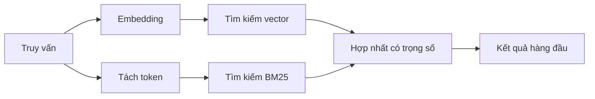

---
read_when:
    - Bạn muốn hiểu cách memory_search hoạt động
    - Bạn muốn chọn một nhà cung cấp embedding
    - Bạn muốn tinh chỉnh chất lượng tìm kiếm
summary: Cách tìm kiếm bộ nhớ tìm các ghi chú liên quan bằng embedding và truy xuất lai
title: Tìm kiếm bộ nhớ
x-i18n:
    generated_at: "2026-07-19T05:46:33Z"
    model: gpt-5.6
    postprocess_version: locale-links-v1
    prompt_version: 32
    provider: openai
    source_hash: e7be013665593c82890d3e0586136385f9b17e8d76f18e85abeab7304f34264d
    source_path: concepts/memory-search.md
    workflow: 16
---

`memory_search` tìm các ghi chú liên quan trong tệp bộ nhớ của bạn, ngay cả khi
cách diễn đạt khác với văn bản gốc. Tính năng này chia bộ nhớ thành các phần nhỏ và
tìm kiếm chúng bằng embedding, từ khóa hoặc cả hai.

## Bắt đầu nhanh

OpenClaw mặc định sử dụng embedding của OpenAI. Để sử dụng nhà cung cấp khác, hãy đặt
rõ ràng:

```json5
{
  agents: {
    defaults: {
      memorySearch: {
        provider: "openai", // hoặc "gemini", "voyage", "mistral", "bedrock", "local", "ollama", "lmstudio", "github-copilot", "openai-compatible"
      },
    },
  },
}
```

`provider` cũng có thể tham chiếu một mục `models.providers.<id>` tùy chỉnh (ví dụ:
`ollama-5080`), miễn là mục đó đặt `api` thành `"ollama"` hoặc
một ID nhà cung cấp khác có bộ điều hợp embedding bộ nhớ.

Để dùng embedding cục bộ mà không cần khóa API, hãy cài đặt plugin nhà cung cấp llama.cpp
chính thức và đặt `provider: "local"`:

```bash
openclaw plugins install @openclaw/llama-cpp-provider
```

Các bản checkout mã nguồn vẫn cần phê duyệt bản dựng native: `pnpm approve-builds`, sau đó
`pnpm rebuild node-llama-cpp`.

Một số endpoint embedding tương thích với OpenAI yêu cầu các nhãn `input_type`
bất đối xứng, chẳng hạn như `"query"` cho tìm kiếm và `"document"`/`"passage"` cho các
phần đã lập chỉ mục. Đặt các giá trị này bằng `queryInputType` và `documentInputType`; xem
[Tham chiếu cấu hình bộ nhớ](/vi/reference/memory-config#provider-specific-config).

## Nhà cung cấp được hỗ trợ

| Nhà cung cấp      | ID                  | Cần khóa API | Ghi chú                                  |
| ----------------- | ------------------- | ------------ | ---------------------------------------- |
| Bedrock           | `bedrock`           | Không        | Sử dụng chuỗi thông tin xác thực AWS     |
| DeepInfra         | `deepinfra`         | Có           | Mô hình mặc định `BAAI/bge-m3`            |
| Gemini            | `gemini`            | Có           | Hỗ trợ lập chỉ mục hình ảnh/âm thanh     |
| GitHub Copilot    | `github-copilot`    | Không        | Sử dụng gói đăng ký Copilot của bạn      |
| Cục bộ            | `local`             | Không        | Mô hình GGUF, tự động tải xuống ~0.6 GB  |
| LM Studio         | `lmstudio`          | Không        | Máy chủ cục bộ/tự lưu trữ                |
| Mistral           | `mistral`           | Có           |                                          |
| Ollama            | `ollama`            | Không        | Máy chủ cục bộ/tự lưu trữ                |
| OpenAI            | `openai`            | Có           | Mặc định                                 |
| Tương thích OpenAI | `openai-compatible` | Thường cần   | Endpoint `/v1/embeddings` dùng chung        |
| Voyage            | `voyage`            | Có           |                                          |

## Cách hoạt động của tìm kiếm

OpenClaw chạy song song hai luồng truy xuất và hợp nhất kết quả:



- **Tìm kiếm vector** đối sánh ý nghĩa tương tự ("máy chủ gateway" khớp với "máy
  chạy OpenClaw").
- **Tìm kiếm từ khóa BM25** đối sánh các thuật ngữ chính xác (ID, chuỗi lỗi, khóa
  cấu hình).
- **Tìm kiếm tên tệp** lập chỉ mục đường dẫn riêng biệt với nội dung ghi chú. Đường dẫn đầy đủ
  chính xác, tên cơ sở và phần thân tên tệp được xếp hạng cao hơn các kết quả khớp một phần với đường dẫn,
  trong khi đoạn trích và điểm từ khóa trong nội dung vẫn lấy từ nội dung ghi chú.

Nếu chỉ có một luồng khả dụng, luồng đó sẽ chạy độc lập.

**Chế độ chỉ FTS.** Đặt `provider: "none"` để chủ động tắt embedding
và chỉ tìm kiếm bằng từ khóa. Nếu để trống `provider` hoặc đặt thành `"auto"`,
hệ thống cũng chuyển sang xếp hạng chỉ bằng từ khóa khi chưa cấu hình xác thực embedding
mà không báo lỗi; `provider: "local"` (nhà cung cấp GGUF/llama.cpp)
cũng hoạt động như vậy khi gặp lỗi.

**Nhà cung cấp được chỉ định rõ ràng không khả dụng.** Nếu bạn chỉ định rõ ràng bất kỳ nhà cung cấp nào khác
(ví dụ: `openai`, `ollama`, `gemini`) và nhà cung cấp đó không khả dụng tại
thời điểm yêu cầu (xác thực không hợp lệ, lỗi mạng), `memory_search` sẽ báo bộ nhớ
không khả dụng thay vì âm thầm hạ cấp xuống kết quả chỉ FTS. Điều này giúp
hiển thị rõ nhà cung cấp đã cấu hình nhưng đang bị lỗi. Đặt `provider: "none"` để chủ động
truy hồi chỉ bằng FTS, hoặc sửa cấu hình nhà cung cấp/xác thực để khôi phục xếp hạng
ngữ nghĩa.

## Cải thiện chất lượng tìm kiếm

Hai tính năng tùy chọn giúp xử lý lịch sử ghi chú lớn.

### Suy giảm theo thời gian

Trọng số xếp hạng của ghi chú cũ giảm dần để thông tin gần đây xuất hiện trước.
Với chu kỳ bán rã mặc định là 30 ngày, ghi chú từ tháng trước có điểm bằng 50% trọng số
ban đầu. `MEMORY.md` và các tệp không ghi ngày khác trong `memory/` có giá trị
lâu dài và không bao giờ bị suy giảm; chỉ các tệp `memory/YYYY-MM-DD.md` có ghi ngày mới bị suy giảm.

<Tip>
Bật tính năng này nếu tác nhân của bạn có nhiều tháng ghi chú hằng ngày và thông tin cũ
liên tục xếp hạng cao hơn ngữ cảnh gần đây.
</Tip>

### MMR (tính đa dạng)

Giảm kết quả trùng lặp. Nếu năm ghi chú đều đề cập đến cùng một cấu hình bộ định tuyến,
MMR bảo đảm các kết quả hàng đầu bao quát nhiều chủ đề khác nhau thay vì lặp lại.

<Tip>
Bật tính năng này nếu `memory_search` liên tục trả về các đoạn trích gần như trùng lặp từ
các ghi chú hằng ngày khác nhau.
</Tip>

### Bật cả hai

```json5
{
  agents: {
    defaults: {
      memorySearch: {
        query: {
          hybrid: {
            mmr: { enabled: true },
            temporalDecay: { enabled: true },
          },
        },
      },
    },
  },
}
```

## Bộ nhớ đa phương thức

Với `gemini-embedding-2-preview`, bạn có thể lập chỉ mục hình ảnh và âm thanh cùng với
Markdown. Tính năng này chỉ áp dụng cho các tệp trong `memorySearch.extraPaths`; các thư mục gốc
bộ nhớ mặc định (`MEMORY.md`, `memory/*.md`) vẫn chỉ hỗ trợ Markdown. Truy vấn tìm kiếm
vẫn là văn bản nhưng có thể đối sánh với nội dung hình ảnh và âm thanh. Xem
[Tham chiếu cấu hình bộ nhớ](/vi/reference/memory-config#multimodal-memory-gemini)
để biết cách thiết lập.

## Tìm kiếm bộ nhớ phiên

Để truy hồi toàn văn chính xác từ bản ghi phiên, hãy sử dụng [`sessions_search`](/vi/concepts/session-search)
rồi mở một kết quả bằng `sessions_history`. Tìm kiếm bộ nhớ phiên vẫn là phần bổ trợ
ngữ nghĩa mang tính thử nghiệm.

Bạn có thể tùy chọn lập chỉ mục bản ghi phiên để `memory_search` có thể truy hồi các
cuộc hội thoại trước đó. Tính năng này yêu cầu chủ động bật: đặt `experimental.sessionMemory: true` và thêm
`"sessions"` vào `sources` (`sources` mặc định là `["memory"]`).

Các kết quả phiên tuân theo `tools.sessions.visibility`: `"tree"` mặc định hiển thị
phiên hiện tại, các phiên do phiên đó khởi tạo và các phiên nhóm của cùng tác nhân được theo dõi
thông qua nhận biết nhóm xung quanh. Với `session.dmScope: "main"`, cấu hình DM nhiều người dùng
chia sẻ phiên chính đó, vì vậy người dùng được định tuyến đến đó có thể truy hồi nội dung
từ các nhóm mà phiên theo dõi. Sử dụng `dmScope` riêng cho từng người ngang hàng để cô lập DM, hoặc đặt
khả năng hiển thị thành `"self"` để không đọc các phiên được theo dõi xung quanh. Các
phiên khác không liên quan của cùng tác nhân vẫn yêu cầu khả năng hiển thị `"agent"`.

Khi sử dụng backend QMD, cũng hãy đặt `memory.qmd.sessions.enabled: true` để
bản ghi được xuất vào bộ sưu tập QMD; chỉ `experimental.sessionMemory`
và `sources` sẽ không xuất bản ghi vào QMD. Xem
[tham chiếu cấu hình](/vi/reference/memory-config#session-memory-search-experimental).

## Khắc phục sự cố

**Không có kết quả?** Chạy `openclaw memory status` để kiểm tra chỉ mục. Nếu trống, hãy chạy
`openclaw memory index --force`.

**Chỉ khớp từ khóa?** Nhà cung cấp embedding của bạn có thể chưa được cấu hình. Hãy kiểm tra
`openclaw memory status --deep`.

**Embedding cục bộ hết thời gian chờ?** `ollama`, `lmstudio` và `local` mặc định sử dụng
thời gian chờ lô nội tuyến dài hơn. Nếu máy chủ chỉ đơn giản là chậm, hãy đặt
`agents.defaults.memorySearch.sync.embeddingBatchTimeoutSeconds` và chạy lại
`openclaw memory index --force`.

**Không tìm thấy văn bản CJK?** Tạo lại chỉ mục FTS bằng
`openclaw memory index --force`.

## Liên quan

- [Tổng quan về bộ nhớ](/vi/concepts/memory)
- [Active Memory](/vi/concepts/active-memory)
- [Công cụ bộ nhớ tích hợp sẵn](/vi/concepts/memory-builtin)
- [Tham chiếu cấu hình bộ nhớ](/vi/reference/memory-config)
