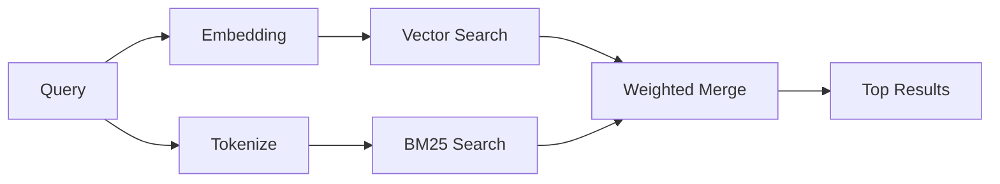

---
read_when:
    - Bạn muốn hiểu cách memory_search hoạt động
    - Bạn muốn chọn một nhà cung cấp embedding
    - Bạn muốn tinh chỉnh chất lượng tìm kiếm
summary: Cách tìm kiếm bộ nhớ tìm các ghi chú liên quan bằng embeddings và truy xuất lai
title: Tìm kiếm bộ nhớ
x-i18n:
    generated_at: "2026-06-28T22:33:24Z"
    model: gpt-5.5
    postprocess_version: locale-links-v1
    provider: openai
    source_hash: 32ffb9d996851566eb92b7812c5425f545ecbb5387a0a445686df35a6c8ae143
    source_path: concepts/memory-search.md
    workflow: 16
---

`memory_search` tìm các ghi chú liên quan từ tệp bộ nhớ của bạn, ngay cả khi
cách diễn đạt khác với văn bản gốc. Công cụ này hoạt động bằng cách lập chỉ mục bộ nhớ thành các
đoạn nhỏ và tìm kiếm chúng bằng embeddings, từ khóa hoặc cả hai.

## Bắt đầu nhanh

Tìm kiếm bộ nhớ mặc định dùng OpenAI embeddings. Để dùng một backend embedding
khác, hãy đặt rõ provider:

```json5
{
  agents: {
    defaults: {
      memorySearch: {
        provider: "openai", // or "gemini", "local", "ollama", "openai-compatible", etc.
      },
    },
  },
}
```

Đối với các thiết lập nhiều endpoint với provider dành riêng cho bộ nhớ, `provider` cũng có thể
là một mục `models.providers.<id>` tùy chỉnh, chẳng hạn như `ollama-5080`, khi
provider đó đặt `api: "ollama"` hoặc một chủ sở hữu adapter embedding bộ nhớ khác.

Đối với embeddings cục bộ không cần khóa API, hãy cài đặt
`@openclaw/llama-cpp-provider` và đặt `provider: "local"`. Các source checkout
vẫn có thể yêu cầu phê duyệt bản dựng native: `pnpm approve-builds` rồi
`pnpm rebuild node-llama-cpp`.

Một số endpoint embedding tương thích với OpenAI yêu cầu nhãn bất đối xứng như
`input_type: "query"` cho tìm kiếm và `input_type: "document"` hoặc `"passage"`
cho các đoạn đã lập chỉ mục. Cấu hình các mục này bằng `memorySearch.queryInputType` và
`memorySearch.documentInputType`; xem [Tham chiếu cấu hình bộ nhớ](/vi/reference/memory-config#provider-specific-config).

## Provider được hỗ trợ

| Provider          | ID                  | Cần khóa API | Ghi chú                       |
| ----------------- | ------------------- | ------------ | ----------------------------- |
| Bedrock           | `bedrock`           | Không        | Dùng chuỗi thông tin xác thực AWS |
| DeepInfra         | `deepinfra`         | Có           | Mặc định: `BAAI/bge-m3`       |
| Gemini            | `gemini`            | Có           | Hỗ trợ lập chỉ mục hình ảnh/âm thanh |
| GitHub Copilot    | `github-copilot`    | Không        | Dùng gói đăng ký Copilot      |
| Local             | `local`             | Không        | Mô hình GGUF, tải xuống ~0,6 GB |
| Mistral           | `mistral`           | Có           |                               |
| Ollama            | `ollama`            | Không        | Cục bộ/tự lưu trữ             |
| OpenAI            | `openai`            | Có           | Mặc định                      |
| OpenAI-compatible | `openai-compatible` | Thường cần   | `/v1/embeddings` chung        |
| Voyage            | `voyage`            | Có           |                               |

## Cách tìm kiếm hoạt động

OpenClaw chạy song song hai đường truy xuất và hợp nhất kết quả:



- **Tìm kiếm vector** tìm các ghi chú có ý nghĩa tương tự ("gateway host" khớp với
  "the machine running OpenClaw").
- **Tìm kiếm từ khóa BM25** tìm các kết quả khớp chính xác (ID, chuỗi lỗi, khóa cấu hình).

Nếu chỉ có một đường khả dụng, đường còn lại sẽ chạy một mình. Chế độ chỉ FTS có chủ đích
(`provider: "none"`) và lựa chọn provider tự động/mặc định vẫn có thể dùng
xếp hạng từ vựng khi embeddings không khả dụng.

Các provider embedding không cục bộ được chỉ định rõ thì khác. Nếu bạn đặt
`memorySearch.provider` thành một provider cụ thể dựa trên từ xa và provider đó
không khả dụng lúc chạy, `memory_search` sẽ báo bộ nhớ là không khả dụng thay vì
âm thầm dùng kết quả chỉ FTS. Điều này giúp provider ngữ nghĩa đã cấu hình bị lỗi
luôn hiển thị. Đặt `provider: "none"` để cố ý truy hồi chỉ FTS, hoặc sửa
cấu hình provider/auth để khôi phục xếp hạng ngữ nghĩa.

## Cải thiện chất lượng tìm kiếm

Hai tính năng tùy chọn giúp ích khi bạn có lịch sử ghi chú lớn:

### Suy giảm theo thời gian

Ghi chú cũ dần mất trọng số xếp hạng để thông tin gần đây xuất hiện trước.
Với chu kỳ bán rã mặc định là 30 ngày, một ghi chú từ tháng trước đạt 50% trọng số
ban đầu của nó. Các tệp lâu dài như `MEMORY.md` không bao giờ bị suy giảm.

<Tip>
Bật suy giảm theo thời gian nếu agent của bạn có nhiều tháng ghi chú hằng ngày và thông tin cũ
liên tục xếp hạng cao hơn ngữ cảnh gần đây.
</Tip>

### MMR (đa dạng)

Giảm các kết quả dư thừa. Nếu năm ghi chú đều nhắc đến cùng một cấu hình router, MMR
đảm bảo các kết quả đầu bao phủ các chủ đề khác nhau thay vì lặp lại.

<Tip>
Bật MMR nếu `memory_search` liên tục trả về các đoạn gần trùng lặp từ
những ghi chú hằng ngày khác nhau.
</Tip>

### Bật cả hai

```json5
{
  agents: {
    defaults: {
      memorySearch: {
        query: {
          hybrid: {
            mmr: { enabled: true },
            temporalDecay: { enabled: true },
          },
        },
      },
    },
  },
}
```

## Bộ nhớ đa phương thức

Với Gemini Embedding 2, bạn có thể lập chỉ mục hình ảnh và tệp âm thanh cùng với
Markdown. Truy vấn tìm kiếm vẫn là văn bản, nhưng chúng khớp với nội dung hình ảnh và âm thanh.
Xem [Tham chiếu cấu hình bộ nhớ](/vi/reference/memory-config) để biết cách thiết lập.

## Tìm kiếm bộ nhớ phiên

Bạn có thể tùy chọn lập chỉ mục transcript phiên để `memory_search` có thể nhớ lại
các cuộc trò chuyện trước đó. Đây là tùy chọn bật qua
`memorySearch.experimental.sessionMemory` và `sources: ["sessions"]`; danh sách source mặc định
chỉ gồm bộ nhớ. Cờ thử nghiệm bật lập chỉ mục transcript phiên,
trong khi `sources` kiểm soát việc các đoạn phiên có được tìm kiếm hay không.

Các kết quả từ phiên tuân theo `tools.sessions.visibility`: thiết lập mặc định `tree` chỉ
hiển thị phiên hiện tại và các phiên do nó sinh ra. Để nhớ lại một phiên không liên quan
cùng agent được Gateway điều phối từ một phiên DM riêng, hãy chủ động
mở rộng khả năng hiển thị thành `agent`.

Khi dùng QMD, cũng đặt `memory.qmd.sessions.enabled: true` để transcript được
xuất vào một bộ sưu tập QMD. Xem
[tham chiếu cấu hình](/vi/reference/memory-config) để biết chi tiết.

## Khắc phục sự cố

**Không có kết quả?** Chạy `openclaw memory status` để kiểm tra chỉ mục. Nếu trống, chạy
`openclaw memory index --force`.

**Chỉ có kết quả khớp từ khóa?** Provider embedding của bạn có thể chưa được cấu hình. Kiểm tra
`openclaw memory status --deep`.

**Embeddings cục bộ hết thời gian chờ?** `ollama`, `lmstudio` và `local` mặc định dùng thời gian chờ
batch inline dài hơn. Nếu host chỉ đơn giản là chậm, hãy đặt
`agents.defaults.memorySearch.sync.embeddingBatchTimeoutSeconds` và chạy lại
`openclaw memory index --force`.

**Không tìm thấy văn bản CJK?** Xây dựng lại chỉ mục FTS bằng
`openclaw memory index --force`.

## Đọc thêm

- [Active Memory](/vi/concepts/active-memory) -- bộ nhớ sub-agent cho các phiên trò chuyện tương tác
- [Bộ nhớ](/vi/concepts/memory) -- bố cục tệp, backend, công cụ
- [Tham chiếu cấu hình bộ nhớ](/vi/reference/memory-config) -- tất cả nút chỉnh cấu hình

## Liên quan

- [Tổng quan bộ nhớ](/vi/concepts/memory)
- [Active Memory](/vi/concepts/active-memory)
- [Công cụ bộ nhớ tích hợp](/vi/concepts/memory-builtin)
