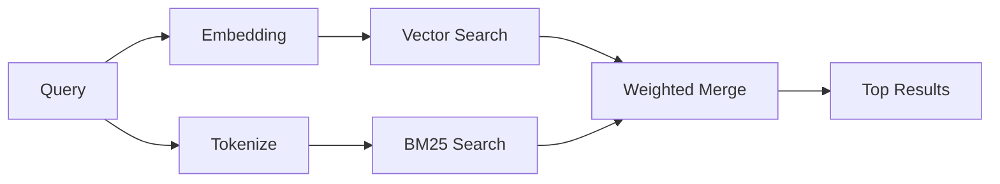

---
read_when:
    - Bạn muốn hiểu cách memory_search hoạt động
    - Bạn muốn chọn một nhà cung cấp mô hình nhúng
    - Bạn muốn tinh chỉnh chất lượng tìm kiếm
summary: Cách tính năng tìm kiếm bộ nhớ tìm các ghi chú liên quan bằng biểu diễn nhúng và truy xuất lai
title: Tìm kiếm bộ nhớ
x-i18n:
    generated_at: "2026-04-30T16:27:58Z"
    model: gpt-5.5
    provider: openai
    source_hash: 7f40bbe32453a28070ffc67f19a4c06e2fe59a24237a2aef353f4b9b8260bcf2
    source_path: concepts/memory-search.md
    workflow: 16
---

`memory_search` tìm các ghi chú liên quan từ những tệp bộ nhớ của bạn, ngay cả khi
cách diễn đạt khác với văn bản gốc. Công cụ này hoạt động bằng cách lập chỉ mục
bộ nhớ thành các đoạn nhỏ và tìm kiếm chúng bằng biểu diễn nhúng, từ khóa, hoặc cả hai.

## Bắt đầu nhanh

Nếu bạn đã cấu hình gói đăng ký GitHub Copilot, OpenAI, Gemini, Voyage, hoặc khóa
API Mistral, tìm kiếm bộ nhớ sẽ tự động hoạt động. Để đặt nhà cung cấp
một cách tường minh:

```json5
{
  agents: {
    defaults: {
      memorySearch: {
        provider: "openai", // or "gemini", "local", "ollama", etc.
      },
    },
  },
}
```

Với các thiết lập nhiều endpoint, `provider` cũng có thể là một mục tùy chỉnh
`models.providers.<id>`, chẳng hạn như `ollama-5080`, khi nhà cung cấp đó đặt
`api: "ollama"` hoặc một chủ sở hữu bộ chuyển đổi biểu diễn nhúng khác.

Để dùng biểu diễn nhúng cục bộ không cần khóa API, hãy đặt `provider: "local"`. Các bản
cài đặt đóng gói giữ lại runtime gốc `node-llama-cpp` trong cây runtime-deps Plugin
được OpenClaw quản lý; chạy `openclaw doctor --fix` nếu cây đó cần được sửa chữa.

Một số endpoint biểu diễn nhúng tương thích với OpenAI yêu cầu nhãn bất đối xứng như
`input_type: "query"` cho tìm kiếm và `input_type: "document"` hoặc `"passage"`
cho các đoạn đã lập chỉ mục. Cấu hình các nhãn đó bằng `memorySearch.queryInputType` và
`memorySearch.documentInputType`; xem [tham chiếu cấu hình bộ nhớ](/vi/reference/memory-config#provider-specific-config).

## Nhà cung cấp được hỗ trợ

| Nhà cung cấp   | ID               | Cần khóa API | Ghi chú                                              |
| -------------- | ---------------- | ------------ | ---------------------------------------------------- |
| Bedrock        | `bedrock`        | Không        | Tự động phát hiện khi chuỗi thông tin xác thực AWS phân giải được |
| Gemini         | `gemini`         | Có           | Hỗ trợ lập chỉ mục hình ảnh/âm thanh                 |
| GitHub Copilot | `github-copilot` | Không        | Tự động phát hiện, dùng gói đăng ký Copilot          |
| Local          | `local`          | Không        | Mô hình GGUF, tải xuống ~0,6 GB                      |
| Mistral        | `mistral`        | Có           | Tự động phát hiện                                    |
| Ollama         | `ollama`         | Không        | Cục bộ, phải đặt tường minh                          |
| OpenAI         | `openai`         | Có           | Tự động phát hiện, nhanh                             |
| Voyage         | `voyage`         | Có           | Tự động phát hiện                                    |

## Cách tìm kiếm hoạt động

OpenClaw chạy song song hai đường truy hồi và hợp nhất kết quả:



- **Tìm kiếm vector** tìm các ghi chú có ý nghĩa tương tự ("gateway host" khớp với
  "máy đang chạy OpenClaw").
- **Tìm kiếm từ khóa BM25** tìm các kết quả khớp chính xác (ID, chuỗi lỗi, khóa cấu hình).

Nếu chỉ có một đường khả dụng (không có biểu diễn nhúng hoặc không có FTS), đường còn lại sẽ chạy riêng.

Khi biểu diễn nhúng không khả dụng, OpenClaw vẫn dùng xếp hạng từ vựng trên kết quả FTS thay vì chỉ quay về thứ tự khớp chính xác thô. Chế độ suy giảm đó tăng điểm cho các đoạn có mức độ phủ thuật ngữ truy vấn mạnh hơn và đường dẫn tệp liên quan, giúp khả năng truy hồi vẫn hữu ích ngay cả khi không có `sqlite-vec` hoặc nhà cung cấp biểu diễn nhúng.

## Cải thiện chất lượng tìm kiếm

Hai tính năng tùy chọn sẽ hữu ích khi bạn có lịch sử ghi chú lớn:

### Suy giảm theo thời gian

Ghi chú cũ dần mất trọng số xếp hạng để thông tin gần đây xuất hiện trước.
Với chu kỳ bán rã mặc định 30 ngày, một ghi chú từ tháng trước được tính 50%
trọng số ban đầu. Các tệp luôn có giá trị như `MEMORY.md` không bao giờ bị suy giảm.

<Tip>
Bật suy giảm theo thời gian nếu agent của bạn có nhiều tháng ghi chú hằng ngày và thông tin lỗi thời liên tục xếp trên ngữ cảnh gần đây.
</Tip>

### MMR (đa dạng)

Giảm các kết quả trùng lặp. Nếu năm ghi chú đều đề cập cùng một cấu hình router, MMR
đảm bảo các kết quả đứng đầu bao phủ những chủ đề khác nhau thay vì lặp lại.

<Tip>
Bật MMR nếu `memory_search` liên tục trả về các đoạn gần như trùng lặp từ
những ghi chú hằng ngày khác nhau.
</Tip>

### Bật cả hai

```json5
{
  agents: {
    defaults: {
      memorySearch: {
        query: {
          hybrid: {
            mmr: { enabled: true },
            temporalDecay: { enabled: true },
          },
        },
      },
    },
  },
}
```

## Bộ nhớ đa phương thức

Với Gemini Embedding 2, bạn có thể lập chỉ mục hình ảnh và tệp âm thanh cùng với
Markdown. Truy vấn tìm kiếm vẫn là văn bản, nhưng chúng khớp với nội dung hình ảnh và âm thanh.
Xem [tham chiếu cấu hình bộ nhớ](/vi/reference/memory-config) để thiết lập.

## Tìm kiếm bộ nhớ phiên

Bạn có thể tùy chọn lập chỉ mục bản ghi phiên để `memory_search` có thể nhớ lại
các cuộc trò chuyện trước đó. Tính năng này là tùy chọn tham gia qua
`memorySearch.experimental.sessionMemory`. Xem
[tham chiếu cấu hình](/vi/reference/memory-config) để biết chi tiết.

## Khắc phục sự cố

**Không có kết quả?** Chạy `openclaw memory status` để kiểm tra chỉ mục. Nếu trống, hãy chạy
`openclaw memory index --force`.

**Chỉ có kết quả khớp từ khóa?** Nhà cung cấp biểu diễn nhúng của bạn có thể chưa được cấu hình. Kiểm tra
`openclaw memory status --deep`.

**Biểu diễn nhúng cục bộ hết thời gian chờ?** `ollama`, `lmstudio`, và `local` mặc định dùng thời gian chờ lô nội tuyến dài hơn. Nếu máy chủ chỉ đơn giản là chậm, hãy đặt
`agents.defaults.memorySearch.sync.embeddingBatchTimeoutSeconds` rồi chạy lại
`openclaw memory index --force`.

**Không tìm thấy văn bản CJK?** Xây dựng lại chỉ mục FTS bằng
`openclaw memory index --force`.

## Đọc thêm

- [Active Memory](/vi/concepts/active-memory) -- bộ nhớ sub-agent cho các phiên trò chuyện tương tác
- [Bộ nhớ](/vi/concepts/memory) -- bố cục tệp, backend, công cụ
- [Tham chiếu cấu hình bộ nhớ](/vi/reference/memory-config) -- tất cả nút cấu hình

## Liên quan

- [Tổng quan về bộ nhớ](/vi/concepts/memory)
- [Active memory](/vi/concepts/active-memory)
- [Công cụ bộ nhớ tích hợp](/vi/concepts/memory-builtin)
