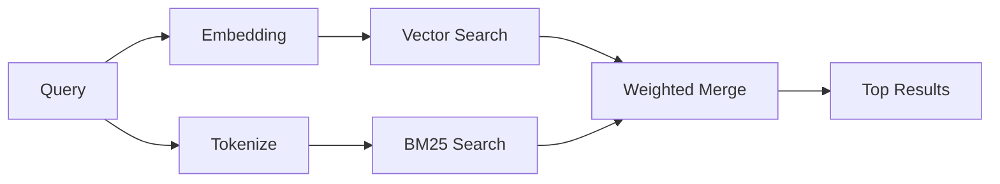

---
read_when:
    - Bạn muốn hiểu cách memory_search hoạt động
    - Bạn muốn chọn một nhà cung cấp vector nhúng
    - Bạn muốn tinh chỉnh chất lượng tìm kiếm
summary: Cách tìm kiếm bộ nhớ tìm các ghi chú liên quan bằng biểu diễn nhúng và truy xuất lai
title: Tìm kiếm bộ nhớ
x-i18n:
    generated_at: "2026-05-02T10:39:13Z"
    model: gpt-5.5
    provider: openai
    source_hash: 2a71fb0809d5c70689e8046f854e4b4b4e79f45769ac2964e40a762ebb4e91a8
    source_path: concepts/memory-search.md
    workflow: 16
---

`memory_search` tìm các ghi chú liên quan từ các tệp bộ nhớ của bạn, ngay cả khi
cách diễn đạt khác với văn bản gốc. Công cụ này hoạt động bằng cách lập chỉ mục
bộ nhớ thành các đoạn nhỏ và tìm kiếm chúng bằng embedding, từ khóa, hoặc cả hai.

## Bắt đầu nhanh

Nếu bạn đã cấu hình gói đăng ký GitHub Copilot, khóa API OpenAI, Gemini, Voyage hoặc Mistral,
tìm kiếm bộ nhớ sẽ tự động hoạt động. Để đặt một nhà cung cấp
rõ ràng:

```json5
{
  agents: {
    defaults: {
      memorySearch: {
        provider: "openai", // or "gemini", "local", "ollama", etc.
      },
    },
  },
}
```

Với các thiết lập nhiều endpoint, `provider` cũng có thể là một mục
`models.providers.<id>` tùy chỉnh, chẳng hạn như `ollama-5080`, khi nhà cung cấp đó đặt
`api: "ollama"` hoặc một chủ sở hữu bộ chuyển đổi embedding khác.

Đối với embedding cục bộ không cần khóa API, đặt `provider: "local"`. Các bản checkout
mã nguồn vẫn có thể yêu cầu phê duyệt bản dựng native: `pnpm approve-builds` rồi
`pnpm rebuild node-llama-cpp`.

Một số endpoint embedding tương thích với OpenAI yêu cầu nhãn bất đối xứng như
`input_type: "query"` cho tìm kiếm và `input_type: "document"` hoặc `"passage"`
cho các đoạn đã lập chỉ mục. Cấu hình các mục đó bằng `memorySearch.queryInputType` và
`memorySearch.documentInputType`; xem [tham chiếu cấu hình bộ nhớ](/vi/reference/memory-config#provider-specific-config).

## Nhà cung cấp được hỗ trợ

| Nhà cung cấp   | ID               | Cần khóa API | Ghi chú                                                |
| -------------- | ---------------- | ------------ | ------------------------------------------------------ |
| Bedrock        | `bedrock`        | Không        | Tự động phát hiện khi chuỗi thông tin xác thực AWS phân giải được |
| Gemini         | `gemini`         | Có           | Hỗ trợ lập chỉ mục hình ảnh/âm thanh                   |
| GitHub Copilot | `github-copilot` | Không        | Tự động phát hiện, dùng gói đăng ký Copilot            |
| Cục bộ         | `local`          | Không        | Mô hình GGUF, tải xuống khoảng 0,6 GB                  |
| Mistral        | `mistral`        | Có           | Tự động phát hiện                                      |
| Ollama         | `ollama`         | Không        | Cục bộ, phải đặt rõ ràng                               |
| OpenAI         | `openai`         | Có           | Tự động phát hiện, nhanh                               |
| Voyage         | `voyage`         | Có           | Tự động phát hiện                                      |

## Cách tìm kiếm hoạt động

OpenClaw chạy song song hai đường truy xuất và hợp nhất kết quả:



- **Tìm kiếm vector** tìm các ghi chú có ý nghĩa tương tự ("gateway host" khớp với
  "the machine running OpenClaw").
- **Tìm kiếm từ khóa BM25** tìm các kết quả khớp chính xác (ID, chuỗi lỗi, khóa cấu hình).

Nếu chỉ có một đường khả dụng (không có embedding hoặc không có FTS), đường còn lại sẽ chạy riêng.

Khi không có embedding, OpenClaw vẫn dùng xếp hạng từ vựng trên kết quả FTS thay vì chỉ quay về thứ tự khớp chính xác thô. Chế độ suy giảm đó tăng hạng các đoạn có mức bao phủ thuật ngữ truy vấn mạnh hơn và đường dẫn tệp liên quan, giúp khả năng truy hồi vẫn hữu ích ngay cả khi không có `sqlite-vec` hoặc nhà cung cấp embedding.

## Cải thiện chất lượng tìm kiếm

Hai tính năng tùy chọn giúp ích khi bạn có lịch sử ghi chú lớn:

### Suy giảm theo thời gian

Các ghi chú cũ dần mất trọng số xếp hạng để thông tin gần đây xuất hiện trước.
Với thời gian bán rã mặc định là 30 ngày, một ghi chú từ tháng trước được tính 50%
trọng số ban đầu. Các tệp thường trực như `MEMORY.md` sẽ không bao giờ bị suy giảm.

<Tip>
Bật suy giảm theo thời gian nếu tác tử của bạn có nhiều tháng ghi chú hằng ngày và thông tin
cũ liên tục được xếp hạng cao hơn ngữ cảnh gần đây.
</Tip>

### MMR (đa dạng)

Giảm các kết quả trùng lặp. Nếu năm ghi chú đều đề cập cùng một cấu hình bộ định tuyến, MMR
đảm bảo các kết quả hàng đầu bao phủ các chủ đề khác nhau thay vì lặp lại.

<Tip>
Bật MMR nếu `memory_search` liên tục trả về các đoạn gần trùng lặp từ
các ghi chú hằng ngày khác nhau.
</Tip>

### Bật cả hai

```json5
{
  agents: {
    defaults: {
      memorySearch: {
        query: {
          hybrid: {
            mmr: { enabled: true },
            temporalDecay: { enabled: true },
          },
        },
      },
    },
  },
}
```

## Bộ nhớ đa phương thức

Với Gemini Embedding 2, bạn có thể lập chỉ mục hình ảnh và tệp âm thanh cùng với
Markdown. Truy vấn tìm kiếm vẫn là văn bản, nhưng chúng khớp với nội dung hình ảnh và âm thanh.
Xem [tham chiếu cấu hình bộ nhớ](/vi/reference/memory-config) để biết cách
thiết lập.

## Tìm kiếm bộ nhớ phiên

Bạn có thể tùy chọn lập chỉ mục bản ghi phiên để `memory_search` có thể nhớ lại
các cuộc trò chuyện trước đó. Tính năng này được chọn bật thông qua
`memorySearch.experimental.sessionMemory`. Xem
[tham chiếu cấu hình](/vi/reference/memory-config) để biết chi tiết.

## Khắc phục sự cố

**Không có kết quả?** Chạy `openclaw memory status` để kiểm tra chỉ mục. Nếu trống, chạy
`openclaw memory index --force`.

**Chỉ có kết quả khớp từ khóa?** Nhà cung cấp embedding của bạn có thể chưa được cấu hình. Kiểm tra
`openclaw memory status --deep`.

**Embedding cục bộ hết thời gian chờ?** `ollama`, `lmstudio`, và `local` dùng thời gian chờ
lô inline dài hơn theo mặc định. Nếu máy chủ chỉ đơn giản là chậm, đặt
`agents.defaults.memorySearch.sync.embeddingBatchTimeoutSeconds` và chạy lại
`openclaw memory index --force`.

**Không tìm thấy văn bản CJK?** Dựng lại chỉ mục FTS bằng
`openclaw memory index --force`.

## Đọc thêm

- [Active Memory](/vi/concepts/active-memory) -- bộ nhớ tác tử phụ cho các phiên trò chuyện tương tác
- [Bộ nhớ](/vi/concepts/memory) -- bố cục tệp, backend, công cụ
- [Tham chiếu cấu hình bộ nhớ](/vi/reference/memory-config) -- tất cả các nút chỉnh cấu hình

## Liên quan

- [Tổng quan bộ nhớ](/vi/concepts/memory)
- [Active Memory](/vi/concepts/active-memory)
- [Công cụ bộ nhớ tích hợp](/vi/concepts/memory-builtin)
