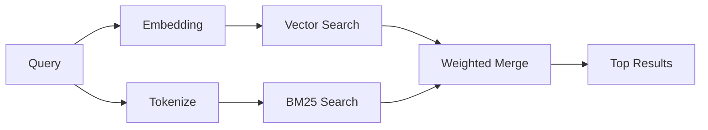

---
read_when:
    - Bạn muốn hiểu memory_search hoạt động như thế nào
    - Bạn muốn chọn một nhà cung cấp mô hình nhúng
    - Bạn muốn tinh chỉnh chất lượng tìm kiếm
summary: Cách tìm kiếm bộ nhớ tìm thấy các ghi chú liên quan bằng biểu diễn nhúng và truy xuất kết hợp
title: Tìm kiếm bộ nhớ
x-i18n:
    generated_at: "2026-04-29T22:37:52Z"
    model: gpt-5.5
    provider: openai
    source_hash: 3e6c44d90f49a797bda01b9a575928c128a334f89ae14fc3620e65562a866aa9
    source_path: concepts/memory-search.md
    workflow: 16
---

`memory_search` tìm các ghi chú liên quan từ các tệp bộ nhớ của bạn, ngay cả khi cách diễn đạt khác với văn bản gốc. Công cụ này hoạt động bằng cách lập chỉ mục bộ nhớ thành các đoạn nhỏ và tìm kiếm chúng bằng embeddings, từ khóa hoặc cả hai.

## Bắt đầu nhanh

Nếu bạn có gói đăng ký GitHub Copilot, hoặc đã cấu hình khóa API OpenAI, Gemini, Voyage hoặc Mistral, tính năng tìm kiếm bộ nhớ sẽ tự động hoạt động. Để đặt nhà cung cấp một cách rõ ràng:

```json5
{
  agents: {
    defaults: {
      memorySearch: {
        provider: "openai", // or "gemini", "local", "ollama", etc.
      },
    },
  },
}
```

Với các thiết lập nhiều endpoint, `provider` cũng có thể là một mục tùy chỉnh `models.providers.<id>`, chẳng hạn như `ollama-5080`, khi nhà cung cấp đó đặt `api: "ollama"` hoặc một chủ sở hữu adapter embedding khác.

Để dùng embeddings cục bộ không cần khóa API, hãy cài đặt gói runtime tùy chọn `node-llama-cpp` cạnh OpenClaw và dùng `provider: "local"`.

Một số endpoint embedding tương thích với OpenAI yêu cầu nhãn bất đối xứng như `input_type: "query"` cho tìm kiếm và `input_type: "document"` hoặc `"passage"` cho các đoạn đã lập chỉ mục. Cấu hình các giá trị đó bằng `memorySearch.queryInputType` và `memorySearch.documentInputType`; xem [tham chiếu cấu hình bộ nhớ](/vi/reference/memory-config#provider-specific-config).

## Nhà cung cấp được hỗ trợ

| Nhà cung cấp   | ID               | Cần khóa API | Ghi chú                                              |
| -------------- | ---------------- | ------------- | ---------------------------------------------------- |
| Bedrock        | `bedrock`        | Không         | Tự động phát hiện khi chuỗi thông tin xác thực AWS phân giải được |
| Gemini         | `gemini`         | Có            | Hỗ trợ lập chỉ mục hình ảnh/âm thanh                 |
| GitHub Copilot | `github-copilot` | Không         | Tự động phát hiện, dùng gói đăng ký Copilot          |
| Cục bộ         | `local`          | Không         | Mô hình GGUF, tải xuống ~0,6 GB                      |
| Mistral        | `mistral`        | Có            | Tự động phát hiện                                    |
| Ollama         | `ollama`         | Không         | Cục bộ, phải đặt rõ ràng                             |
| OpenAI         | `openai`         | Có            | Tự động phát hiện, nhanh                             |
| Voyage         | `voyage`         | Có            | Tự động phát hiện                                    |

## Cách tìm kiếm hoạt động

OpenClaw chạy song song hai luồng truy xuất và hợp nhất kết quả:



- **Tìm kiếm vector** tìm các ghi chú có ý nghĩa tương tự ("gateway host" khớp với "máy đang chạy OpenClaw").
- **Tìm kiếm từ khóa BM25** tìm các kết quả khớp chính xác (ID, chuỗi lỗi, khóa cấu hình).

Nếu chỉ có một luồng khả dụng (không có embeddings hoặc không có FTS), luồng còn lại sẽ chạy riêng.

Khi embeddings không khả dụng, OpenClaw vẫn dùng xếp hạng từ vựng trên kết quả FTS thay vì chỉ quay về thứ tự khớp chính xác thô. Chế độ suy giảm này tăng hạng các đoạn có mức độ bao phủ thuật ngữ truy vấn mạnh hơn và đường dẫn tệp liên quan, nhờ đó khả năng truy hồi vẫn hữu ích ngay cả khi không có `sqlite-vec` hoặc nhà cung cấp embedding.

## Cải thiện chất lượng tìm kiếm

Hai tính năng tùy chọn giúp ích khi bạn có lịch sử ghi chú lớn:

### Suy giảm theo thời gian

Ghi chú cũ dần giảm trọng số xếp hạng để thông tin gần đây xuất hiện trước. Với chu kỳ bán rã mặc định là 30 ngày, một ghi chú từ tháng trước đạt 50% trọng số ban đầu. Các tệp luôn có giá trị như `MEMORY.md` sẽ không bao giờ bị suy giảm.

<Tip>
Bật suy giảm theo thời gian nếu agent của bạn có nhiều tháng ghi chú hằng ngày và thông tin đã cũ thường xuyên xếp hạng cao hơn ngữ cảnh gần đây.
</Tip>

### MMR (đa dạng)

Giảm các kết quả trùng lặp. Nếu năm ghi chú đều nhắc đến cùng một cấu hình router, MMR đảm bảo các kết quả hàng đầu bao phủ những chủ đề khác nhau thay vì lặp lại.

<Tip>
Bật MMR nếu `memory_search` liên tục trả về các đoạn gần trùng lặp từ những ghi chú hằng ngày khác nhau.
</Tip>

### Bật cả hai

```json5
{
  agents: {
    defaults: {
      memorySearch: {
        query: {
          hybrid: {
            mmr: { enabled: true },
            temporalDecay: { enabled: true },
          },
        },
      },
    },
  },
}
```

## Bộ nhớ đa phương thức

Với Gemini Embedding 2, bạn có thể lập chỉ mục hình ảnh và tệp âm thanh cùng với Markdown. Truy vấn tìm kiếm vẫn là văn bản, nhưng sẽ khớp với nội dung hình ảnh và âm thanh. Xem [tham chiếu cấu hình bộ nhớ](/vi/reference/memory-config) để thiết lập.

## Tìm kiếm bộ nhớ phiên

Bạn có thể tùy chọn lập chỉ mục bản ghi phiên để `memory_search` có thể nhớ lại các cuộc trò chuyện trước đó. Tính năng này cần chọn bật qua `memorySearch.experimental.sessionMemory`. Xem [tham chiếu cấu hình](/vi/reference/memory-config) để biết chi tiết.

## Khắc phục sự cố

**Không có kết quả?** Chạy `openclaw memory status` để kiểm tra chỉ mục. Nếu trống, chạy `openclaw memory index --force`.

**Chỉ có kết quả khớp từ khóa?** Nhà cung cấp embedding của bạn có thể chưa được cấu hình. Kiểm tra `openclaw memory status --deep`.

**Embeddings cục bộ bị hết thời gian chờ?** `ollama`, `lmstudio` và `local` mặc định dùng thời gian chờ lô inline dài hơn. Nếu máy chủ chỉ đơn giản là chậm, đặt `agents.defaults.memorySearch.sync.embeddingBatchTimeoutSeconds` rồi chạy lại `openclaw memory index --force`.

**Không tìm thấy văn bản CJK?** Xây dựng lại chỉ mục FTS bằng `openclaw memory index --force`.

## Đọc thêm

- [Active Memory](/vi/concepts/active-memory) -- bộ nhớ sub-agent cho các phiên trò chuyện tương tác
- [Bộ nhớ](/vi/concepts/memory) -- bố cục tệp, backend, công cụ
- [Tham chiếu cấu hình bộ nhớ](/vi/reference/memory-config) -- tất cả nút cấu hình

## Liên quan

- [Tổng quan bộ nhớ](/vi/concepts/memory)
- [Active Memory](/vi/concepts/active-memory)
- [Công cụ bộ nhớ tích hợp](/vi/concepts/memory-builtin)
