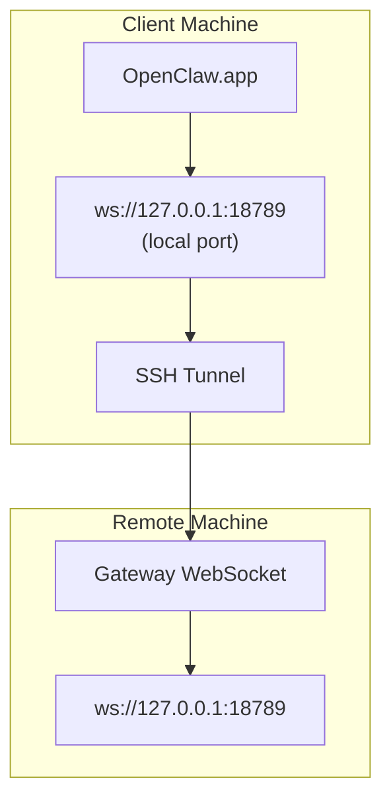

> Nội dung này đã được hợp nhất vào [Truy cập từ xa](/vi/gateway/remote#macos-persistent-ssh-tunnel-via-launchagent). Xem trang đó để biết hướng dẫn hiện tại.

# Chạy OpenClaw.app với Gateway từ xa

OpenClaw.app dùng đường hầm SSH để kết nối đến một gateway từ xa. Hướng dẫn này chỉ cho bạn cách thiết lập.

## Tổng quan



## Thiết lập nhanh

### Bước 1: Thêm cấu hình SSH

Chỉnh sửa `~/.ssh/config` và thêm:

```ssh
Host remote-gateway
    HostName <REMOTE_IP>          # e.g., 172.27.187.184
    User <REMOTE_USER>            # e.g., jefferson
    LocalForward 18789 127.0.0.1:18789
    IdentityFile ~/.ssh/id_rsa
```

Thay `<REMOTE_IP>` và `<REMOTE_USER>` bằng các giá trị của bạn.

### Bước 2: Sao chép khóa SSH

Sao chép khóa công khai của bạn sang máy từ xa (nhập mật khẩu một lần):

```bash
ssh-copy-id -i ~/.ssh/id_rsa <REMOTE_USER>@<REMOTE_IP>
```

### Bước 3: Cấu hình xác thực Gateway từ xa

```bash
openclaw config set gateway.remote.token "<your-token>"
```

Dùng `gateway.remote.password` thay thế nếu gateway từ xa của bạn dùng xác thực bằng mật khẩu.
`OPENCLAW_GATEWAY_TOKEN` vẫn hợp lệ như một ghi đè ở cấp shell, nhưng thiết lập
remote-client bền vững là `gateway.remote.token` / `gateway.remote.password`.

### Bước 4: Khởi động đường hầm SSH

```bash
ssh -N remote-gateway &
```

### Bước 5: Khởi động lại OpenClaw.app

```bash
# Quit OpenClaw.app (⌘Q), then reopen:
open /path/to/OpenClaw.app
```

Ứng dụng giờ sẽ kết nối đến gateway từ xa thông qua đường hầm SSH.

---

## Tự động khởi động đường hầm khi đăng nhập

Để đường hầm SSH tự động khởi động khi bạn đăng nhập, hãy tạo một Launch Agent.

### Tạo tệp PLIST

Lưu nội dung này dưới dạng `~/Library/LaunchAgents/ai.openclaw.ssh-tunnel.plist`:

```xml
<?xml version="1.0" encoding="UTF-8"?>
<!DOCTYPE plist PUBLIC "-//Apple//DTD PLIST 1.0//EN" "http://www.apple.com/DTDs/PropertyList-1.0.dtd">
<plist version="1.0">
<dict>
    <key>Label</key>
    <string>ai.openclaw.ssh-tunnel</string>
    <key>ProgramArguments</key>
    <array>
        <string>/usr/bin/ssh</string>
        <string>-N</string>
        <string>remote-gateway</string>
    </array>
    <key>KeepAlive</key>
    <true/>
    <key>RunAtLoad</key>
    <true/>
</dict>
</plist>
```

### Tải Launch Agent

```bash
launchctl bootstrap gui/$UID ~/Library/LaunchAgents/ai.openclaw.ssh-tunnel.plist
```

Đường hầm giờ sẽ:

- Tự động khởi động khi bạn đăng nhập
- Khởi động lại nếu bị sập
- Tiếp tục chạy trong nền

Ghi chú cũ: gỡ mọi LaunchAgent `com.openclaw.ssh-tunnel` còn sót lại nếu có.

---

## Khắc phục sự cố

**Kiểm tra đường hầm có đang chạy không:**

```bash
ps aux | grep "ssh -N remote-gateway" | grep -v grep
lsof -i :18789
```

**Khởi động lại đường hầm:**

```bash
launchctl kickstart -k gui/$UID/ai.openclaw.ssh-tunnel
```

**Dừng đường hầm:**

```bash
launchctl bootout gui/$UID/ai.openclaw.ssh-tunnel
```

---

## Cách hoạt động

| Thành phần                           | Chức năng                                                     |
| ------------------------------------ | ------------------------------------------------------------ |
| `LocalForward 18789 127.0.0.1:18789` | Chuyển tiếp cổng cục bộ 18789 đến cổng từ xa 18789           |
| `ssh -N`                             | SSH mà không thực thi lệnh từ xa (chỉ chuyển tiếp cổng)      |
| `KeepAlive`                          | Tự động khởi động lại đường hầm nếu bị sập                   |
| `RunAtLoad`                          | Khởi động đường hầm khi agent được tải                       |

OpenClaw.app kết nối đến `ws://127.0.0.1:18789` trên máy khách của bạn. Đường hầm SSH chuyển tiếp kết nối đó đến cổng 18789 trên máy từ xa nơi Gateway đang chạy.

## Liên quan

- [Truy cập từ xa](/vi/gateway/remote)
- [Tailscale](/vi/gateway/tailscale)
