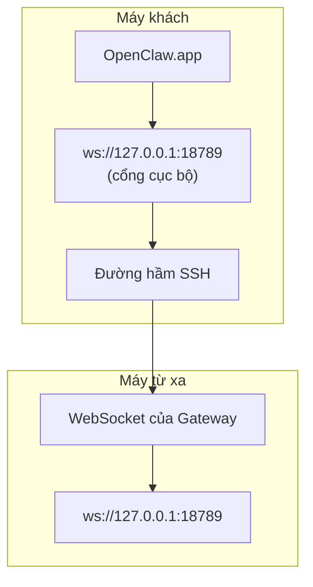

<Note>
Nội dung này hiện nằm trong [Truy cập từ xa](/vi/gateway/remote#macos-persistent-ssh-tunnel-via-launchagent). Hãy sử dụng trang đó để xem hướng dẫn hiện tại; trang này được giữ lại làm đích chuyển hướng.
</Note>

# Chạy OpenClaw.app với Gateway từ xa

OpenClaw.app kết nối đến Gateway từ xa qua đường hầm SSH: một cấu hình SSH `LocalForward` ánh xạ cổng cục bộ tới cổng WebSocket của Gateway trên máy chủ từ xa.

## Thiết lập

1. Thêm một mục cấu hình SSH với `LocalForward 18789 127.0.0.1:18789` (xem [Truy cập từ xa](/vi/gateway/remote#macos-persistent-ssh-tunnel-via-launchagent) để biết khối cấu hình đầy đủ).
2. Sao chép khóa SSH của bạn sang máy chủ từ xa bằng `ssh-copy-id`.
3. Đặt `gateway.remote.token` (hoặc `gateway.remote.password`) bằng `openclaw config set gateway.remote.token "<your-token>"`.
4. Khởi động đường hầm: `ssh -N remote-gateway &`.
5. Thoát rồi mở lại OpenClaw.app.

Để đường hầm vẫn hoạt động sau khi khởi động lại và tự động kết nối lại, hãy sử dụng thiết lập LaunchAgent trên trang [Truy cập từ xa](/vi/gateway/remote#macos-persistent-ssh-tunnel-via-launchagent) thay vì chạy `ssh -N` thủ công.

## Cách hoạt động

| Thành phần                           | Chức năng                                                          |
| ------------------------------------ | ------------------------------------------------------------------ |
| `LocalForward 18789 127.0.0.1:18789` | Chuyển tiếp cổng cục bộ 18789 tới cổng từ xa 18789                 |
| `ssh -N`                             | SSH không thực thi lệnh từ xa (chỉ chuyển tiếp cổng)               |
| `KeepAlive`                          | Tự động khởi động lại đường hầm nếu bị dừng đột ngột (LaunchAgent) |
| `RunAtLoad`                          | Khởi động đường hầm khi LaunchAgent được tải (LaunchAgent)         |

OpenClaw.app kết nối tới `ws://127.0.0.1:18789` trên máy khách. Đường hầm chuyển tiếp kết nối đó tới cổng 18789 trên máy chủ từ xa đang chạy Gateway.

## Liên quan

- [Truy cập từ xa](/vi/gateway/remote)
- [Tailscale](/vi/gateway/tailscale)
