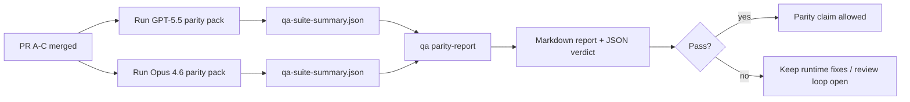

---
read_when:
    - Xem xét loạt PR về tính tương đồng GPT-5.5 / Codex
    - Duy trì kiến trúc tác nhân sáu hợp đồng làm nền tảng cho chương trình tương đương
summary: Cách rà soát chương trình tương đương GPT-5.5 / Codex dưới dạng bốn đơn vị hợp nhất
title: Ghi chú dành cho người bảo trì về tính tương đương GPT-5.5 / Codex
x-i18n:
    generated_at: "2026-05-06T09:15:25Z"
    model: gpt-5.5
    provider: openai
    source_hash: 5752b4610f8b0d70b80d880ea10df75478b5f85ca431cdb73d3b61d745b23356
    source_path: help/gpt55-codex-agentic-parity-maintainers.md
    workflow: 16
---

Ghi chú này giải thích cách review chương trình tương đương GPT-5.5 / Codex dưới dạng bốn đơn vị hợp nhất mà không làm mất kiến trúc sáu hợp đồng ban đầu.

## Đơn vị hợp nhất

### PR A: thực thi agentic nghiêm ngặt

Sở hữu:

- `executionContract`
- theo đuổi cùng lượt, ưu tiên GPT-5
- `update_plan` làm theo dõi tiến độ không kết thúc
- trạng thái bị chặn rõ ràng thay vì dừng im lặng chỉ có kế hoạch

Không sở hữu:

- phân loại lỗi xác thực/runtime
- tính trung thực về quyền
- thiết kế lại replay/continuation
- đo chuẩn tương đương

### PR B: tính trung thực của runtime

Sở hữu:

- tính đúng đắn của phạm vi OAuth Codex
- phân loại lỗi provider/runtime có kiểu
- tính khả dụng `/elevated full` trung thực và lý do bị chặn

Không sở hữu:

- chuẩn hóa schema công cụ
- trạng thái replay/liveness
- gating đo chuẩn

### PR C: tính đúng đắn của thực thi

Sở hữu:

- khả năng tương thích công cụ OpenAI/Codex do provider sở hữu
- xử lý schema nghiêm ngặt không tham số
- hiển thị replay-invalid
- khả năng nhìn thấy trạng thái tác vụ dài bị tạm dừng, bị chặn và bị bỏ dở

Không sở hữu:

- continuation tự chọn
- hành vi phương ngữ Codex chung bên ngoài provider hooks
- gating đo chuẩn

### PR D: parity harness

Sở hữu:

- gói kịch bản đợt đầu GPT-5.5 so với Opus 4.6
- tài liệu về tính tương đương
- báo cáo tính tương đương và cơ chế release-gate

Không sở hữu:

- thay đổi hành vi runtime bên ngoài QA-lab
- mô phỏng auth/proxy/DNS bên trong harness

## Ánh xạ lại về sáu hợp đồng ban đầu

| Hợp đồng ban đầu                         | Đơn vị hợp nhất |
| ---------------------------------------- | --------------- |
| Tính đúng đắn của transport/auth provider | PR B            |
| Khả năng tương thích hợp đồng/schema công cụ | PR C        |
| Thực thi cùng lượt                       | PR A            |
| Tính trung thực về quyền                 | PR B            |
| Tính đúng đắn của replay/continuation/liveness | PR C       |
| Benchmark/release gate                   | PR D            |

## Thứ tự review

1. PR A
2. PR B
3. PR C
4. PR D

PR D là lớp bằng chứng. Nó không nên là lý do khiến các PR về tính đúng đắn của runtime bị trì hoãn.

## Cần xem xét gì

### PR A

- Các lượt chạy GPT-5 hành động hoặc fail closed thay vì dừng ở commentary
- `update_plan` không còn tự nó trông giống tiến độ
- hành vi vẫn ưu tiên GPT-5 và trong phạm vi Pi nhúng

### PR B

- lỗi auth/proxy/runtime không còn bị gộp vào xử lý chung "model failed"
- `/elevated full` chỉ được mô tả là khả dụng khi nó thực sự khả dụng
- lý do bị chặn hiển thị cho cả model và runtime hướng người dùng

### PR C

- đăng ký công cụ OpenAI/Codex nghiêm ngặt hoạt động có thể dự đoán
- công cụ không tham số không trượt kiểm tra schema nghiêm ngặt
- kết quả replay và Compaction giữ trạng thái liveness trung thực

### PR D

- gói kịch bản dễ hiểu và có thể tái lập
- gói bao gồm một lane an toàn replay có đột biến, không chỉ các luồng chỉ đọc
- báo cáo có thể đọc được bởi con người và tự động hóa
- tuyên bố tương đương được hậu thuẫn bằng bằng chứng, không phải giai thoại

Artifact kỳ vọng từ PR D:

- `qa-suite-report.md` / `qa-suite-summary.json` cho mỗi lượt chạy model
- `qa-agentic-parity-report.md` với so sánh tổng hợp và theo từng kịch bản
- `qa-agentic-parity-summary.json` với verdict máy đọc được

## Release gate

Không tuyên bố GPT-5.5 tương đương hoặc vượt trội hơn Opus 4.6 cho đến khi:

- PR A, PR B và PR C đã được hợp nhất
- PR D chạy sạch gói tương đương đợt đầu
- các bộ hồi quy runtime-truthfulness vẫn xanh
- báo cáo tính tương đương không cho thấy trường hợp fake-success nào và không có hồi quy trong hành vi dừng

Parity harness không phải là nguồn bằng chứng duy nhất. Giữ sự phân tách này rõ ràng trong review:

- PR D sở hữu so sánh dựa trên kịch bản giữa GPT-5.5 và Opus 4.6
- các bộ kiểm thử xác định của PR B vẫn sở hữu bằng chứng về auth/proxy/DNS và tính trung thực full-access

## Quy trình hợp nhất nhanh cho maintainer

Dùng phần này khi bạn đã sẵn sàng land một PR tương đương và muốn một trình tự lặp lại được, rủi ro thấp.

1. Xác nhận mức bằng chứng đã đạt trước khi hợp nhất:
   - triệu chứng có thể tái lập hoặc kiểm thử thất bại
   - nguyên nhân gốc đã được xác minh trong mã được chạm tới
   - bản sửa trong đường dẫn liên quan
   - kiểm thử hồi quy hoặc ghi chú xác minh thủ công rõ ràng
2. Triage/gắn nhãn trước khi hợp nhất:
   - áp dụng mọi nhãn tự động đóng `r:*` khi PR không nên được land
   - giữ các ứng viên hợp nhất không còn luồng chặn chưa giải quyết
3. Xác thực cục bộ trên bề mặt được chạm tới:
   - `pnpm check:changed`
   - `pnpm test:changed` khi kiểm thử thay đổi hoặc độ tin cậy của bug fix phụ thuộc vào độ phủ kiểm thử
4. Land bằng luồng maintainer tiêu chuẩn (quy trình `/landpr`), rồi xác minh:
   - hành vi tự động đóng issue được liên kết
   - CI và trạng thái sau hợp nhất trên `main`
5. Sau khi land, chạy tìm kiếm trùng lặp cho các PR/issue mở liên quan và chỉ đóng khi có tham chiếu canonical.

Nếu thiếu bất kỳ mục nào trong mức bằng chứng, hãy yêu cầu thay đổi thay vì hợp nhất.

## Bản đồ mục tiêu đến bằng chứng

| Mục cổng hoàn tất                         | Chủ sở hữu chính | Artifact review                                                     |
| ----------------------------------------- | ---------------- | ------------------------------------------------------------------- |
| Không dừng chỉ có kế hoạch                | PR A             | kiểm thử runtime strict-agentic và `approval-turn-tool-followthrough` |
| Không có tiến độ giả hoặc hoàn thành công cụ giả | PR A + PR D | số lượng fake-success tương đương cộng với chi tiết báo cáo theo kịch bản |
| Không có hướng dẫn `/elevated full` sai   | PR B             | các bộ runtime-truthfulness xác định                                |
| Lỗi replay/liveness vẫn rõ ràng           | PR C + PR D      | bộ lifecycle/replay cộng với `compaction-retry-mutating-tool`        |
| GPT-5.5 ngang bằng hoặc vượt Opus 4.6     | PR D             | `qa-agentic-parity-report.md` và `qa-agentic-parity-summary.json`    |

## Viết tắt cho reviewer: trước và sau

| Vấn đề người dùng thấy trước đây                         | Tín hiệu review sau đó                                                                 |
| -------------------------------------------------------- | -------------------------------------------------------------------------------------- |
| GPT-5.5 dừng sau khi lập kế hoạch                        | PR A cho thấy hành vi hành động-hoặc-chặn thay vì hoàn tất chỉ bằng commentary          |
| Sử dụng công cụ có cảm giác giòn với schema OpenAI/Codex nghiêm ngặt | PR C giữ đăng ký công cụ và lời gọi không tham số có thể dự đoán       |
| Gợi ý `/elevated full` đôi khi gây hiểu lầm              | PR B gắn hướng dẫn với năng lực runtime thực tế và lý do bị chặn                       |
| Tác vụ dài có thể biến mất vào mơ hồ replay/Compaction   | PR C phát ra trạng thái tạm dừng, bị chặn, bị bỏ dở và replay-invalid rõ ràng          |
| Tuyên bố tương đương chỉ mang tính giai thoại            | PR D tạo báo cáo cộng với verdict JSON với cùng độ phủ kịch bản trên cả hai model      |

## Liên quan

- [Tính tương đương agentic GPT-5.5 / Codex](/vi/help/gpt55-codex-agentic-parity)
