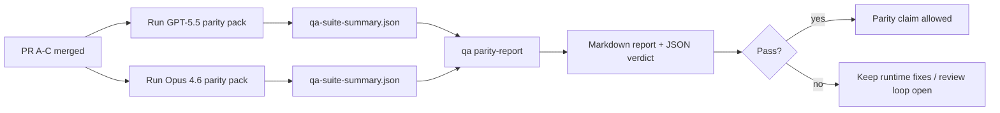

---
read_when:
    - Đang rà soát chuỗi yêu cầu kéo về tính tương đương GPT-5.5 / Codex
    - Duy trì kiến trúc tác tử sáu hợp đồng làm nền tảng cho chương trình tương đương
summary: Cách xem xét chương trình tương đồng GPT-5.5 / Codex dưới dạng bốn đơn vị hợp nhất
title: Ghi chú dành cho người bảo trì về tính tương đương GPT-5.5 / Codex
x-i18n:
    generated_at: "2026-04-29T22:48:53Z"
    model: gpt-5.5
    provider: openai
    source_hash: 8de69081f5985954b88583880c36388dc47116c3351c15d135b8ab3a660058e3
    source_path: help/gpt55-codex-agentic-parity-maintainers.md
    workflow: 16
---

Ghi chú này giải thích cách rà soát chương trình tương đương GPT-5.5 / Codex dưới dạng bốn đơn vị hợp nhất mà không làm mất kiến trúc sáu hợp đồng ban đầu.

## Đơn vị hợp nhất

### PR A: thực thi agentic nghiêm ngặt

Phụ trách:

- `executionContract`
- theo đuổi cùng lượt ưu tiên GPT-5
- `update_plan` làm theo dõi tiến độ không kết thúc
- trạng thái bị chặn rõ ràng thay vì dừng im lặng chỉ có kế hoạch

Không phụ trách:

- phân loại lỗi xác thực/thời gian chạy
- tính trung thực về quyền
- thiết kế lại phát lại/tiếp tục
- đo chuẩn tương đương

### PR B: tính trung thực của thời gian chạy

Phụ trách:

- tính đúng đắn của phạm vi OAuth Codex
- phân loại lỗi nhà cung cấp/thời gian chạy có kiểu
- tính khả dụng trung thực của `/elevated full` và lý do bị chặn

Không phụ trách:

- chuẩn hóa schema công cụ
- trạng thái phát lại/tồn tại
- cổng đo chuẩn

### PR C: tính đúng đắn của thực thi

Phụ trách:

- khả năng tương thích công cụ OpenAI/Codex do nhà cung cấp sở hữu
- xử lý schema nghiêm ngặt không tham số
- hiển thị phát lại không hợp lệ
- khả năng thấy trạng thái tác vụ dài bị tạm dừng, bị chặn và bị bỏ rơi

Không phụ trách:

- tự chọn tiếp tục
- hành vi phương ngữ Codex chung bên ngoài hook nhà cung cấp
- cổng đo chuẩn

### PR D: bộ khung tương đương

Phụ trách:

- gói kịch bản đợt đầu GPT-5.5 so với Opus 4.6
- tài liệu tương đương
- báo cáo tương đương và cơ chế cổng phát hành

Không phụ trách:

- thay đổi hành vi thời gian chạy bên ngoài QA-lab
- mô phỏng xác thực/proxy/DNS bên trong bộ khung

## Ánh xạ ngược về sáu hợp đồng ban đầu

| Hợp đồng ban đầu                         | Đơn vị hợp nhất |
| ---------------------------------------- | --------------- |
| Tính đúng đắn truyền tải/xác thực của nhà cung cấp | PR B       |
| Khả năng tương thích hợp đồng/schema công cụ | PR C       |
| Thực thi cùng lượt                       | PR A            |
| Tính trung thực về quyền                 | PR B            |
| Tính đúng đắn phát lại/tiếp tục/tồn tại  | PR C            |
| Cổng đo chuẩn/phát hành                  | PR D            |

## Thứ tự rà soát

1. PR A
2. PR B
3. PR C
4. PR D

PR D là lớp bằng chứng. Nó không nên là lý do khiến các PR về tính đúng đắn của thời gian chạy bị trì hoãn.

## Cần chú ý điều gì

### PR A

- Các lượt chạy GPT-5 hành động hoặc đóng khi lỗi thay vì dừng ở phần bình luận
- `update_plan` không còn tự nó trông giống tiến độ
- hành vi vẫn ưu tiên GPT-5 và được giới hạn trong Pi nhúng

### PR B

- lỗi xác thực/proxy/thời gian chạy không còn bị gom vào xử lý chung kiểu “model failed”
- `/elevated full` chỉ được mô tả là khả dụng khi nó thật sự khả dụng
- lý do bị chặn hiển thị cho cả mô hình và thời gian chạy hướng người dùng

### PR C

- đăng ký công cụ OpenAI/Codex nghiêm ngặt hoạt động có thể dự đoán
- công cụ không tham số không lỗi khi kiểm tra schema nghiêm ngặt
- kết quả phát lại và Compaction bảo toàn trạng thái tồn tại trung thực

### PR D

- gói kịch bản dễ hiểu và tái lập được
- gói có làn an toàn phát lại có biến đổi, không chỉ các luồng chỉ đọc
- báo cáo đọc được bởi con người và tự động hóa
- tuyên bố tương đương dựa trên bằng chứng, không phải giai thoại

Tạo tác kỳ vọng từ PR D:

- `qa-suite-report.md` / `qa-suite-summary.json` cho mỗi lượt chạy mô hình
- `qa-agentic-parity-report.md` với so sánh tổng hợp và ở cấp kịch bản
- `qa-agentic-parity-summary.json` với phán quyết máy đọc được

## Cổng phát hành

Không tuyên bố GPT-5.5 tương đương hoặc vượt trội hơn Opus 4.6 cho đến khi:

- PR A, PR B và PR C đã được hợp nhất
- PR D chạy sạch gói tương đương đợt đầu
- các bộ hồi quy về tính trung thực của thời gian chạy vẫn xanh
- báo cáo tương đương không cho thấy trường hợp thành công giả và không có hồi quy trong hành vi dừng

Bộ khung tương đương không phải là nguồn bằng chứng duy nhất. Giữ phần tách này rõ ràng khi rà soát:

- PR D sở hữu phần so sánh dựa trên kịch bản giữa GPT-5.5 và Opus 4.6
- các bộ kiểm thử tất định của PR B vẫn sở hữu bằng chứng về xác thực/proxy/DNS và tính trung thực của toàn quyền truy cập

## Quy trình hợp nhất nhanh cho maintainer

Dùng quy trình này khi bạn đã sẵn sàng đưa một PR tương đương vào và muốn một chuỗi lặp lại được, ít rủi ro.

1. Xác nhận thanh bằng chứng đã đạt trước khi hợp nhất:
   - triệu chứng tái lập được hoặc kiểm thử lỗi
   - nguyên nhân gốc đã được xác minh trong mã được chạm tới
   - bản sửa trong đường dẫn liên quan
   - kiểm thử hồi quy hoặc ghi chú xác minh thủ công rõ ràng
2. Phân loại/gắn nhãn trước khi hợp nhất:
   - áp dụng mọi nhãn tự đóng `r:*` khi PR không nên được đưa vào
   - giữ các ứng viên hợp nhất không còn luồng chặn chưa giải quyết
3. Xác thực cục bộ trên bề mặt được chạm tới:
   - `pnpm check:changed`
   - `pnpm test:changed` khi kiểm thử thay đổi hoặc độ tin cậy của bản sửa lỗi phụ thuộc vào độ bao phủ kiểm thử
4. Đưa vào bằng luồng maintainer tiêu chuẩn (quy trình `/landpr`), rồi xác minh:
   - hành vi tự đóng issue được liên kết
   - CI và trạng thái sau hợp nhất trên `main`
5. Sau khi đưa vào, chạy tìm kiếm trùng lặp cho các PR/issue mở liên quan và chỉ đóng khi có tham chiếu chuẩn.

Nếu thiếu bất kỳ mục nào trong thanh bằng chứng, hãy yêu cầu thay đổi thay vì hợp nhất.

## Bản đồ mục tiêu đến bằng chứng

| Mục cổng hoàn tất                        | Chủ sở hữu chính | Tạo tác rà soát                                                     |
| ---------------------------------------- | ---------------- | ------------------------------------------------------------------- |
| Không còn kẹt chỉ có kế hoạch            | PR A             | kiểm thử thời gian chạy agentic nghiêm ngặt và `approval-turn-tool-followthrough` |
| Không có tiến độ giả hoặc hoàn tất công cụ giả | PR A + PR D | số lượng thành công giả của tương đương cộng với chi tiết báo cáo cấp kịch bản |
| Không có hướng dẫn sai về `/elevated full` | PR B           | các bộ kiểm thử tất định về tính trung thực của thời gian chạy       |
| Lỗi phát lại/tồn tại vẫn rõ ràng         | PR C + PR D      | bộ kiểm thử vòng đời/phát lại cộng với `compaction-retry-mutating-tool` |
| GPT-5.5 ngang bằng hoặc vượt Opus 4.6    | PR D             | `qa-agentic-parity-report.md` và `qa-agentic-parity-summary.json`  |

## Cách nói tắt cho reviewer: trước và sau

| Vấn đề người dùng thấy trước đây                         | Tín hiệu rà soát sau đó                                                                  |
| -------------------------------------------------------- | ---------------------------------------------------------------------------------------- |
| GPT-5.5 dừng sau khi lập kế hoạch                        | PR A cho thấy hành vi hành động-hoặc-bị-chặn thay vì hoàn tất chỉ có bình luận           |
| Việc dùng công cụ thấy mong manh với schema OpenAI/Codex nghiêm ngặt | PR C giữ đăng ký công cụ và gọi không tham số có thể dự đoán                  |
| Gợi ý `/elevated full` đôi khi gây hiểu nhầm             | PR B buộc hướng dẫn với năng lực thời gian chạy thực tế và lý do bị chặn                 |
| Tác vụ dài có thể biến mất vào mơ hồ phát lại/Compaction | PR C phát ra trạng thái tạm dừng, bị chặn, bị bỏ rơi và phát lại không hợp lệ rõ ràng    |
| Tuyên bố tương đương từng mang tính giai thoại            | PR D tạo báo cáo cộng với phán quyết JSON có cùng độ bao phủ kịch bản trên cả hai mô hình |

## Liên quan

- [Tính tương đương agentic GPT-5.5 / Codex](/vi/help/gpt55-codex-agentic-parity)
