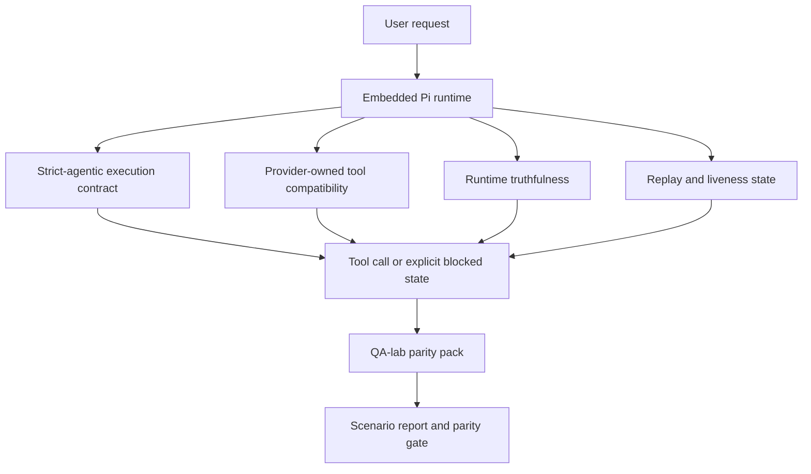
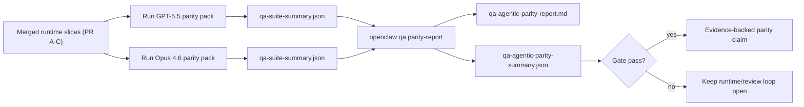

---
read_when:
    - Gỡ lỗi hành vi của tác tử GPT-5.5 hoặc Codex
    - So sánh hành vi tác nhân của OpenClaw giữa các mô hình tiên tiến nhất
    - Đang xem xét các bản sửa lỗi cho chế độ tác tử nghiêm ngặt, sơ đồ công cụ, nâng quyền và phát lại
summary: Cách OpenClaw lấp đầy các khoảng trống trong thực thi tác nhân tự chủ cho GPT-5.5 và các mô hình kiểu Codex
title: Tính tương đương về khả năng tác tử của GPT-5.5 / Codex
x-i18n:
    generated_at: "2026-04-29T22:49:02Z"
    model: gpt-5.5
    provider: openai
    source_hash: 8a3b9375cd9e9d95855c4a1135953e00fd7a939e52fb7b75342da3bde2d83fe1
    source_path: help/gpt55-codex-agentic-parity.md
    workflow: 16
---

# Tính ngang bằng về năng lực tác nhân GPT-5.5 / Codex trong OpenClaw

OpenClaw đã hoạt động tốt với các mô hình frontier dùng công cụ, nhưng GPT-5.5 và các mô hình kiểu Codex vẫn hoạt động chưa tối ưu theo một vài cách thực tế:

- chúng có thể dừng lại sau khi lập kế hoạch thay vì thực hiện công việc
- chúng có thể dùng sai các schema công cụ OpenAI/Codex nghiêm ngặt
- chúng có thể yêu cầu `/elevated full` ngay cả khi không thể có toàn quyền truy cập
- chúng có thể mất trạng thái tác vụ chạy lâu trong quá trình phát lại hoặc compaction
- các tuyên bố ngang bằng với Claude Opus 4.6 dựa trên giai thoại thay vì các kịch bản có thể lặp lại

Chương trình ngang bằng này khắc phục các khoảng trống đó trong bốn phần có thể review.

## Những gì đã thay đổi

### PR A: thực thi strict-agentic

Phần này thêm một hợp đồng thực thi `strict-agentic` chọn tham gia cho các lần chạy Pi GPT-5 nhúng.

Khi được bật, OpenClaw sẽ ngừng chấp nhận các lượt chỉ lập kế hoạch như một hoàn thành “đủ tốt”. Nếu mô hình chỉ nói những gì nó định làm và không thực sự dùng công cụ hoặc tạo tiến triển, OpenClaw sẽ thử lại với một chỉ dẫn hành động ngay và sau đó fail closed với trạng thái bị chặn rõ ràng thay vì âm thầm kết thúc tác vụ.

Điều này cải thiện trải nghiệm GPT-5.5 nhiều nhất trong:

- các lượt theo sau ngắn kiểu “ok làm đi”
- các tác vụ mã nơi bước đầu tiên là hiển nhiên
- các luồng nơi `update_plan` nên là theo dõi tiến độ thay vì văn bản lấp chỗ

### PR B: tính trung thực của runtime

Phần này khiến OpenClaw nói đúng sự thật về hai điều:

- vì sao lệnh gọi provider/runtime thất bại
- liệu `/elevated full` có thực sự khả dụng hay không

Điều đó nghĩa là GPT-5.5 nhận được tín hiệu runtime tốt hơn cho thiếu phạm vi, lỗi làm mới xác thực, lỗi xác thực HTML 403, sự cố proxy, lỗi DNS hoặc timeout, và các chế độ toàn quyền truy cập bị chặn. Mô hình ít có khả năng bịa ra cách khắc phục sai hoặc tiếp tục yêu cầu một chế độ quyền mà runtime không thể cung cấp.

### PR C: tính đúng đắn của thực thi

Phần này cải thiện hai loại tính đúng đắn:

- khả năng tương thích schema công cụ OpenAI/Codex do provider sở hữu
- hiển thị khả năng sống của tác vụ dài và phát lại

Công việc tương thích công cụ giảm ma sát schema cho đăng ký công cụ OpenAI/Codex nghiêm ngặt, đặc biệt quanh các công cụ không có tham số và kỳ vọng root object nghiêm ngặt. Công việc phát lại/khả năng sống giúp các tác vụ chạy lâu dễ quan sát hơn, để các trạng thái tạm dừng, bị chặn, và bị bỏ dở hiển thị thay vì biến mất vào văn bản lỗi chung chung.

### PR D: bộ kiểm thử ngang bằng

Phần này thêm gói ngang bằng QA-lab đợt đầu để GPT-5.5 và Opus 4.6 có thể được chạy qua cùng các kịch bản và được so sánh bằng bằng chứng chung.

Gói ngang bằng là lớp bằng chứng. Bản thân nó không thay đổi hành vi runtime.

Sau khi bạn có hai artifact `qa-suite-summary.json`, hãy tạo so sánh cổng phát hành bằng:

```bash
pnpm openclaw qa parity-report \
  --repo-root . \
  --candidate-summary .artifacts/qa-e2e/gpt55/qa-suite-summary.json \
  --baseline-summary .artifacts/qa-e2e/opus46/qa-suite-summary.json \
  --output-dir .artifacts/qa-e2e/parity
```

Lệnh đó ghi:

- một báo cáo Markdown dễ đọc cho con người
- một phán quyết JSON dễ đọc cho máy
- một kết quả cổng `pass` / `fail` rõ ràng

## Vì sao điều này cải thiện GPT-5.5 trong thực tế

Trước công việc này, GPT-5.5 trên OpenClaw có thể cảm giác kém tính tác nhân hơn Opus trong các phiên lập trình thực tế vì runtime dung thứ các hành vi đặc biệt gây hại cho mô hình kiểu GPT-5:

- các lượt chỉ bình luận
- ma sát schema quanh công cụ
- phản hồi quyền mơ hồ
- hỏng phát lại hoặc compaction âm thầm

Mục tiêu không phải là khiến GPT-5.5 bắt chước Opus. Mục tiêu là cung cấp cho GPT-5.5 một hợp đồng runtime thưởng cho tiến triển thực, cung cấp ngữ nghĩa công cụ và quyền sạch hơn, và biến các chế độ lỗi thành trạng thái rõ ràng, dễ đọc cho cả máy và con người.

Điều đó thay đổi trải nghiệm người dùng từ:

- “mô hình có một kế hoạch tốt nhưng đã dừng lại”

thành:

- “mô hình hoặc đã hành động, hoặc OpenClaw đã hiển thị lý do chính xác vì sao nó không thể”

## Trước và sau đối với người dùng GPT-5.5

| Trước chương trình này                                                                        | Sau PR A-D                                                                                |
| ---------------------------------------------------------------------------------------------- | ---------------------------------------------------------------------------------------- |
| GPT-5.5 có thể dừng sau một kế hoạch hợp lý mà không thực hiện bước công cụ tiếp theo          | PR A biến “chỉ lập kế hoạch” thành “hành động ngay hoặc hiển thị trạng thái bị chặn”      |
| Schema công cụ nghiêm ngặt có thể từ chối công cụ không tham số hoặc công cụ dạng OpenAI/Codex theo cách khó hiểu | PR C giúp đăng ký và gọi công cụ do provider sở hữu dễ dự đoán hơn                       |
| Hướng dẫn `/elevated full` có thể mơ hồ hoặc sai trong các runtime bị chặn                     | PR B cung cấp cho GPT-5.5 và người dùng các gợi ý runtime và quyền đúng sự thật          |
| Lỗi phát lại hoặc compaction có thể tạo cảm giác tác vụ âm thầm biến mất                      | PR C hiển thị rõ ràng các kết quả tạm dừng, bị chặn, bị bỏ dở, và phát lại không hợp lệ  |
| “GPT-5.5 cảm giác tệ hơn Opus” phần lớn là giai thoại                                          | PR D biến điều đó thành cùng gói kịch bản, cùng chỉ số, và một cổng pass/fail cứng       |

## Kiến trúc



## Luồng phát hành



## Gói kịch bản

Gói ngang bằng đợt đầu hiện bao phủ năm kịch bản:

### `approval-turn-tool-followthrough`

Kiểm tra rằng mô hình không dừng ở “Tôi sẽ làm việc đó” sau một phê duyệt ngắn. Nó nên thực hiện hành động cụ thể đầu tiên trong cùng lượt.

### `model-switch-tool-continuity`

Kiểm tra rằng công việc dùng công cụ vẫn mạch lạc qua các ranh giới chuyển đổi mô hình/runtime thay vì reset thành bình luận hoặc mất ngữ cảnh thực thi.

### `source-docs-discovery-report`

Kiểm tra rằng mô hình có thể đọc nguồn và tài liệu, tổng hợp phát hiện, và tiếp tục tác vụ theo cách có tính tác nhân thay vì tạo một bản tóm tắt mỏng rồi dừng sớm.

### `image-understanding-attachment`

Kiểm tra rằng các tác vụ đa chế độ liên quan đến tệp đính kèm vẫn có thể hành động và không sụp thành tường thuật mơ hồ.

### `compaction-retry-mutating-tool`

Kiểm tra rằng một tác vụ có thao tác ghi thay đổi thực giữ rõ tính không an toàn khi phát lại thay vì âm thầm trông như an toàn khi phát lại nếu lần chạy bị compact, thử lại, hoặc mất trạng thái phản hồi dưới áp lực.

## Ma trận kịch bản

| Kịch bản                           | Điều được kiểm tra                    | Hành vi tốt của GPT-5.5                                                       | Tín hiệu thất bại                                                              |
| ---------------------------------- | ------------------------------------- | ------------------------------------------------------------------------------ | ------------------------------------------------------------------------------ |
| `approval-turn-tool-followthrough` | Lượt phê duyệt ngắn sau một kế hoạch  | Bắt đầu hành động công cụ cụ thể đầu tiên ngay lập tức thay vì nhắc lại ý định | lượt theo sau chỉ lập kế hoạch, không có hoạt động công cụ, hoặc lượt bị chặn không có lý do chặn thật |
| `model-switch-tool-continuity`     | Chuyển đổi runtime/mô hình khi dùng công cụ | Giữ ngữ cảnh tác vụ và tiếp tục hành động mạch lạc                            | reset thành bình luận, mất ngữ cảnh công cụ, hoặc dừng sau khi chuyển đổi      |
| `source-docs-discovery-report`     | Đọc nguồn + tổng hợp + hành động      | Tìm nguồn, dùng công cụ, và tạo báo cáo hữu ích mà không bị kẹt                | tóm tắt mỏng, thiếu công việc công cụ, hoặc dừng khi chưa hoàn thành lượt      |
| `image-understanding-attachment`   | Công việc tác nhân do tệp đính kèm dẫn dắt | Diễn giải tệp đính kèm, kết nối nó với công cụ, và tiếp tục tác vụ             | tường thuật mơ hồ, bỏ qua tệp đính kèm, hoặc không có hành động tiếp theo cụ thể |
| `compaction-retry-mutating-tool`   | Công việc thay đổi dưới áp lực compaction | Thực hiện một thao tác ghi thật và giữ rõ tính không an toàn khi phát lại sau hiệu ứng phụ | thao tác ghi thay đổi xảy ra nhưng an toàn phát lại bị ngụ ý, bị thiếu, hoặc mâu thuẫn |

## Cổng phát hành

GPT-5.5 chỉ có thể được xem là ngang bằng hoặc tốt hơn khi runtime đã hợp nhất vượt qua gói ngang bằng và các hồi quy về tính trung thực của runtime cùng lúc.

Kết quả bắt buộc:

- không bị kẹt chỉ lập kế hoạch khi hành động công cụ tiếp theo đã rõ
- không hoàn thành giả mà không có thực thi thật
- không có hướng dẫn `/elevated full` sai
- không âm thầm bỏ dở phát lại hoặc compaction
- các chỉ số gói ngang bằng ít nhất mạnh bằng baseline Opus 4.6 đã thống nhất

Đối với bộ kiểm thử đợt đầu, cổng so sánh:

- tỷ lệ hoàn thành
- tỷ lệ dừng ngoài ý muốn
- tỷ lệ lệnh gọi công cụ hợp lệ
- số lượng thành công giả

Bằng chứng ngang bằng được cố ý tách trên hai lớp:

- PR D chứng minh hành vi GPT-5.5 so với Opus 4.6 trong cùng kịch bản bằng QA-lab
- các bộ kiểm thử xác định của PR B chứng minh tính trung thực về xác thực, proxy, DNS, và `/elevated full` bên ngoài bộ kiểm thử

## Ma trận mục tiêu-đến-bằng chứng

| Hạng mục cổng hoàn thành                                | PR sở hữu    | Nguồn bằng chứng                                                   | Tín hiệu pass                                                                            |
| -------------------------------------------------------- | ----------- | ------------------------------------------------------------------ | ---------------------------------------------------------------------------------------- |
| GPT-5.5 không còn bị kẹt sau khi lập kế hoạch            | PR A        | `approval-turn-tool-followthrough` cộng với các bộ kiểm thử runtime PR A | các lượt phê duyệt kích hoạt công việc thật hoặc trạng thái bị chặn rõ ràng              |
| GPT-5.5 không còn giả vờ tiến triển hoặc giả hoàn thành công cụ | PR A + PR D | kết quả kịch bản báo cáo ngang bằng và số lượng thành công giả      | không có kết quả pass đáng ngờ và không có hoàn thành chỉ bằng bình luận                 |
| GPT-5.5 không còn đưa hướng dẫn `/elevated full` sai     | PR B        | các bộ kiểm thử tính trung thực xác định                           | lý do bị chặn và gợi ý toàn quyền truy cập vẫn chính xác theo runtime                    |
| Lỗi phát lại/khả năng sống vẫn rõ ràng                   | PR C + PR D | các bộ kiểm thử vòng đời/phát lại PR C cộng với `compaction-retry-mutating-tool` | công việc thay đổi giữ rõ tính không an toàn khi phát lại thay vì âm thầm biến mất      |
| GPT-5.5 khớp hoặc vượt Opus 4.6 trên các chỉ số đã thống nhất | PR D        | `qa-agentic-parity-report.md` và `qa-agentic-parity-summary.json` | cùng phạm vi kịch bản và không hồi quy về hoàn thành, hành vi dừng, hoặc dùng công cụ hợp lệ |

## Cách đọc phán quyết ngang bằng

Dùng phán quyết trong `qa-agentic-parity-summary.json` làm quyết định cuối cùng dễ đọc cho máy đối với gói ngang bằng đợt đầu.

- `pass` nghĩa là GPT-5.5 đã bao phủ các kịch bản giống như Opus 4.6 và không hồi quy trên các chỉ số tổng hợp đã thống nhất.
- `fail` nghĩa là ít nhất một cổng kiểm tra bắt buộc đã bị kích hoạt: hoàn thành yếu hơn, dừng ngoài ý muốn nhiều hơn, sử dụng công cụ hợp lệ yếu hơn, bất kỳ trường hợp thành công giả nào, hoặc phạm vi kịch bản không khớp.
- “sự cố CI chung/nền tảng” tự nó không phải là kết quả tương đương. Nếu nhiễu CI bên ngoài PR D chặn một lượt chạy, phán quyết nên chờ một lần thực thi runtime đã hợp nhất sạch thay vì được suy ra từ nhật ký thời kỳ nhánh.
- Tính trung thực của auth, proxy, DNS và `/elevated full` vẫn đến từ các bộ kiểm thử xác định của PR B, vì vậy tuyên bố phát hành cuối cùng cần cả hai: một phán quyết tương đương PR D đạt và phạm vi tính trung thực PR B xanh.

## Ai nên bật `strict-agentic`

Dùng `strict-agentic` khi:

- agent được kỳ vọng hành động ngay khi bước tiếp theo là rõ ràng
- GPT-5.5 hoặc các mô hình họ Codex là runtime chính
- bạn thích các trạng thái bị chặn rõ ràng hơn là các phản hồi “hữu ích” chỉ tóm tắt lại

Giữ hợp đồng mặc định khi:

- bạn muốn hành vi lỏng hơn hiện có
- bạn không dùng các mô hình họ GPT-5
- bạn đang kiểm thử prompt thay vì cưỡng chế ở runtime

## Liên quan

- [Ghi chú bảo trì viên về tương đương GPT-5.5 / Codex](/vi/help/gpt55-codex-agentic-parity-maintainers)
