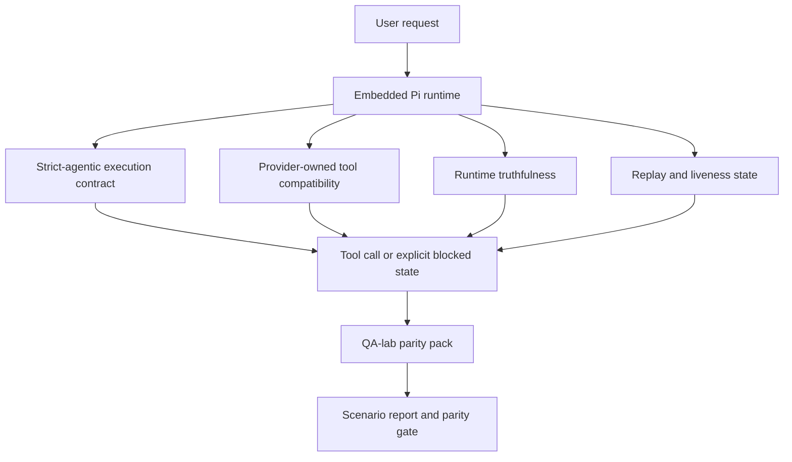
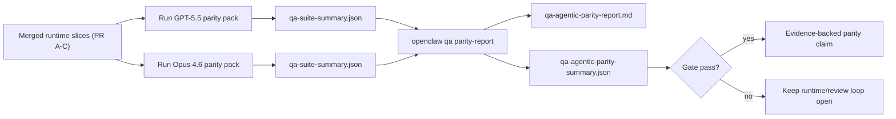

---
read_when:
    - Gỡ lỗi hành vi của tác nhân GPT-5.5 hoặc Codex
    - So sánh hành vi tác tử của OpenClaw trên các mô hình tiên phong
    - Đang xem xét các bản sửa lỗi cho strict-agentic, lược đồ công cụ, nâng quyền và phát lại
summary: Cách OpenClaw khắc phục các khoảng trống trong thực thi tác tử cho GPT-5.5 và các mô hình kiểu Codex
title: Tính tương đương về khả năng tác tử giữa GPT-5.5 và Codex
x-i18n:
    generated_at: "2026-05-06T09:15:35Z"
    model: gpt-5.5
    provider: openai
    source_hash: bbc32f418dfffe2786093fa6b42b19f92a2d382c9408dfc55dd0154d67959390
    source_path: help/gpt55-codex-agentic-parity.md
    workflow: 16
---

OpenClaw đã hoạt động tốt với các mô hình frontier có dùng công cụ, nhưng GPT-5.5 và các mô hình kiểu Codex vẫn hoạt động kém hơn mong đợi theo một vài cách thực tế:

- chúng có thể dừng lại sau khi lập kế hoạch thay vì thực hiện công việc
- chúng có thể dùng sai các schema công cụ OpenAI/Codex nghiêm ngặt
- chúng có thể yêu cầu `/elevated full` ngay cả khi không thể có quyền truy cập đầy đủ
- chúng có thể mất trạng thái tác vụ chạy lâu trong quá trình phát lại hoặc Compaction
- các tuyên bố ngang bằng với Claude Opus 4.6 dựa trên giai thoại thay vì các kịch bản có thể lặp lại

Chương trình ngang bằng này khắc phục những khoảng trống đó trong bốn phần có thể review.

## Những gì đã thay đổi

### PR A: thực thi tác tử nghiêm ngặt

Phần này thêm một hợp đồng thực thi `strict-agentic` tùy chọn cho các lần chạy GPT-5 của Pi nhúng.

Khi bật, OpenClaw sẽ ngừng chấp nhận các lượt chỉ lập kế hoạch như một lần hoàn thành "đủ tốt". Nếu mô hình chỉ nói điều nó định làm và không thực sự dùng công cụ hoặc tạo tiến triển, OpenClaw sẽ thử lại với một chỉ dẫn hành động ngay và sau đó đóng thất bại bằng một trạng thái bị chặn rõ ràng thay vì âm thầm kết thúc tác vụ.

Điều này cải thiện trải nghiệm GPT-5.5 nhiều nhất trong:

- các lượt tiếp theo ngắn như "ok làm đi"
- tác vụ code nơi bước đầu tiên đã rõ ràng
- các luồng mà `update_plan` nên là theo dõi tiến độ thay vì văn bản lấp chỗ

### PR B: tính trung thực của runtime

Phần này khiến OpenClaw nói đúng sự thật về hai điều:

- vì sao lệnh gọi provider/runtime thất bại
- liệu `/elevated full` có thực sự khả dụng hay không

Điều đó có nghĩa là GPT-5.5 nhận được tín hiệu runtime tốt hơn cho thiếu scope, lỗi làm mới xác thực, lỗi xác thực HTML 403, sự cố proxy, lỗi DNS hoặc timeout, và các chế độ truy cập đầy đủ bị chặn. Mô hình ít có khả năng bịa ra cách khắc phục sai hoặc tiếp tục yêu cầu một chế độ quyền mà runtime không thể cung cấp.

### PR C: tính đúng đắn khi thực thi

Phần này cải thiện hai loại tính đúng đắn:

- khả năng tương thích schema công cụ OpenAI/Codex do provider sở hữu
- hiển thị trạng thái phát lại và tính sống của tác vụ dài

Công việc tương thích công cụ giảm ma sát schema cho việc đăng ký công cụ OpenAI/Codex nghiêm ngặt, đặc biệt quanh các công cụ không có tham số và kỳ vọng object-root nghiêm ngặt. Công việc phát lại/tính sống làm cho các tác vụ chạy lâu dễ quan sát hơn, để các trạng thái tạm dừng, bị chặn và bị bỏ rơi hiển thị thay vì biến mất vào văn bản lỗi chung chung.

### PR D: bộ đo ngang bằng

Phần này thêm gói ngang bằng QA-lab đợt đầu để GPT-5.5 và Opus 4.6 có thể được chạy qua cùng các kịch bản và được so sánh bằng bằng chứng dùng chung.

Gói ngang bằng là lớp bằng chứng. Bản thân nó không thay đổi hành vi runtime.

Sau khi bạn có hai artifact `qa-suite-summary.json`, hãy tạo phép so sánh cổng phát hành bằng:

```bash
pnpm openclaw qa parity-report \
  --repo-root . \
  --candidate-summary .artifacts/qa-e2e/gpt55/qa-suite-summary.json \
  --baseline-summary .artifacts/qa-e2e/opus46/qa-suite-summary.json \
  --output-dir .artifacts/qa-e2e/parity
```

Lệnh đó ghi:

- một báo cáo Markdown dễ đọc cho con người
- một kết luận JSON máy đọc được
- một kết quả cổng `pass` / `fail` rõ ràng

## Vì sao điều này cải thiện GPT-5.5 trong thực tế

Trước công việc này, GPT-5.5 trên OpenClaw có thể cho cảm giác ít tác tử hơn Opus trong các phiên code thực tế vì runtime dung thứ các hành vi đặc biệt có hại cho các mô hình kiểu GPT-5:

- các lượt chỉ có bình luận
- ma sát schema quanh công cụ
- phản hồi quyền mơ hồ
- lỗi phát lại hoặc Compaction âm thầm

Mục tiêu không phải là làm GPT-5.5 bắt chước Opus. Mục tiêu là cung cấp cho GPT-5.5 một hợp đồng runtime thưởng cho tiến triển thật, cung cấp ngữ nghĩa công cụ và quyền sạch hơn, và biến các chế độ lỗi thành trạng thái rõ ràng, máy và con người đều đọc được.

Điều đó thay đổi trải nghiệm người dùng từ:

- "mô hình có kế hoạch tốt nhưng đã dừng lại"

thành:

- "mô hình hoặc đã hành động, hoặc OpenClaw hiển thị chính xác lý do nó không thể"

## Trước và sau đối với người dùng GPT-5.5

| Trước chương trình này                                                                        | Sau PR A-D                                                                                 |
| ---------------------------------------------------------------------------------------------- | ------------------------------------------------------------------------------------------ |
| GPT-5.5 có thể dừng sau một kế hoạch hợp lý mà không thực hiện bước công cụ tiếp theo          | PR A biến "chỉ lập kế hoạch" thành "hành động ngay hoặc hiển thị trạng thái bị chặn"       |
| Schema công cụ nghiêm ngặt có thể từ chối các công cụ không tham số hoặc kiểu OpenAI/Codex theo cách khó hiểu | PR C làm cho việc đăng ký và gọi công cụ do provider sở hữu dễ dự đoán hơn                 |
| Hướng dẫn `/elevated full` có thể mơ hồ hoặc sai trong các runtime bị chặn                      | PR B cung cấp cho GPT-5.5 và người dùng các gợi ý runtime và quyền trung thực              |
| Lỗi phát lại hoặc Compaction có thể khiến tác vụ như âm thầm biến mất                          | PR C hiển thị rõ ràng các kết quả tạm dừng, bị chặn, bị bỏ rơi và phát lại không hợp lệ    |
| "GPT-5.5 cảm giác tệ hơn Opus" chủ yếu là giai thoại                                           | PR D biến điều đó thành cùng gói kịch bản, cùng chỉ số và một cổng pass/fail cứng          |

## Kiến trúc



## Luồng phát hành



## Gói kịch bản

Gói ngang bằng đợt đầu hiện bao gồm năm kịch bản:

### `approval-turn-tool-followthrough`

Kiểm tra rằng mô hình không dừng ở "Tôi sẽ làm việc đó" sau một phê duyệt ngắn. Nó nên thực hiện hành động cụ thể đầu tiên trong cùng lượt.

### `model-switch-tool-continuity`

Kiểm tra rằng công việc dùng công cụ vẫn mạch lạc qua các ranh giới chuyển đổi mô hình/runtime thay vì đặt lại thành bình luận hoặc mất ngữ cảnh thực thi.

### `source-docs-discovery-report`

Kiểm tra rằng mô hình có thể đọc nguồn và tài liệu, tổng hợp phát hiện, và tiếp tục tác vụ theo kiểu tác tử thay vì tạo một tóm tắt mỏng rồi dừng sớm.

### `image-understanding-attachment`

Kiểm tra rằng các tác vụ chế độ hỗn hợp có attachment vẫn khả thi để hành động và không sụp thành lời kể mơ hồ.

### `compaction-retry-mutating-tool`

Kiểm tra rằng một tác vụ có thao tác ghi thay đổi thật giữ rõ tính không an toàn khi phát lại thay vì lặng lẽ trông như an toàn để phát lại nếu lần chạy bị Compaction, thử lại hoặc mất trạng thái phản hồi dưới áp lực.

## Ma trận kịch bản

| Kịch bản                           | Nội dung kiểm tra                       | Hành vi GPT-5.5 tốt                                                            | Tín hiệu lỗi                                                                    |
| ---------------------------------- | --------------------------------------- | ------------------------------------------------------------------------------ | ------------------------------------------------------------------------------- |
| `approval-turn-tool-followthrough` | Các lượt phê duyệt ngắn sau kế hoạch    | Bắt đầu hành động công cụ cụ thể đầu tiên ngay lập tức thay vì nhắc lại ý định | lượt tiếp theo chỉ lập kế hoạch, không có hoạt động công cụ, hoặc lượt bị chặn mà không có chặn thật |
| `model-switch-tool-continuity`     | Chuyển đổi runtime/mô hình khi dùng công cụ | Giữ ngữ cảnh tác vụ và tiếp tục hành động mạch lạc                             | đặt lại thành bình luận, mất ngữ cảnh công cụ, hoặc dừng sau khi chuyển đổi     |
| `source-docs-discovery-report`     | Đọc nguồn + tổng hợp + hành động        | Tìm nguồn, dùng công cụ, và tạo báo cáo hữu ích mà không bị khựng              | tóm tắt mỏng, thiếu công việc công cụ, hoặc dừng ở lượt chưa hoàn tất           |
| `image-understanding-attachment`   | Công việc tác tử dựa trên attachment    | Diễn giải attachment, kết nối nó với công cụ, và tiếp tục tác vụ               | lời kể mơ hồ, bỏ qua attachment, hoặc không có hành động tiếp theo cụ thể       |
| `compaction-retry-mutating-tool`   | Công việc thay đổi dữ liệu dưới áp lực Compaction | Thực hiện một thao tác ghi thật và giữ rõ tính không an toàn khi phát lại sau side effect | thao tác ghi thay đổi xảy ra nhưng an toàn phát lại bị ngụ ý, bị thiếu, hoặc mâu thuẫn |

## Cổng phát hành

GPT-5.5 chỉ có thể được xem là ngang bằng hoặc tốt hơn khi runtime đã merge vượt qua gói ngang bằng và các hồi quy về tính trung thực runtime cùng lúc.

Kết quả bắt buộc:

- không có khựng chỉ lập kế hoạch khi hành động công cụ tiếp theo đã rõ
- không có hoàn thành giả nếu không thực thi thật
- không có hướng dẫn `/elevated full` sai
- không âm thầm bỏ rơi khi phát lại hoặc Compaction
- chỉ số gói ngang bằng ít nhất mạnh bằng baseline Opus 4.6 đã thống nhất

Đối với bộ đo đợt đầu, cổng so sánh:

- tỷ lệ hoàn thành
- tỷ lệ dừng ngoài ý muốn
- tỷ lệ lệnh gọi công cụ hợp lệ
- số lượng thành công giả

Bằng chứng ngang bằng được cố ý tách thành hai lớp:

- PR D chứng minh hành vi GPT-5.5 so với Opus 4.6 trên cùng kịch bản bằng QA-lab
- các bộ deterministic của PR B chứng minh tính trung thực về xác thực, proxy, DNS và `/elevated full` bên ngoài bộ đo

## Ma trận mục tiêu sang bằng chứng

| Mục cổng hoàn thành                                      | PR sở hữu    | Nguồn bằng chứng                                                   | Tín hiệu đạt                                                                             |
| -------------------------------------------------------- | ------------ | ------------------------------------------------------------------ | ---------------------------------------------------------------------------------------- |
| GPT-5.5 không còn khựng sau khi lập kế hoạch             | PR A         | `approval-turn-tool-followthrough` cộng với các bộ runtime PR A    | các lượt phê duyệt kích hoạt công việc thật hoặc trạng thái bị chặn rõ ràng              |
| GPT-5.5 không còn giả tiến triển hoặc giả hoàn thành công cụ | PR A + PR D | kết quả kịch bản của báo cáo ngang bằng và số lượng thành công giả | không có kết quả pass đáng ngờ và không có hoàn thành chỉ bằng bình luận                 |
| GPT-5.5 không còn đưa hướng dẫn `/elevated full` sai     | PR B         | các bộ kiểm thử tính trung thực deterministic                      | lý do bị chặn và gợi ý truy cập đầy đủ vẫn chính xác theo runtime                        |
| Lỗi phát lại/tính sống vẫn rõ ràng                       | PR C + PR D  | các bộ lifecycle/phát lại PR C cộng với `compaction-retry-mutating-tool` | công việc thay đổi dữ liệu giữ rõ tính không an toàn khi phát lại thay vì âm thầm biến mất |
| GPT-5.5 ngang bằng hoặc vượt Opus 4.6 trên các chỉ số đã thống nhất | PR D         | `qa-agentic-parity-report.md` và `qa-agentic-parity-summary.json`  | cùng độ phủ kịch bản và không hồi quy về hoàn thành, hành vi dừng hoặc việc dùng công cụ hợp lệ |

## Cách đọc kết luận ngang bằng

Dùng kết luận trong `qa-agentic-parity-summary.json` làm quyết định máy đọc được cuối cùng cho gói ngang bằng đợt đầu.

- `pass` nghĩa là GPT-5.5 đã bao phủ cùng các kịch bản như Opus 4.6 và không hồi quy trên các chỉ số tổng hợp đã thống nhất.
- `fail` nghĩa là ít nhất một cổng bắt buộc đã bị kích hoạt: hoàn thành yếu hơn, nhiều lần dừng ngoài ý muốn hơn, sử dụng công cụ hợp lệ yếu hơn, bất kỳ trường hợp thành công giả nào, hoặc phạm vi bao phủ kịch bản không khớp.
- "sự cố CI dùng chung/cơ sở" tự nó không phải là một kết quả ngang bằng. Nếu nhiễu CI bên ngoài PR D chặn một lần chạy, kết luận nên chờ một lần thực thi merged-runtime sạch thay vì được suy luận từ nhật ký thời kỳ nhánh.
- Xác thực, proxy, DNS và tính trung thực của `/elevated full` vẫn đến từ các bộ kiểm thử xác định của PR B, vì vậy tuyên bố phát hành cuối cùng cần cả hai: kết luận ngang bằng PR D đạt và phạm vi bao phủ tính trung thực PR B xanh.

## Ai nên bật `strict-agentic`

Dùng `strict-agentic` khi:

- agent được kỳ vọng hành động ngay lập tức khi bước tiếp theo đã rõ ràng
- GPT-5.5 hoặc các mô hình họ Codex là runtime chính
- bạn muốn các trạng thái bị chặn rõ ràng hơn các phản hồi chỉ tóm tắt lại "hữu ích"

Giữ hợp đồng mặc định khi:

- bạn muốn hành vi lỏng hơn hiện có
- bạn không dùng các mô hình họ GPT-5
- bạn đang kiểm thử prompt thay vì thực thi runtime

## Liên quan

- [Ghi chú của maintainer về tính ngang bằng GPT-5.5 / Codex](/vi/help/gpt55-codex-agentic-parity-maintainers)
