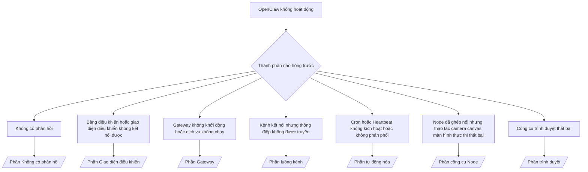

---
read_when:
    - OpenClaw không hoạt động và bạn cần cách khắc phục nhanh nhất
    - Bạn muốn có một quy trình phân loại trước khi đi sâu vào các cẩm nang vận hành chi tiết
summary: Trung tâm khắc phục sự cố theo triệu chứng cho OpenClaw
title: Khắc phục sự cố chung
x-i18n:
    generated_at: "2026-07-12T08:01:20Z"
    model: gpt-5.6
    postprocess_version: locale-links-v1
    provider: openai
    source_hash: db50e0cdf4d11f3aa6196be445358d904a2b9c40c89243f1b124c77167f6dd85
    source_path: help/troubleshooting.md
    workflow: 16
---

Cửa ngõ phân loại sự cố. 2 phút để chẩn đoán, sau đó chuyển đến trang chuyên sâu.

## 60 giây đầu tiên

Chạy lần lượt các lệnh sau:

```bash
openclaw status
openclaw status --all
openclaw gateway probe
openclaw gateway status
openclaw doctor
openclaw channels status --probe
openclaw logs --follow
```

Kết quả tốt, mỗi mục một dòng:

- `openclaw status` hiển thị các kênh đã cấu hình, không có lỗi xác thực.
- `openclaw status --all` tạo báo cáo đầy đủ, có thể chia sẻ.
- `openclaw gateway probe` hiển thị `Reachable: yes`. `Capability: ...` là
  cấp độ xác thực mà phép thăm dò đã xác minh; `Read probe: limited - missing scope:
operator.read` biểu thị khả năng chẩn đoán bị hạn chế, không phải lỗi kết nối.
- `openclaw gateway status` hiển thị `Runtime: running`, `Connectivity probe:
ok` và một giá trị `Capability: ...` hợp lý. Thêm `--require-rpc` để đồng thời yêu cầu
  bằng chứng RPC có phạm vi đọc.
- `openclaw doctor` không báo cáo lỗi cấu hình/dịch vụ gây cản trở.
- `openclaw channels status --probe` trả về trạng thái truyền tải trực tiếp cho từng tài khoản
  (`works` / `audit ok`) khi có thể kết nối đến Gateway; nếu không, lệnh sẽ
  quay về hiển thị bản tóm tắt chỉ dựa trên cấu hình.
- `openclaw logs --follow` hiển thị hoạt động ổn định, không có lỗi nghiêm trọng lặp lại.

## Trợ lý có vẻ bị hạn chế hoặc thiếu công cụ

Kiểm tra hồ sơ công cụ đang có hiệu lực:

```bash
openclaw status
openclaw status --all
openclaw doctor
```

Các nguyên nhân phổ biến:

- `tools.profile: "minimal"` chỉ cho phép `session_status`.
- `tools.profile: "messaging"` có phạm vi hẹp, dành cho các tác nhân chỉ trò chuyện.
- `tools.profile: "coding"` là giá trị mặc định cho cấu hình cục bộ mới (công việc với kho mã, tệp,
  shell và môi trường chạy).
- `tools.profile: "full"` loại bỏ các hạn chế của hồ sơ; chỉ dùng cho các
  tác nhân đáng tin cậy do người vận hành kiểm soát.
- `agents.list[].tools` theo từng tác nhân sẽ thu hẹp hoặc mở rộng hồ sơ gốc
  cho một tác nhân.

Thay đổi hồ sơ, khởi động lại hoặc tải lại Gateway, sau đó kiểm tra lại bằng
`openclaw status --all`. Bảng đầy đủ về hồ sơ/nhóm: [Hồ sơ công cụ](/vi/gateway/config-tools#tool-profiles).

## Ngữ cảnh dài của Anthropic gặp lỗi 429

`HTTP 429: rate_limit_error: Extra usage is required for long context requests`
→ [Anthropic 429 yêu cầu mức sử dụng bổ sung cho ngữ cảnh dài](/vi/gateway/troubleshooting#anthropic-429-extra-usage-required-for-long-context).

## Phần phụ trợ cục bộ tương thích với OpenAI hoạt động trực tiếp nhưng thất bại trong OpenClaw

Phần phụ trợ `/v1` cục bộ/tự lưu trữ của bạn phản hồi các phép thăm dò trực tiếp đến `/v1/chat/completions`
nhưng thất bại khi chạy `openclaw infer model run` hoặc trong các lượt tác nhân thông thường:

1. Nếu lỗi đề cập rằng `messages[].content` phải là chuỗi: đặt
   `models.providers.<provider>.models[].compat.requiresStringContent: true`.
2. Nếu vẫn chỉ thất bại trong các lượt tác nhân OpenClaw: đặt
   `models.providers.<provider>.models[].compat.supportsTools: false` rồi thử lại.
3. Nếu các lệnh gọi trực tiếp nhỏ hoạt động nhưng lời nhắc OpenClaw lớn hơn làm phần phụ trợ gặp sự cố:
   đây là giới hạn của mô hình/máy chủ thượng nguồn, không phải lỗi của OpenClaw. Tiếp tục tại
   [Phần phụ trợ cục bộ tương thích với OpenAI vượt qua phép thăm dò trực tiếp nhưng lượt chạy tác nhân thất bại](/vi/gateway/troubleshooting#local-openai-compatible-backend-passes-direct-probes-but-agent-runs-fail).

## Cài đặt Plugin thất bại do thiếu phần mở rộng openclaw

`package.json missing openclaw.extensions` có nghĩa là gói Plugin sử dụng một
cấu trúc mà OpenClaw không còn chấp nhận.

Khắc phục trong gói Plugin:

1. Thêm `openclaw.extensions` vào `package.json`, trỏ đến các tệp môi trường chạy
   đã được dựng (thường là `./dist/index.js`).
2. Phát hành lại, sau đó chạy lại `openclaw plugins install <package>`.

```json
{
  "name": "@openclaw/my-plugin",
  "version": "1.2.3",
  "openclaw": {
    "extensions": ["./dist/index.js"]
  }
}
```

Tham khảo: [Kiến trúc Plugin](/vi/plugins/architecture)

## Chính sách cài đặt chặn việc cài đặt hoặc cập nhật Plugin

Quá trình cập nhật hoàn tất nhưng các Plugin đã lỗi thời, bị vô hiệu hóa hoặc hiển thị `blocked by install
policy`, `install policy failed closed` hay `Disabled "<plugin>" after plugin
update failure`: hãy kiểm tra `security.installPolicy`.

Chính sách cài đặt chạy khi cài đặt và cập nhật Plugin. Phiên bản Plugin
`@openclaw/*` thường thay đổi cùng bản phát hành OpenClaw, vì vậy một bản cập nhật OpenClaw
có thể cần bản cập nhật Plugin tương ứng trong quá trình đồng bộ sau cập nhật.

Tránh các dạng chính sách sau, trừ khi bạn cũng duy trì quy tắc nâng cấp tương ứng:

- Cố định các Plugin do OpenClaw sở hữu ở đúng một phiên bản cũ (ví dụ: chỉ
  `@openclaw/*@2026.5.3`).
- Chỉ chặn dựa trên loại nguồn (mọi yêu cầu npm, mạng hoặc `request.mode:
"update"`).
- Xem lệnh chính sách là không bắt buộc: khi `security.installPolicy` được
  bật, tệp thực thi chính sách bị thiếu, chậm, không thể đọc hoặc bị chặn quyền
  sẽ khiến hệ thống đóng chặn.
- Phê duyệt phiên bản mà không đối chiếu `openclawVersion` của yêu cầu với
  siêu dữ liệu của ứng viên Plugin.

Ưu tiên các quy tắc cho phép cập nhật `@openclaw/*` đáng tin cậy và tương thích với
máy chủ hiện tại, thay vì ghim vĩnh viễn vào một bản phát hành. Nếu bạn chặn npm theo
mặc định, hãy thêm ngoại lệ hẹp cho các mã định danh Plugin bạn sử dụng và áp dụng cùng
quy tắc tin cậy cho `request.mode: "update"` như khi cài đặt.

Khôi phục:

```bash
openclaw doctor --deep
openclaw plugins update --all
openclaw status --all
```

Nếu chính sách được cố ý đặt nghiêm ngặt, hãy nới lỏng trong khoảng thời gian nâng cấp
đáng tin cậy, chạy lại `openclaw plugins update --all`, sau đó khôi phục quy tắc nghiêm ngặt hơn.
Nếu lỗi cập nhật đã vô hiệu hóa một Plugin, hãy kiểm tra trước khi bật lại:

```bash
openclaw plugins inspect <plugin-id> --runtime --json
openclaw plugins enable <plugin-id>
```

Tham khảo: [Chính sách cài đặt của người vận hành](/vi/tools/skills-config#operator-install-policy-securityinstallpolicy)

## Plugin hiện diện nhưng bị chặn do quyền sở hữu đáng ngờ

Cảnh báo từ `openclaw doctor`, quá trình thiết lập hoặc khởi động hiển thị:

```text
blocked plugin candidate: suspicious ownership (... uid=1000, expected uid=0 or root)
plugin present but blocked
```

Các tệp Plugin thuộc sở hữu của một người dùng Unix khác với tiến trình đang tải
chúng. Không xóa cấu hình Plugin; hãy sửa quyền sở hữu tệp hoặc chạy
OpenClaw bằng người dùng sở hữu thư mục trạng thái.

Các bản cài đặt Docker chạy dưới người dùng `node` (uid `1000`). Sửa các điểm gắn kết liên kết của máy chủ:

```bash
sudo chown -R 1000:1000 /path/to/openclaw-config /path/to/openclaw-workspace
openclaw doctor --fix
```

Nếu bạn cố ý chạy OpenClaw dưới quyền root, hãy sửa thư mục gốc Plugin được quản lý
thay thế:

```bash
sudo chown -R root:root /path/to/openclaw-config/npm
openclaw doctor --fix
```

Tài liệu chuyên sâu: [Quyền sở hữu đường dẫn Plugin bị chặn](/vi/tools/plugin#blocked-plugin-path-ownership), [Docker: Quyền và EACCES](/vi/install/docker#shell-helpers-optional)

## Cây quyết định



<AccordionGroup>
  <Accordion title="Không có phản hồi">
    ```bash
    openclaw status
    openclaw gateway status
    openclaw channels status --probe
    openclaw pairing list --channel <channel> [--account <id>]
    openclaw logs --follow
    ```

    Kết quả tốt:

    - `Runtime: running`
    - `Connectivity probe: ok`
    - `Capability: read-only`, `write-capable` hoặc `admin-capable`
    - Kênh hiển thị phương thức truyền tải đã kết nối và, nếu được hỗ trợ, có `works` hoặc
      `audit ok` trong `channels status --probe`
    - Người gửi đã được phê duyệt (hoặc chính sách tin nhắn trực tiếp ở chế độ mở/danh sách cho phép)

    Dấu hiệu trong nhật ký:

    - `drop guild message (mention required` → cơ chế yêu cầu đề cập của Discord đã chặn thông điệp.
    - `pairing request` → người gửi chưa được phê duyệt, đang chờ phê duyệt ghép nối tin nhắn trực tiếp.
    - `blocked` / `allowlist` trong nhật ký kênh → người gửi, phòng hoặc nhóm đã bị lọc.

    Trang chuyên sâu: [Không có phản hồi](/vi/gateway/troubleshooting#no-replies), [Khắc phục sự cố kênh](/vi/channels/troubleshooting), [Ghép nối](/vi/channels/pairing)

  </Accordion>

  <Accordion title="Bảng điều khiển hoặc giao diện điều khiển không kết nối được">
    ```bash
    openclaw status
    openclaw gateway status
    openclaw logs --follow
    openclaw doctor
    openclaw channels status --probe
    ```

    Kết quả tốt:

    - `Dashboard: http://...` hiển thị trong `openclaw gateway status`
    - `Connectivity probe: ok`
    - `Capability: read-only`, `write-capable` hoặc `admin-capable`
    - Không có vòng lặp xác thực trong nhật ký

    Dấu hiệu trong nhật ký:

    - `device identity required` → ngữ cảnh HTTP/không bảo mật không thể hoàn tất xác thực thiết bị.
    - `origin not allowed` → `Origin` của trình duyệt không được phép đối với đích Gateway của giao diện điều khiển.
    - `AUTH_TOKEN_MISMATCH` với `canRetryWithDeviceToken=true` → có thể tự động thử lại một lần bằng mã thông báo thiết bị đáng tin cậy, sử dụng lại các phạm vi đã lưu đệm của mã thông báo ghép nối.
    - `unauthorized` lặp lại sau lần thử đó → sai mã thông báo/mật khẩu, chế độ xác thực không khớp hoặc mã thông báo thiết bị đã ghép nối bị cũ.
    - `too many failed authentication attempts (retry later)` → các lần thất bại lặp lại từ `Origin` của trình duyệt đó tạm thời bị khóa; các nguồn localhost khác sử dụng nhóm giới hạn riêng. Xem [Khả năng kết nối của bảng điều khiển/giao diện điều khiển](/vi/gateway/troubleshooting#dashboard-control-ui-connectivity) để biết sắc thái về việc thử lại đồng thời của Tailscale Serve.
    - `gateway connect failed:` → giao diện người dùng nhắm đến sai URL/cổng hoặc không thể kết nối đến Gateway.

    Trang chuyên sâu: [Khả năng kết nối của bảng điều khiển/giao diện điều khiển](/vi/gateway/troubleshooting#dashboard-control-ui-connectivity), [Giao diện điều khiển](/vi/web/control-ui), [Xác thực](/vi/gateway/authentication)

  </Accordion>

  <Accordion title="Gateway không khởi động hoặc dịch vụ đã cài đặt nhưng không chạy">
    ```bash
    openclaw status
    openclaw gateway status
    openclaw logs --follow
    openclaw doctor
    openclaw channels status --probe
    ```

    Kết quả tốt:

    - `Service: ... (loaded)`
    - `Runtime: running`
    - `Connectivity probe: ok`
    - `Capability: read-only`, `write-capable` hoặc `admin-capable`

    Dấu hiệu trong nhật ký:

    - `Gateway start blocked: set gateway.mode=local` hoặc `existing config is missing gateway.mode` → chế độ Gateway đang là từ xa hoặc cấu hình thiếu dấu xác nhận chế độ cục bộ và cần được sửa.
    - `refusing to bind gateway ... without auth` → liên kết không phải loopback mà không có đường dẫn xác thực hợp lệ (mã thông báo/mật khẩu hoặc proxy đáng tin cậy nếu đã cấu hình).
    - `another gateway instance is already listening` hoặc `EADDRINUSE` → cổng đã được sử dụng.

    Trang chuyên sâu: [Dịch vụ Gateway không chạy](/vi/gateway/troubleshooting#gateway-service-not-running), [Tiến trình nền](/vi/gateway/background-process), [Cấu hình](/vi/gateway/configuration)

  </Accordion>

  <Accordion title="Kênh kết nối nhưng thông điệp không được truyền">
    ```bash
    openclaw status
    openclaw gateway status
    openclaw logs --follow
    openclaw doctor
    openclaw channels status --probe
    ```

    Kết quả tốt:

    - Phương thức truyền tải của kênh đã kết nối.
    - Kiểm tra ghép nối/danh sách cho phép thành công.
    - Phát hiện được lượt đề cập tại nơi yêu cầu.

    Dấu hiệu trong nhật ký:

    - `mention required` → cơ chế yêu cầu đề cập trong nhóm đã chặn quá trình xử lý.
    - `pairing` / `pending` → người gửi tin nhắn trực tiếp chưa được phê duyệt.
    - `not_in_channel`, `missing_scope`, `Forbidden`, `401/403` → vấn đề về mã thông báo quyền của kênh.

    Trang chuyên sâu: [Kênh đã kết nối nhưng thông điệp không được truyền](/vi/gateway/troubleshooting#channel-connected-messages-not-flowing), [Khắc phục sự cố kênh](/vi/channels/troubleshooting)

  </Accordion>

  <Accordion title="Cron hoặc Heartbeat không kích hoạt hoặc không phân phối">
    ```bash
    openclaw status
    openclaw gateway status
    openclaw cron status
    openclaw cron list
    openclaw cron runs --id <jobId> --limit 20
    openclaw logs --follow
    ```

    Kết quả tốt:

    - `cron status` hiển thị bộ lập lịch đã bật cùng thời điểm đánh thức tiếp theo.
    - `cron runs` hiển thị các mục `ok` gần đây.
    - Heartbeat đã bật và đang trong khung giờ hoạt động.

    Dấu hiệu trong nhật ký:

    - `cron: scheduler disabled; jobs will not run automatically` → Cron đã bị tắt.
    - `heartbeat skipped` với lý do `quiet-hours` → nằm ngoài giờ hoạt động đã cấu hình.
    - `heartbeat skipped` với lý do `empty-heartbeat-file` → `HEARTBEAT.md` tồn tại nhưng chỉ chứa nội dung khung trống như dòng trống, chú thích, tiêu đề, hàng rào mã hoặc danh sách kiểm tra trống.
    - `heartbeat skipped` với lý do `no-tasks-due` → chế độ tác vụ đang hoạt động nhưng chưa đến hạn của khoảng thời gian tác vụ nào.
    - `heartbeat skipped` với lý do `alerts-disabled` → `showOk`, `showAlerts` và `useIndicator` đều bị tắt.
    - `requests-in-flight` → luồng chính đang bận; lần đánh thức Heartbeat bị hoãn.
    - `unknown accountId` → tài khoản đích nhận Heartbeat không tồn tại.

    Các trang chuyên sâu: [Phân phối Cron và Heartbeat](/vi/gateway/troubleshooting#cron-and-heartbeat-delivery), [Tác vụ theo lịch: Khắc phục sự cố](/vi/automation/cron-jobs#troubleshooting), [Heartbeat](/vi/gateway/heartbeat)

  </Accordion>

  <Accordion title="Node đã được ghép nối nhưng công cụ camera canvas screen exec thất bại">
    ```bash
    openclaw status
    openclaw gateway status
    openclaw nodes status
    openclaw nodes describe --node <idOrNameOrIp>
    openclaw logs --follow
    ```

    Kết quả đúng:

    - Node được liệt kê là đã kết nối và ghép nối cho vai trò `node`.
    - Khả năng cần thiết cho lệnh bạn đang gọi có tồn tại.
    - Trạng thái quyền cho công cụ là đã được cấp.

    Dấu hiệu trong nhật ký:

    - `NODE_BACKGROUND_UNAVAILABLE` → đưa ứng dụng Node ra tiền cảnh.
    - `*_PERMISSION_REQUIRED` → quyền của hệ điều hành bị từ chối hoặc còn thiếu.
    - `SYSTEM_RUN_DENIED: approval required` → phê duyệt exec đang chờ xử lý.
    - `SYSTEM_RUN_DENIED: allowlist miss` → lệnh không nằm trong danh sách cho phép của exec.

    Các trang chuyên sâu: [Node đã ghép nối nhưng công cụ thất bại](/vi/gateway/troubleshooting#node-paired-tool-fails), [Khắc phục sự cố Node](/vi/nodes/troubleshooting), [Phê duyệt exec](/vi/tools/exec-approvals)

  </Accordion>

  <Accordion title="Exec đột nhiên yêu cầu phê duyệt">
    ```bash
    openclaw config get tools.exec.host
    openclaw config get tools.exec.security
    openclaw config get tools.exec.ask
    openclaw gateway restart
    ```

    Những thay đổi:

    - Khi chưa đặt, `tools.exec.host` mặc định là `auto`, giá trị này được phân giải thành `sandbox`
      khi môi trường chạy sandbox đang hoạt động, nếu không thì thành `gateway`.
    - `host=auto` chỉ định tuyến; hành vi không nhắc xác nhận đến từ
      `security=full` kết hợp với `ask=off` trên Gateway/Node.
    - Khi chưa đặt, `tools.exec.security` mặc định là `full` trên `gateway`/`node`.
    - Khi chưa đặt, `tools.exec.ask` mặc định là `off`.
    - Nếu bạn thấy yêu cầu phê duyệt, một chính sách cục bộ trên máy chủ hoặc theo phiên nào đó
      đã siết chặt exec so với các giá trị mặc định này.

    Khôi phục các giá trị mặc định hiện tại không yêu cầu phê duyệt:

    ```bash
    openclaw config set tools.exec.host gateway
    openclaw config set tools.exec.security full
    openclaw config set tools.exec.ask off
    openclaw gateway restart
    ```

    Các phương án an toàn hơn:

    - Chỉ đặt `tools.exec.host=gateway` để định tuyến máy chủ ổn định.
    - Dùng `security=allowlist` với `ask=on-miss` để thực thi trên máy chủ và yêu cầu xem xét
      khi lệnh không có trong danh sách cho phép.
    - Bật chế độ sandbox để `host=auto` được phân giải trở lại thành `sandbox`.

    Dấu hiệu trong nhật ký:

    - `Approval required.` → lệnh đang chờ `/approve ...`.
    - `SYSTEM_RUN_DENIED: approval required` → phê duyệt exec trên máy chủ Node đang chờ xử lý.
    - `exec host=sandbox requires a sandbox runtime for this session` → sandbox được chọn ngầm định hoặc tường minh nhưng chế độ sandbox đang tắt.

    Các trang chuyên sâu: [Exec](/vi/tools/exec), [Phê duyệt exec](/vi/tools/exec-approvals), [Bảo mật: Nội dung kiểm tra của quy trình kiểm toán](/vi/gateway/security#what-the-audit-checks-high-level)

  </Accordion>

  <Accordion title="Công cụ trình duyệt thất bại">
    ```bash
    openclaw status
    openclaw gateway status
    openclaw browser status
    openclaw logs --follow
    openclaw doctor
    ```

    Kết quả đúng:

    - Trạng thái trình duyệt hiển thị `running: true` cùng trình duyệt/hồ sơ đã chọn.
    - Hồ sơ `openclaw` khởi động được hoặc hồ sơ `user` thấy các thẻ Chrome cục bộ.

    Dấu hiệu trong nhật ký:

    - `unknown command "browser"` → `plugins.allow` đã được đặt và không bao gồm `browser`.
    - `Failed to start Chrome CDP on port` → không thể khởi chạy trình duyệt cục bộ.
    - `browser.executablePath not found` → đường dẫn tệp thực thi đã cấu hình không đúng.
    - `browser.cdpUrl must be http(s) or ws(s)` → URL CDP đã cấu hình sử dụng giao thức không được hỗ trợ.
    - `browser.cdpUrl has invalid port` → URL CDP đã cấu hình có cổng không hợp lệ hoặc nằm ngoài phạm vi.
    - `No Chrome tabs found for profile="user"` → hồ sơ đính kèm Chrome MCP không có thẻ Chrome cục bộ nào đang mở.
    - `Remote CDP for profile "<name>" is not reachable` → không thể truy cập điểm cuối CDP từ xa đã cấu hình từ máy chủ này.
    - `Browser attachOnly is enabled ... not reachable` → hồ sơ chỉ đính kèm không có đích CDP đang hoạt động.
    - Các tùy chọn ghi đè cũ về khung nhìn/chế độ tối/ngôn ngữ/chế độ ngoại tuyến trên hồ sơ chỉ đính kèm hoặc CDP từ xa → chạy `openclaw browser stop --browser-profile <name>` để đóng phiên điều khiển và giải phóng trạng thái mô phỏng mà không cần khởi động lại Gateway.

    Các trang chuyên sâu: [Công cụ trình duyệt thất bại](/vi/gateway/troubleshooting#browser-tool-fails), [Thiếu lệnh hoặc công cụ trình duyệt](/vi/tools/browser#missing-browser-command-or-tool), [Trình duyệt: Khắc phục sự cố trên Linux](/vi/tools/browser-linux-troubleshooting), [Trình duyệt: Khắc phục sự cố CDP từ xa trên WSL2/Windows](/vi/tools/browser-wsl2-windows-remote-cdp-troubleshooting)

  </Accordion>

</AccordionGroup>

## Liên quan

- [Câu hỏi thường gặp](/vi/help/faq) — các câu hỏi thường gặp
- [Khắc phục sự cố Gateway](/vi/gateway/troubleshooting) — các sự cố dành riêng cho Gateway
- [Doctor](/vi/gateway/doctor) — kiểm tra tình trạng và sửa chữa tự động
- [Khắc phục sự cố kênh](/vi/channels/troubleshooting) — các sự cố kết nối kênh
- [Tác vụ theo lịch: Khắc phục sự cố](/vi/automation/cron-jobs#troubleshooting) — các sự cố về Cron và Heartbeat
