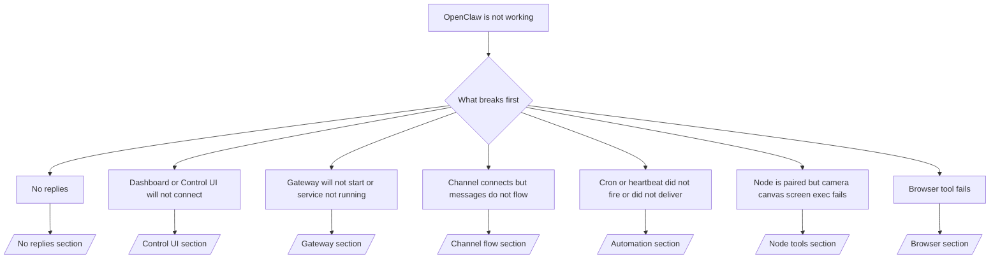

---
read_when:
    - OpenClaw không hoạt động và bạn cần cách nhanh nhất để khắc phục
    - Bạn cần một luồng phân loại trước khi đi sâu vào các sổ tay vận hành chuyên sâu
summary: Trung tâm khắc phục sự cố theo triệu chứng trước cho OpenClaw
title: Khắc phục sự cố chung
x-i18n:
    generated_at: "2026-06-27T17:36:21Z"
    model: gpt-5.5
    postprocess_version: locale-links-v1
    provider: openai
    source_hash: ae1236c73e3a5c9237bd81d603e8dca18c595a8bcbb71f5931bfbf2389b342cd
    source_path: help/troubleshooting.md
    workflow: 16
---

Nếu bạn chỉ có 2 phút, hãy dùng trang này như cửa vào phân loại sự cố.

## 60 giây đầu tiên

Chạy đúng thang lệnh này theo thứ tự:

```bash
openclaw status
openclaw status --all
openclaw gateway probe
openclaw gateway status
openclaw doctor
openclaw channels status --probe
openclaw logs --follow
```

Đầu ra tốt trong một dòng:

- `openclaw status` → hiển thị các kênh đã cấu hình và không có lỗi xác thực rõ ràng.
- `openclaw status --all` → báo cáo đầy đủ hiện diện và có thể chia sẻ.
- `openclaw gateway probe` → mục tiêu Gateway mong đợi có thể truy cập được (`Reachable: yes`). `Capability: ...` cho biết probe có thể chứng minh mức xác thực nào, và `Read probe: limited - missing scope: operator.read` là chẩn đoán bị suy giảm, không phải lỗi kết nối.
- `openclaw gateway status` → `Runtime: running`, `Connectivity probe: ok`, và một dòng `Capability: ...` hợp lý. Dùng `--require-rpc` nếu bạn cũng cần bằng chứng RPC phạm vi đọc.
- `openclaw doctor` → không có lỗi cấu hình/dịch vụ chặn.
- `openclaw channels status --probe` → Gateway có thể truy cập sẽ trả về trạng thái truyền tải trực tiếp theo từng tài khoản
  cùng kết quả probe/kiểm tra như `works` hoặc `audit ok`; nếu
  Gateway không thể truy cập, lệnh sẽ chuyển sang các tóm tắt chỉ dựa trên cấu hình.
- `openclaw logs --follow` → hoạt động ổn định, không có lỗi nghiêm trọng lặp lại.

## Trợ lý bị giới hạn hoặc thiếu công cụ

Nếu trợ lý không thể kiểm tra tệp, chạy lệnh, dùng tự động hóa trình duyệt, hoặc
thấy các công cụ mong đợi, hãy kiểm tra hồ sơ công cụ hiệu lực trước:

```bash
openclaw status
openclaw status --all
openclaw doctor
```

Nguyên nhân phổ biến:

- `tools.profile: "messaging"` cố ý hẹp cho các agent chỉ trò chuyện.
- `tools.profile: "coding"` là hồ sơ thông thường cho các quy trình kho mã, tệp, shell,
  và runtime.
- `tools.profile: "full"` cung cấp bộ công cụ rộng nhất và nên được giới hạn
  cho các agent do operator đáng tin cậy kiểm soát.
- Ghi đè `agents.list[].tools` theo từng agent có thể thu hẹp hoặc mở rộng hồ sơ
  gốc cho một agent.

Thay đổi hồ sơ công cụ gốc hoặc theo từng agent, rồi khởi động lại hoặc tải lại Gateway
và chạy lại `openclaw status --all`. Xem [Công cụ](/vi/tools) để biết mô hình hồ sơ
và các ghi đè cho phép/từ chối.

## Ngữ cảnh dài Anthropic 429

Nếu bạn thấy:
`HTTP 429: rate_limit_error: Extra usage is required for long context requests`,
hãy đến [/gateway/troubleshooting#anthropic-429-extra-usage-required-for-long-context](/vi/gateway/troubleshooting#anthropic-429-extra-usage-required-for-long-context).

## Backend cục bộ tương thích OpenAI hoạt động trực tiếp nhưng lỗi trong OpenClaw

Nếu backend `/v1` cục bộ hoặc tự lưu trữ của bạn trả lời các probe
`/v1/chat/completions` trực tiếp nhỏ nhưng lỗi trên `openclaw infer model run` hoặc các lượt
agent thông thường:

1. Nếu lỗi nhắc đến `messages[].content` mong đợi một chuỗi, đặt
   `models.providers.<provider>.models[].compat.requiresStringContent: true`.
2. Nếu backend vẫn chỉ lỗi trên các lượt agent OpenClaw, đặt
   `models.providers.<provider>.models[].compat.supportsTools: false` rồi thử lại.
3. Nếu các lệnh gọi trực tiếp rất nhỏ vẫn hoạt động nhưng prompt OpenClaw lớn hơn làm sập
   backend, hãy xem vấn đề còn lại là giới hạn của mô hình/máy chủ upstream và
   tiếp tục trong runbook chuyên sâu:
   [/gateway/troubleshooting#local-openai-compatible-backend-passes-direct-probes-but-agent-runs-fail](/vi/gateway/troubleshooting#local-openai-compatible-backend-passes-direct-probes-but-agent-runs-fail)

## Cài đặt Plugin lỗi vì thiếu openclaw extensions

Nếu cài đặt lỗi với `package.json missing openclaw.extensions`, gói Plugin
đang dùng định dạng cũ mà OpenClaw không còn chấp nhận.

Sửa trong gói Plugin:

1. Thêm `openclaw.extensions` vào `package.json`.
2. Trỏ các mục đến tệp runtime đã build (thường là `./dist/index.js`).
3. Phát hành lại Plugin và chạy lại `openclaw plugins install <package>`.

Ví dụ:

```json
{
  "name": "@openclaw/my-plugin",
  "version": "1.2.3",
  "openclaw": {
    "extensions": ["./dist/index.js"]
  }
}
```

Tham khảo: [Kiến trúc Plugin](/vi/plugins/architecture)

## Chính sách cài đặt chặn cài đặt hoặc cập nhật Plugin

Nếu một bản cập nhật hoàn tất nhưng Plugin bị cũ, bị vô hiệu hóa, hoặc hiển thị thông báo như
`blocked by install policy`, `install policy failed closed`, hoặc
`Disabled "<plugin>" after plugin update failure`, hãy kiểm tra
`security.installPolicy`.

Chính sách cài đặt chạy khi cài đặt và cập nhật Plugin. Các phiên bản Plugin
do OpenClaw sở hữu thường đi cùng bản phát hành OpenClaw, nên một bản cập nhật OpenClaw
cũng có thể cần các bản cập nhật Plugin `@openclaw/*` tương ứng trong đồng bộ sau cập nhật.

Tránh các dạng chính sách rộng này trừ khi bạn cũng duy trì quy tắc nâng cấp tương ứng:

- Đóng băng Plugin do OpenClaw sở hữu ở đúng một phiên bản cũ, chẳng hạn chỉ cho phép
  `@openclaw/*@2026.5.3`.
- Chặn chỉ theo loại nguồn, chẳng hạn mọi yêu cầu Plugin npm, mạng, hoặc
  `request.mode: "update"`.
- Xem lệnh chính sách là tùy chọn. Khi `security.installPolicy` được
  bật, tệp thực thi chính sách bị thiếu, chậm, không đọc được, hoặc bị quyền chặn
  sẽ fail closed.
- Phê duyệt phiên bản Plugin mà không xét đến
  `openclawVersion` của yêu cầu chính sách và metadata ứng viên Plugin.

Quy tắc chính sách an toàn hơn cho phép cập nhật Plugin tin cậy do OpenClaw sở hữu khi
ứng viên tương thích với host OpenClaw hiện tại, thay vì ghim
một bản phát hành duy nhất mãi mãi. Nếu bạn chặn npm theo mặc định, hãy tạo ngoại lệ hẹp
cho các gói Plugin `@openclaw/*` tin cậy hoặc id Plugin bạn dùng. Nếu bạn
phân biệt yêu cầu cài đặt và cập nhật, hãy áp dụng cùng quy tắc tin cậy cho
`request.mode: "update"`.

Khôi phục:

```bash
openclaw doctor --deep
openclaw plugins update --all
openclaw status --all
```

Nếu chính sách cố ý nghiêm ngặt, hãy nới lỏng nó cho khoảng nâng cấp OpenClaw tin cậy,
chạy lại `openclaw plugins update --all`, rồi khôi phục quy tắc nghiêm ngặt hơn.
Nếu một Plugin bị vô hiệu hóa sau lỗi cập nhật, hãy kiểm tra nó và chỉ bật lại
sau khi cập nhật thành công:

```bash
openclaw plugins inspect <plugin-id> --runtime --json
openclaw plugins enable <plugin-id>
```

Tham khảo: [Chính sách cài đặt của operator](/vi/tools/skills-config#operator-install-policy-securityinstallpolicy)

## Plugin hiện diện nhưng bị chặn vì quyền sở hữu đáng ngờ

Nếu `openclaw doctor`, thiết lập, hoặc cảnh báo khởi động hiển thị:

```text
blocked plugin candidate: suspicious ownership (... uid=1000, expected uid=0 or root)
plugin present but blocked
```

các tệp Plugin thuộc sở hữu của một người dùng Unix khác với tiến trình đang tải
chúng. Đừng xóa cấu hình Plugin. Hãy sửa quyền sở hữu tệp hoặc chạy OpenClaw bằng
cùng người dùng sở hữu thư mục trạng thái.

Các bản cài Docker thường chạy dưới dạng `node` (uid `1000`). Với thiết lập Docker mặc định,
sửa các bind mount trên host:

```bash
sudo chown -R 1000:1000 /path/to/openclaw-config /path/to/openclaw-workspace
openclaw doctor --fix
```

Nếu bạn cố ý chạy OpenClaw dưới quyền root, hãy sửa root Plugin được quản lý thành
quyền sở hữu root thay vào đó:

```bash
sudo chown -R root:root /path/to/openclaw-config/npm
openclaw doctor --fix
```

Tài liệu sâu hơn:

- [Quyền sở hữu đường dẫn Plugin](/vi/tools/plugin#blocked-plugin-path-ownership)
- [Quyền Docker](/vi/install/docker#permissions-and-eacces)

## Cây quyết định



<AccordionGroup>
  <Accordion title="No replies">
    ```bash
    openclaw status
    openclaw gateway status
    openclaw channels status --probe
    openclaw pairing list --channel <channel> [--account <id>]
    openclaw logs --follow
    ```

    Đầu ra tốt trông như sau:

    - `Runtime: running`
    - `Connectivity probe: ok`
    - `Capability: read-only`, `write-capable`, hoặc `admin-capable`
    - Kênh của bạn hiển thị truyền tải đã kết nối và, khi được hỗ trợ, `works` hoặc `audit ok` trong `channels status --probe`
    - Người gửi có vẻ đã được phê duyệt (hoặc chính sách DM đang mở/danh sách cho phép)

    Chữ ký log phổ biến:

    - `drop guild message (mention required` → cổng nhắc đến đã chặn tin nhắn trong Discord.
    - `pairing request` → người gửi chưa được phê duyệt và đang chờ phê duyệt ghép đôi qua DM.
    - `blocked` / `allowlist` trong log kênh → người gửi, phòng, hoặc nhóm bị lọc.

    Trang chuyên sâu:

    - [/gateway/troubleshooting#no-replies](/vi/gateway/troubleshooting#no-replies)
    - [/channels/troubleshooting](/vi/channels/troubleshooting)
    - [/channels/pairing](/vi/channels/pairing)

  </Accordion>

  <Accordion title="Dashboard or Control UI will not connect">
    ```bash
    openclaw status
    openclaw gateway status
    openclaw logs --follow
    openclaw doctor
    openclaw channels status --probe
    ```

    Đầu ra tốt trông như sau:

    - `Dashboard: http://...` được hiển thị trong `openclaw gateway status`
    - `Connectivity probe: ok`
    - `Capability: read-only`, `write-capable`, hoặc `admin-capable`
    - Không có vòng lặp xác thực trong log

    Chữ ký log phổ biến:

    - `device identity required` → ngữ cảnh HTTP/không an toàn không thể hoàn tất xác thực thiết bị.
    - `origin not allowed` → `Origin` của trình duyệt không được phép cho mục tiêu Gateway
      Control UI.
    - `AUTH_TOKEN_MISMATCH` kèm gợi ý thử lại (`canRetryWithDeviceToken=true`) → một lần thử lại bằng device-token tin cậy có thể tự động xảy ra.
    - Lần thử lại bằng token đã lưu cache đó tái sử dụng bộ phạm vi đã lưu cache cùng với
      device token đã ghép đôi. Các caller `deviceToken` rõ ràng / `scopes` rõ ràng giữ nguyên
      bộ phạm vi đã yêu cầu của chúng.
    - Trên đường dẫn Control UI bất đồng bộ qua Tailscale Serve, các lần thử thất bại cho cùng
      `{scope, ip}` được tuần tự hóa trước khi bộ giới hạn ghi nhận lỗi, nên một
      lần thử lại sai đồng thời thứ hai đã có thể hiển thị `retry later`.
    - `too many failed authentication attempts (retry later)` từ origin trình duyệt localhost
      → các lỗi lặp lại từ cùng `Origin` đó tạm thời
      bị khóa; một origin localhost khác dùng một bucket riêng.
    - `unauthorized` lặp lại sau lần thử lại đó → token/mật khẩu sai, chế độ xác thực không khớp, hoặc device token đã ghép đôi bị cũ.
    - `gateway connect failed:` → UI đang trỏ đến sai URL/cổng hoặc Gateway không thể truy cập.

    Trang chuyên sâu:

    - [/gateway/troubleshooting#dashboard-control-ui-connectivity](/vi/gateway/troubleshooting#dashboard-control-ui-connectivity)
    - [/web/control-ui](/vi/web/control-ui)
    - [/gateway/authentication](/vi/gateway/authentication)

  </Accordion>

  <Accordion title="Gateway will not start or service installed but not running">
    ```bash
    openclaw status
    openclaw gateway status
    openclaw logs --follow
    openclaw doctor
    openclaw channels status --probe
    ```

    Đầu ra tốt trông như sau:

    - `Service: ... (loaded)`
    - `Runtime: running`
    - `Connectivity probe: ok`
    - `Capability: read-only`, `write-capable`, hoặc `admin-capable`

    Chữ ký log phổ biến:

    - `Gateway start blocked: set gateway.mode=local` hoặc `existing config is missing gateway.mode` → chế độ Gateway là remote, hoặc tệp cấu hình thiếu dấu local-mode và nên được sửa.
    - `refusing to bind gateway ... without auth` → bind không phải local loopback mà không có đường xác thực Gateway hợp lệ (token/mật khẩu, hoặc trusted-proxy khi được cấu hình).
    - `another gateway instance is already listening` hoặc `EADDRINUSE` → cổng đã bị chiếm.

    Trang chuyên sâu:

    - [/gateway/troubleshooting#gateway-service-not-running](/vi/gateway/troubleshooting#gateway-service-not-running)
    - [/gateway/background-process](/vi/gateway/background-process)
    - [/gateway/configuration](/vi/gateway/configuration)

  </Accordion>

  <Accordion title="Kênh kết nối nhưng tin nhắn không lưu chuyển">
    ```bash
    openclaw status
    openclaw gateway status
    openclaw logs --follow
    openclaw doctor
    openclaw channels status --probe
    ```

    Đầu ra tốt sẽ trông như sau:

    - Transport của kênh đã kết nối.
    - Kiểm tra ghép đôi/danh sách cho phép đều đạt.
    - Lượt nhắc được phát hiện ở nơi bắt buộc.

    Chữ ký nhật ký thường gặp:

    - `mention required` → cổng nhắc trong nhóm đã chặn xử lý.
    - `pairing` / `pending` → người gửi DM chưa được phê duyệt.
    - `not_in_channel`, `missing_scope`, `Forbidden`, `401/403` → vấn đề token quyền của kênh.

    Trang chuyên sâu:

    - [/gateway/troubleshooting#channel-connected-messages-not-flowing](/vi/gateway/troubleshooting#channel-connected-messages-not-flowing)
    - [/channels/troubleshooting](/vi/channels/troubleshooting)

  </Accordion>

  <Accordion title="Cron hoặc Heartbeat không kích hoạt hoặc không gửi">
    ```bash
    openclaw status
    openclaw gateway status
    openclaw cron status
    openclaw cron list
    openclaw cron runs --id <jobId> --limit 20
    openclaw logs --follow
    ```

    Đầu ra tốt sẽ trông như sau:

    - `cron.status` hiển thị đã bật kèm lần đánh thức tiếp theo.
    - `cron runs` hiển thị các mục `ok` gần đây.
    - Heartbeat đã bật và không nằm ngoài giờ hoạt động.

    Chữ ký nhật ký thường gặp:

    - `cron: scheduler disabled; jobs will not run automatically` → Cron bị tắt.
    - `heartbeat skipped` với `reason=quiet-hours` → ngoài giờ hoạt động đã cấu hình.
    - `heartbeat skipped` với `reason=empty-heartbeat-file` → `HEARTBEAT.md` tồn tại nhưng chỉ chứa khung trống, chú thích, tiêu đề, fence hoặc danh sách kiểm tra trống.
    - `heartbeat skipped` với `reason=no-tasks-due` → chế độ tác vụ của `HEARTBEAT.md` đang hoạt động nhưng chưa đến hạn khoảng thời gian nào của tác vụ.
    - `heartbeat skipped` với `reason=alerts-disabled` → toàn bộ khả năng hiển thị Heartbeat đã bị tắt (`showOk`, `showAlerts` và `useIndicator` đều tắt).
    - `requests-in-flight` → luồng chính đang bận; lần đánh thức Heartbeat đã bị trì hoãn.
    - `unknown accountId` → tài khoản đích gửi Heartbeat không tồn tại.

    Trang chuyên sâu:

    - [/gateway/troubleshooting#cron-and-heartbeat-delivery](/vi/gateway/troubleshooting#cron-and-heartbeat-delivery)
    - [/automation/cron-jobs#troubleshooting](/vi/automation/cron-jobs#troubleshooting)
    - [/gateway/heartbeat](/vi/gateway/heartbeat)

  </Accordion>

  <Accordion title="Node đã ghép đôi nhưng công cụ camera canvas screen exec thất bại">
    ```bash
    openclaw status
    openclaw gateway status
    openclaw nodes status
    openclaw nodes describe --node <idOrNameOrIp>
    openclaw logs --follow
    ```

    Đầu ra tốt sẽ trông như sau:

    - Node được liệt kê là đã kết nối và đã ghép đôi cho vai trò `node`.
    - Năng lực tồn tại cho lệnh bạn đang gọi.
    - Trạng thái quyền đã được cấp cho công cụ.

    Chữ ký nhật ký thường gặp:

    - `NODE_BACKGROUND_UNAVAILABLE` → đưa ứng dụng node ra nền trước.
    - `*_PERMISSION_REQUIRED` → quyền hệ điều hành bị từ chối/thiếu.
    - `SYSTEM_RUN_DENIED: approval required` → phê duyệt exec đang chờ.
    - `SYSTEM_RUN_DENIED: allowlist miss` → lệnh không nằm trong danh sách cho phép exec.

    Trang chuyên sâu:

    - [/gateway/troubleshooting#node-paired-tool-fails](/vi/gateway/troubleshooting#node-paired-tool-fails)
    - [/nodes/troubleshooting](/vi/nodes/troubleshooting)
    - [/tools/exec-approvals](/vi/tools/exec-approvals)

  </Accordion>

  <Accordion title="Exec đột ngột yêu cầu phê duyệt">
    ```bash
    openclaw config get tools.exec.host
    openclaw config get tools.exec.security
    openclaw config get tools.exec.ask
    openclaw gateway restart
    ```

    Điều đã thay đổi:

    - Nếu `tools.exec.host` chưa đặt, mặc định là `auto`.
    - `host=auto` phân giải thành `sandbox` khi runtime sandbox đang hoạt động, nếu không thì thành `gateway`.
    - `host=auto` chỉ định tuyến; hành vi "YOLO" không nhắc đến từ `security=full` cộng với `ask=off` trên gateway/node.
    - Trên `gateway` và `node`, `tools.exec.security` chưa đặt mặc định là `full`.
    - `tools.exec.ask` chưa đặt mặc định là `off`.
    - Kết quả: nếu bạn thấy các yêu cầu phê duyệt, một số chính sách cục bộ theo host hoặc theo phiên đã siết exec chặt hơn các mặc định hiện tại.

    Khôi phục hành vi mặc định hiện tại không cần phê duyệt:

    ```bash
    openclaw config set tools.exec.host gateway
    openclaw config set tools.exec.security full
    openclaw config set tools.exec.ask off
    openclaw gateway restart
    ```

    Các lựa chọn thay thế an toàn hơn:

    - Chỉ đặt `tools.exec.host=gateway` nếu bạn chỉ muốn định tuyến host ổn định.
    - Dùng `security=allowlist` với `ask=on-miss` nếu bạn muốn exec trên host nhưng vẫn muốn xem xét khi trượt danh sách cho phép.
    - Bật chế độ sandbox nếu bạn muốn `host=auto` phân giải lại về `sandbox`.

    Chữ ký nhật ký thường gặp:

    - `Approval required.` → lệnh đang chờ `/approve ...`.
    - `SYSTEM_RUN_DENIED: approval required` → phê duyệt exec trên node-host đang chờ.
    - `exec host=sandbox requires a sandbox runtime for this session` → lựa chọn sandbox ngầm định/rõ ràng nhưng chế độ sandbox đang tắt.

    Trang chuyên sâu:

    - [/tools/exec](/vi/tools/exec)
    - [/tools/exec-approvals](/vi/tools/exec-approvals)
    - [/gateway/security#what-the-audit-checks-high-level](/vi/gateway/security#what-the-audit-checks-high-level)

  </Accordion>

  <Accordion title="Công cụ trình duyệt thất bại">
    ```bash
    openclaw status
    openclaw gateway status
    openclaw browser status
    openclaw logs --follow
    openclaw doctor
    ```

    Đầu ra tốt sẽ trông như sau:

    - Trạng thái trình duyệt hiển thị `running: true` và trình duyệt/hồ sơ đã chọn.
    - `openclaw` khởi động, hoặc `user` có thể thấy các thẻ Chrome cục bộ.

    Chữ ký nhật ký thường gặp:

    - `unknown command "browser"` hoặc `unknown command 'browser'` → `plugins.allow` đã đặt và không bao gồm `browser`.
    - `Failed to start Chrome CDP on port` → khởi chạy trình duyệt cục bộ thất bại.
    - `browser.executablePath not found` → đường dẫn nhị phân đã cấu hình sai.
    - `browser.cdpUrl must be http(s) or ws(s)` → URL CDP đã cấu hình dùng scheme không được hỗ trợ.
    - `browser.cdpUrl has invalid port` → URL CDP đã cấu hình có cổng sai hoặc ngoài phạm vi.
    - `No Chrome tabs found for profile="user"` → hồ sơ gắn Chrome MCP không có thẻ Chrome cục bộ nào đang mở.
    - `Remote CDP for profile "<name>" is not reachable` → endpoint CDP từ xa đã cấu hình không thể truy cập từ host này.
    - `Browser attachOnly is enabled ... not reachable` hoặc `Browser attachOnly is enabled and CDP websocket ... is not reachable` → hồ sơ chỉ gắn không có mục tiêu CDP đang hoạt động.
    - ghi đè viewport / chế độ tối / locale / ngoại tuyến bị cũ trên các hồ sơ chỉ gắn hoặc CDP từ xa → chạy `openclaw browser stop --browser-profile <name>` để đóng phiên điều khiển đang hoạt động và giải phóng trạng thái giả lập mà không cần khởi động lại gateway.

    Trang chuyên sâu:

    - [/gateway/troubleshooting#browser-tool-fails](/vi/gateway/troubleshooting#browser-tool-fails)
    - [/tools/browser#missing-browser-command-or-tool](/vi/tools/browser#missing-browser-command-or-tool)
    - [/tools/browser-linux-troubleshooting](/vi/tools/browser-linux-troubleshooting)
    - [/tools/browser-wsl2-windows-remote-cdp-troubleshooting](/vi/tools/browser-wsl2-windows-remote-cdp-troubleshooting)

  </Accordion>

</AccordionGroup>

## Liên quan

- [FAQ](/vi/help/faq) — các câu hỏi thường gặp
- [Khắc phục sự cố Gateway](/vi/gateway/troubleshooting) — các vấn đề riêng của gateway
- [Doctor](/vi/gateway/doctor) — kiểm tra và sửa chữa tình trạng tự động
- [Khắc phục sự cố kênh](/vi/channels/troubleshooting) — các vấn đề kết nối kênh
- [Khắc phục sự cố tự động hóa](/vi/automation/cron-jobs#troubleshooting) — các vấn đề Cron và Heartbeat
