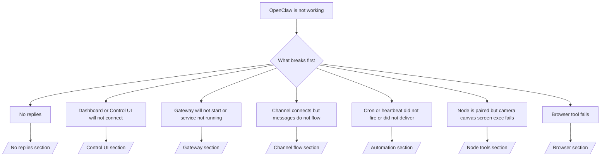

---
read_when:
    - OpenClaw không hoạt động và bạn cần cách nhanh nhất để khắc phục
    - Bạn muốn có một quy trình phân loại trước khi đi sâu vào các sổ tay vận hành chuyên sâu
summary: Trung tâm khắc phục sự cố theo triệu chứng cho OpenClaw
title: Khắc phục sự cố chung
x-i18n:
    generated_at: "2026-05-06T09:16:49Z"
    model: gpt-5.5
    provider: openai
    source_hash: 624fa34cda3b440fa9cc636beb3fe6e3608a77a332933fa593097ebc556ac745
    source_path: help/troubleshooting.md
    workflow: 16
---

Nếu bạn chỉ có 2 phút, hãy dùng trang này như cửa trước để phân loại sự cố.

## 60 giây đầu tiên

Chạy đúng thang lệnh này theo thứ tự:

```bash
openclaw status
openclaw status --all
openclaw gateway probe
openclaw gateway status
openclaw doctor
openclaw channels status --probe
openclaw logs --follow
```

Kết quả tốt trong một dòng:

- `openclaw status` → hiển thị các kênh đã cấu hình và không có lỗi xác thực rõ ràng.
- `openclaw status --all` → có báo cáo đầy đủ và có thể chia sẻ.
- `openclaw gateway probe` → mục tiêu gateway mong đợi có thể truy cập được (`Reachable: yes`). `Capability: ...` cho bạn biết mức xác thực mà phép kiểm tra có thể chứng minh, và `Read probe: limited - missing scope: operator.read` là chẩn đoán bị giảm cấp, không phải lỗi kết nối.
- `openclaw gateway status` → `Runtime: running`, `Connectivity probe: ok`, và một dòng `Capability: ...` hợp lý. Dùng `--require-rpc` nếu bạn cũng cần bằng chứng RPC phạm vi đọc.
- `openclaw doctor` → không có lỗi cấu hình/dịch vụ chặn.
- `openclaw channels status --probe` → Gateway có thể truy cập sẽ trả về trạng thái truyền tải theo từng tài khoản đang hoạt động cùng kết quả kiểm tra/kiểm toán như `works` hoặc `audit ok`; nếu Gateway không thể truy cập, lệnh sẽ quay về các tóm tắt chỉ dựa trên cấu hình.
- `openclaw logs --follow` → hoạt động ổn định, không có lỗi nghiêm trọng lặp lại.

## Anthropic ngữ cảnh dài 429

Nếu bạn thấy:
`HTTP 429: rate_limit_error: Extra usage is required for long context requests`,
hãy đến [/gateway/troubleshooting#anthropic-429-extra-usage-required-for-long-context](/vi/gateway/troubleshooting#anthropic-429-extra-usage-required-for-long-context).

## Backend tương thích OpenAI cục bộ hoạt động trực tiếp nhưng lỗi trong OpenClaw

Nếu backend `/v1` cục bộ hoặc tự lưu trữ của bạn trả lời các phép kiểm tra
`/v1/chat/completions` trực tiếp nhỏ nhưng lỗi trên `openclaw infer model run` hoặc các lượt
agent thông thường:

1. Nếu lỗi đề cập `messages[].content` mong đợi một chuỗi, hãy đặt
   `models.providers.<provider>.models[].compat.requiresStringContent: true`.
2. Nếu backend vẫn chỉ lỗi trên các lượt agent OpenClaw, hãy đặt
   `models.providers.<provider>.models[].compat.supportsTools: false` và thử lại.
3. Nếu các lệnh gọi trực tiếp rất nhỏ vẫn hoạt động nhưng prompt OpenClaw lớn hơn làm
   backend sập, hãy coi vấn đề còn lại là giới hạn của mô hình/máy chủ upstream và
   tiếp tục trong runbook chuyên sâu:
   [/gateway/troubleshooting#local-openai-compatible-backend-passes-direct-probes-but-agent-runs-fail](/vi/gateway/troubleshooting#local-openai-compatible-backend-passes-direct-probes-but-agent-runs-fail)

## Cài đặt Plugin lỗi vì thiếu openclaw extensions

Nếu cài đặt lỗi với `package.json missing openclaw.extensions`, gói plugin
đang dùng định dạng cũ mà OpenClaw không còn chấp nhận.

Sửa trong gói plugin:

1. Thêm `openclaw.extensions` vào `package.json`.
2. Trỏ các mục đến tệp runtime đã build (thường là `./dist/index.js`).
3. Phát hành lại plugin và chạy lại `openclaw plugins install <package>`.

Ví dụ:

```json
{
  "name": "@openclaw/my-plugin",
  "version": "1.2.3",
  "openclaw": {
    "extensions": ["./dist/index.js"]
  }
}
```

Tham khảo: [Kiến trúc Plugin](/vi/plugins/architecture)

## Có Plugin nhưng bị chặn do quyền sở hữu đáng ngờ

Nếu `openclaw doctor`, thiết lập, hoặc cảnh báo khởi động hiển thị:

```text
blocked plugin candidate: suspicious ownership (... uid=1000, expected uid=0 or root)
plugin present but blocked
```

các tệp plugin thuộc sở hữu của một người dùng Unix khác với tiến trình đang tải
chúng. Đừng xóa cấu hình plugin. Hãy sửa quyền sở hữu tệp hoặc chạy OpenClaw bằng
cùng người dùng sở hữu thư mục trạng thái.

Các bản cài Docker thường chạy dưới người dùng `node` (uid `1000`). Với thiết lập Docker
mặc định, sửa các bind mount trên host:

```bash
sudo chown -R 1000:1000 /path/to/openclaw-config /path/to/openclaw-workspace
openclaw doctor --fix
```

Nếu bạn cố ý chạy OpenClaw bằng root, hãy sửa thư mục gốc plugin được quản lý sang
quyền sở hữu root thay vào đó:

```bash
sudo chown -R root:root /path/to/openclaw-config/npm
openclaw doctor --fix
```

Tài liệu chuyên sâu hơn:

- [Quyền sở hữu đường dẫn Plugin](/vi/tools/plugin#blocked-plugin-path-ownership)
- [Quyền Docker](/vi/install/docker#permissions-and-eacces)

## Cây quyết định



<AccordionGroup>
  <Accordion title="Không có phản hồi">
    ```bash
    openclaw status
    openclaw gateway status
    openclaw channels status --probe
    openclaw pairing list --channel <channel> [--account <id>]
    openclaw logs --follow
    ```

    Kết quả tốt trông như sau:

    - `Runtime: running`
    - `Connectivity probe: ok`
    - `Capability: read-only`, `write-capable`, hoặc `admin-capable`
    - Kênh của bạn hiển thị truyền tải đã kết nối và, ở nơi được hỗ trợ, `works` hoặc `audit ok` trong `channels status --probe`
    - Người gửi có vẻ đã được phê duyệt (hoặc chính sách DM đang mở/danh sách cho phép)

    Các dấu hiệu nhật ký thường gặp:

    - `drop guild message (mention required` → chặn do yêu cầu nhắc tên đã chặn tin nhắn trong Discord.
    - `pairing request` → người gửi chưa được phê duyệt và đang chờ phê duyệt ghép nối qua DM.
    - `blocked` / `allowlist` trong nhật ký kênh → người gửi, phòng, hoặc nhóm bị lọc.

    Trang chuyên sâu:

    - [/gateway/troubleshooting#no-replies](/vi/gateway/troubleshooting#no-replies)
    - [/channels/troubleshooting](/vi/channels/troubleshooting)
    - [/channels/pairing](/vi/channels/pairing)

  </Accordion>

  <Accordion title="Dashboard hoặc Control UI không kết nối">
    ```bash
    openclaw status
    openclaw gateway status
    openclaw logs --follow
    openclaw doctor
    openclaw channels status --probe
    ```

    Kết quả tốt trông như sau:

    - `Dashboard: http://...` được hiển thị trong `openclaw gateway status`
    - `Connectivity probe: ok`
    - `Capability: read-only`, `write-capable`, hoặc `admin-capable`
    - Không có vòng lặp xác thực trong nhật ký

    Các dấu hiệu nhật ký thường gặp:

    - `device identity required` → ngữ cảnh HTTP/không bảo mật không thể hoàn tất xác thực thiết bị.
    - `origin not allowed` → `Origin` của trình duyệt không được phép cho mục tiêu Gateway của Control UI.
    - `AUTH_TOKEN_MISMATCH` với gợi ý thử lại (`canRetryWithDeviceToken=true`) → một lần thử lại bằng token thiết bị đáng tin cậy có thể tự động xảy ra.
    - Lần thử lại token đã lưu cache đó dùng lại tập phạm vi đã lưu cache cùng token thiết bị đã ghép nối. Các caller có `deviceToken` rõ ràng / `scopes` rõ ràng vẫn giữ tập phạm vi đã yêu cầu của chúng.
    - Trên đường dẫn Control UI Tailscale Serve bất đồng bộ, các lần thử lỗi cho cùng
      `{scope, ip}` được tuần tự hóa trước khi bộ giới hạn ghi nhận lỗi, nên một
      lần thử lại sai thứ hai chạy đồng thời có thể đã hiển thị `retry later`.
    - `too many failed authentication attempts (retry later)` từ origin trình duyệt localhost → các lỗi lặp lại từ cùng `Origin` đó tạm thời bị khóa; một origin localhost khác dùng bucket riêng.
    - `unauthorized` lặp lại sau lần thử lại đó → token/mật khẩu sai, chế độ xác thực không khớp, hoặc token thiết bị đã ghép nối bị cũ.
    - `gateway connect failed:` → UI đang trỏ đến sai URL/cổng hoặc Gateway không thể truy cập.

    Trang chuyên sâu:

    - [/gateway/troubleshooting#dashboard-control-ui-connectivity](/vi/gateway/troubleshooting#dashboard-control-ui-connectivity)
    - [/web/control-ui](/vi/web/control-ui)
    - [/gateway/authentication](/vi/gateway/authentication)

  </Accordion>

  <Accordion title="Gateway không khởi động hoặc dịch vụ đã cài nhưng không chạy">
    ```bash
    openclaw status
    openclaw gateway status
    openclaw logs --follow
    openclaw doctor
    openclaw channels status --probe
    ```

    Kết quả tốt trông như sau:

    - `Service: ... (loaded)`
    - `Runtime: running`
    - `Connectivity probe: ok`
    - `Capability: read-only`, `write-capable`, hoặc `admin-capable`

    Các dấu hiệu nhật ký thường gặp:

    - `Gateway start blocked: set gateway.mode=local` hoặc `existing config is missing gateway.mode` → chế độ Gateway là remote, hoặc tệp cấu hình thiếu dấu local-mode và cần được sửa.
    - `refusing to bind gateway ... without auth` → bind không phải loopback mà không có đường dẫn xác thực Gateway hợp lệ (token/mật khẩu, hoặc trusted-proxy khi đã cấu hình).
    - `another gateway instance is already listening` hoặc `EADDRINUSE` → cổng đã bị chiếm.

    Trang chuyên sâu:

    - [/gateway/troubleshooting#gateway-service-not-running](/vi/gateway/troubleshooting#gateway-service-not-running)
    - [/gateway/background-process](/vi/gateway/background-process)
    - [/gateway/configuration](/vi/gateway/configuration)

  </Accordion>

  <Accordion title="Kênh kết nối nhưng tin nhắn không luân chuyển">
    ```bash
    openclaw status
    openclaw gateway status
    openclaw logs --follow
    openclaw doctor
    openclaw channels status --probe
    ```

    Kết quả tốt trông như sau:

    - Truyền tải kênh đã kết nối.
    - Kiểm tra ghép nối/danh sách cho phép đạt.
    - Lượt nhắc tên được phát hiện khi bắt buộc.

    Các dấu hiệu nhật ký thường gặp:

    - `mention required` → chặn do yêu cầu nhắc tên trong nhóm đã chặn xử lý.
    - `pairing` / `pending` → người gửi DM chưa được phê duyệt.
    - `not_in_channel`, `missing_scope`, `Forbidden`, `401/403` → sự cố token quyền của kênh.

    Trang chuyên sâu:

    - [/gateway/troubleshooting#channel-connected-messages-not-flowing](/vi/gateway/troubleshooting#channel-connected-messages-not-flowing)
    - [/channels/troubleshooting](/vi/channels/troubleshooting)

  </Accordion>

  <Accordion title="Cron hoặc Heartbeat không kích hoạt hoặc không gửi">
    ```bash
    openclaw status
    openclaw gateway status
    openclaw cron status
    openclaw cron list
    openclaw cron runs --id <jobId> --limit 20
    openclaw logs --follow
    ```

    Kết quả tốt trông như sau:

    - `cron.status` hiển thị đã bật với lần đánh thức tiếp theo.
    - `cron runs` hiển thị các mục `ok` gần đây.
    - Heartbeat đã bật và không nằm ngoài giờ hoạt động.

    Các dấu hiệu nhật ký thường gặp:

    - `cron: scheduler disabled; jobs will not run automatically` → Cron bị tắt.
    - `heartbeat skipped` với `reason=quiet-hours` → ngoài giờ hoạt động đã cấu hình.
    - `heartbeat skipped` với `reason=empty-heartbeat-file` → `HEARTBEAT.md` tồn tại nhưng chỉ chứa khung trống/chỉ có tiêu đề.
    - `heartbeat skipped` với `reason=no-tasks-due` → chế độ tác vụ `HEARTBEAT.md` đang hoạt động nhưng chưa có khoảng thời gian tác vụ nào đến hạn.
    - `heartbeat skipped` với `reason=alerts-disabled` → toàn bộ khả năng hiển thị Heartbeat bị tắt (`showOk`, `showAlerts`, và `useIndicator` đều tắt).
    - `requests-in-flight` → làn chính đang bận; lần đánh thức Heartbeat bị hoãn.
    - `unknown accountId` → tài khoản mục tiêu gửi Heartbeat không tồn tại.

    Trang chuyên sâu:

    - [/gateway/troubleshooting#cron-and-heartbeat-delivery](/vi/gateway/troubleshooting#cron-and-heartbeat-delivery)
    - [/automation/cron-jobs#troubleshooting](/vi/automation/cron-jobs#troubleshooting)
    - [/gateway/heartbeat](/vi/gateway/heartbeat)

  </Accordion>

  <Accordion title="Node đã ghép nối nhưng công cụ camera canvas screen exec lỗi">
    ```bash
    openclaw status
    openclaw gateway status
    openclaw nodes status
    openclaw nodes describe --node <idOrNameOrIp>
    openclaw logs --follow
    ```

    Kết quả tốt trông như sau:

    - Node được liệt kê là đã kết nối và đã ghép nối cho vai trò `node`.
    - Có capability cho lệnh bạn đang gọi.
    - Trạng thái quyền đã được cấp cho công cụ.

    Các dấu hiệu nhật ký thường gặp:

    - `NODE_BACKGROUND_UNAVAILABLE` → đưa ứng dụng Node ra tiền cảnh.
    - `*_PERMISSION_REQUIRED` → quyền của OS đã bị từ chối/thiếu.
    - `SYSTEM_RUN_DENIED: approval required` → phê duyệt exec đang chờ xử lý.
    - `SYSTEM_RUN_DENIED: allowlist miss` → lệnh không có trong danh sách cho phép exec.

    Trang chuyên sâu:

    - [/gateway/troubleshooting#node-paired-tool-fails](/vi/gateway/troubleshooting#node-paired-tool-fails)
    - [/nodes/troubleshooting](/vi/nodes/troubleshooting)
    - [/tools/exec-approvals](/vi/tools/exec-approvals)

  </Accordion>

  <Accordion title="Exec đột nhiên yêu cầu phê duyệt">
    ```bash
    openclaw config get tools.exec.host
    openclaw config get tools.exec.security
    openclaw config get tools.exec.ask
    openclaw gateway restart
    ```

    Điều đã thay đổi:

    - Nếu `tools.exec.host` chưa được đặt, mặc định là `auto`.
    - `host=auto` phân giải thành `sandbox` khi runtime sandbox đang hoạt động, nếu không thì thành `gateway`.
    - `host=auto` chỉ là định tuyến; hành vi "YOLO" không nhắc đến từ `security=full` cộng với `ask=off` trên gateway/node.
    - Trên `gateway` và `node`, `tools.exec.security` chưa đặt sẽ mặc định là `full`.
    - `tools.exec.ask` chưa đặt sẽ mặc định là `off`.
    - Kết quả: nếu bạn đang thấy các phê duyệt, một số chính sách cục bộ theo host hoặc theo phiên đã siết exec chặt hơn so với mặc định hiện tại.

    Khôi phục hành vi mặc định hiện tại không cần phê duyệt:

    ```bash
    openclaw config set tools.exec.host gateway
    openclaw config set tools.exec.security full
    openclaw config set tools.exec.ask off
    openclaw gateway restart
    ```

    Các lựa chọn thay thế an toàn hơn:

    - Chỉ đặt `tools.exec.host=gateway` nếu bạn chỉ muốn định tuyến host ổn định.
    - Dùng `security=allowlist` với `ask=on-miss` nếu bạn muốn exec trên host nhưng vẫn muốn xem xét khi danh sách cho phép bị thiếu.
    - Bật chế độ sandbox nếu bạn muốn `host=auto` phân giải trở lại `sandbox`.

    Chữ ký log thường gặp:

    - `Approval required.` → lệnh đang chờ `/approve ...`.
    - `SYSTEM_RUN_DENIED: approval required` → phê duyệt exec trên node-host đang chờ xử lý.
    - `exec host=sandbox requires a sandbox runtime for this session` → lựa chọn sandbox ngầm định/tường minh nhưng chế độ sandbox đang tắt.

    Trang chuyên sâu:

    - [/tools/exec](/vi/tools/exec)
    - [/tools/exec-approvals](/vi/tools/exec-approvals)
    - [/gateway/security#what-the-audit-checks-high-level](/vi/gateway/security#what-the-audit-checks-high-level)

  </Accordion>

  <Accordion title="Công cụ trình duyệt gặp lỗi">
    ```bash
    openclaw status
    openclaw gateway status
    openclaw browser status
    openclaw logs --follow
    openclaw doctor
    ```

    Đầu ra tốt trông như sau:

    - Trạng thái trình duyệt hiển thị `running: true` và một trình duyệt/hồ sơ đã chọn.
    - `openclaw` khởi động, hoặc `user` có thể thấy các tab Chrome cục bộ.

    Chữ ký log thường gặp:

    - `unknown command "browser"` hoặc `unknown command 'browser'` → `plugins.allow` đã được đặt và không bao gồm `browser`.
    - `Failed to start Chrome CDP on port` → khởi chạy trình duyệt cục bộ thất bại.
    - `browser.executablePath not found` → đường dẫn nhị phân đã cấu hình không đúng.
    - `browser.cdpUrl must be http(s) or ws(s)` → URL CDP đã cấu hình dùng một scheme không được hỗ trợ.
    - `browser.cdpUrl has invalid port` → URL CDP đã cấu hình có cổng không hợp lệ hoặc ngoài phạm vi.
    - `No Chrome tabs found for profile="user"` → hồ sơ đính kèm Chrome MCP không có tab Chrome cục bộ nào đang mở.
    - `Remote CDP for profile "<name>" is not reachable` → endpoint CDP từ xa đã cấu hình không thể truy cập từ host này.
    - `Browser attachOnly is enabled ... not reachable` hoặc `Browser attachOnly is enabled and CDP websocket ... is not reachable` → hồ sơ chỉ đính kèm không có mục tiêu CDP đang hoạt động.
    - các ghi đè viewport / chế độ tối / locale / ngoại tuyến cũ trên hồ sơ chỉ đính kèm hoặc CDP từ xa → chạy `openclaw browser stop --browser-profile <name>` để đóng phiên điều khiển đang hoạt động và giải phóng trạng thái mô phỏng mà không cần khởi động lại gateway.

    Trang chuyên sâu:

    - [/gateway/troubleshooting#browser-tool-fails](/vi/gateway/troubleshooting#browser-tool-fails)
    - [/tools/browser#missing-browser-command-or-tool](/vi/tools/browser#missing-browser-command-or-tool)
    - [/tools/browser-linux-troubleshooting](/vi/tools/browser-linux-troubleshooting)
    - [/tools/browser-wsl2-windows-remote-cdp-troubleshooting](/vi/tools/browser-wsl2-windows-remote-cdp-troubleshooting)

  </Accordion>

</AccordionGroup>

## Liên quan

- [FAQ](/vi/help/faq) — các câu hỏi thường gặp
- [Khắc phục sự cố Gateway](/vi/gateway/troubleshooting) — các vấn đề riêng của gateway
- [Doctor](/vi/gateway/doctor) — kiểm tra tình trạng và sửa chữa tự động
- [Khắc phục sự cố kênh](/vi/channels/troubleshooting) — các vấn đề về kết nối kênh
- [Khắc phục sự cố tự động hóa](/vi/automation/cron-jobs#troubleshooting) — các vấn đề về Cron và Heartbeat
