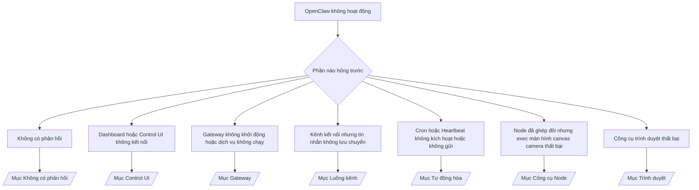

---
read_when:
    - OpenClaw không hoạt động và bạn cần cách nhanh nhất để khắc phục
    - Bạn cần một quy trình phân loại trước khi đi sâu vào các sổ tay vận hành chuyên sâu
summary: Trung tâm khắc phục sự cố bắt đầu từ triệu chứng cho OpenClaw
title: Khắc phục sự cố chung
x-i18n:
    generated_at: "2026-04-29T22:49:28Z"
    model: gpt-5.5
    provider: openai
    source_hash: c832c3f7609c56a5461515ed0f693d2255310bf2d3958f69f57c482bcbef97f0
    source_path: help/troubleshooting.md
    workflow: 16
---

Nếu bạn chỉ có 2 phút, hãy dùng trang này làm cửa vào để phân loại sự cố.

## 60 giây đầu tiên

Chạy đúng thang kiểm tra này theo thứ tự:

```bash
openclaw status
openclaw status --all
openclaw gateway probe
openclaw gateway status
openclaw doctor
openclaw channels status --probe
openclaw logs --follow
```

Kết quả tốt trong một dòng:

- `openclaw status` → hiển thị các kênh đã cấu hình và không có lỗi xác thực rõ ràng.
- `openclaw status --all` → báo cáo đầy đủ hiện diện và có thể chia sẻ.
- `openclaw gateway probe` → mục tiêu gateway dự kiến có thể truy cập được (`Reachable: yes`). `Capability: ...` cho bạn biết mức xác thực mà phép kiểm tra có thể chứng minh, và `Read probe: limited - missing scope: operator.read` là chẩn đoán bị suy giảm, không phải lỗi kết nối.
- `openclaw gateway status` → `Runtime: running`, `Connectivity probe: ok`, và một dòng `Capability: ...` hợp lý. Dùng `--require-rpc` nếu bạn cũng cần bằng chứng RPC với phạm vi đọc.
- `openclaw doctor` → không có lỗi cấu hình/dịch vụ chặn hoạt động.
- `openclaw channels status --probe` → Gateway có thể truy cập trả về trạng thái truyền tải trực tiếp cho từng tài khoản
  cùng với kết quả kiểm tra/kiểm toán như `works` hoặc `audit ok`; nếu
  Gateway không thể truy cập, lệnh sẽ quay về phần tóm tắt chỉ dựa trên cấu hình.
- `openclaw logs --follow` → hoạt động ổn định, không có lỗi nghiêm trọng lặp lại.

## Anthropic long context 429

Nếu bạn thấy:
`HTTP 429: rate_limit_error: Extra usage is required for long context requests`,
hãy đi tới [/gateway/troubleshooting#anthropic-429-extra-usage-required-for-long-context](/vi/gateway/troubleshooting#anthropic-429-extra-usage-required-for-long-context).

## Backend cục bộ tương thích OpenAI hoạt động trực tiếp nhưng thất bại trong OpenClaw

Nếu backend `/v1` cục bộ hoặc tự lưu trữ của bạn trả lời các phép kiểm tra trực tiếp nhỏ
`/v1/chat/completions` nhưng thất bại với `openclaw infer model run` hoặc các lượt
agent thông thường:

1. Nếu lỗi nhắc rằng `messages[].content` mong đợi một chuỗi, hãy đặt
   `models.providers.<provider>.models[].compat.requiresStringContent: true`.
2. Nếu backend vẫn chỉ thất bại ở các lượt agent của OpenClaw, hãy đặt
   `models.providers.<provider>.models[].compat.supportsTools: false` rồi thử lại.
3. Nếu các lệnh gọi trực tiếp rất nhỏ vẫn hoạt động nhưng prompt OpenClaw lớn hơn làm sập
   backend, hãy xem vấn đề còn lại là giới hạn của mô hình/máy chủ upstream và
   tiếp tục trong runbook chuyên sâu:
   [/gateway/troubleshooting#local-openai-compatible-backend-passes-direct-probes-but-agent-runs-fail](/vi/gateway/troubleshooting#local-openai-compatible-backend-passes-direct-probes-but-agent-runs-fail)

## Cài đặt Plugin thất bại vì thiếu openclaw extensions

Nếu cài đặt thất bại với `package.json missing openclaw.extensions`, gói plugin
đang dùng định dạng cũ mà OpenClaw không còn chấp nhận.

Sửa trong gói plugin:

1. Thêm `openclaw.extensions` vào `package.json`.
2. Trỏ các mục tới tệp runtime đã build (thường là `./dist/index.js`).
3. Phát hành lại plugin và chạy lại `openclaw plugins install <package>`.

Ví dụ:

```json
{
  "name": "@openclaw/my-plugin",
  "version": "1.2.3",
  "openclaw": {
    "extensions": ["./dist/index.js"]
  }
}
```

Tham khảo: [Kiến trúc Plugin](/vi/plugins/architecture)

## Cây quyết định



<AccordionGroup>
  <Accordion title="Không có phản hồi">
    ```bash
    openclaw status
    openclaw gateway status
    openclaw channels status --probe
    openclaw pairing list --channel <channel> [--account <id>]
    openclaw logs --follow
    ```

    Kết quả tốt trông như sau:

    - `Runtime: running`
    - `Connectivity probe: ok`
    - `Capability: read-only`, `write-capable`, hoặc `admin-capable`
    - Kênh của bạn hiển thị truyền tải đã kết nối và, khi được hỗ trợ, `works` hoặc `audit ok` trong `channels status --probe`
    - Người gửi xuất hiện là đã được phê duyệt (hoặc chính sách DM đang mở/dùng allowlist)

    Các mẫu log thường gặp:

    - `drop guild message (mention required` → chặn theo yêu cầu mention đã chặn tin nhắn trong Discord.
    - `pairing request` → người gửi chưa được phê duyệt và đang chờ phê duyệt ghép đôi qua DM.
    - `blocked` / `allowlist` trong log kênh → người gửi, phòng hoặc nhóm bị lọc.

    Trang chuyên sâu:

    - [/gateway/troubleshooting#no-replies](/vi/gateway/troubleshooting#no-replies)
    - [/channels/troubleshooting](/vi/channels/troubleshooting)
    - [/channels/pairing](/vi/channels/pairing)

  </Accordion>

  <Accordion title="Dashboard hoặc Control UI không kết nối">
    ```bash
    openclaw status
    openclaw gateway status
    openclaw logs --follow
    openclaw doctor
    openclaw channels status --probe
    ```

    Kết quả tốt trông như sau:

    - `Dashboard: http://...` được hiển thị trong `openclaw gateway status`
    - `Connectivity probe: ok`
    - `Capability: read-only`, `write-capable`, hoặc `admin-capable`
    - Không có vòng lặp xác thực trong log

    Các mẫu log thường gặp:

    - `device identity required` → ngữ cảnh HTTP/không bảo mật không thể hoàn tất xác thực thiết bị.
    - `origin not allowed` → `Origin` của trình duyệt không được phép cho mục tiêu Gateway
      của Control UI.
    - `AUTH_TOKEN_MISMATCH` kèm gợi ý thử lại (`canRetryWithDeviceToken=true`) → một lần thử lại bằng token thiết bị tin cậy có thể tự động xảy ra.
    - Lần thử lại bằng token đã lưu bộ nhớ đệm đó tái sử dụng tập phạm vi đã lưu cùng token thiết bị
      đã ghép đôi. Các caller dùng `deviceToken` rõ ràng / `scopes` rõ ràng vẫn giữ
      tập phạm vi đã yêu cầu của chúng.
    - Trên đường dẫn Control UI Tailscale Serve bất đồng bộ, các lần thử thất bại cho cùng
      `{scope, ip}` được tuần tự hóa trước khi bộ giới hạn ghi nhận thất bại, nên một
      lần thử lại lỗi đồng thời thứ hai đã có thể hiển thị `retry later`.
    - `too many failed authentication attempts (retry later)` từ một origin trình duyệt localhost
      → các lần thất bại lặp lại từ cùng `Origin` đó bị khóa tạm thời; một origin localhost khác dùng bucket riêng.
    - `unauthorized` lặp lại sau lần thử lại đó → token/mật khẩu sai, chế độ xác thực không khớp, hoặc token thiết bị đã ghép đôi bị cũ.
    - `gateway connect failed:` → UI đang nhắm tới sai URL/cổng hoặc Gateway không thể truy cập.

    Trang chuyên sâu:

    - [/gateway/troubleshooting#dashboard-control-ui-connectivity](/vi/gateway/troubleshooting#dashboard-control-ui-connectivity)
    - [/web/control-ui](/vi/web/control-ui)
    - [/gateway/authentication](/vi/gateway/authentication)

  </Accordion>

  <Accordion title="Gateway không khởi động hoặc dịch vụ đã cài nhưng không chạy">
    ```bash
    openclaw status
    openclaw gateway status
    openclaw logs --follow
    openclaw doctor
    openclaw channels status --probe
    ```

    Kết quả tốt trông như sau:

    - `Service: ... (loaded)`
    - `Runtime: running`
    - `Connectivity probe: ok`
    - `Capability: read-only`, `write-capable`, hoặc `admin-capable`

    Các mẫu log thường gặp:

    - `Gateway start blocked: set gateway.mode=local` hoặc `existing config is missing gateway.mode` → chế độ gateway là từ xa, hoặc tệp cấu hình thiếu dấu chế độ cục bộ và cần được sửa chữa.
    - `refusing to bind gateway ... without auth` → bind không phải local loopback mà không có đường dẫn xác thực Gateway hợp lệ (token/mật khẩu, hoặc trusted-proxy khi đã cấu hình).
    - `another gateway instance is already listening` hoặc `EADDRINUSE` → cổng đã bị chiếm.

    Trang chuyên sâu:

    - [/gateway/troubleshooting#gateway-service-not-running](/vi/gateway/troubleshooting#gateway-service-not-running)
    - [/gateway/background-process](/vi/gateway/background-process)
    - [/gateway/configuration](/vi/gateway/configuration)

  </Accordion>

  <Accordion title="Kênh kết nối nhưng tin nhắn không lưu chuyển">
    ```bash
    openclaw status
    openclaw gateway status
    openclaw logs --follow
    openclaw doctor
    openclaw channels status --probe
    ```

    Kết quả tốt trông như sau:

    - Truyền tải kênh đã kết nối.
    - Các kiểm tra ghép đôi/allowlist đạt.
    - Mention được phát hiện ở nơi bắt buộc.

    Các mẫu log thường gặp:

    - `mention required` → chặn theo yêu cầu mention trong nhóm đã chặn xử lý.
    - `pairing` / `pending` → người gửi DM chưa được phê duyệt.
    - `not_in_channel`, `missing_scope`, `Forbidden`, `401/403` → sự cố token quyền của kênh.

    Trang chuyên sâu:

    - [/gateway/troubleshooting#channel-connected-messages-not-flowing](/vi/gateway/troubleshooting#channel-connected-messages-not-flowing)
    - [/channels/troubleshooting](/vi/channels/troubleshooting)

  </Accordion>

  <Accordion title="Cron hoặc Heartbeat không kích hoạt hoặc không gửi">
    ```bash
    openclaw status
    openclaw gateway status
    openclaw cron status
    openclaw cron list
    openclaw cron runs --id <jobId> --limit 20
    openclaw logs --follow
    ```

    Kết quả tốt trông như sau:

    - `cron.status` hiển thị đã bật cùng lần đánh thức tiếp theo.
    - `cron runs` hiển thị các mục `ok` gần đây.
    - Heartbeat đã bật và không nằm ngoài giờ hoạt động.

    Các mẫu log thường gặp:

    - `cron: scheduler disabled; jobs will not run automatically` → cron bị tắt.
    - `heartbeat skipped` với `reason=quiet-hours` → ngoài giờ hoạt động đã cấu hình.
    - `heartbeat skipped` với `reason=empty-heartbeat-file` → `HEARTBEAT.md` tồn tại nhưng chỉ chứa khung trống/chỉ có tiêu đề.
    - `heartbeat skipped` với `reason=no-tasks-due` → chế độ tác vụ `HEARTBEAT.md` đang hoạt động nhưng chưa có khoảng thời gian tác vụ nào đến hạn.
    - `heartbeat skipped` với `reason=alerts-disabled` → toàn bộ khả năng hiển thị Heartbeat bị tắt (`showOk`, `showAlerts`, và `useIndicator` đều tắt).
    - `requests-in-flight` → làn chính đang bận; lần đánh thức Heartbeat bị hoãn.
    - `unknown accountId` → tài khoản đích nhận Heartbeat không tồn tại.

    Trang chuyên sâu:

    - [/gateway/troubleshooting#cron-and-heartbeat-delivery](/vi/gateway/troubleshooting#cron-and-heartbeat-delivery)
    - [/automation/cron-jobs#troubleshooting](/vi/automation/cron-jobs#troubleshooting)
    - [/gateway/heartbeat](/vi/gateway/heartbeat)

  </Accordion>

  <Accordion title="Node đã ghép đôi nhưng công cụ thất bại ở camera canvas screen exec">
    ```bash
    openclaw status
    openclaw gateway status
    openclaw nodes status
    openclaw nodes describe --node <idOrNameOrIp>
    openclaw logs --follow
    ```

    Kết quả tốt trông như sau:

    - Node được liệt kê là đã kết nối và đã ghép đôi cho vai trò `node`.
    - Capability tồn tại cho lệnh bạn đang gọi.
    - Trạng thái quyền đã được cấp cho công cụ.

    Các mẫu log thường gặp:

    - `NODE_BACKGROUND_UNAVAILABLE` → đưa ứng dụng node lên foreground.
    - `*_PERMISSION_REQUIRED` → quyền OS bị từ chối/thiếu.
    - `SYSTEM_RUN_DENIED: approval required` → phê duyệt exec đang chờ xử lý.
    - `SYSTEM_RUN_DENIED: allowlist miss` → lệnh không có trong allowlist exec.

    Trang chuyên sâu:

    - [/gateway/troubleshooting#node-paired-tool-fails](/vi/gateway/troubleshooting#node-paired-tool-fails)
    - [/nodes/troubleshooting](/vi/nodes/troubleshooting)
    - [/tools/exec-approvals](/vi/tools/exec-approvals)

  </Accordion>

  <Accordion title="Exec đột nhiên yêu cầu phê duyệt">
    ```bash
    openclaw config get tools.exec.host
    openclaw config get tools.exec.security
    openclaw config get tools.exec.ask
    openclaw gateway restart
    ```

    Điều đã thay đổi:

    - Nếu `tools.exec.host` chưa được đặt, mặc định là `auto`.
    - `host=auto` phân giải thành `sandbox` khi runtime sandbox đang hoạt động, nếu không thì thành `gateway`.
    - `host=auto` chỉ dùng để định tuyến; hành vi “YOLO” không nhắc xác nhận đến từ `security=full` cộng với `ask=off` trên gateway/node.
    - Trên `gateway` và `node`, `tools.exec.security` chưa được đặt sẽ mặc định là `full`.
    - `tools.exec.ask` chưa được đặt sẽ mặc định là `off`.
    - Kết quả: nếu bạn đang thấy yêu cầu phê duyệt, một chính sách cục bộ theo host hoặc theo phiên nào đó đã siết chặt exec hơn so với các mặc định hiện tại.

    Khôi phục hành vi mặc định hiện tại không cần phê duyệt:

    ```bash
    openclaw config set tools.exec.host gateway
    openclaw config set tools.exec.security full
    openclaw config set tools.exec.ask off
    openclaw gateway restart
    ```

    Các phương án an toàn hơn:

    - Chỉ đặt `tools.exec.host=gateway` nếu bạn chỉ muốn định tuyến host ổn định.
    - Dùng `security=allowlist` với `ask=on-miss` nếu bạn muốn exec trên host nhưng vẫn muốn xem xét khi không khớp allowlist.
    - Bật chế độ sandbox nếu bạn muốn `host=auto` phân giải trở lại `sandbox`.

    Các dấu hiệu log thường gặp:

    - `Approval required.` → lệnh đang chờ `/approve ...`.
    - `SYSTEM_RUN_DENIED: approval required` → phê duyệt exec trên node-host đang chờ xử lý.
    - `exec host=sandbox requires a sandbox runtime for this session` → lựa chọn sandbox ngầm định/rõ ràng nhưng chế độ sandbox đang tắt.

    Các trang chuyên sâu:

    - [/tools/exec](/vi/tools/exec)
    - [/tools/exec-approvals](/vi/tools/exec-approvals)
    - [/gateway/security#what-the-audit-checks-high-level](/vi/gateway/security#what-the-audit-checks-high-level)

  </Accordion>

  <Accordion title="Browser tool fails">
    ```bash
    openclaw status
    openclaw gateway status
    openclaw browser status
    openclaw logs --follow
    openclaw doctor
    ```

    Đầu ra tốt sẽ giống như sau:

    - Trạng thái trình duyệt hiển thị `running: true` và một trình duyệt/hồ sơ đã chọn.
    - `openclaw` khởi động, hoặc `user` có thể thấy các thẻ Chrome cục bộ.

    Các dấu hiệu log thường gặp:

    - `unknown command "browser"` hoặc `unknown command 'browser'` → `plugins.allow` đã được đặt và không bao gồm `browser`.
    - `Failed to start Chrome CDP on port` → khởi chạy trình duyệt cục bộ thất bại.
    - `browser.executablePath not found` → đường dẫn nhị phân đã cấu hình không đúng.
    - `browser.cdpUrl must be http(s) or ws(s)` → URL CDP đã cấu hình dùng một lược đồ không được hỗ trợ.
    - `browser.cdpUrl has invalid port` → URL CDP đã cấu hình có cổng không hợp lệ hoặc nằm ngoài phạm vi.
    - `No Chrome tabs found for profile="user"` → hồ sơ đính kèm Chrome MCP không có thẻ Chrome cục bộ nào đang mở.
    - `Remote CDP for profile "<name>" is not reachable` → endpoint CDP từ xa đã cấu hình không thể truy cập từ host này.
    - `Browser attachOnly is enabled ... not reachable` hoặc `Browser attachOnly is enabled and CDP websocket ... is not reachable` → hồ sơ chỉ đính kèm không có mục tiêu CDP đang hoạt động.
    - các ghi đè viewport / chế độ tối / locale / ngoại tuyến cũ trên hồ sơ chỉ đính kèm hoặc CDP từ xa → chạy `openclaw browser stop --browser-profile <name>` để đóng phiên điều khiển đang hoạt động và giải phóng trạng thái mô phỏng mà không cần khởi động lại gateway.

    Các trang chuyên sâu:

    - [/gateway/troubleshooting#browser-tool-fails](/vi/gateway/troubleshooting#browser-tool-fails)
    - [/tools/browser#missing-browser-command-or-tool](/vi/tools/browser#missing-browser-command-or-tool)
    - [/tools/browser-linux-troubleshooting](/vi/tools/browser-linux-troubleshooting)
    - [/tools/browser-wsl2-windows-remote-cdp-troubleshooting](/vi/tools/browser-wsl2-windows-remote-cdp-troubleshooting)

  </Accordion>

</AccordionGroup>

## Liên quan

- [FAQ](/vi/help/faq) — các câu hỏi thường gặp
- [Khắc phục sự cố Gateway](/vi/gateway/troubleshooting) — các vấn đề riêng của Gateway
- [Doctor](/vi/gateway/doctor) — kiểm tra tình trạng và sửa chữa tự động
- [Khắc phục sự cố kênh](/vi/channels/troubleshooting) — các vấn đề kết nối kênh
- [Khắc phục sự cố tự động hóa](/vi/automation/cron-jobs#troubleshooting) — các vấn đề về cron và heartbeat
