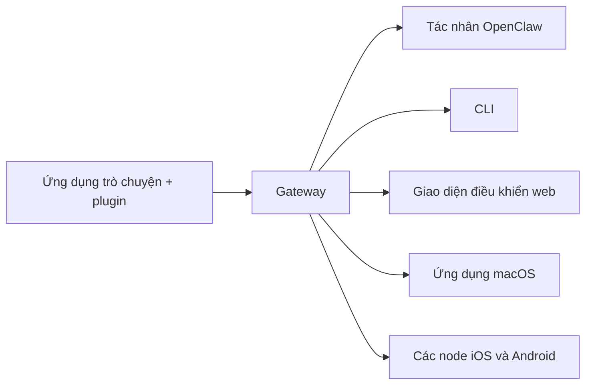

---
read_when:
    - Giới thiệu OpenClaw cho người mới bắt đầu
summary: OpenClaw là một gateway đa kênh dành cho các tác nhân AI, chạy trên mọi hệ điều hành.
title: OpenClaw
x-i18n:
    generated_at: "2026-07-12T08:02:50Z"
    model: gpt-5.6
    postprocess_version: locale-links-v1
    provider: openai
    source_hash: 2b87c2a9ce06f110bda45709fb6055ed8000f73993793ea7386db2a47a782828
    source_path: index.md
    workflow: 16
---

# OpenClaw 🦞

<p align="center">
    
    
</p>

> _"TẨY TẾ BÀO CHẾT! TẨY TẾ BÀO CHẾT!"_ — Có lẽ là một chú tôm hùm vũ trụ

<p align="center">
  <strong>Gateway hoạt động trên mọi hệ điều hành dành cho các tác nhân AI trên Discord, Google Chat, iMessage, Matrix, Microsoft Teams, Signal, Slack, Telegram, WhatsApp, Zalo và nhiều nền tảng khác.</strong><br />
  Gửi tin nhắn và nhận phản hồi từ tác nhân ngay trên thiết bị bỏ túi của bạn. Chạy một Gateway duy nhất cho các plugin kênh, WebChat và các node di động.
</p>

<Columns>
  <Card title="Bắt đầu" href="/vi/start/getting-started" icon="rocket">
    Cài đặt OpenClaw và khởi chạy Gateway chỉ trong vài phút.
  </Card>
  <Card title="Chạy quy trình thiết lập ban đầu" href="/vi/start/wizard" icon="list-checks">
    Thiết lập có hướng dẫn bằng `openclaw onboard` và các quy trình ghép nối.
  </Card>
  <Card title="Kết nối một kênh" href="/vi/channels" icon="message-circle">
    Liên kết Discord, Signal, Telegram, WhatsApp và các nền tảng khác để trò chuyện từ mọi nơi.
  </Card>
  <Card title="Mở giao diện điều khiển" href="/vi/web/control-ui" icon="layout-dashboard">
    Khởi chạy bảng điều khiển trên trình duyệt để trò chuyện, cấu hình và quản lý phiên.
  </Card>
</Columns>

## Duyệt tài liệu

Trình duyệt di động có thể hiển thị trình đơn mục mà không có đầy đủ thanh thẻ như trên máy tính. Hãy sử dụng
các liên kết trung tâm này để truy cập cùng những khu vực tài liệu cấp cao nhất từ phần nội dung trang.

<Columns>
  <Card title="Bắt đầu" href="/vi" icon="rocket">
    Tổng quan, nội dung giới thiệu, các bước đầu tiên và hướng dẫn thiết lập.
  </Card>
  <Card title="Cài đặt" href="/vi/install" icon="download">
    Các phương thức cài đặt, bản cập nhật, vùng chứa, dịch vụ lưu trữ và thiết lập nâng cao.
  </Card>
  <Card title="Kênh" href="/vi/channels" icon="messages-square">
    Các kênh nhắn tin, ghép nối, định tuyến, nhóm truy cập và kiểm thử chất lượng kênh.
  </Card>
  <Card title="Tác nhân" href="/vi/concepts/architecture" icon="bot">
    Kiến trúc, phiên, ngữ cảnh, bộ nhớ và định tuyến đa tác nhân.
  </Card>
  <Card title="Khả năng" href="/vi/tools" icon="wand-sparkles">
    Công cụ, Skills, cron, webhook và các khả năng tự động hóa.
  </Card>
  <Card title="ClawHub" href="/vi/clawhub" icon="store">
    Chợ Plugin, xuất bản, tuyển chọn và hướng dẫn về độ tin cậy.
  </Card>
  <Card title="Mô hình" href="/vi/providers" icon="brain">
    Nhà cung cấp, cấu hình mô hình, chuyển đổi dự phòng và dịch vụ mô hình cục bộ.
  </Card>
  <Card title="Nền tảng" href="/vi/platforms" icon="monitor-smartphone">
    macOS, Windows, iOS, Android, các node và giao diện web.
  </Card>
  <Card title="Gateway và vận hành" href="/vi/gateway" icon="server">
    Cấu hình, bảo mật, chẩn đoán và vận hành Gateway.
  </Card>
  <Card title="Tham khảo" href="/vi/cli" icon="terminal">
    Tài liệu tham khảo CLI, lược đồ, RPC, ghi chú phát hành và mẫu.
  </Card>
  <Card title="Trợ giúp" href="/vi/help" icon="life-buoy">
    Khắc phục sự cố, câu hỏi thường gặp, kiểm thử, chẩn đoán và kiểm tra môi trường.
  </Card>
</Columns>

## OpenClaw là gì?

OpenClaw là một **Gateway tự lưu trữ** kết nối các ứng dụng trò chuyện yêu thích của bạn — Discord, Google Chat, iMessage, Matrix, Microsoft Teams, Signal, Slack, Telegram, WhatsApp, Zalo và nhiều nền tảng khác thông qua các plugin kênh — với các tác nhân lập trình AI. Bạn chạy một tiến trình Gateway duy nhất trên máy của mình (hoặc máy chủ), và tiến trình đó trở thành cầu nối giữa các ứng dụng nhắn tin với một trợ lý AI luôn sẵn sàng.

**Dành cho ai?** Các nhà phát triển và người dùng nâng cao muốn có một trợ lý AI cá nhân mà họ có thể nhắn tin từ mọi nơi — mà không phải từ bỏ quyền kiểm soát dữ liệu hoặc phụ thuộc vào một dịch vụ được lưu trữ.

**Điều gì làm nên sự khác biệt?**

- **Tự lưu trữ**: chạy trên phần cứng của bạn, theo quy tắc của bạn
- **Đa kênh**: một Gateway phục vụ đồng thời mọi plugin kênh đã cấu hình
- **Thiết kế chuyên biệt cho tác nhân**: được xây dựng cho các tác nhân lập trình có khả năng sử dụng công cụ, quản lý phiên, bộ nhớ và định tuyến đa tác nhân
- **Mã nguồn mở**: được cấp phép theo MIT và phát triển bởi cộng đồng

**Bạn cần gì?** Node 24 (khuyến nghị), hoặc Node 22 LTS (`22.19+`) để đảm bảo khả năng tương thích, một khóa API từ nhà cung cấp bạn chọn và 5 phút. Để có chất lượng và độ bảo mật tốt nhất, hãy sử dụng mô hình thế hệ mới nhất mạnh nhất hiện có.

## Cách hoạt động



Gateway là nguồn thông tin xác thực duy nhất cho phiên, định tuyến và kết nối kênh.

## Các khả năng chính

<Columns>
  <Card title="Gateway đa kênh" icon="network" href="/vi/channels">
    Discord, iMessage, Signal, Slack, Telegram, WhatsApp, WebChat và nhiều nền tảng khác chỉ với một tiến trình Gateway.
  </Card>
  <Card title="Kênh Plugin" icon="plug" href="/vi/tools/plugin">
    Các plugin kênh bổ sung Matrix, Nostr, Twitch, Zalo và nhiều nền tảng khác; các plugin chính thức được cài đặt theo yêu cầu.
  </Card>
  <Card title="Định tuyến đa tác nhân" icon="route" href="/vi/concepts/multi-agent">
    Các phiên biệt lập theo từng tác nhân, không gian làm việc hoặc người gửi.
  </Card>
  <Card title="Hỗ trợ phương tiện" icon="image" href="/vi/nodes/images">
    Gửi và nhận hình ảnh, âm thanh và tài liệu.
  </Card>
  <Card title="Giao diện điều khiển web" icon="monitor" href="/vi/web/control-ui">
    Bảng điều khiển trên trình duyệt để trò chuyện, cấu hình, quản lý phiên và node.
  </Card>
  <Card title="Node di động" icon="smartphone" href="/vi/nodes">
    Ghép nối các node iOS và Android cho quy trình làm việc hỗ trợ Canvas, camera và giọng nói.
  </Card>
</Columns>

## Bắt đầu nhanh

<Steps>
  <Step title="Cài đặt OpenClaw">
    ```bash
    npm install -g openclaw@latest
    ```
  </Step>
  <Step title="Thiết lập ban đầu và cài đặt dịch vụ">
    ```bash
    openclaw onboard --install-daemon
    ```
  </Step>
  <Step title="Trò chuyện">
    Mở giao diện điều khiển trong trình duyệt và gửi tin nhắn:

    ```bash
    openclaw dashboard
    ```

    Hoặc kết nối một kênh ([Telegram](/vi/channels/telegram) là nhanh nhất) và trò chuyện từ điện thoại.

  </Step>
</Steps>

Bạn cần hướng dẫn đầy đủ về cài đặt và thiết lập môi trường phát triển? Xem [Bắt đầu](/vi/start/getting-started).

## Bảng điều khiển

Mở giao diện điều khiển trên trình duyệt sau khi Gateway khởi động.

- Mặc định cục bộ: [http://127.0.0.1:18789/](http://127.0.0.1:18789/)
- Truy cập từ xa: [Giao diện web](/vi/web) và [Tailscale](/vi/gateway/tailscale)

<p align="center">
  
</p>

## Cấu hình (không bắt buộc)

Cấu hình nằm tại `~/.openclaw/openclaw.json`.

- Nếu bạn **không làm gì**, OpenClaw sử dụng môi trường thực thi tác nhân OpenClaw đi kèm; các tin nhắn trực tiếp dùng chung phiên chính của tác nhân, còn mỗi cuộc trò chuyện nhóm có một phiên riêng.
- Nếu muốn hạn chế quyền truy cập, hãy bắt đầu với `channels.whatsapp.allowFrom` và quy tắc đề cập (đối với nhóm).

Ví dụ:

```json5
{
  channels: {
    whatsapp: {
      allowFrom: ["+15555550123"],
      groups: { "*": { requireMention: true } },
    },
  },
  messages: { groupChat: { mentionPatterns: ["@openclaw"] } },
}
```

## Bắt đầu tại đây

<Columns>
  <Card title="Trung tâm tài liệu" href="/vi/start/hubs" icon="book-open">
    Toàn bộ tài liệu và hướng dẫn được sắp xếp theo trường hợp sử dụng.
  </Card>
  <Card title="Cấu hình" href="/vi/gateway/configuration" icon="settings">
    Các thiết lập cốt lõi của Gateway, token và cấu hình nhà cung cấp.
  </Card>
  <Card title="Truy cập từ xa" href="/vi/gateway/remote" icon="globe">
    Các mẫu truy cập qua SSH và tailnet.
  </Card>
  <Card title="Kênh" href="/vi/channels/telegram" icon="message-square">
    Thiết lập riêng cho từng kênh gồm Discord, Feishu, Microsoft Teams, Telegram, WhatsApp và nhiều nền tảng khác.
  </Card>
  <Card title="Node" href="/vi/nodes" icon="smartphone">
    Các node iOS và Android với khả năng ghép nối, Canvas, camera và thao tác trên thiết bị.
  </Card>
  <Card title="Trợ giúp" href="/vi/help" icon="life-buoy">
    Điểm bắt đầu để tìm các cách khắc phục phổ biến và xử lý sự cố.
  </Card>
</Columns>

## Tìm hiểu thêm

<Columns>
  <Card title="Danh sách tính năng đầy đủ" href="/vi/concepts/features" icon="list">
    Toàn bộ khả năng về kênh, định tuyến và phương tiện.
  </Card>
  <Card title="Định tuyến đa tác nhân" href="/vi/concepts/multi-agent" icon="route">
    Cách ly không gian làm việc và các phiên riêng cho từng tác nhân.
  </Card>
  <Card title="Bảo mật" href="/vi/gateway/security" icon="shield">
    Token, danh sách cho phép và các biện pháp kiểm soát an toàn.
  </Card>
  <Card title="Khắc phục sự cố" href="/vi/gateway/troubleshooting" icon="wrench">
    Chẩn đoán Gateway và các lỗi thường gặp.
  </Card>
  <Card title="Giới thiệu và ghi nhận đóng góp" href="/vi/reference/credits" icon="info">
    Nguồn gốc dự án, những người đóng góp và giấy phép.
  </Card>
</Columns>
