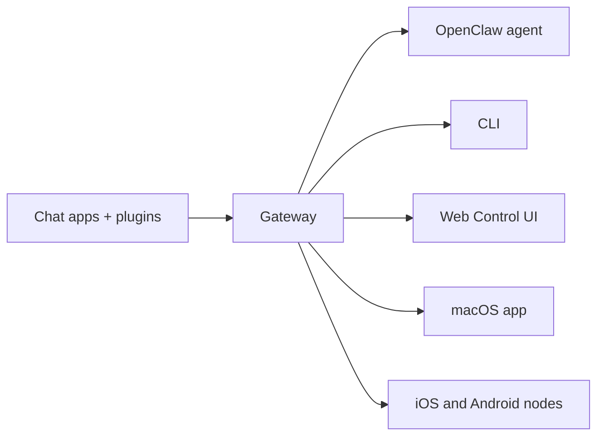

---
read_when:
    - Giới thiệu OpenClaw cho người mới bắt đầu
summary: OpenClaw là một Gateway đa kênh dành cho các tác nhân AI, chạy trên mọi hệ điều hành.
title: OpenClaw
x-i18n:
    generated_at: "2026-06-27T17:36:15Z"
    model: gpt-5.5
    postprocess_version: locale-links-v1
    provider: openai
    source_hash: fcaa54a0a6d7aa62193fd9f03428bbcbfdcb2c00a184bcd6f49e4e093fefc473
    source_path: index.md
    workflow: 16
---

# OpenClaw 🦞

<p align="center">
    
    
</p>

> _"TẨY TẾ BÀO CHẾT! TẨY TẾ BÀO CHẾT!"_ — Có lẽ là một con tôm hùm không gian

<p align="center">
  <strong>Gateway trên mọi hệ điều hành cho các tác tử AI qua Discord, Google Chat, iMessage, Matrix, Microsoft Teams, Signal, Slack, Telegram, WhatsApp, Zalo và nhiều kênh khác.</strong><br />
  Gửi một tin nhắn, nhận phản hồi từ tác tử ngay trong túi bạn. Chạy một Gateway trên các kênh tích hợp sẵn, Plugin kênh đi kèm, WebChat và Node di động.
</p>

<Columns>
  <Card title="Bắt đầu" href="/vi/start/getting-started" icon="rocket">
    Cài đặt OpenClaw và khởi chạy Gateway trong vài phút.
  </Card>
  <Card title="Chạy quy trình nhập môn" href="/vi/start/wizard" icon="sparkles">
    Thiết lập có hướng dẫn với `openclaw onboard` và các luồng ghép nối.
  </Card>
  <Card title="Mở Control UI" href="/vi/web/control-ui" icon="layout-dashboard">
    Khởi chạy bảng điều khiển trên trình duyệt để chat, cấu hình và quản lý phiên.
  </Card>
</Columns>

## OpenClaw là gì?

OpenClaw là một **gateway tự lưu trữ** kết nối các ứng dụng chat và bề mặt kênh yêu thích của bạn — các kênh tích hợp sẵn cùng với Plugin kênh đi kèm hoặc bên ngoài như Discord, Google Chat, iMessage, Matrix, Microsoft Teams, Signal, Slack, Telegram, WhatsApp, Zalo và nhiều kênh khác — với các tác tử lập trình AI. Bạn chạy một tiến trình Gateway duy nhất trên máy của mình (hoặc trên máy chủ), và nó trở thành cầu nối giữa các ứng dụng nhắn tin của bạn và một trợ lý AI luôn sẵn sàng.

**Dành cho ai?** Nhà phát triển và người dùng nâng cao muốn có một trợ lý AI cá nhân có thể nhắn tin từ bất cứ đâu — mà không phải từ bỏ quyền kiểm soát dữ liệu hoặc phụ thuộc vào dịch vụ được lưu trữ sẵn.

**Điều gì làm nó khác biệt?**

- **Tự lưu trữ**: chạy trên phần cứng của bạn, theo quy tắc của bạn
- **Đa kênh**: một Gateway phục vụ đồng thời các kênh tích hợp sẵn cùng với Plugin kênh đi kèm hoặc bên ngoài
- **Gốc tác tử**: được xây dựng cho tác tử lập trình với khả năng dùng công cụ, phiên, bộ nhớ và định tuyến đa tác tử
- **Mã nguồn mở**: giấy phép MIT, do cộng đồng dẫn dắt

**Bạn cần gì?** Node 24 (khuyến nghị), hoặc Node 22 LTS (`22.19+`) để tương thích, một khóa API từ nhà cung cấp bạn chọn và 5 phút. Để có chất lượng và bảo mật tốt nhất, hãy dùng mô hình thế hệ mới nhất mạnh nhất hiện có.

## Cách hoạt động



Gateway là nguồn chân lý duy nhất cho phiên, định tuyến và kết nối kênh.

## Năng lực chính

<Columns>
  <Card title="Gateway đa kênh" icon="network" href="/vi/channels">
    Discord, iMessage, Signal, Slack, Telegram, WhatsApp, WebChat và nhiều kênh khác với một tiến trình Gateway duy nhất.
  </Card>
  <Card title="Kênh Plugin" icon="plug" href="/vi/tools/plugin">
    Các Plugin đi kèm bổ sung Matrix, Nostr, Twitch, Zalo và nhiều kênh khác trong các bản phát hành hiện hành thông thường.
  </Card>
  <Card title="Định tuyến đa tác tử" icon="route" href="/vi/concepts/multi-agent">
    Phiên tách biệt theo từng tác tử, workspace hoặc người gửi.
  </Card>
  <Card title="Hỗ trợ phương tiện" icon="image" href="/vi/nodes/images">
    Gửi và nhận hình ảnh, âm thanh và tài liệu.
  </Card>
  <Card title="Web Control UI" icon="monitor" href="/vi/web/control-ui">
    Bảng điều khiển trên trình duyệt để chat, cấu hình, phiên và Node.
  </Card>
  <Card title="Node di động" icon="smartphone" href="/vi/nodes">
    Ghép nối Node iOS và Android cho các quy trình làm việc hỗ trợ Canvas, camera và giọng nói.
  </Card>
</Columns>

## Bắt đầu nhanh

<Steps>
  <Step title="Cài đặt OpenClaw">
    ```bash
    npm install -g openclaw@latest
    ```
  </Step>
  <Step title="Nhập môn và cài đặt dịch vụ">
    ```bash
    openclaw onboard --install-daemon
    ```
  </Step>
  <Step title="Chat">
    Mở Control UI trong trình duyệt của bạn và gửi một tin nhắn:

    ```bash
    openclaw dashboard
    ```

    Hoặc kết nối một kênh ([Telegram](/vi/channels/telegram) là nhanh nhất) và chat từ điện thoại của bạn.

  </Step>
</Steps>

Cần hướng dẫn cài đặt đầy đủ và thiết lập phát triển? Xem [Bắt đầu](/vi/start/getting-started).

## Bảng điều khiển

Mở Control UI trên trình duyệt sau khi Gateway khởi động.

- Mặc định cục bộ: [http://127.0.0.1:18789/](http://127.0.0.1:18789/)
- Truy cập từ xa: [Bề mặt web](/vi/web) và [Tailscale](/vi/gateway/tailscale)

<p align="center">
  
</p>

## Cấu hình (tùy chọn)

Cấu hình nằm tại `~/.openclaw/openclaw.json`.

- Nếu bạn **không làm gì**, OpenClaw dùng runtime tác tử OpenClaw đi kèm với phiên theo từng người gửi.
- Nếu bạn muốn khóa chặt hơn, hãy bắt đầu với `channels.whatsapp.allowFrom` và (đối với nhóm) quy tắc nhắc tên.

Ví dụ:

```json5
{
  channels: {
    whatsapp: {
      allowFrom: ["+15555550123"],
      groups: { "*": { requireMention: true } },
    },
  },
  messages: { groupChat: { mentionPatterns: ["@openclaw"] } },
}
```

## Bắt đầu tại đây

<Columns>
  <Card title="Trung tâm tài liệu" href="/vi/start/hubs" icon="book-open">
    Tất cả tài liệu và hướng dẫn, được sắp xếp theo trường hợp sử dụng.
  </Card>
  <Card title="Cấu hình" href="/vi/gateway/configuration" icon="settings">
    Cài đặt Gateway lõi, token và cấu hình nhà cung cấp.
  </Card>
  <Card title="Truy cập từ xa" href="/vi/gateway/remote" icon="globe">
    Các mẫu truy cập SSH và tailnet.
  </Card>
  <Card title="Kênh" href="/vi/channels/telegram" icon="message-square">
    Thiết lập theo từng kênh cho Feishu, Microsoft Teams, WhatsApp, Telegram, Discord và nhiều kênh khác.
  </Card>
  <Card title="Node" href="/vi/nodes" icon="smartphone">
    Node iOS và Android với ghép nối, Canvas, camera và hành động thiết bị.
  </Card>
  <Card title="Trợ giúp" href="/vi/help" icon="life-buoy">
    Điểm vào cho các cách khắc phục phổ biến và xử lý sự cố.
  </Card>
</Columns>

## Tìm hiểu thêm

<Columns>
  <Card title="Danh sách tính năng đầy đủ" href="/vi/concepts/features" icon="list">
    Toàn bộ năng lực về kênh, định tuyến và phương tiện.
  </Card>
  <Card title="Định tuyến đa tác tử" href="/vi/concepts/multi-agent" icon="route">
    Cô lập workspace và phiên theo từng tác tử.
  </Card>
  <Card title="Bảo mật" href="/vi/gateway/security" icon="shield">
    Token, danh sách cho phép và kiểm soát an toàn.
  </Card>
  <Card title="Xử lý sự cố" href="/vi/gateway/troubleshooting" icon="wrench">
    Chẩn đoán Gateway và các lỗi phổ biến.
  </Card>
  <Card title="Giới thiệu và ghi công" href="/vi/reference/credits" icon="info">
    Nguồn gốc dự án, người đóng góp và giấy phép.
  </Card>
</Columns>
