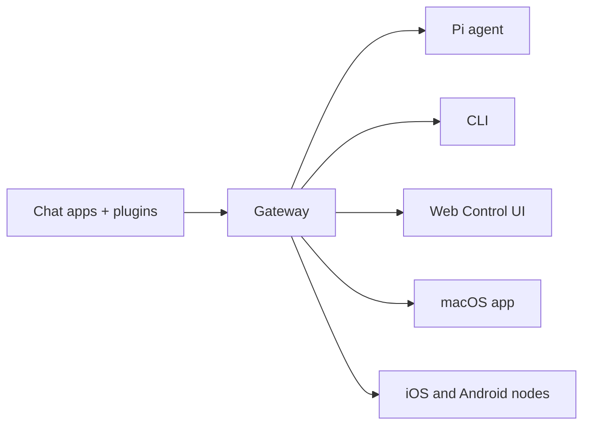

---
read_when:
    - Giới thiệu OpenClaw cho người mới
summary: OpenClaw là một Gateway đa kênh dành cho các tác nhân AI, chạy trên bất kỳ hệ điều hành nào.
title: OpenClaw
x-i18n:
    generated_at: "2026-04-29T22:49:37Z"
    model: gpt-5.5
    provider: openai
    source_hash: 923d34fa604051d502e4bc902802d6921a4b89a9447f76123aa8d2ff085f0b99
    source_path: index.md
    workflow: 16
---

# OpenClaw 🦞

<p align="center">
    
    
</p>

> _"TẨY DA CHẾT! TẨY DA CHẾT!"_ — Có lẽ là một con tôm hùm không gian

<p align="center">
  <strong>Gateway cho mọi hệ điều hành, dành cho các tác tử AI trên Discord, Google Chat, iMessage, Matrix, Microsoft Teams, Signal, Slack, Telegram, WhatsApp, Zalo, v.v.</strong><br />
  Gửi một tin nhắn, nhận phản hồi từ tác tử ngay trong túi bạn. Chạy một Gateway cho các kênh tích hợp sẵn, Plugin kênh đi kèm, WebChat và các nút di động.
</p>

<Columns>
  <Card title="Bắt đầu" href="/vi/start/getting-started" icon="rocket">
    Cài đặt OpenClaw và khởi chạy Gateway trong vài phút.
  </Card>
  <Card title="Chạy quy trình nhập môn" href="/vi/start/wizard" icon="sparkles">
    Thiết lập có hướng dẫn với `openclaw onboard` và các luồng ghép nối.
  </Card>
  <Card title="Mở giao diện điều khiển" href="/vi/web/control-ui" icon="layout-dashboard">
    Khởi chạy bảng điều khiển trên trình duyệt để trò chuyện, cấu hình và quản lý phiên.
  </Card>
</Columns>

## OpenClaw là gì?

OpenClaw là một **gateway tự lưu trữ** kết nối các ứng dụng trò chuyện và bề mặt kênh yêu thích của bạn — gồm các kênh tích hợp sẵn cùng Plugin kênh đi kèm hoặc bên ngoài như Discord, Google Chat, iMessage, Matrix, Microsoft Teams, Signal, Slack, Telegram, WhatsApp, Zalo, v.v. — với các tác tử lập trình AI như Pi. Bạn chạy một tiến trình Gateway duy nhất trên máy của mình (hoặc trên máy chủ), và nó trở thành cầu nối giữa các ứng dụng nhắn tin của bạn với một trợ lý AI luôn sẵn sàng.

**Dành cho ai?** Nhà phát triển và người dùng chuyên sâu muốn có một trợ lý AI cá nhân có thể nhắn tin từ mọi nơi — mà không phải từ bỏ quyền kiểm soát dữ liệu hoặc phụ thuộc vào dịch vụ lưu trữ sẵn.

**Điều gì làm nó khác biệt?**

- **Tự lưu trữ**: chạy trên phần cứng của bạn, theo quy tắc của bạn
- **Đa kênh**: một Gateway phục vụ đồng thời các kênh tích hợp sẵn cùng Plugin kênh đi kèm hoặc bên ngoài
- **Hướng tác tử**: được xây dựng cho tác tử lập trình với khả năng dùng công cụ, phiên, bộ nhớ và định tuyến đa tác tử
- **Mã nguồn mở**: giấy phép MIT, do cộng đồng dẫn dắt

**Bạn cần gì?** Node 24 (khuyến nghị), hoặc Node 22 LTS (`22.14+`) để tương thích, một khóa API từ nhà cung cấp bạn chọn, và 5 phút. Để có chất lượng và bảo mật tốt nhất, hãy dùng mô hình thế hệ mới nhất mạnh nhất hiện có.

## Cách hoạt động



Gateway là nguồn dữ liệu chuẩn duy nhất cho phiên, định tuyến và kết nối kênh.

## Khả năng chính

<Columns>
  <Card title="Gateway đa kênh" icon="network" href="/vi/channels">
    Discord, iMessage, Signal, Slack, Telegram, WhatsApp, WebChat, v.v. với một tiến trình Gateway duy nhất.
  </Card>
  <Card title="Kênh Plugin" icon="plug" href="/vi/tools/plugin">
    Các Plugin đi kèm bổ sung Matrix, Nostr, Twitch, Zalo, v.v. trong các bản phát hành hiện tại thông thường.
  </Card>
  <Card title="Định tuyến đa tác tử" icon="route" href="/vi/concepts/multi-agent">
    Phiên biệt lập theo tác tử, không gian làm việc hoặc người gửi.
  </Card>
  <Card title="Hỗ trợ phương tiện" icon="image" href="/vi/nodes/images">
    Gửi và nhận hình ảnh, âm thanh và tài liệu.
  </Card>
  <Card title="Giao diện điều khiển web" icon="monitor" href="/vi/web/control-ui">
    Bảng điều khiển trên trình duyệt cho trò chuyện, cấu hình, phiên và nút.
  </Card>
  <Card title="Nút di động" icon="smartphone" href="/vi/nodes">
    Ghép nối các nút iOS và Android cho quy trình làm việc hỗ trợ Canvas, camera và giọng nói.
  </Card>
</Columns>

## Khởi động nhanh

<Steps>
  <Step title="Cài đặt OpenClaw">
    ```bash
    npm install -g openclaw@latest
    ```
  </Step>
  <Step title="Nhập môn và cài đặt dịch vụ">
    ```bash
    openclaw onboard --install-daemon
    ```
  </Step>
  <Step title="Trò chuyện">
    Mở giao diện điều khiển trong trình duyệt và gửi một tin nhắn:

    ```bash
    openclaw dashboard
    ```

    Hoặc kết nối một kênh ([Telegram](/vi/channels/telegram) là nhanh nhất) và trò chuyện từ điện thoại của bạn.

  </Step>
</Steps>

Cần hướng dẫn cài đặt đầy đủ và thiết lập phát triển? Xem [Bắt đầu](/vi/start/getting-started).

## Bảng điều khiển

Mở giao diện điều khiển trên trình duyệt sau khi Gateway khởi động.

- Mặc định cục bộ: [http://127.0.0.1:18789/](http://127.0.0.1:18789/)
- Truy cập từ xa: [Bề mặt web](/vi/web) và [Tailscale](/vi/gateway/tailscale)

<p align="center">
  
</p>

## Cấu hình (tùy chọn)

Cấu hình nằm tại `~/.openclaw/openclaw.json`.

- Nếu bạn **không làm gì**, OpenClaw dùng tệp nhị phân Pi đi kèm ở chế độ RPC với các phiên theo từng người gửi.
- Nếu bạn muốn khóa chặt hơn, hãy bắt đầu với `channels.whatsapp.allowFrom` và (đối với nhóm) quy tắc nhắc đến.

Ví dụ:

```json5
{
  channels: {
    whatsapp: {
      allowFrom: ["+15555550123"],
      groups: { "*": { requireMention: true } },
    },
  },
  messages: { groupChat: { mentionPatterns: ["@openclaw"] } },
}
```

## Bắt đầu tại đây

<Columns>
  <Card title="Trung tâm tài liệu" href="/vi/start/hubs" icon="book-open">
    Tất cả tài liệu và hướng dẫn, được tổ chức theo trường hợp sử dụng.
  </Card>
  <Card title="Cấu hình" href="/vi/gateway/configuration" icon="settings">
    Thiết lập Gateway cốt lõi, token và cấu hình nhà cung cấp.
  </Card>
  <Card title="Truy cập từ xa" href="/vi/gateway/remote" icon="globe">
    Mẫu truy cập SSH và tailnet.
  </Card>
  <Card title="Kênh" href="/vi/channels/telegram" icon="message-square">
    Thiết lập riêng cho từng kênh dành cho Feishu, Microsoft Teams, WhatsApp, Telegram, Discord, v.v.
  </Card>
  <Card title="Nút" href="/vi/nodes" icon="smartphone">
    Nút iOS và Android với ghép nối, Canvas, camera và hành động thiết bị.
  </Card>
  <Card title="Trợ giúp" href="/vi/help" icon="life-buoy">
    Điểm bắt đầu cho các cách khắc phục thường gặp và xử lý sự cố.
  </Card>
</Columns>

## Tìm hiểu thêm

<Columns>
  <Card title="Danh sách tính năng đầy đủ" href="/vi/concepts/features" icon="list">
    Toàn bộ khả năng về kênh, định tuyến và phương tiện.
  </Card>
  <Card title="Định tuyến đa tác tử" href="/vi/concepts/multi-agent" icon="route">
    Cách ly không gian làm việc và phiên theo từng tác tử.
  </Card>
  <Card title="Bảo mật" href="/vi/gateway/security" icon="shield">
    Token, danh sách cho phép và điều khiển an toàn.
  </Card>
  <Card title="Xử lý sự cố" href="/vi/gateway/troubleshooting" icon="wrench">
    Chẩn đoán Gateway và các lỗi thường gặp.
  </Card>
  <Card title="Giới thiệu và ghi nhận" href="/vi/reference/credits" icon="info">
    Nguồn gốc dự án, người đóng góp và giấy phép.
  </Card>
</Columns>
