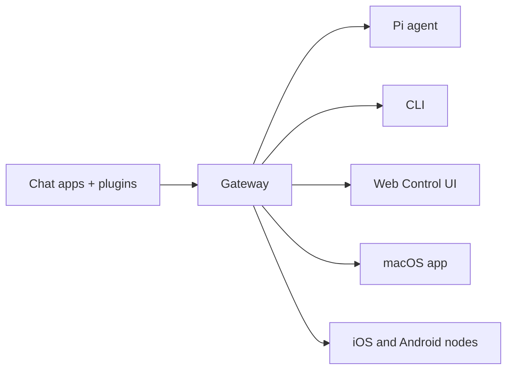

---
read_when:
    - Giới thiệu OpenClaw cho người mới
summary: OpenClaw là một Gateway đa kênh cho các tác nhân AI, chạy trên bất kỳ hệ điều hành nào.
title: OpenClaw
x-i18n:
    generated_at: "2026-05-07T13:19:43Z"
    model: gpt-5.5
    provider: openai
    source_hash: 7bf82c8551703257e55289d2b82f6436c9900a8afae7ab9b6a655332716ff37b
    source_path: index.md
    workflow: 16
---

# OpenClaw 🦞

<p align="center">
    
    
</p>

> _"TẨY DA CHẾT! TẨY DA CHẾT!"_ — Có lẽ là một con tôm hùm không gian

<p align="center">
  <strong>Gateway trên mọi hệ điều hành cho các AI agent trên Discord, Google Chat, iMessage, Matrix, Microsoft Teams, Signal, Slack, Telegram, WhatsApp, Zalo, và nhiều nền tảng khác.</strong><br />
  Gửi một tin nhắn, nhận phản hồi từ agent ngay trong túi bạn. Chạy một Gateway trên các kênh tích hợp sẵn, các Plugin kênh đi kèm, WebChat, và các node di động.
</p>

<Columns>
  <Card title="Bắt đầu" href="/vi/start/getting-started" icon="rocket">
    Cài đặt OpenClaw và khởi chạy Gateway trong vài phút.
  </Card>
  <Card title="Chạy quy trình thiết lập ban đầu" href="/vi/start/wizard" icon="sparkles">
    Thiết lập có hướng dẫn bằng `openclaw onboard` và các luồng ghép nối.
  </Card>
  <Card title="Mở Control UI" href="/vi/web/control-ui" icon="layout-dashboard">
    Khởi chạy dashboard trong trình duyệt cho chat, cấu hình, và phiên.
  </Card>
</Columns>

## OpenClaw là gì?

OpenClaw là một **Gateway tự lưu trữ** kết nối các ứng dụng chat và giao diện kênh yêu thích của bạn — các kênh tích hợp sẵn cùng các Plugin kênh đi kèm hoặc bên ngoài như Discord, Google Chat, iMessage, Matrix, Microsoft Teams, Signal, Slack, Telegram, WhatsApp, Zalo, và nhiều nền tảng khác — với các AI coding agent như Pi. Bạn chạy một tiến trình Gateway duy nhất trên máy của mình (hoặc một máy chủ), và nó trở thành cầu nối giữa các ứng dụng nhắn tin của bạn với một trợ lý AI luôn sẵn sàng.

**Dành cho ai?** Nhà phát triển và người dùng chuyên sâu muốn có một trợ lý AI cá nhân có thể nhắn tin từ bất cứ đâu — mà không phải từ bỏ quyền kiểm soát dữ liệu hoặc phụ thuộc vào dịch vụ được lưu trữ sẵn.

**Điểm khác biệt là gì?**

- **Tự lưu trữ**: chạy trên phần cứng của bạn, theo quy tắc của bạn
- **Đa kênh**: một Gateway phục vụ đồng thời các kênh tích hợp sẵn cùng các Plugin kênh đi kèm hoặc bên ngoài
- **Hướng agent**: được xây dựng cho coding agent với khả năng dùng công cụ, phiên, bộ nhớ, và định tuyến đa agent
- **Mã nguồn mở**: giấy phép MIT, do cộng đồng thúc đẩy

**Bạn cần gì?** Node 24 (khuyến nghị), hoặc Node 22 LTS (`22.16+`) để tương thích, một API key từ nhà cung cấp bạn chọn, và 5 phút. Để có chất lượng và bảo mật tốt nhất, hãy dùng model thế hệ mới nhất mạnh nhất hiện có.

## Cách hoạt động



Gateway là nguồn sự thật duy nhất cho phiên, định tuyến, và kết nối kênh.

## Khả năng chính

<Columns>
  <Card title="Gateway đa kênh" icon="network" href="/vi/channels">
    Discord, iMessage, Signal, Slack, Telegram, WhatsApp, WebChat, và nhiều nền tảng khác với một tiến trình Gateway duy nhất.
  </Card>
  <Card title="Kênh Plugin" icon="plug" href="/vi/tools/plugin">
    Các Plugin đi kèm bổ sung Matrix, Nostr, Twitch, Zalo, và nhiều kênh khác trong các bản phát hành hiện tại thông thường.
  </Card>
  <Card title="Định tuyến đa agent" icon="route" href="/vi/concepts/multi-agent">
    Phiên tách biệt theo agent, workspace, hoặc người gửi.
  </Card>
  <Card title="Hỗ trợ phương tiện" icon="image" href="/vi/nodes/images">
    Gửi và nhận hình ảnh, âm thanh, và tài liệu.
  </Card>
  <Card title="Web Control UI" icon="monitor" href="/vi/web/control-ui">
    Dashboard trong trình duyệt cho chat, cấu hình, phiên, và node.
  </Card>
  <Card title="Node di động" icon="smartphone" href="/vi/nodes">
    Ghép nối các node iOS và Android cho Canvas, camera, và workflow hỗ trợ giọng nói.
  </Card>
</Columns>

## Khởi động nhanh

<Steps>
  <Step title="Cài đặt OpenClaw">
    ```bash
    npm install -g openclaw@latest
    ```
  </Step>
  <Step title="Thiết lập ban đầu và cài đặt dịch vụ">
    ```bash
    openclaw onboard --install-daemon
    ```
  </Step>
  <Step title="Chat">
    Mở Control UI trong trình duyệt của bạn và gửi một tin nhắn:

    ```bash
    openclaw dashboard
    ```

    Hoặc kết nối một kênh ([Telegram](/vi/channels/telegram) là nhanh nhất) và chat từ điện thoại của bạn.

  </Step>
</Steps>

Cần phần cài đặt đầy đủ và thiết lập dev? Xem [Bắt đầu](/vi/start/getting-started).

## Dashboard

Mở Control UI trong trình duyệt sau khi Gateway khởi động.

- Mặc định cục bộ: [http://127.0.0.1:18789/](http://127.0.0.1:18789/)
- Truy cập từ xa: [Bề mặt web](/vi/web) và [Tailscale](/vi/gateway/tailscale)

<p align="center">
  
</p>

## Cấu hình (tùy chọn)

Cấu hình nằm tại `~/.openclaw/openclaw.json`.

- Nếu bạn **không làm gì**, OpenClaw dùng binary Pi đi kèm ở chế độ RPC với phiên theo từng người gửi.
- Nếu bạn muốn siết chặt quyền truy cập, hãy bắt đầu với `channels.whatsapp.allowFrom` và quy tắc nhắc tên (đối với nhóm).

Ví dụ:

```json5
{
  channels: {
    whatsapp: {
      allowFrom: ["+15555550123"],
      groups: { "*": { requireMention: true } },
    },
  },
  messages: { groupChat: { mentionPatterns: ["@openclaw"] } },
}
```

## Bắt đầu tại đây

<Columns>
  <Card title="Trung tâm tài liệu" href="/vi/start/hubs" icon="book-open">
    Tất cả tài liệu và hướng dẫn, được sắp xếp theo trường hợp sử dụng.
  </Card>
  <Card title="Cấu hình" href="/vi/gateway/configuration" icon="settings">
    Thiết lập Gateway cốt lõi, token, và cấu hình nhà cung cấp.
  </Card>
  <Card title="Truy cập từ xa" href="/vi/gateway/remote" icon="globe">
    Các mẫu truy cập SSH và tailnet.
  </Card>
  <Card title="Kênh" href="/vi/channels/telegram" icon="message-square">
    Thiết lập riêng cho từng kênh cho Feishu, Microsoft Teams, WhatsApp, Telegram, Discord, và nhiều nền tảng khác.
  </Card>
  <Card title="Node" href="/vi/nodes" icon="smartphone">
    Node iOS và Android với ghép nối, Canvas, camera, và thao tác thiết bị.
  </Card>
  <Card title="Trợ giúp" href="/vi/help" icon="life-buoy">
    Điểm vào cho các cách khắc phục phổ biến và xử lý sự cố.
  </Card>
</Columns>

## Tìm hiểu thêm

<Columns>
  <Card title="Danh sách tính năng đầy đủ" href="/vi/concepts/features" icon="list">
    Khả năng đầy đủ về kênh, định tuyến, và phương tiện.
  </Card>
  <Card title="Định tuyến đa agent" href="/vi/concepts/multi-agent" icon="route">
    Cô lập workspace và phiên theo từng agent.
  </Card>
  <Card title="Bảo mật" href="/vi/gateway/security" icon="shield">
    Token, danh sách cho phép, và kiểm soát an toàn.
  </Card>
  <Card title="Xử lý sự cố" href="/vi/gateway/troubleshooting" icon="wrench">
    Chẩn đoán Gateway và các lỗi thường gặp.
  </Card>
  <Card title="Giới thiệu và ghi công" href="/vi/reference/credits" icon="info">
    Nguồn gốc dự án, người đóng góp, và giấy phép.
  </Card>
</Columns>
