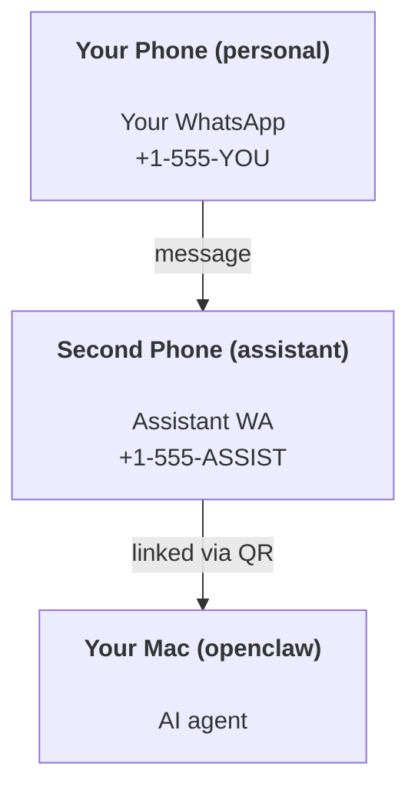

---
read_when:
    - Đưa một phiên bản trợ lý mới vào sử dụng
    - Đang xem xét các tác động về an toàn/quyền truy cập
summary: Hướng dẫn toàn trình để chạy OpenClaw như một trợ lý cá nhân kèm các lưu ý an toàn
title: Thiết lập trợ lý cá nhân
x-i18n:
    generated_at: "2026-06-27T18:12:27Z"
    model: gpt-5.5
    postprocess_version: locale-links-v1
    provider: openai
    source_hash: b0cd640872a2a60fd88d2dc3df6d038ef8574163430d8683ef9b67921b0c87f4
    source_path: start/openclaw.md
    workflow: 16
---

OpenClaw là một Gateway tự lưu trữ kết nối Discord, Google Chat, iMessage, Matrix, Microsoft Teams, Signal, Slack, Telegram, WhatsApp, Zalo và nhiều kênh khác với các tác tử AI. Hướng dẫn này bao quát thiết lập "trợ lý cá nhân": một số WhatsApp riêng hoạt động như trợ lý AI luôn bật của bạn.

## ⚠️ An toàn trước tiên

Bạn đang đặt một tác tử vào vị trí có thể:

- chạy lệnh trên máy của bạn (tùy theo chính sách công cụ của bạn)
- đọc/ghi tệp trong workspace của bạn
- gửi tin nhắn ra ngoài qua WhatsApp/Telegram/Discord/Mattermost và các kênh đi kèm khác

Hãy bắt đầu thận trọng:

- Luôn đặt `channels.whatsapp.allowFrom` (đừng bao giờ chạy ở chế độ mở cho toàn thế giới trên máy Mac cá nhân của bạn).
- Dùng một số WhatsApp riêng cho trợ lý.
- Heartbeat hiện mặc định chạy 30 phút một lần. Tắt cho đến khi bạn tin tưởng thiết lập bằng cách đặt `agents.defaults.heartbeat.every: "0m"`.

## Điều kiện tiên quyết

- OpenClaw đã được cài đặt và onboarding - xem [Bắt đầu](/vi/start/getting-started) nếu bạn chưa làm việc này
- Một số điện thoại thứ hai (SIM/eSIM/trả trước) cho trợ lý

## Thiết lập hai điện thoại (khuyến nghị)

Bạn muốn mô hình này:



Nếu bạn liên kết WhatsApp cá nhân của mình với OpenClaw, mọi tin nhắn gửi đến bạn sẽ trở thành "đầu vào của tác tử". Điều đó hiếm khi là điều bạn muốn.

## Khởi động nhanh trong 5 phút

1. Ghép nối WhatsApp Web (hiển thị QR; quét bằng điện thoại của trợ lý):

```bash
openclaw channels login
```

2. Khởi động Gateway (để nó tiếp tục chạy):

```bash
openclaw gateway --port 18789
```

3. Đặt cấu hình tối thiểu vào `~/.openclaw/openclaw.json`:

```json5
{
  gateway: { mode: "local" },
  channels: { whatsapp: { allowFrom: ["+15555550123"] } },
}
```

Bây giờ hãy nhắn tin cho số của trợ lý từ điện thoại trong danh sách cho phép của bạn.

Khi onboarding hoàn tất, OpenClaw tự động mở dashboard và in ra một liên kết sạch (không có token). Nếu dashboard yêu cầu xác thực, hãy dán shared secret đã cấu hình vào phần cài đặt Control UI. Onboarding mặc định dùng token (`gateway.auth.token`), nhưng xác thực bằng mật khẩu cũng hoạt động nếu bạn đã chuyển `gateway.auth.mode` sang `password`. Để mở lại sau này: `openclaw dashboard`.

## Cấp workspace cho tác tử (AGENTS)

OpenClaw đọc hướng dẫn vận hành và "bộ nhớ" từ thư mục workspace của nó.

Theo mặc định, OpenClaw dùng `~/.openclaw/workspace` làm workspace của tác tử và sẽ tự động tạo nó (cùng các tệp khởi đầu `AGENTS.md`, `SOUL.md`, `TOOLS.md`, `IDENTITY.md`, `USER.md`, `HEARTBEAT.md`) trong quá trình thiết lập/lần chạy tác tử đầu tiên. `BOOTSTRAP.md` chỉ được tạo khi workspace hoàn toàn mới (nó không nên xuất hiện lại sau khi bạn xóa). `MEMORY.md` là tùy chọn (không tự động tạo); khi có mặt, nó được tải cho các phiên thông thường. Các phiên tác tử con chỉ chèn `AGENTS.md` và `TOOLS.md`.

<Tip>
Hãy xem thư mục này như bộ nhớ của OpenClaw và biến nó thành một repo git (lý tưởng là riêng tư) để `AGENTS.md` và các tệp bộ nhớ của bạn được sao lưu. Nếu đã cài git, các workspace hoàn toàn mới sẽ được tự động khởi tạo.
</Tip>

```bash
openclaw setup
```

Bố cục workspace đầy đủ + hướng dẫn sao lưu: [Workspace của tác tử](/vi/concepts/agent-workspace)
Quy trình bộ nhớ: [Bộ nhớ](/vi/concepts/memory)

Tùy chọn: chọn workspace khác bằng `agents.defaults.workspace` (hỗ trợ `~`).

```json5
{
  agents: {
    defaults: {
      workspace: "~/.openclaw/workspace",
    },
  },
}
```

Nếu bạn đã phân phối các tệp workspace riêng từ một repo, bạn có thể tắt hoàn toàn việc tạo tệp bootstrap:

```json5
{
  agents: {
    defaults: {
      skipBootstrap: true,
    },
  },
}
```

## Cấu hình biến nó thành "một trợ lý"

OpenClaw mặc định là một thiết lập trợ lý tốt, nhưng bạn thường sẽ muốn tinh chỉnh:

- persona/hướng dẫn trong [`SOUL.md`](/vi/concepts/soul)
- mặc định suy nghĩ (nếu muốn)
- Heartbeat (sau khi bạn tin tưởng nó)

Ví dụ:

```json5
{
  logging: { level: "info" },
  agents: {
    defaults: {
      model: { primary: "anthropic/claude-opus-4-6" },
      workspace: "~/.openclaw/workspace",
      thinkingDefault: "high",
      timeoutSeconds: 1800,
      // Start with 0; enable later.
      heartbeat: { every: "0m" },
    },
    list: [
      {
        id: "main",
        default: true,
        groupChat: {
          mentionPatterns: ["@openclaw", "openclaw"],
        },
      },
    ],
  },
  channels: {
    whatsapp: {
      allowFrom: ["+15555550123"],
      groups: {
        "*": { requireMention: true },
      },
    },
  },
  session: {
    scope: "per-sender",
    resetTriggers: ["/new", "/reset"],
    reset: {
      mode: "daily",
      atHour: 4,
      idleMinutes: 10080,
    },
  },
}
```

## Phiên và bộ nhớ

- Tệp phiên: `~/.openclaw/agents/<agentId>/sessions/{{SessionId}}.jsonl`
- Siêu dữ liệu phiên (mức dùng token, tuyến cuối cùng, v.v.): `~/.openclaw/agents/<agentId>/sessions/sessions.json` (cũ: `~/.openclaw/sessions/sessions.json`)
- `/new` hoặc `/reset` bắt đầu một phiên mới cho cuộc trò chuyện đó (có thể cấu hình qua `resetTriggers`). Nếu gửi riêng lẻ, OpenClaw xác nhận việc đặt lại mà không gọi model.
- `/compact [instructions]` compaction ngữ cảnh phiên và báo cáo ngân sách ngữ cảnh còn lại.

## Heartbeat (chế độ chủ động)

Theo mặc định, OpenClaw chạy Heartbeat 30 phút một lần với prompt:
`Read HEARTBEAT.md if it exists (workspace context). Follow it strictly. Do not infer or repeat old tasks from prior chats. If nothing needs attention, reply HEARTBEAT_OK.`
Đặt `agents.defaults.heartbeat.every: "0m"` để tắt.

- Nếu `HEARTBEAT.md` tồn tại nhưng thực tế trống (chỉ có dòng trống, chú thích Markdown/HTML, tiêu đề Markdown như `# Heading`, dấu fence, hoặc các mục checklist trống), OpenClaw bỏ qua lượt chạy Heartbeat để tiết kiệm lệnh gọi API.
- Nếu thiếu tệp, Heartbeat vẫn chạy và model quyết định phải làm gì.
- Nếu tác tử trả lời bằng `HEARTBEAT_OK` (tùy chọn có phần đệm ngắn; xem `agents.defaults.heartbeat.ackMaxChars`), OpenClaw sẽ chặn việc gửi ra ngoài cho Heartbeat đó.
- Theo mặc định, cho phép gửi Heartbeat đến các mục tiêu kiểu DM `user:<id>`. Đặt `agents.defaults.heartbeat.directPolicy: "block"` để chặn gửi đến mục tiêu trực tiếp trong khi vẫn giữ các lượt chạy Heartbeat hoạt động.
- Heartbeat chạy đầy đủ các lượt của tác tử - khoảng thời gian ngắn hơn sẽ tiêu tốn nhiều token hơn.

```json5
{
  agents: {
    defaults: {
      heartbeat: { every: "30m" },
    },
  },
}
```

## Phương tiện vào và ra

Tệp đính kèm đầu vào (hình ảnh/âm thanh/tài liệu) có thể được đưa đến lệnh của bạn qua template:

- `{{MediaPath}}` (đường dẫn tệp tạm cục bộ)
- `{{MediaUrl}}` (pseudo-URL)
- `{{Transcript}}` (nếu bật phiên âm âm thanh)

Tệp đính kèm đầu ra từ tác tử dùng các trường phương tiện có cấu trúc trên công cụ tin nhắn hoặc payload trả lời, chẳng hạn như `media`, `mediaUrl`, `mediaUrls`, `path`, hoặc `filePath`. Ví dụ đối số của công cụ tin nhắn:

```json
{
  "message": "Here's the screenshot.",
  "mediaUrl": "https://example.com/screenshot.png"
}
```

OpenClaw gửi phương tiện có cấu trúc cùng với văn bản. Các phản hồi trợ lý cuối kiểu cũ vẫn có thể được chuẩn hóa để tương thích, nhưng đầu ra công cụ, đầu ra trình duyệt, khối streaming và hành động tin nhắn không phân tích văn bản như lệnh đính kèm.

Hành vi đường dẫn cục bộ tuân theo cùng mô hình tin cậy đọc tệp như tác tử:

- Nếu `tools.fs.workspaceOnly` là `true`, đường dẫn phương tiện cục bộ đầu ra vẫn bị giới hạn trong temp root của OpenClaw, bộ nhớ đệm phương tiện, các đường dẫn workspace của tác tử và các tệp do sandbox tạo.
- Nếu `tools.fs.workspaceOnly` là `false`, phương tiện cục bộ đầu ra có thể dùng các tệp cục bộ trên máy chủ mà tác tử đã được phép đọc.
- Đường dẫn cục bộ có thể là tuyệt đối, tương đối theo workspace, hoặc tương đối theo home với `~/`.
- Gửi cục bộ trên máy chủ vẫn chỉ cho phép phương tiện và các loại tài liệu an toàn (hình ảnh, âm thanh, video, PDF, tài liệu Office và tài liệu văn bản đã được xác thực như Markdown/MD, TXT, JSON, YAML và YML). Đây là phần mở rộng của ranh giới tin cậy đọc trên máy chủ hiện có, không phải trình quét bí mật: nếu tác tử có thể đọc `secret.txt` hoặc `config.json` cục bộ trên máy chủ, nó có thể đính kèm tệp đó khi phần mở rộng và xác thực nội dung khớp.

Điều đó nghĩa là hình ảnh/tệp được tạo bên ngoài workspace giờ có thể gửi khi chính sách fs của bạn đã cho phép các lượt đọc đó, trong khi các phần mở rộng văn bản cục bộ tùy ý trên máy chủ vẫn bị chặn. Hãy giữ các tệp nhạy cảm bên ngoài hệ thống tệp mà tác tử có thể đọc, hoặc giữ `tools.fs.workspaceOnly=true` để gửi đường dẫn cục bộ nghiêm ngặt hơn.

## Checklist vận hành

```bash
openclaw status          # local status (creds, sessions, queued events)
openclaw status --all    # full diagnosis (read-only, pasteable)
openclaw status --deep   # asks the gateway for a live health probe with channel probes when supported
openclaw health --json   # gateway health snapshot (WS; default can return a fresh cached snapshot)
```

Nhật ký nằm dưới `/tmp/openclaw/` (mặc định: `openclaw-YYYY-MM-DD.log`).

## Bước tiếp theo

- WebChat: [WebChat](/vi/web/webchat)
- Vận hành Gateway: [Runbook Gateway](/vi/gateway)
- Cron + đánh thức: [Tác vụ Cron](/vi/automation/cron-jobs)
- Ứng dụng đồng hành trên thanh menu macOS: [Ứng dụng OpenClaw macOS](/vi/platforms/macos)
- Ứng dụng node iOS: [Ứng dụng iOS](/vi/platforms/ios)
- Ứng dụng node Android: [Ứng dụng Android](/vi/platforms/android)
- Windows Hub: [Windows](/vi/platforms/windows)
- Trạng thái Linux: [Ứng dụng Linux](/vi/platforms/linux)
- Bảo mật: [Bảo mật](/vi/gateway/security)

## Liên quan

- [Bắt đầu](/vi/start/getting-started)
- [Thiết lập](/vi/start/setup)
- [Tổng quan về kênh](/vi/channels)
