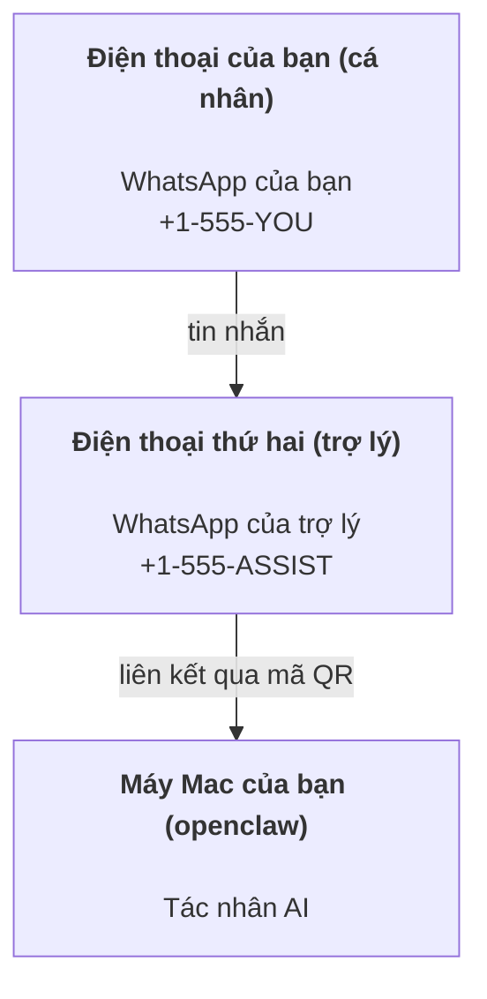

---
read_when:
    - Làm quen với một phiên bản trợ lý mới
    - Xem xét các tác động về an toàn/quyền hạn
summary: Hướng dẫn toàn diện về cách chạy OpenClaw như một trợ lý cá nhân kèm các lưu ý an toàn
title: Thiết lập trợ lý cá nhân
x-i18n:
    generated_at: "2026-07-16T15:04:53Z"
    model: gpt-5.6
    postprocess_version: locale-links-v1
    prompt_version: 32
    provider: openai
    source_hash: e8c34e31314f55647059fd600935330110add27b338a675bc0ce1529bebb207d
    source_path: start/openclaw.md
    workflow: 16
---

OpenClaw là một Gateway tự lưu trữ, kết nối Discord, Google Chat, iMessage, Matrix, Microsoft Teams, Signal, Slack, Telegram, WhatsApp, Zalo và nhiều nền tảng khác với các tác nhân AI. Hướng dẫn này trình bày cách thiết lập "trợ lý cá nhân": một số WhatsApp chuyên dụng hoạt động như trợ lý AI luôn trực tuyến của bạn.

## An toàn là trên hết

Việc cấp cho tác nhân một kênh sẽ đặt tác nhân vào vị trí có thể chạy lệnh trên máy của bạn (tùy thuộc vào chính sách công cụ), đọc/ghi tệp trong không gian làm việc và gửi tin nhắn ra ngoài qua mọi kênh đã kết nối. Hãy bắt đầu thận trọng:

- Luôn đặt `channels.whatsapp.allowFrom` (không bao giờ chạy ở chế độ mở cho toàn thế giới trên máy Mac cá nhân).
- Sử dụng một số WhatsApp chuyên dụng cho trợ lý.
- Heartbeat mặc định chạy mỗi 30 phút. Hãy tắt cho đến khi bạn tin tưởng cấu hình bằng cách đặt `agents.defaults.heartbeat.every: "0m"`.

## Điều kiện tiên quyết

- OpenClaw đã được cài đặt và hoàn tất quy trình thiết lập ban đầu — xem [Bắt đầu](/vi/start/getting-started) nếu bạn chưa thực hiện
- Một số điện thoại thứ hai (SIM/eSIM/trả trước) dành cho trợ lý

## Thiết lập hai điện thoại (khuyến nghị)

Mô hình cần thiết:



Nếu liên kết WhatsApp cá nhân với OpenClaw, mọi tin nhắn gửi đến bạn đều trở thành "đầu vào của tác nhân". Đây hiếm khi là điều bạn mong muốn.

## Bắt đầu nhanh trong 5 phút

1. Ghép nối WhatsApp Web (hiển thị mã QR; quét bằng điện thoại của trợ lý):

```bash
openclaw channels login
```

2. Khởi động Gateway (để tiến trình tiếp tục chạy):

```bash
openclaw gateway --port 18789
```

3. Đặt cấu hình tối thiểu vào `~/.openclaw/openclaw.json`:

```json5
{
  gateway: { mode: "local" },
  channels: { whatsapp: { allowFrom: ["+15555550123"] } },
}
```

Bây giờ, hãy nhắn tin đến số của trợ lý từ điện thoại nằm trong danh sách cho phép.

Khi quy trình thiết lập ban đầu hoàn tất, OpenClaw tự động mở bảng điều khiển và in ra một liên kết rõ ràng (không chứa token). Nếu bảng điều khiển yêu cầu xác thực, hãy dán bí mật dùng chung đã cấu hình vào phần cài đặt Control UI. Quy trình thiết lập ban đầu sử dụng token theo mặc định (`gateway.auth.token`), nhưng xác thực bằng mật khẩu cũng hoạt động nếu bạn đã chuyển `gateway.auth.mode` sang `password`. Để mở lại sau này: `openclaw dashboard`.

## Cấp không gian làm việc cho tác nhân (AGENTS)

OpenClaw đọc hướng dẫn vận hành và "bộ nhớ" từ thư mục không gian làm việc của tác nhân.

Theo mặc định, OpenClaw sử dụng `~/.openclaw/workspace` làm không gian làm việc của tác nhân và tự động tạo thư mục này (cùng các tệp khởi đầu `AGENTS.md`, `SOUL.md`, `TOOLS.md`, `IDENTITY.md`, `USER.md`, `HEARTBEAT.md`) trong quá trình thiết lập ban đầu hoặc lần chạy tác nhân đầu tiên. `BOOTSTRAP.md` chỉ được tạo cho không gian làm việc hoàn toàn mới và không được xuất hiện lại sau khi bạn xóa. `MEMORY.md` là tùy chọn và không bao giờ được tự động tạo; khi có mặt, tệp này được nạp cho các phiên thông thường. Các phiên tác nhân phụ chỉ chèn `AGENTS.md` và `TOOLS.md`.

<Tip>
Hãy coi thư mục này là bộ nhớ của OpenClaw và biến nó thành một kho git (lý tưởng nhất là riêng tư) để sao lưu `AGENTS.md` cùng các tệp bộ nhớ. Nếu đã cài đặt git, các không gian làm việc hoàn toàn mới sẽ tự động được khởi tạo với `git init`.
</Tip>

Để tạo các thư mục không gian làm việc và cấu hình mà không chạy toàn bộ trình hướng dẫn thiết lập ban đầu:

```bash
openclaw setup --baseline
```

(`openclaw setup` đơn lẻ là bí danh của `openclaw onboard` và chạy toàn bộ trình hướng dẫn tương tác.)

Bố cục đầy đủ của không gian làm việc và hướng dẫn sao lưu: [Không gian làm việc của tác nhân](/vi/concepts/agent-workspace)
Quy trình bộ nhớ: [Bộ nhớ](/vi/concepts/memory)

Tùy chọn: chọn không gian làm việc khác bằng `agents.defaults.workspace` (hỗ trợ `~`).

```json5
{
  agents: {
    defaults: {
      workspace: "~/.openclaw/workspace",
    },
  },
}
```

Nếu bạn đã cung cấp các tệp không gian làm việc riêng từ một kho mã nguồn, có thể tắt hoàn toàn việc tạo tệp khởi động:

```json5
{
  agents: {
    defaults: {
      skipBootstrap: true,
    },
  },
}
```

## Cấu hình biến hệ thống thành "một trợ lý"

OpenClaw mặc định sử dụng cấu hình trợ lý phù hợp, nhưng thông thường bạn sẽ muốn điều chỉnh:

- tính cách/hướng dẫn trong [`SOUL.md`](/vi/concepts/soul)
- giá trị mặc định cho quá trình suy luận (nếu muốn)
- Heartbeat (sau khi bạn tin tưởng cấu hình)

Ví dụ:

```json5
{
  logging: { level: "info" },
  agents: {
    defaults: {
      model: { primary: "anthropic/claude-opus-4-8" },
      workspace: "~/.openclaw/workspace",
      thinkingDefault: "high",
      timeoutSeconds: 1800,
      // Bắt đầu với 0; bật sau.
      heartbeat: { every: "0m" },
    },
    list: [
      {
        id: "main",
        default: true,
        groupChat: {
          mentionPatterns: ["@openclaw", "openclaw"],
        },
      },
    ],
  },
  channels: {
    whatsapp: {
      allowFrom: ["+15555550123"],
      groups: {
        "*": { requireMention: true },
      },
    },
  },
  session: {
    scope: "per-sender",
    resetTriggers: ["/new", "/reset"],
    reset: {
      mode: "daily",
      atHour: 4,
      idleMinutes: 10080,
    },
  },
}
```

## Phiên và bộ nhớ

- Các hàng phiên, hàng bản chép lời và siêu dữ liệu (mức sử dụng token, tuyến gần nhất, v.v.): `~/.openclaw/agents/<agentId>/agent/openclaw-agent.sqlite`
- Các thành phần bản chép lời cũ/lưu trữ: `~/.openclaw/agents/<agentId>/sessions/`
- Nguồn di chuyển hàng dữ liệu cũ: `~/.openclaw/agents/<agentId>/sessions/sessions.json`
- `/new` hoặc `/reset` bắt đầu một phiên mới cho cuộc trò chuyện đó (có thể cấu hình qua `session.resetTriggers`). Nếu được gửi riêng lẻ, OpenClaw xác nhận việc đặt lại mà không gọi mô hình.
- `/compact [instructions]` thực hiện Compaction ngữ cảnh phiên và báo cáo ngân sách ngữ cảnh còn lại.

## Heartbeat (chế độ chủ động)

Theo mặc định, OpenClaw chạy Heartbeat mỗi 30 phút với lời nhắc:
`Read HEARTBEAT.md if it exists (workspace context). Follow it strictly. Do not infer or repeat old tasks from prior chats. If nothing needs attention, reply HEARTBEAT_OK.`
Đặt `agents.defaults.heartbeat.every: "0m"` để tắt.

- Nếu `HEARTBEAT.md` tồn tại nhưng thực tế trống (chỉ có dòng trống, chú thích Markdown/HTML, tiêu đề Markdown như `# Heading`, dấu phân cách khối mã hoặc mục danh sách kiểm tra trống), OpenClaw bỏ qua lần chạy Heartbeat để tiết kiệm lệnh gọi API.
- Nếu thiếu tệp, Heartbeat vẫn chạy và mô hình quyết định việc cần làm.
- Nếu tác nhân phản hồi bằng `HEARTBEAT_OK` (có thể kèm phần đệm ngắn; xem `agents.defaults.heartbeat.ackMaxChars`), OpenClaw sẽ không gửi phản hồi ra ngoài cho Heartbeat đó.
- Theo mặc định, cho phép gửi Heartbeat đến các đích `user:<id>` kiểu tin nhắn trực tiếp. Đặt `agents.defaults.heartbeat.directPolicy: "block"` để ngăn gửi đến đích trực tiếp nhưng vẫn duy trì các lần chạy Heartbeat.
- Heartbeat chạy toàn bộ lượt của tác nhân — khoảng thời gian ngắn hơn tiêu tốn nhiều token hơn.

```json5
{
  agents: {
    defaults: {
      heartbeat: { every: "30m" },
    },
  },
}
```

## Phương tiện đầu vào và đầu ra

Các tệp đính kèm đầu vào (hình ảnh/âm thanh/tài liệu) có thể được cung cấp cho lệnh qua các mẫu:

- `{{MediaPath}}` (đường dẫn tệp tạm cục bộ)
- `{{MediaUrl}}` (URL giả)
- `{{Transcript}}` (nếu đã bật phiên âm)

Tệp đính kèm đầu ra từ tác nhân sử dụng các trường phương tiện có cấu trúc trong công cụ tin nhắn hoặc tải trọng phản hồi, chẳng hạn như `media`, `mediaUrl`, `mediaUrls`, `path` hoặc `filePath`. Ví dụ về đối số của công cụ tin nhắn:

```json
{
  "message": "Đây là ảnh chụp màn hình.",
  "mediaUrl": "https://example.com/screenshot.png"
}
```

OpenClaw gửi phương tiện có cấu trúc cùng với văn bản. Các phản hồi cuối cùng kiểu cũ của trợ lý vẫn có thể được chuẩn hóa để đảm bảo khả năng tương thích, nhưng đầu ra công cụ, đầu ra trình duyệt, khối truyền phát và thao tác tin nhắn không phân tích văn bản thành lệnh đính kèm.

Hành vi đối với đường dẫn cục bộ tuân theo cùng mô hình tin cậy đọc tệp như tác nhân:

- Nếu `tools.fs.workspaceOnly` là `true`, đường dẫn phương tiện cục bộ gửi ra ngoài vẫn bị giới hạn trong thư mục tạm gốc của OpenClaw, bộ nhớ đệm phương tiện, các đường dẫn không gian làm việc của tác nhân và các tệp do sandbox tạo.
- Nếu `tools.fs.workspaceOnly` là `false`, phương tiện cục bộ gửi ra ngoài có thể sử dụng các tệp cục bộ trên máy chủ mà tác nhân đã được phép đọc.
- Đường dẫn cục bộ có thể là đường dẫn tuyệt đối, tương đối với không gian làm việc hoặc tương đối với thư mục chính bằng `~/`.
- Việc gửi tệp cục bộ trên máy chủ vẫn chỉ cho phép phương tiện và các loại tài liệu an toàn (hình ảnh, âm thanh, video, PDF, tài liệu Office và tài liệu văn bản đã được xác thực như Markdown/MD, TXT, JSON, YAML và YML). Đây là phần mở rộng của ranh giới tin cậy đọc trên máy chủ hiện có, không phải trình quét bí mật: nếu tác nhân có thể đọc `secret.txt` hoặc `config.json` cục bộ trên máy chủ, tác nhân có thể đính kèm tệp đó khi phần mở rộng và nội dung vượt qua bước xác thực.

Hãy giữ các tệp nhạy cảm bên ngoài hệ thống tệp mà tác nhân có thể đọc, hoặc giữ `tools.fs.workspaceOnly: true` để áp dụng giới hạn nghiêm ngặt hơn khi gửi đường dẫn cục bộ.

## Danh sách kiểm tra vận hành

```bash
openclaw status          # trạng thái cục bộ (thông tin xác thực, phiên, sự kiện trong hàng đợi)
openclaw status --all    # chẩn đoán đầy đủ (chỉ đọc, có thể dán)
openclaw status --deep   # thăm dò các kênh (WhatsApp Web + Telegram + Discord + Slack + Signal)
openclaw health --json   # ảnh chụp nhanh tình trạng Gateway qua kết nối WS
```

Nhật ký nằm trong `/tmp/openclaw/` (mặc định: `openclaw-YYYY-MM-DD.log`).

## Các bước tiếp theo

- WebChat: [WebChat](/vi/web/webchat)
- Vận hành Gateway: [Sổ tay vận hành Gateway](/vi/gateway)
- Cron + đánh thức: [Tác vụ Cron](/vi/automation/cron-jobs)
- Ứng dụng đồng hành trên thanh menu macOS: [Ứng dụng OpenClaw cho macOS](/vi/platforms/macos)
- Ứng dụng Node cho iOS: [Ứng dụng iOS](/vi/platforms/ios)
- Ứng dụng Node cho Android: [Ứng dụng Android](/vi/platforms/android)
- Trung tâm Windows: [Windows](/vi/platforms/windows)
- Trạng thái Linux: [Ứng dụng Linux](/vi/platforms/linux)
- Bảo mật: [Bảo mật](/vi/gateway/security)

## Liên quan

- [Bắt đầu](/vi/start/getting-started)
- [Thiết lập](/vi/start/setup)
- [Tổng quan về các kênh](/vi/channels)
