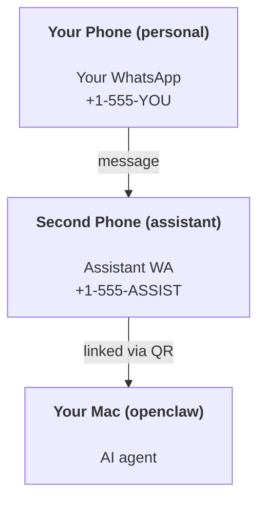

---
read_when:
    - Thiết lập ban đầu cho một phiên bản trợ lý mới
    - Xem xét các tác động về an toàn/phân quyền
summary: Hướng dẫn từ đầu đến cuối về cách chạy OpenClaw như một trợ lý cá nhân, kèm các lưu ý an toàn
title: Thiết lập trợ lý cá nhân
x-i18n:
    generated_at: "2026-05-06T09:30:42Z"
    model: gpt-5.5
    provider: openai
    source_hash: 6fea1194e6b9e8d8816cc712296940487b38faaabea463bd45ba1f37ff52d44d
    source_path: start/openclaw.md
    workflow: 16
---

OpenClaw là một gateway tự lưu trữ kết nối Discord, Google Chat, iMessage, Matrix, Microsoft Teams, Signal, Slack, Telegram, WhatsApp, Zalo và nhiều kênh khác với các tác nhân AI. Hướng dẫn này bao quát thiết lập "trợ lý cá nhân": một số WhatsApp chuyên dụng hoạt động như trợ lý AI luôn bật của bạn.

## ⚠️ An toàn trước tiên

Bạn đang đặt một tác nhân vào vị trí có thể:

- chạy lệnh trên máy của bạn (tùy theo chính sách công cụ của bạn)
- đọc/ghi tệp trong workspace của bạn
- gửi tin nhắn ra ngoài qua WhatsApp/Telegram/Discord/Mattermost và các kênh đi kèm khác

Hãy bắt đầu thận trọng:

- Luôn đặt `channels.whatsapp.allowFrom` (không bao giờ chạy mở cho toàn thế giới trên máy Mac cá nhân của bạn).
- Dùng một số WhatsApp chuyên dụng cho trợ lý.
- Heartbeat hiện mặc định chạy mỗi 30 phút. Tắt cho đến khi bạn tin tưởng thiết lập bằng cách đặt `agents.defaults.heartbeat.every: "0m"`.

## Điều kiện tiên quyết

- Đã cài đặt và onboarding OpenClaw - xem [Bắt đầu](/vi/start/getting-started) nếu bạn chưa làm việc này
- Một số điện thoại thứ hai (SIM/eSIM/trả trước) cho trợ lý

## Thiết lập hai điện thoại (khuyến nghị)

Bạn muốn cấu hình này:



Nếu bạn liên kết WhatsApp cá nhân của mình với OpenClaw, mọi tin nhắn gửi đến bạn đều trở thành "đầu vào tác nhân". Điều đó hiếm khi là điều bạn muốn.

## Bắt đầu nhanh trong 5 phút

1. Ghép nối WhatsApp Web (hiển thị QR; quét bằng điện thoại của trợ lý):

```bash
openclaw channels login
```

2. Khởi động Gateway (để nó tiếp tục chạy):

```bash
openclaw gateway --port 18789
```

3. Đặt cấu hình tối thiểu trong `~/.openclaw/openclaw.json`:

```json5
{
  gateway: { mode: "local" },
  channels: { whatsapp: { allowFrom: ["+15555550123"] } },
}
```

Bây giờ hãy nhắn tin đến số trợ lý từ điện thoại đã được allowlist của bạn.

Khi onboarding hoàn tất, OpenClaw tự động mở dashboard và in ra một liên kết sạch (không chứa token). Nếu dashboard yêu cầu xác thực, hãy dán shared secret đã cấu hình vào phần cài đặt Control UI. Onboarding mặc định dùng token (`gateway.auth.token`), nhưng xác thực bằng mật khẩu cũng hoạt động nếu bạn đã chuyển `gateway.auth.mode` sang `password`. Để mở lại sau: `openclaw dashboard`.

## Cấp workspace cho tác nhân (AGENTS)

OpenClaw đọc hướng dẫn vận hành và "bộ nhớ" từ thư mục workspace của nó.

Theo mặc định, OpenClaw dùng `~/.openclaw/workspace` làm workspace của tác nhân, và sẽ tự động tạo thư mục đó (cùng các tệp khởi đầu `AGENTS.md`, `SOUL.md`, `TOOLS.md`, `IDENTITY.md`, `USER.md`, `HEARTBEAT.md`) khi thiết lập/lần chạy tác nhân đầu tiên. `BOOTSTRAP.md` chỉ được tạo khi workspace hoàn toàn mới (nó không nên xuất hiện lại sau khi bạn xóa). `MEMORY.md` là tùy chọn (không tự động tạo); khi có mặt, nó được tải cho các phiên thông thường. Các phiên subagent chỉ chèn `AGENTS.md` và `TOOLS.md`.

<Tip>
Hãy xem thư mục này như bộ nhớ của OpenClaw và biến nó thành một repo git (lý tưởng là riêng tư) để `AGENTS.md` và các tệp bộ nhớ của bạn được sao lưu. Nếu đã cài git, các workspace hoàn toàn mới sẽ được tự động khởi tạo.
</Tip>

```bash
openclaw setup
```

Bố cục workspace đầy đủ + hướng dẫn sao lưu: [Workspace của tác nhân](/vi/concepts/agent-workspace)
Quy trình bộ nhớ: [Bộ nhớ](/vi/concepts/memory)

Tùy chọn: chọn workspace khác bằng `agents.defaults.workspace` (hỗ trợ `~`).

```json5
{
  agents: {
    defaults: {
      workspace: "~/.openclaw/workspace",
    },
  },
}
```

Nếu bạn đã cung cấp các tệp workspace của riêng mình từ một repo, bạn có thể tắt hoàn toàn việc tạo tệp bootstrap:

```json5
{
  agents: {
    defaults: {
      skipBootstrap: true,
    },
  },
}
```

## Cấu hình biến nó thành "một trợ lý"

OpenClaw mặc định có một thiết lập trợ lý tốt, nhưng bạn thường sẽ muốn tinh chỉnh:

- persona/hướng dẫn trong [`SOUL.md`](/vi/concepts/soul)
- mặc định suy nghĩ (nếu muốn)
- heartbeat (khi bạn đã tin tưởng nó)

Ví dụ:

```json5
{
  logging: { level: "info" },
  agent: {
    model: "anthropic/claude-opus-4-6",
    workspace: "~/.openclaw/workspace",
    thinkingDefault: "high",
    timeoutSeconds: 1800,
    // Start with 0; enable later.
    heartbeat: { every: "0m" },
  },
  channels: {
    whatsapp: {
      allowFrom: ["+15555550123"],
      groups: {
        "*": { requireMention: true },
      },
    },
  },
  routing: {
    groupChat: {
      mentionPatterns: ["@openclaw", "openclaw"],
    },
  },
  session: {
    scope: "per-sender",
    resetTriggers: ["/new", "/reset"],
    reset: {
      mode: "daily",
      atHour: 4,
      idleMinutes: 10080,
    },
  },
}
```

## Phiên và bộ nhớ

- Tệp phiên: `~/.openclaw/agents/<agentId>/sessions/{{SessionId}}.jsonl`
- Siêu dữ liệu phiên (mức sử dụng token, route cuối cùng, v.v.): `~/.openclaw/agents/<agentId>/sessions/sessions.json` (cũ: `~/.openclaw/sessions/sessions.json`)
- `/new` hoặc `/reset` bắt đầu một phiên mới cho cuộc trò chuyện đó (có thể cấu hình qua `resetTriggers`). Nếu được gửi riêng lẻ, OpenClaw xác nhận reset mà không gọi mô hình.
- `/compact [instructions]` nén ngữ cảnh phiên và báo cáo ngân sách ngữ cảnh còn lại.

## Heartbeat (chế độ chủ động)

Theo mặc định, OpenClaw chạy một heartbeat mỗi 30 phút với prompt:
`Read HEARTBEAT.md if it exists (workspace context). Follow it strictly. Do not infer or repeat old tasks from prior chats. If nothing needs attention, reply HEARTBEAT_OK.`
Đặt `agents.defaults.heartbeat.every: "0m"` để tắt.

- Nếu `HEARTBEAT.md` tồn tại nhưng về cơ bản là rỗng (chỉ có dòng trống và các tiêu đề markdown như `# Heading`), OpenClaw bỏ qua lần chạy heartbeat để tiết kiệm lệnh gọi API.
- Nếu thiếu tệp, heartbeat vẫn chạy và mô hình quyết định cần làm gì.
- Nếu tác nhân trả lời `HEARTBEAT_OK` (tùy chọn kèm phần đệm ngắn; xem `agents.defaults.heartbeat.ackMaxChars`), OpenClaw sẽ chặn việc gửi đi cho heartbeat đó.
- Theo mặc định, việc gửi heartbeat đến các mục tiêu kiểu DM `user:<id>` được cho phép. Đặt `agents.defaults.heartbeat.directPolicy: "block"` để chặn gửi đến mục tiêu trực tiếp trong khi vẫn giữ các lần chạy heartbeat hoạt động.
- Heartbeat chạy đầy đủ lượt tác nhân - khoảng thời gian ngắn hơn tiêu tốn nhiều token hơn.

```json5
{
  agent: {
    heartbeat: { every: "30m" },
  },
}
```

## Phương tiện vào và ra

Tệp đính kèm gửi vào (hình ảnh/âm thanh/tài liệu) có thể được đưa vào lệnh của bạn qua template:

- `{{MediaPath}}` (đường dẫn tệp tạm cục bộ)
- `{{MediaUrl}}` (pseudo-URL)
- `{{Transcript}}` (nếu đã bật phiên âm âm thanh)

Tệp đính kèm gửi ra từ tác nhân: thêm `MEDIA:<path-or-url>` trên một dòng riêng (không có khoảng trắng). Ví dụ:

```
Here's the screenshot.
MEDIA:https://example.com/screenshot.png
```

OpenClaw trích xuất các dòng này và gửi chúng dưới dạng phương tiện cùng với văn bản.

Hành vi đường dẫn cục bộ tuân theo cùng mô hình tin cậy đọc tệp như tác nhân:

- Nếu `tools.fs.workspaceOnly` là `true`, các đường dẫn cục bộ `MEDIA:` gửi ra vẫn bị giới hạn trong thư mục tạm gốc của OpenClaw, bộ nhớ đệm phương tiện, các đường dẫn workspace của tác nhân và các tệp do sandbox tạo.
- Nếu `tools.fs.workspaceOnly` là `false`, `MEDIA:` gửi ra có thể dùng các tệp cục bộ trên máy chủ mà tác nhân đã được phép đọc.
- Đường dẫn cục bộ có thể là tuyệt đối, tương đối theo workspace, hoặc tương đối theo home với `~/`.
- Gửi tệp cục bộ trên máy chủ vẫn chỉ cho phép phương tiện và các loại tài liệu an toàn (hình ảnh, âm thanh, video, PDF và tài liệu Office). Văn bản thuần và các tệp giống bí mật không được xem là phương tiện có thể gửi.

Điều đó có nghĩa là các hình ảnh/tệp được tạo bên ngoài workspace giờ có thể được gửi khi chính sách fs của bạn đã cho phép các lần đọc đó, mà không mở lại khả năng rò rỉ tệp đính kèm văn bản tùy ý trên máy chủ.

## Danh sách kiểm tra vận hành

```bash
openclaw status          # local status (creds, sessions, queued events)
openclaw status --all    # full diagnosis (read-only, pasteable)
openclaw status --deep   # asks the gateway for a live health probe with channel probes when supported
openclaw health --json   # gateway health snapshot (WS; default can return a fresh cached snapshot)
```

Nhật ký nằm dưới `/tmp/openclaw/` (mặc định: `openclaw-YYYY-MM-DD.log`).

## Các bước tiếp theo

- WebChat: [WebChat](/vi/web/webchat)
- Vận hành Gateway: [Runbook Gateway](/vi/gateway)
- Cron + đánh thức: [Cron jobs](/vi/automation/cron-jobs)
- Ứng dụng đồng hành thanh menu macOS: [Ứng dụng OpenClaw macOS](/vi/platforms/macos)
- Ứng dụng node iOS: [Ứng dụng iOS](/vi/platforms/ios)
- Ứng dụng node Android: [Ứng dụng Android](/vi/platforms/android)
- Trạng thái Windows: [Windows (WSL2)](/vi/platforms/windows)
- Trạng thái Linux: [Ứng dụng Linux](/vi/platforms/linux)
- Bảo mật: [Bảo mật](/vi/gateway/security)

## Liên quan

- [Bắt đầu](/vi/start/getting-started)
- [Thiết lập](/vi/start/setup)
- [Tổng quan kênh](/vi/channels)
