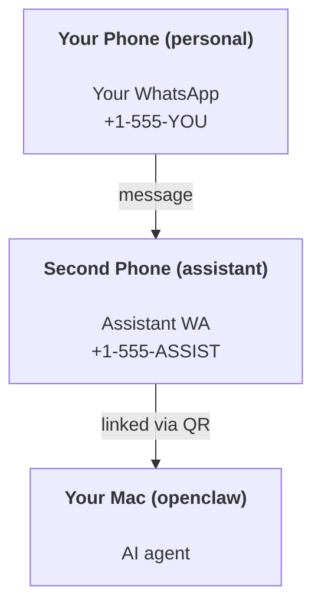

---
read_when:
    - Thiết lập ban đầu cho một thực thể trợ lý mới
    - Đang xem xét các tác động về an toàn/quyền hạn
summary: Hướng dẫn từ đầu đến cuối để chạy OpenClaw như một trợ lý cá nhân, kèm các lưu ý về an toàn
title: Thiết lập trợ lý cá nhân
x-i18n:
    generated_at: "2026-05-11T20:36:30Z"
    model: gpt-5.5
    provider: openai
    source_hash: 74dd13c4b43faa8e29e1fd56a355f36c6cf7c3fa8193bb62c1056211933f4df9
    source_path: start/openclaw.md
    workflow: 16
---

OpenClaw là một Gateway tự lưu trữ kết nối Discord, Google Chat, iMessage, Matrix, Microsoft Teams, Signal, Slack, Telegram, WhatsApp, Zalo và nhiều kênh khác với các tác tử AI. Hướng dẫn này trình bày thiết lập "trợ lý cá nhân": một số WhatsApp riêng hoạt động như trợ lý AI luôn sẵn sàng của bạn.

## ⚠️ An toàn trước tiên

Bạn đang đặt một tác tử vào vị trí có thể:

- chạy lệnh trên máy của bạn (tùy theo chính sách công cụ của bạn)
- đọc/ghi tệp trong không gian làm việc của bạn
- gửi tin nhắn ngược ra ngoài qua WhatsApp/Telegram/Discord/Mattermost và các kênh đi kèm khác

Hãy bắt đầu thận trọng:

- Luôn đặt `channels.whatsapp.allowFrom` (đừng bao giờ chạy ở chế độ mở cho toàn thế giới trên máy Mac cá nhân của bạn).
- Dùng một số WhatsApp riêng cho trợ lý.
- Heartbeat hiện mặc định chạy mỗi 30 phút. Hãy tắt cho đến khi bạn tin tưởng thiết lập bằng cách đặt `agents.defaults.heartbeat.every: "0m"`.

## Điều kiện tiên quyết

- OpenClaw đã được cài đặt và onboarding - xem [Bắt đầu](/vi/start/getting-started) nếu bạn chưa làm việc này
- Một số điện thoại thứ hai (SIM/eSIM/trả trước) cho trợ lý

## Thiết lập hai điện thoại (khuyến nghị)

Bạn muốn mô hình này:



Nếu bạn liên kết WhatsApp cá nhân với OpenClaw, mọi tin nhắn gửi đến bạn đều trở thành "đầu vào của tác tử". Đó hiếm khi là điều bạn muốn.

## Khởi động nhanh trong 5 phút

1. Ghép nối WhatsApp Web (hiển thị QR; quét bằng điện thoại của trợ lý):

```bash
openclaw channels login
```

2. Khởi động Gateway (để Gateway tiếp tục chạy):

```bash
openclaw gateway --port 18789
```

3. Đặt cấu hình tối thiểu trong `~/.openclaw/openclaw.json`:

```json5
{
  gateway: { mode: "local" },
  channels: { whatsapp: { allowFrom: ["+15555550123"] } },
}
```

Bây giờ hãy nhắn tin tới số của trợ lý từ điện thoại nằm trong danh sách cho phép của bạn.

Khi onboarding hoàn tất, OpenClaw tự động mở dashboard và in ra một liên kết sạch (không token hóa). Nếu dashboard yêu cầu xác thực, hãy dán shared secret đã cấu hình vào phần cài đặt Control UI. Onboarding mặc định dùng token (`gateway.auth.token`), nhưng xác thực bằng mật khẩu cũng hoạt động nếu bạn đã chuyển `gateway.auth.mode` sang `password`. Để mở lại sau: `openclaw dashboard`.

## Cấp cho tác tử một không gian làm việc (AGENTS)

OpenClaw đọc hướng dẫn vận hành và "bộ nhớ" từ thư mục không gian làm việc của nó.

Theo mặc định, OpenClaw dùng `~/.openclaw/workspace` làm không gian làm việc của tác tử, và sẽ tự động tạo nó (cùng các tệp khởi đầu `AGENTS.md`, `SOUL.md`, `TOOLS.md`, `IDENTITY.md`, `USER.md`, `HEARTBEAT.md`) khi thiết lập/chạy tác tử lần đầu. `BOOTSTRAP.md` chỉ được tạo khi không gian làm việc hoàn toàn mới (nó không nên xuất hiện lại sau khi bạn xóa). `MEMORY.md` là tùy chọn (không tự động tạo); khi có mặt, nó được tải cho các phiên thông thường. Các phiên tác tử con chỉ chèn `AGENTS.md` và `TOOLS.md`.

<Tip>
Hãy xem thư mục này như bộ nhớ của OpenClaw và biến nó thành một repo git (lý tưởng là riêng tư) để `AGENTS.md` và các tệp bộ nhớ của bạn được sao lưu. Nếu đã cài git, các không gian làm việc hoàn toàn mới sẽ được tự động khởi tạo.
</Tip>

```bash
openclaw setup
```

Bố cục không gian làm việc đầy đủ + hướng dẫn sao lưu: [Không gian làm việc của tác tử](/vi/concepts/agent-workspace)
Quy trình bộ nhớ: [Bộ nhớ](/vi/concepts/memory)

Tùy chọn: chọn một không gian làm việc khác bằng `agents.defaults.workspace` (hỗ trợ `~`).

```json5
{
  agents: {
    defaults: {
      workspace: "~/.openclaw/workspace",
    },
  },
}
```

Nếu bạn đã cung cấp các tệp không gian làm việc riêng từ một repo, bạn có thể tắt hoàn toàn việc tạo tệp bootstrap:

```json5
{
  agents: {
    defaults: {
      skipBootstrap: true,
    },
  },
}
```

## Cấu hình biến nó thành "một trợ lý"

OpenClaw mặc định là một thiết lập trợ lý tốt, nhưng bạn thường sẽ muốn tinh chỉnh:

- persona/hướng dẫn trong [`SOUL.md`](/vi/concepts/soul)
- mặc định suy nghĩ (nếu muốn)
- Heartbeat (khi bạn đã tin tưởng nó)

Ví dụ:

```json5
{
  logging: { level: "info" },
  agents: {
    defaults: {
      model: { primary: "anthropic/claude-opus-4-6" },
      workspace: "~/.openclaw/workspace",
      thinkingDefault: "high",
      timeoutSeconds: 1800,
      // Start with 0; enable later.
      heartbeat: { every: "0m" },
    },
    list: [
      {
        id: "main",
        default: true,
        groupChat: {
          mentionPatterns: ["@openclaw", "openclaw"],
        },
      },
    ],
  },
  channels: {
    whatsapp: {
      allowFrom: ["+15555550123"],
      groups: {
        "*": { requireMention: true },
      },
    },
  },
  session: {
    scope: "per-sender",
    resetTriggers: ["/new", "/reset"],
    reset: {
      mode: "daily",
      atHour: 4,
      idleMinutes: 10080,
    },
  },
}
```

## Phiên và bộ nhớ

- Tệp phiên: `~/.openclaw/agents/<agentId>/sessions/{{SessionId}}.jsonl`
- Siêu dữ liệu phiên (mức sử dụng token, tuyến gần nhất, v.v.): `~/.openclaw/agents/<agentId>/sessions/sessions.json` (cũ: `~/.openclaw/sessions/sessions.json`)
- `/new` hoặc `/reset` bắt đầu một phiên mới cho cuộc trò chuyện đó (có thể cấu hình qua `resetTriggers`). Nếu được gửi riêng lẻ, OpenClaw xác nhận việc đặt lại mà không gọi mô hình.
- `/compact [instructions]` nén ngữ cảnh phiên và báo cáo ngân sách ngữ cảnh còn lại.

## Heartbeat (chế độ chủ động)

Theo mặc định, OpenClaw chạy Heartbeat mỗi 30 phút với prompt:
`Read HEARTBEAT.md if it exists (workspace context). Follow it strictly. Do not infer or repeat old tasks from prior chats. If nothing needs attention, reply HEARTBEAT_OK.`
Đặt `agents.defaults.heartbeat.every: "0m"` để tắt.

- Nếu `HEARTBEAT.md` tồn tại nhưng về cơ bản trống (chỉ có dòng trống và tiêu đề markdown như `# Heading`), OpenClaw bỏ qua lượt chạy Heartbeat để tiết kiệm lệnh gọi API.
- Nếu thiếu tệp, Heartbeat vẫn chạy và mô hình quyết định cần làm gì.
- Nếu tác tử trả lời bằng `HEARTBEAT_OK` (tùy chọn kèm phần đệm ngắn; xem `agents.defaults.heartbeat.ackMaxChars`), OpenClaw sẽ chặn việc gửi ra ngoài cho Heartbeat đó.
- Theo mặc định, việc gửi Heartbeat tới các mục tiêu kiểu DM `user:<id>` được cho phép. Đặt `agents.defaults.heartbeat.directPolicy: "block"` để chặn gửi tới mục tiêu trực tiếp trong khi vẫn giữ các lượt chạy Heartbeat hoạt động.
- Heartbeat chạy trọn lượt tác tử - khoảng thời gian ngắn hơn sẽ tiêu tốn nhiều token hơn.

```json5
{
  agents: {
    defaults: {
      heartbeat: { every: "30m" },
    },
  },
}
```

## Phương tiện vào và ra

Tệp đính kèm đầu vào (hình ảnh/âm thanh/tài liệu) có thể được đưa vào lệnh của bạn qua template:

- `{{MediaPath}}` (đường dẫn tệp tạm cục bộ)
- `{{MediaUrl}}` (pseudo-URL)
- `{{Transcript}}` (nếu đã bật phiên âm âm thanh)

Tệp đính kèm đầu ra từ tác tử: đặt `MEDIA:<path-or-url>` trên một dòng riêng (không có khoảng trắng). Ví dụ:

```
Here's the screenshot.
MEDIA:https://example.com/screenshot.png
```

OpenClaw trích xuất các dòng này và gửi chúng dưới dạng phương tiện kèm theo văn bản.

Hành vi đường dẫn cục bộ tuân theo cùng mô hình tin cậy đọc tệp như tác tử:

- Nếu `tools.fs.workspaceOnly` là `true`, các đường dẫn cục bộ `MEDIA:` đầu ra vẫn bị giới hạn trong thư mục gốc tạm của OpenClaw, bộ nhớ đệm phương tiện, đường dẫn không gian làm việc của tác tử, và các tệp do sandbox tạo.
- Nếu `tools.fs.workspaceOnly` là `false`, `MEDIA:` đầu ra có thể dùng các tệp cục bộ trên máy chủ mà tác tử đã được phép đọc.
- Đường dẫn cục bộ có thể là tuyệt đối, tương đối với không gian làm việc, hoặc tương đối với thư mục home bằng `~/`.
- Gửi từ máy chủ cục bộ vẫn chỉ cho phép phương tiện và các loại tài liệu an toàn (hình ảnh, âm thanh, video, PDF và tài liệu Office). Văn bản thuần và các tệp có vẻ giống bí mật không được xem là phương tiện có thể gửi.

Điều đó nghĩa là hình ảnh/tệp được tạo bên ngoài không gian làm việc hiện có thể được gửi khi chính sách fs của bạn đã cho phép các lượt đọc đó, mà không mở lại khả năng rò rỉ tệp đính kèm văn bản tùy ý trên máy chủ.

## Danh sách kiểm tra vận hành

```bash
openclaw status          # local status (creds, sessions, queued events)
openclaw status --all    # full diagnosis (read-only, pasteable)
openclaw status --deep   # asks the gateway for a live health probe with channel probes when supported
openclaw health --json   # gateway health snapshot (WS; default can return a fresh cached snapshot)
```

Nhật ký nằm dưới `/tmp/openclaw/` (mặc định: `openclaw-YYYY-MM-DD.log`).

## Bước tiếp theo

- WebChat: [WebChat](/vi/web/webchat)
- Vận hành Gateway: [Runbook Gateway](/vi/gateway)
- Cron + đánh thức: [Tác vụ Cron](/vi/automation/cron-jobs)
- Ứng dụng đồng hành trên thanh menu macOS: [Ứng dụng OpenClaw macOS](/vi/platforms/macos)
- Ứng dụng nút iOS: [Ứng dụng iOS](/vi/platforms/ios)
- Ứng dụng nút Android: [Ứng dụng Android](/vi/platforms/android)
- Trạng thái Windows: [Windows (WSL2)](/vi/platforms/windows)
- Trạng thái Linux: [Ứng dụng Linux](/vi/platforms/linux)
- Bảo mật: [Bảo mật](/vi/gateway/security)

## Liên quan

- [Bắt đầu](/vi/start/getting-started)
- [Thiết lập](/vi/start/setup)
- [Tổng quan về kênh](/vi/channels)
