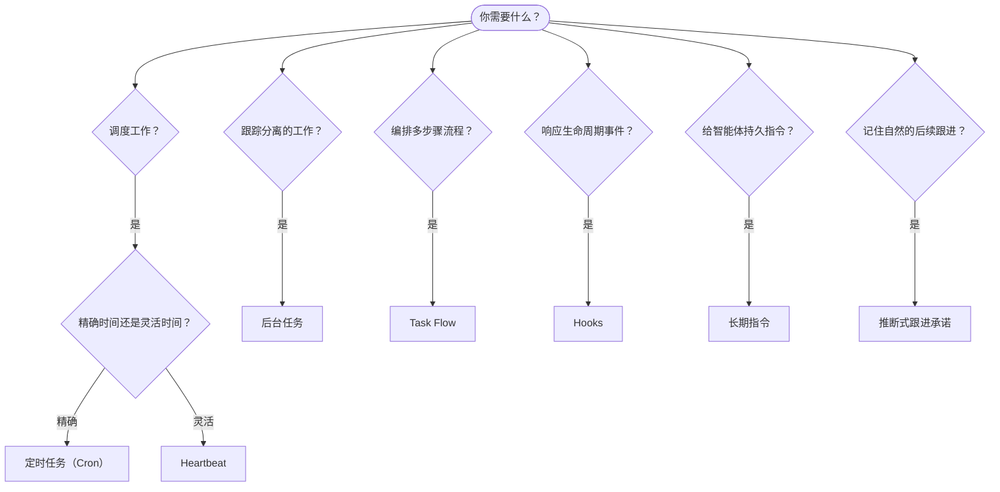

OpenClaw 通过任务、定时作业、推断式跟进承诺、事件钩子和长期指令在后台运行工作。使用此页面选择合适的机制。

## 快速决策指南

| 使用场景                                | 推荐                   | 原因                                             |
| --------------------------------------- | ---------------------- | ------------------------------------------------ |
| 每天上午 9 点整发送日报                 | 定时任务（Cron）       | 精确时间，隔离执行                               |
| 20 分钟后提醒我                         | 定时任务（Cron）       | 使用精确时间的一次性任务（`--at`）               |
| 运行每周深度分析                        | 定时任务（Cron）       | 独立任务，可使用不同模型                         |
| 每 30 分钟检查收件箱                    | Heartbeat              | 与其他检查批处理，感知上下文                     |
| 监控日历中的即将发生事件                | Heartbeat              | 自然适合周期性感知                               |
| 在提到的面试后跟进检查                  | 推断式跟进承诺         | 类似记忆的后续跟进，没有明确提醒请求             |
| 基于用户上下文的温和关怀跟进            | 推断式跟进承诺         | 限定在同一个智能体和渠道                         |
| 检查子智能体或 ACP 运行的状态           | 后台任务               | 任务账本跟踪所有分离的工作                       |
| 审计运行了什么以及何时运行              | 后台任务               | `openclaw tasks list` 和 `openclaw tasks audit`  |
| 多步骤研究后总结                        | Task Flow              | 带修订跟踪的持久编排                             |
| 在会话重置时运行脚本                    | Hooks                  | 事件驱动，在生命周期事件触发                     |
| 在每次工具调用时执行代码                | 插件钩子               | 进程内钩子可拦截工具调用                         |
| 回复前始终检查合规性                    | 长期指令               | 自动注入每个会话                                 |

### 定时任务（Cron）与 Heartbeat 对比

| 维度            | 定时任务（Cron）                    | Heartbeat                             |
| --------------- | ----------------------------------- | ------------------------------------- |
| 时间            | 精确（cron 表达式、一次性任务）     | 近似（默认每 30 分钟）                |
| 会话上下文      | 全新（隔离）或共享                  | 完整主会话上下文                      |
| 任务记录        | 始终创建                            | 从不创建                              |
| 交付            | 渠道、webhook 或静默                | 主会话内联                            |
| 最适合          | 报告、提醒、后台作业                | 收件箱检查、日历、通知                |

当你需要精确时间或隔离执行时，请使用定时任务（Cron）。当工作受益于完整会话上下文且近似时间即可时，请使用 Heartbeat。

## 核心概念

### 定时任务（cron）

Cron 是 Gateway 网关内置的精确时间调度器。它会持久化作业，在正确时间唤醒智能体，并可将输出交付到聊天渠道或 webhook 端点。支持一次性提醒、重复表达式和入站 webhook 触发器。

参见 [定时任务](/zh-CN/automation/cron-jobs)。

### 任务

后台任务账本跟踪所有分离的工作：ACP 运行、子智能体生成、隔离的 cron 执行和 CLI 操作。任务是记录，不是调度器。使用 `openclaw tasks list` 和 `openclaw tasks audit` 查看它们。

参见 [后台任务](/zh-CN/automation/tasks)。

### 推断式跟进承诺

跟进承诺是可选启用的短期后续跟进记忆。OpenClaw 会从普通对话中推断它们，将它们限定到同一个智能体和渠道，并通过 Heartbeat 交付到期跟进检查。用户明确请求的精确提醒仍属于 cron。

参见 [推断式跟进承诺](/zh-CN/concepts/commitments)。

### Task Flow

Task Flow 是位于后台任务之上的流程编排基底。它通过托管和镜像同步模式、修订跟踪以及用于检查的 `openclaw tasks flow list|show|cancel` 管理持久多步骤流程。

参见 [Task Flow](/zh-CN/automation/taskflow)。

### 长期指令

长期指令授予智能体针对已定义程序的永久操作权限。它们位于工作区文件中（通常是 `AGENTS.md`），并被注入到每个会话。与 cron 结合用于基于时间的强制执行。

参见 [长期指令](/zh-CN/automation/standing-orders)。

### Hooks

内部钩子是由智能体生命周期事件（`/new`、`/reset`、`/stop`）、会话压缩、Gateway 网关启动和消息流触发的事件驱动脚本。它们从钩子目录中发现，并通过 `openclaw hooks` 管理。对于进程内工具调用拦截，请使用 [插件钩子](/zh-CN/plugins/hooks)。

参见 [Hooks](/zh-CN/automation/hooks)。

### Heartbeat

Heartbeat 是周期性主会话轮次（默认每 30 分钟）。它在一个具有完整会话上下文的智能体轮次中批处理多个检查（收件箱、日历、通知）。Heartbeat 轮次不会创建任务记录，也不会延长每日/空闲会话重置的新鲜度。使用 `HEARTBEAT.md` 编写一个小型检查清单，或者在你想在 Heartbeat 本身内部执行仅到期的周期性检查时使用 `tasks:` 块。空 Heartbeat 文件会以 `empty-heartbeat-file` 跳过；仅到期任务模式会以 `no-tasks-due` 跳过。当 cron 工作处于活动或排队状态时，Heartbeat 会延后；`heartbeat.skipWhenBusy` 也可以在同一智能体的会话键控子智能体或嵌套通道忙碌时延后该智能体。

参见 [Heartbeat](/zh-CN/gateway/heartbeat)。

## 它们如何协同工作

- **Cron** 处理精确日程（日报、周报）和一次性提醒。所有 cron 执行都会创建任务记录。
- **Heartbeat** 在每 30 分钟的一个批处理轮次中处理例行监控（收件箱、日历、通知）。
- **Hooks** 使用自定义脚本响应特定事件（会话重置、压缩、消息流）。插件钩子覆盖工具调用。
- **长期指令** 为智能体提供持久上下文和权限边界。
- **Task Flow** 在单个任务之上协调多步骤流程。
- **任务** 自动跟踪所有分离的工作，因此你可以检查和审计它。

## 相关

- [定时任务](/zh-CN/automation/cron-jobs) — 精确调度和一次性提醒
- [推断式跟进承诺](/zh-CN/concepts/commitments) — 类似记忆的后续跟进检查
- [后台任务](/zh-CN/automation/tasks) — 用于所有分离工作的任务账本
- [Task Flow](/zh-CN/automation/taskflow) — 持久多步骤流程编排
- [Hooks](/zh-CN/automation/hooks) — 事件驱动的生命周期脚本
- [插件钩子](/zh-CN/plugins/hooks) — 进程内工具、提示词、消息和生命周期钩子
- [长期指令](/zh-CN/automation/standing-orders) — 持久智能体指令
- [Heartbeat](/zh-CN/gateway/heartbeat) — 周期性主会话轮次
- [配置参考](/zh-CN/gateway/configuration-reference) — 所有配置键
