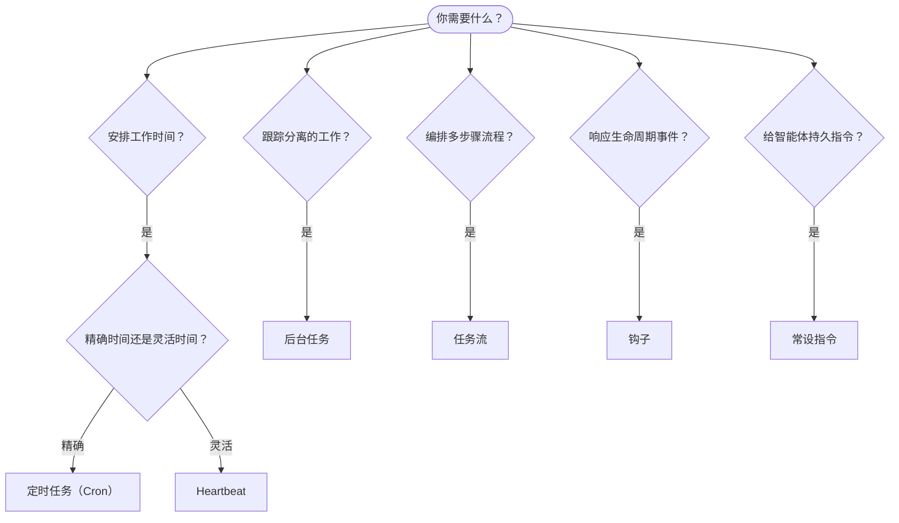

---
read_when:
    - 决定如何使用 OpenClaw 自动化工作
    - 在 heartbeat、cron、钩子和常设指令之间进行选择
    - 寻找合适的自动化入口点
summary: 自动化机制概览：任务、cron、钩子、常设指令和任务流
title: 自动化与任务
x-i18n:
    generated_at: "2026-04-26T01:45:57Z"
    model: gpt-5.4
    provider: openai
    source_hash: 6d2a2d3ef58830133e07b34f33c611664fc1032247e9dd81005adf7fc0c43cdb
    source_path: automation/index.md
    workflow: 15
---

OpenClaw 通过任务、定时作业、事件钩子和常设指令在后台运行工作。本页将帮助你选择合适的机制，并理解它们如何协同工作。

## 快速决策指南

| 用例 | 推荐方案 | 原因 |
| --------------------------------------- | ---------------------- | ------------------------------------------------ |
| 每天早上 9 点准时发送日报 | 定时任务（Cron） | 时间精确，执行隔离 |
| 20 分钟后提醒我 | 定时任务（Cron） | 一次性任务，时间精确（`--at`） |
| 每周运行一次深度分析 | 定时任务（Cron） | 独立任务，可使用不同模型 |
| 每 30 分钟检查一次收件箱 | Heartbeat | 与其他检查批量处理，具备上下文感知 |
| 监控日历中的即将到来事件 | Heartbeat | 非常适合周期性感知 |
| 检查子智能体或 ACP 运行的状态 | 后台任务 | 任务台账会跟踪所有分离工作 |
| 审计运行了什么以及何时运行 | 后台任务 | `openclaw tasks list` 和 `openclaw tasks audit` |
| 先进行多步骤研究再总结 | 任务流 | 具备修订跟踪的持久化编排 |
| 在会话重置时运行脚本 | 钩子 | 事件驱动，在生命周期事件上触发 |
| 在每次工具调用时执行代码 | 插件钩子 | 进程内钩子可拦截工具调用 |
| 回复前始终检查合规性 | 常设指令 | 自动注入到每个会话中 |

### 定时任务（Cron）与 Heartbeat 的区别

| 维度 | 定时任务（Cron） | Heartbeat |
| --------------- | ----------------------------------- | ------------------------------------- |
| 时间安排 | 精确（cron 表达式、一次性） | 近似（默认每 30 分钟） |
| 会话上下文 | 全新（隔离）或共享 | 完整的主会话上下文 |
| 任务记录 | 始终创建 | 从不创建 |
| 结果投递 | 渠道、webhook 或静默 | 在主会话中内联显示 |
| 最适合 | 报告、提醒、后台作业 | 收件箱检查、日历、通知 |

当你需要精确定时或隔离执行时，使用定时任务（Cron）。当工作受益于完整会话上下文，且近似时间安排即可时，使用 Heartbeat。

## 核心概念

### 定时任务（cron）

Cron 是 Gateway 网关内置的精确定时调度器。它会持久化作业，在合适时间唤醒智能体，并可将输出投递到聊天渠道或 webhook 端点。支持一次性提醒、周期性表达式和入站 webhook 触发器。

参见 [定时任务](/zh-CN/automation/cron-jobs)。

### 任务

后台任务台账会跟踪所有分离工作：ACP 运行、子智能体生成、隔离的 cron 执行以及 CLI 操作。任务是记录，而不是调度器。使用 `openclaw tasks list` 和 `openclaw tasks audit` 进行查看。

参见 [后台任务](/zh-CN/automation/tasks)。

### 任务流

任务流是位于后台任务之上的流程编排基础层。它通过托管和镜像同步模式、修订跟踪，以及 `openclaw tasks flow list|show|cancel` 检查命令，来管理持久化的多步骤流程。

参见 [任务流](/zh-CN/automation/taskflow)。

### 常设指令

常设指令为已定义程序授予智能体永久性的操作权限。它们保存在工作区文件中（通常是 `AGENTS.md`），并注入到每个会话中。可与 cron 结合，以实现基于时间的执行约束。

参见 [常设指令](/zh-CN/automation/standing-orders)。

### 钩子

内部钩子是由智能体生命周期事件
（`/new`、`/reset`、`/stop`）、会话压缩、Gateway 网关启动以及消息流触发的事件驱动脚本。系统会自动从目录中发现它们，并可通过 `openclaw hooks` 进行管理。对于进程内的工具调用拦截，请使用
[插件钩子](/zh-CN/plugins/hooks)。

参见 [钩子](/zh-CN/automation/hooks)。

### Heartbeat

Heartbeat 是周期性的主会话轮次（默认每 30 分钟一次）。它会在一次智能体轮次中，结合完整会话上下文，批量执行多个检查（收件箱、日历、通知）。Heartbeat 轮次不会创建任务记录，也不会延长每日/空闲会话重置的新鲜度。使用 `HEARTBEAT.md` 可编写简短检查清单；如果你希望在 heartbeat 内部执行仅在到期时运行的周期性检查，可使用 `tasks:` 代码块。空的 heartbeat 文件会以 `empty-heartbeat-file` 跳过；仅到期任务模式会以 `no-tasks-due` 跳过。

参见 [Heartbeat](/zh-CN/gateway/heartbeat)。

## 它们如何协同工作

- **Cron** 处理精确定时安排（日报、每周回顾）和一次性提醒。所有 cron 执行都会创建任务记录。
- **Heartbeat** 每 30 分钟在一次批处理轮次中处理常规监控（收件箱、日历、通知）。
- **钩子** 响应特定事件（会话重置、压缩、消息流），运行自定义脚本。插件钩子负责工具调用。
- **常设指令** 为智能体提供持久上下文和权限边界。
- **任务流** 在单个任务之上协调多步骤流程。
- **任务** 会自动跟踪所有分离工作，便于你检查和审计。

## 相关内容

- [定时任务](/zh-CN/automation/cron-jobs) — 精确定时安排和一次性提醒
- [后台任务](/zh-CN/automation/tasks) — 所有分离工作的任务台账
- [任务流](/zh-CN/automation/taskflow) — 持久化的多步骤流程编排
- [钩子](/zh-CN/automation/hooks) — 事件驱动的生命周期脚本
- [插件钩子](/zh-CN/plugins/hooks) — 进程内工具、提示词、消息和生命周期钩子
- [常设指令](/zh-CN/automation/standing-orders) — 持久化智能体指令
- [Heartbeat](/zh-CN/gateway/heartbeat) — 周期性的主会话轮次
- [配置参考](/zh-CN/gateway/configuration-reference) — 所有配置键
