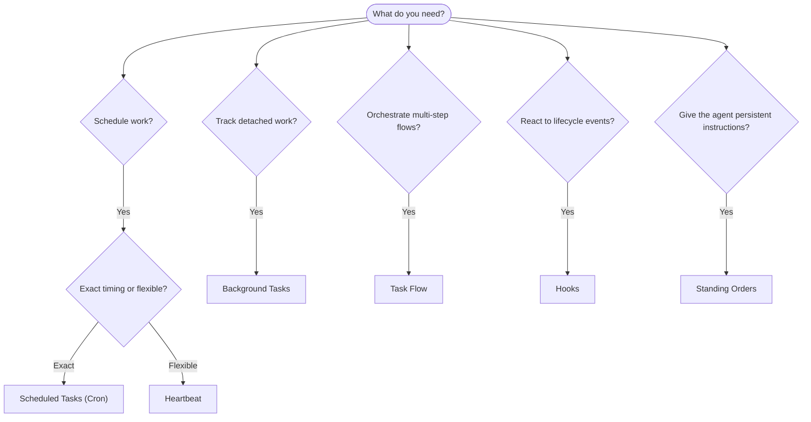

---
read_when:
    - 决定如何使用 OpenClaw 自动化工作
    - 在 heartbeat、cron、Hooks 和 standing orders 之间做出选择
    - 寻找合适的自动化入口点
summary: 自动化机制概览：任务、cron、Hooks、standing orders 和 Task Flow
title: 自动化与任务
x-i18n:
    generated_at: "2026-04-05T08:13:02Z"
    model: gpt-5.4
    provider: openai
    source_hash: 13cd05dcd2f38737f7bb19243ad1136978bfd727006fd65226daa3590f823afe
    source_path: automation/index.md
    workflow: 15
---

# 自动化与任务

OpenClaw 通过任务、定时作业、事件 Hooks 和长期指令在后台运行工作。此页面可帮助你选择合适的机制，并理解它们如何协同工作。

## 快速决策指南

| 使用场景 | 推荐方式 | 原因 |
| --------------------------------------- | ---------------------- | ------------------------------------------------ |
| 在上午 9 点准时发送每日报告 | 定时任务（Cron） | 精确计时，隔离执行 |
| 20 分钟后提醒我 | 定时任务（Cron） | 一次性任务，时间精确（`--at`） |
| 每周运行一次深度分析 | 定时任务（Cron） | 独立任务，可使用不同模型 |
| 每 30 分钟检查一次收件箱 | Heartbeat | 与其他检查批处理，具备上下文感知 |
| 监控日历中的即将发生事件 | Heartbeat | 非常适合周期性感知 |
| 检查子智能体或 ACP 运行的状态 | 后台任务 | 任务台账会跟踪所有分离的工作 |
| 审计运行了什么以及运行时间 | 后台任务 | `openclaw tasks list` 和 `openclaw tasks audit` |
| 进行多步骤研究后再总结 | Task Flow | 具有修订跟踪的持久化编排 |
| 在会话重置时运行脚本 | Hooks | 事件驱动，在生命周期事件上触发 |
| 在每次工具调用时执行代码 | Hooks | Hooks 可按事件类型过滤 |
| 在回复前始终检查合规性 | standing orders | 自动注入到每个会话中 |

### 定时任务（Cron）与 Heartbeat

| 维度 | 定时任务（Cron） | Heartbeat |
| --------------- | ----------------------------------- | ------------------------------------- |
| 时间控制 | 精确（cron 表达式、一次性任务） | 近似（默认每 30 分钟一次） |
| 会话上下文 | 全新（隔离）或共享 | 完整的主会话上下文 |
| 任务记录 | 总是创建 | 从不创建 |
| 传递方式 | 渠道、webhook 或静默 | 以内联方式出现在主会话中 |
| 最适合 | 报告、提醒、后台作业 | 收件箱检查、日历、通知 |

当你需要精确时间控制或隔离执行时，请使用定时任务（Cron）。当任务受益于完整会话上下文且可以接受近似时间控制时，请使用 Heartbeat。

## 核心概念

### 定时任务（cron）

Cron 是 Gateway 网关的内置调度器，用于精确时间控制。它会持久化作业，在正确的时间唤醒智能体，并可将输出发送到聊天渠道或 webhook 端点。支持一次性提醒、周期性表达式以及入站 webhook 触发器。

请参见 [定时任务](/automation/cron-jobs)。

### 任务

后台任务台账会跟踪所有分离的工作：ACP 运行、子智能体派生、隔离的 cron 执行以及 CLI 操作。任务是记录，不是调度器。使用 `openclaw tasks list` 和 `openclaw tasks audit` 进行检查。

请参见 [后台任务](/automation/tasks)。

### Task Flow

Task Flow 是位于后台任务之上的流程编排基础层。它通过托管和镜像同步模式、修订跟踪以及 `openclaw tasks flow list|show|cancel` 检查命令来管理持久化的多步骤流程。

请参见 [Task Flow](/automation/taskflow)。

### standing orders

standing orders 为已定义的程序授予智能体永久操作权限。它们保存在工作区文件中（通常为 `AGENTS.md`），并会注入到每个会话中。可结合 cron 进行基于时间的强制执行。

请参见 [Standing Orders](/automation/standing-orders)。

### Hooks

Hooks 是由智能体生命周期事件（`/new`、`/reset`、`/stop`）、会话压缩、Gateway 网关启动、消息流和工具调用触发的事件驱动脚本。Hooks 会从目录中自动发现，也可通过 `openclaw hooks` 管理。

请参见 [Hooks](/automation/hooks)。

### Heartbeat

Heartbeat 是周期性的主会话轮次（默认每 30 分钟一次）。它会在单次智能体轮次中，结合完整会话上下文批量执行多项检查（收件箱、日历、通知）。Heartbeat 轮次不会创建任务记录。你可以使用 `HEARTBEAT.md` 编写一个简短检查清单，或在希望仅在到期时于 heartbeat 内执行周期性检查时使用 `tasks:` 代码块。空的 heartbeat 文件会以 `empty-heartbeat-file` 跳过；仅到期任务模式会以 `no-tasks-due` 跳过。

请参见 [Heartbeat](/gateway/heartbeat)。

## 它们如何协同工作

- **Cron** 处理精确定时计划（每日报告、每周回顾）和一次性提醒。所有 cron 执行都会创建任务记录。
- **Heartbeat** 每 30 分钟以一次批处理轮次处理例行监控（收件箱、日历、通知）。
- **Hooks** 通过自定义脚本响应特定事件（工具调用、会话重置、压缩）。
- **standing orders** 为智能体提供持久上下文和权限边界。
- **Task Flow** 在单个任务之上协调多步骤流程。
- **任务** 会自动跟踪所有分离的工作，便于你检查和审计。

## 相关内容

- [定时任务](/automation/cron-jobs) — 精确定时和一次性提醒
- [后台任务](/automation/tasks) — 所有分离工作的任务台账
- [Task Flow](/automation/taskflow) — 持久化的多步骤流程编排
- [Hooks](/automation/hooks) — 事件驱动的生命周期脚本
- [Standing Orders](/automation/standing-orders) — 持久化的智能体指令
- [Heartbeat](/gateway/heartbeat) — 周期性的主会话轮次
- [配置参考](/gateway/configuration-reference) — 所有配置键
