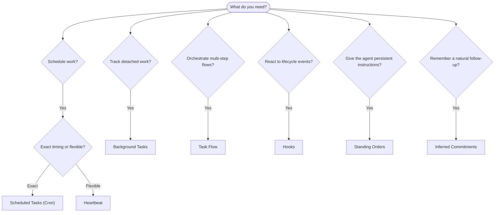

---
read_when:
    - 决定如何使用 OpenClaw 自动化工作
    - 在 Heartbeat、cron、跟进承诺、钩子和常驻指令之间选择
    - 寻找合适的自动化入口点
summary: 自动化机制概览：任务、cron、钩子、常设指令和任务流
title: 自动化与任务
x-i18n:
    generated_at: "2026-04-29T21:36:54Z"
    model: gpt-5.5
    provider: openai
    source_hash: a2465c39f21db8bcb98f980a2c4b2c03018dddd5f43de59d8bf6ce0d6e97d9ef
    source_path: automation/index.md
    workflow: 16
---

OpenClaw 通过任务、定时任务、推断式跟进承诺、事件钩子和长期指令在后台运行工作。本页帮助你选择合适的机制，并理解它们如何协同工作。

## 快速决策指南

| 使用场景                                | 推荐方式               | 原因                                             |
| --------------------------------------- | ---------------------- | ------------------------------------------------ |
| 在上午 9 点准时发送日报                 | 定时任务（Cron）       | 精确时间，隔离执行                               |
| 20 分钟后提醒我                         | 定时任务（Cron）       | 使用精确时间的一次性任务（`--at`）              |
| 每周运行深度分析                        | 定时任务（Cron）       | 独立任务，可使用不同模型                         |
| 每 30 分钟检查收件箱                    | Heartbeat              | 与其他检查批量执行，具备上下文感知               |
| 监控日历中的即将到来的事件              | Heartbeat              | 非常适合周期性感知                               |
| 在提到的面试后跟进                      | 推断式跟进承诺         | 类似记忆的跟进，不是明确的提醒请求               |
| 基于用户上下文进行温和关怀式问候        | 推断式跟进承诺         | 限定在同一智能体和渠道内                         |
| 检查子智能体或 ACP 运行的状态           | 后台任务               | 任务台账会跟踪所有脱离主流程的工作               |
| 审计运行过的内容和时间                  | 后台任务               | `openclaw tasks list` 和 `openclaw tasks audit` |
| 多步研究后再总结                        | Task Flow              | 带修订跟踪的持久编排                             |
| 在会话重置时运行脚本                    | 钩子                   | 事件驱动，在生命周期事件触发                     |
| 每次工具调用时执行代码                  | 插件钩子               | 进程内钩子可以拦截工具调用                       |
| 回复前始终检查合规性                    | 长期指令               | 自动注入到每个会话中                             |

### 定时任务（Cron）与 Heartbeat

| 维度       | 定时任务（Cron）                    | Heartbeat                             |
| ---------- | ----------------------------------- | ------------------------------------- |
| 时间       | 精确（cron 表达式、一次性任务）     | 近似（默认每 30 分钟）                |
| 会话上下文 | 全新（隔离）或共享                  | 完整主会话上下文                      |
| 任务记录   | 始终创建                            | 从不创建                              |
| 投递       | 渠道、webhook 或静默                | 在主会话中内联                        |
| 最适合     | 报告、提醒、后台作业                | 收件箱检查、日历、通知                |

当你需要精确时间或隔离执行时，使用定时任务（Cron）。当工作受益于完整会话上下文且近似时间即可时，使用 Heartbeat。

## 核心概念

### 定时任务（cron）

Cron 是 Gateway 网关内置的精确定时调度器。它会持久化作业，在正确时间唤醒智能体，并可将输出投递到聊天渠道或 webhook 端点。支持一次性提醒、重复表达式和入站 webhook 触发器。

参见[定时任务](/zh-CN/automation/cron-jobs)。

### 任务

后台任务台账会跟踪所有脱离主流程的工作：ACP 运行、子智能体启动、隔离 cron 执行和 CLI 操作。任务是记录，不是调度器。使用 `openclaw tasks list` 和 `openclaw tasks audit` 检查它们。

参见[后台任务](/zh-CN/automation/tasks)。

### 推断式跟进承诺

跟进承诺是可选择启用的短期跟进记忆。OpenClaw 会从普通对话中推断它们，将其限定到同一智能体和渠道，并通过 Heartbeat 投递到期的问候。用户明确请求的精确提醒仍应由 cron 处理。

参见[推断式跟进承诺](/zh-CN/concepts/commitments)。

### Task Flow

Task Flow 是后台任务之上的流程编排基底。它通过托管和镜像同步模式、修订跟踪，以及用于检查的 `openclaw tasks flow list|show|cancel`，管理持久的多步流程。

参见 [Task Flow](/zh-CN/automation/taskflow)。

### 长期指令

长期指令为智能体授予针对已定义程序的永久操作权限。它们存放在工作区文件中（通常是 `AGENTS.md`），并会注入到每个会话中。可与 cron 结合使用，以实现基于时间的强制执行。

参见[长期指令](/zh-CN/automation/standing-orders)。

### 钩子

内部钩子是由智能体生命周期事件（`/new`、`/reset`、`/stop`）、会话压缩、Gateway 网关启动和消息流触发的事件驱动脚本。它们会从目录中自动发现，并可通过 `openclaw hooks` 管理。对于进程内工具调用拦截，请使用[插件钩子](/zh-CN/plugins/hooks)。

参见[钩子](/zh-CN/automation/hooks)。

### Heartbeat

Heartbeat 是周期性的主会话轮次（默认每 30 分钟）。它会在一次智能体轮次中批量执行多项检查（收件箱、日历、通知），并带有完整会话上下文。Heartbeat 轮次不会创建任务记录，也不会延长每日/空闲会话重置的新鲜度。使用 `HEARTBEAT.md` 编写一个小型检查清单；如果你希望在 Heartbeat 本身内部只运行到期的周期性检查，则使用 `tasks:` 块。空的 Heartbeat 文件会以 `empty-heartbeat-file` 跳过；仅到期任务模式会以 `no-tasks-due` 跳过。当 cron 工作处于活跃或排队状态时，Heartbeat 会延后；`heartbeat.skipWhenBusy` 还可以在子智能体或嵌套通道繁忙时延后它们。

参见 [Heartbeat](/zh-CN/gateway/heartbeat)。

## 它们如何协同工作

- **Cron** 处理精确日程（日报、周回顾）和一次性提醒。所有 cron 执行都会创建任务记录。
- **Heartbeat** 每 30 分钟在一个批量轮次中处理常规监控（收件箱、日历、通知）。
- **钩子** 使用自定义脚本响应特定事件（会话重置、压缩、消息流）。插件钩子覆盖工具调用。
- **长期指令** 为智能体提供持久上下文和权限边界。
- **Task Flow** 在单个任务之上协调多步流程。
- **任务** 自动跟踪所有脱离主流程的工作，便于你检查和审计。

## 相关内容

- [定时任务](/zh-CN/automation/cron-jobs) — 精确调度和一次性提醒
- [推断式跟进承诺](/zh-CN/concepts/commitments) — 类似记忆的跟进问候
- [后台任务](/zh-CN/automation/tasks) — 所有脱离主流程工作的任务台账
- [Task Flow](/zh-CN/automation/taskflow) — 持久的多步流程编排
- [钩子](/zh-CN/automation/hooks) — 事件驱动的生命周期脚本
- [插件钩子](/zh-CN/plugins/hooks) — 进程内工具、提示、消息和生命周期钩子
- [长期指令](/zh-CN/automation/standing-orders) — 持久的智能体指令
- [Heartbeat](/zh-CN/gateway/heartbeat) — 周期性主会话轮次
- [配置参考](/zh-CN/gateway/configuration-reference) — 所有配置键
