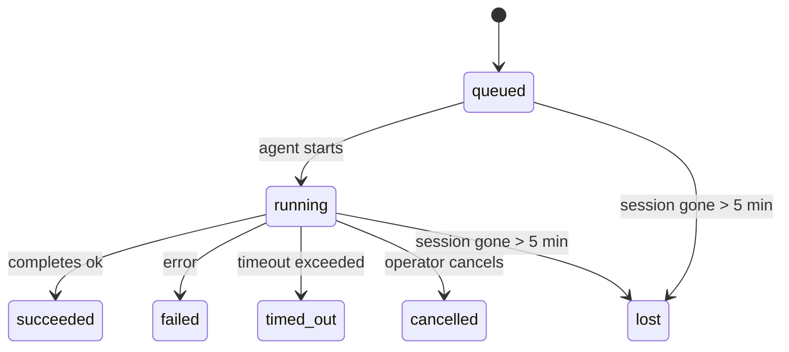

---
read_when:
    - 检查正在进行或最近完成的后台工作
    - 调试分离式智能体运行的交付失败
    - 了解后台运行与会话、cron 和心跳的关系
sidebarTitle: Background tasks
summary: 用于跟踪 ACP 运行、子智能体、隔离的 cron 作业和 CLI 操作的后台任务
title: 后台任务
x-i18n:
    generated_at: "2026-04-29T03:44:27Z"
    model: gpt-5.5
    provider: openai
    source_hash: 4bbf74f3aeea532738b56b83cd2e1a0a3734bfd453da6636b8be985a28ccc027
    source_path: automation/tasks.md
    workflow: 16
---

<Note>
正在寻找调度功能？请参见 [自动化和任务](/zh-CN/automation) 以选择合适机制。本页是后台工作的活动台账，不是调度器。
</Note>

后台任务跟踪在**主对话会话之外**运行的工作：ACP 运行、子智能体派生、隔离的 cron 作业执行，以及由 CLI 发起的操作。

任务**不会**取代会话、cron 作业或心跳，它们是记录脱离式工作发生了什么、何时发生以及是否成功的**活动台账**。

<Note>
并非每次智能体运行都会创建任务。心跳轮次和普通交互式聊天不会创建任务。所有 cron 执行、ACP 派生、子智能体派生和 CLI 智能体命令都会创建任务。
</Note>

## 要点速览

- 任务是**记录**，不是调度器；cron 和心跳决定工作_何时_运行，任务跟踪_发生了什么_。
- ACP、子智能体、所有 cron 作业和 CLI 操作都会创建任务。心跳轮次不会。
- 每个任务都会经过 `queued → running → terminal`（succeeded、failed、timed_out、cancelled 或 lost）。
- 当 cron 运行时仍拥有作业时，cron 任务会保持活动状态；如果内存中的运行时状态已消失，任务维护会先检查持久化的 cron 运行历史，再将任务标记为 lost。
- 完成由推送驱动：脱离式工作完成时可以直接通知，或唤醒请求方会话/心跳，因此状态轮询循环通常不是合适的形态。
- 隔离的 cron 运行和子智能体完成会尽力清理其子会话中受跟踪的浏览器标签页/进程，然后再进行最终清理记账。
- 当后代子智能体工作仍在收尾时，隔离的 cron 投递会抑制过时的中间父级回复；如果最终后代输出在投递前到达，它会优先使用该输出。
- 完成通知会直接投递到渠道，或排队等待下一次心跳。
- `openclaw tasks list` 显示所有任务；`openclaw tasks audit` 会暴露问题。
- 终态记录会保留 7 天，然后自动清理。

## 快速开始

<Tabs>
  <Tab title="列出和过滤">
    ```bash
    # List all tasks (newest first)
    openclaw tasks list

    # Filter by runtime or status
    openclaw tasks list --runtime acp
    openclaw tasks list --status running
    ```

  </Tab>
  <Tab title="检查">
    ```bash
    # Show details for a specific task (by ID, run ID, or session key)
    openclaw tasks show <lookup>
    ```
  </Tab>
  <Tab title="取消和通知">
    ```bash
    # Cancel a running task (kills the child session)
    openclaw tasks cancel <lookup>

    # Change notification policy for a task
    openclaw tasks notify <lookup> state_changes
    ```

  </Tab>
  <Tab title="审计和维护">
    ```bash
    # Run a health audit
    openclaw tasks audit

    # Preview or apply maintenance
    openclaw tasks maintenance
    openclaw tasks maintenance --apply
    ```

  </Tab>
  <Tab title="任务流">
    ```bash
    # Inspect TaskFlow state
    openclaw tasks flow list
    openclaw tasks flow show <lookup>
    openclaw tasks flow cancel <lookup>
    ```
  </Tab>
</Tabs>

## 什么会创建任务

| 来源                   | 运行时类型 | 创建任务记录的时机                                       | 默认通知策略 |
| ---------------------- | ------------ | ------------------------------------------------------ | --------------------- |
| ACP 后台运行           | `acp`        | 派生子 ACP 会话                                        | `done_only`           |
| 子智能体编排           | `subagent`   | 通过 `sessions_spawn` 派生子智能体                      | `done_only`           |
| Cron 作业（所有类型）  | `cron`       | 每次 cron 执行（主会话和隔离执行）                      | `silent`              |
| CLI 操作               | `cli`        | 通过 Gateway 网关运行的 `openclaw agent` 命令           | `silent`              |
| 智能体媒体作业         | `cli`        | 基于会话的 `video_generate` 运行                        | `silent`              |

<AccordionGroup>
  <Accordion title="cron 和媒体的默认通知">
    主会话 cron 任务默认使用 `silent` 通知策略；它们会创建记录用于跟踪，但不会生成通知。隔离的 cron 任务也默认使用 `silent`，但更可见，因为它们在自己的会话中运行。

    基于会话的 `video_generate` 运行也使用 `silent` 通知策略。它们仍会创建任务记录，但完成结果会作为内部唤醒交回原始智能体会话，这样智能体可以自行写入后续消息并附加完成的视频。如果你选择启用 `tools.media.asyncCompletion.directSend`，异步 `music_generate` 和 `video_generate` 完成会先尝试直接投递到渠道，然后再回退到请求方会话唤醒路径。

  </Accordion>
  <Accordion title="并发 video_generate 护栏">
    当基于会话的 `video_generate` 任务仍处于活动状态时，该工具也会充当护栏：同一会话中重复的 `video_generate` 调用会返回活动任务状态，而不是启动第二个并发生成。需要从智能体侧显式查询进度/状态时，请使用 `action: "status"`。
  </Accordion>
  <Accordion title="什么不会创建任务">
    - 心跳轮次；主会话；参见 [心跳](/zh-CN/gateway/heartbeat)
    - 普通交互式聊天轮次
    - 直接 `/command` 响应

  </Accordion>
</AccordionGroup>

## 任务生命周期



| 状态        | 含义                                                                       |
| ----------- | -------------------------------------------------------------------------- |
| `queued`    | 已创建，正在等待智能体启动                                                 |
| `running`   | 智能体轮次正在主动执行                                                     |
| `succeeded` | 已成功完成                                                                 |
| `failed`    | 已完成但发生错误                                                           |
| `timed_out` | 超出配置的超时时间                                                         |
| `cancelled` | 操作者通过 `openclaw tasks cancel` 停止                                    |
| `lost`      | 运行时在 5 分钟宽限期后丢失了权威支撑状态                                  |

状态转换会自动发生；当关联的智能体运行结束时，任务状态会更新为匹配的状态。

对于活动任务记录，智能体运行完成结果具有权威性。成功的脱离式运行会最终确定为 `succeeded`，普通运行错误会最终确定为 `failed`，超时或中止结果会最终确定为 `timed_out`。如果操作者已经取消任务，或者运行时已经记录了更强的终态（例如 `failed`、`timed_out` 或 `lost`），之后到达的成功信号不会下调该终态状态。

`lost` 具有运行时感知能力：

- ACP 任务：支撑的 ACP 子会话元数据已消失。
- 子智能体任务：支撑的子会话已从目标智能体存储中消失。
- Cron 任务：cron 运行时不再将作业跟踪为活动状态，并且持久化的 cron 运行历史没有显示该运行的终态结果。离线 CLI 审计不会把自身空的进程内 cron 运行时状态视为权威。
- CLI 任务：隔离的子会话任务使用子会话；由聊天支撑的 CLI 任务改用实时运行上下文，因此残留的渠道/群组/直接会话行不会让它们保持活动状态。由 Gateway 网关支撑的 `openclaw agent` 运行也会根据其运行结果最终确定，因此已完成的运行不会一直保持活动状态，直到清扫器将其标记为 `lost`。

## 投递和通知

当任务达到终态时，OpenClaw 会通知你。有两条投递路径：

**直接投递**：如果任务有渠道目标（`requesterOrigin`），完成消息会直接发送到该渠道（Telegram、Discord、Slack 等）。对于子智能体完成，OpenClaw 还会在可用时保留绑定的线程/主题路由，并且可以在放弃直接投递前，从请求方会话存储的路由（`lastChannel` / `lastTo` / `lastAccountId`）中补齐缺失的 `to` / 账号。

**会话排队投递**：如果直接投递失败或未设置来源，更新会作为系统事件排入请求方会话，并在下一次心跳中呈现。

<Tip>
任务完成会触发一次即时心跳唤醒，让你快速看到结果；你不必等待下一次计划的心跳 tick。
</Tip>

这意味着常见工作流是基于推送的：启动一次脱离式工作，然后让运行时在完成时唤醒或通知你。只有在需要调试、干预或显式审计时，才轮询任务状态。

### 通知策略

控制每个任务的通知详细程度：

| 策略                  | 投递内容                                                                |
| --------------------- | ----------------------------------------------------------------------- |
| `done_only`（默认）   | 仅终态（succeeded、failed 等）；**这是默认值**                          |
| `state_changes`       | 每次状态转换和进度更新                                                  |
| `silent`              | 完全不通知                                                              |

任务运行期间可更改策略：

```bash
openclaw tasks notify <lookup> state_changes
```

## CLI 参考

<AccordionGroup>
  <Accordion title="tasks list">
    ```bash
    openclaw tasks list [--runtime <acp|subagent|cron|cli>] [--status <status>] [--json]
    ```

    输出列：任务 ID、种类、状态、投递、运行 ID、子会话、摘要。

  </Accordion>
  <Accordion title="tasks show">
    ```bash
    openclaw tasks show <lookup>
    ```

    查找令牌接受任务 ID、运行 ID 或会话键。显示完整记录，包括计时、投递状态、错误和终态摘要。

  </Accordion>
  <Accordion title="tasks cancel">
    ```bash
    openclaw tasks cancel <lookup>
    ```

    对于 ACP 和子智能体任务，这会杀掉子会话。对于由 CLI 跟踪的任务，取消操作会记录在任务注册表中（没有单独的子运行时句柄）。状态转换为 `cancelled`，并在适用时发送投递通知。

  </Accordion>
  <Accordion title="tasks notify">
    ```bash
    openclaw tasks notify <lookup> <done_only|state_changes|silent>
    ```
  </Accordion>
  <Accordion title="tasks audit">
    ```bash
    openclaw tasks audit [--json]
    ```

    暴露运维问题。检测到问题时，发现项也会显示在 `openclaw status` 中。

    | 发现                      | 严重性     | 触发条件                                                                                                     |
    | ------------------------- | ---------- | ------------------------------------------------------------------------------------------------------------ |
    | `stale_queued`            | 警告       | 排队超过 10 分钟                                                                                             |
    | `stale_running`           | 错误       | 运行超过 30 分钟                                                                                             |
    | `lost`                    | 警告/错误  | 运行时支持的任务所有权消失；保留的丢失任务在 `cleanupAfter` 之前发出警告，之后变为错误 |
    | `delivery_failed`         | 警告       | 交付失败且通知策略不是 `silent`                                                                              |
    | `missing_cleanup`         | 警告       | 终止任务没有清理时间戳                                                                                       |
    | `inconsistent_timestamps` | 警告       | 时间线违规（例如结束时间早于开始时间）                                                                       |

  </Accordion>
  <Accordion title="tasks maintenance">
    ```bash
    openclaw tasks maintenance [--json]
    openclaw tasks maintenance --apply [--json]
    ```

    用它来预览或应用任务和 Task Flow 状态的对账、清理标记和修剪。

    对账会感知运行时：

    - ACP/subagent 任务会检查其背后的子会话。
    - Cron 任务会检查 cron 运行时是否仍拥有该作业，然后先从持久化的 cron 运行日志/作业状态恢复终止状态，再回退到 `lost`。只有 Gateway 网关进程对内存中的 cron 活动作业集具有权威性；离线 CLI 审计会使用持久化历史，但不会仅因为该本地 Set 为空就把 cron 任务标记为丢失。
    - 聊天支持的 CLI 任务会检查所属的实时运行上下文，而不只是聊天会话行。

    完成清理也会感知运行时：

    - Subagent 完成时会尽力关闭为子会话跟踪的浏览器标签页/进程，然后继续执行公告清理。
    - 隔离的 cron 完成时会尽力关闭为 cron 会话跟踪的浏览器标签页/进程，然后运行才会完全拆除。
    - 隔离的 cron 交付会在需要时等待后代 subagent 后续操作，并抑制陈旧的父级确认文本，而不是公告它。
    - Subagent 完成交付优先使用最新可见的助手文本；如果为空，则回退到已清理的最新 tool/toolResult 文本，并且仅超时的工具调用运行可以折叠成简短的部分进度摘要。终止失败的运行会公告失败状态，而不会重放捕获到的回复文本。
    - 清理失败不会掩盖真实的任务结果。

  </Accordion>
  <Accordion title="tasks flow list | show | cancel">
    ```bash
    openclaw tasks flow list [--status <status>] [--json]
    openclaw tasks flow show <lookup> [--json]
    openclaw tasks flow cancel <lookup>
    ```

    当你关注的是编排中的 Task Flow，而不是某一条后台任务记录时，请使用这些命令。

  </Accordion>
</AccordionGroup>

## 聊天任务看板（`/tasks`）

在任何聊天会话中使用 `/tasks` 查看链接到该会话的后台任务。该看板会显示活跃任务和最近完成的任务，以及运行时、状态、时间信息、进度或错误详情。

当当前会话没有可见的已链接任务时，`/tasks` 会回退到智能体本地任务计数，因此你仍能获得概览，同时不会泄露其他会话的详情。

如需完整的操作员账本，请使用 CLI：`openclaw tasks list`。

## Status 集成（任务压力）

`openclaw status` 包含一目了然的任务摘要：

```
Tasks: 3 queued · 2 running · 1 issues
```

该摘要会报告：

- **活跃** — `queued` + `running` 的数量
- **失败** — `failed` + `timed_out` + `lost` 的数量
- **按运行时** — 按 `acp`、`subagent`、`cron`、`cli` 分解

`/status` 和 `session_status` 工具都使用感知清理的任务快照：优先显示活跃任务，隐藏陈旧的已完成行，并且只有在没有剩余活跃工作时才显示近期失败。这样可以让状态卡片专注于当前真正重要的内容。

## 存储和维护

### 任务存放位置

任务记录会持久化到 SQLite：

```
$OPENCLAW_STATE_DIR/tasks/runs.sqlite
```

注册表会在 Gateway 网关启动时加载到内存，并将写入同步到 SQLite，以便跨重启保持持久性。
Gateway 网关通过使用 SQLite 默认的自动检查点阈值，以及定期和关闭时的 `TRUNCATE` 检查点，使 SQLite 预写日志保持有界。

### 自动维护

清扫器每 **60 秒** 运行一次，处理四件事：

<Steps>
  <Step title="Reconciliation">
    检查活跃任务是否仍有权威的运行时支持。ACP/subagent 任务使用子会话状态，cron 任务使用活动作业所有权，聊天支持的 CLI 任务使用所属的运行上下文。如果该支持状态消失超过 5 分钟，任务会被标记为 `lost`。
  </Step>
  <Step title="ACP session repair">
    关闭终止的或孤立的父级所有的一次性 ACP 会话，并且仅在没有剩余活跃对话绑定时，才关闭陈旧的终止或孤立持久 ACP 会话。
  </Step>
  <Step title="Cleanup stamping">
    在终止任务上设置 `cleanupAfter` 时间戳（endedAt + 7 天）。在保留期内，丢失任务仍会在审计中显示为警告；`cleanupAfter` 过期后，或清理元数据缺失时，它们会成为错误。
  </Step>
  <Step title="Pruning">
    删除超过其 `cleanupAfter` 日期的记录。
  </Step>
</Steps>

<Note>
**保留期：** 终止任务记录会保留 **7 天**，然后自动修剪。无需配置。
</Note>

## 任务与其他系统的关系

<AccordionGroup>
  <Accordion title="Tasks and Task Flow">
    [Task Flow](/zh-CN/automation/taskflow) 是后台任务之上的流程编排层。单个流程可以在其生命周期内使用托管或镜像同步模式协调多个任务。使用 `openclaw tasks` 检查单个任务记录，使用 `openclaw tasks flow` 检查编排中的流程。

    详情参见 [Task Flow](/zh-CN/automation/taskflow)。

  </Accordion>
  <Accordion title="Tasks and cron">
    cron 作业**定义**位于 `~/.openclaw/cron/jobs.json`；运行时执行状态位于旁边的 `~/.openclaw/cron/jobs-state.json`。**每次** cron 执行都会创建一条任务记录，包括主会话和隔离会话。主会话 cron 任务默认使用 `silent` 通知策略，因此它们会被跟踪，但不会生成通知。

    参见 [Cron 作业](/zh-CN/automation/cron-jobs)。

  </Accordion>
  <Accordion title="Tasks and heartbeat">
    Heartbeat 运行是主会话轮次，它们不会创建任务记录。任务完成时，可以触发一次 heartbeat 唤醒，让你及时看到结果。

    参见 [Heartbeat](/zh-CN/gateway/heartbeat)。

  </Accordion>
  <Accordion title="Tasks and sessions">
    任务可以引用 `childSessionKey`（工作运行的位置）和 `requesterSessionKey`（启动它的人）。会话是对话上下文；任务是在其之上的活动跟踪。
  </Accordion>
  <Accordion title="Tasks and agent runs">
    任务的 `runId` 会链接到执行工作的智能体运行。智能体生命周期事件（开始、结束、错误）会自动更新任务状态，你不需要手动管理生命周期。
  </Accordion>
</AccordionGroup>

## 相关

- [自动化与任务](/zh-CN/automation) — 所有自动化机制一览
- [CLI：任务](/zh-CN/cli/tasks) — CLI 命令参考
- [Heartbeat](/zh-CN/gateway/heartbeat) — 周期性主会话轮次
- [定时任务](/zh-CN/automation/cron-jobs) — 调度后台工作
- [Task Flow](/zh-CN/automation/taskflow) — 任务之上的流程编排
