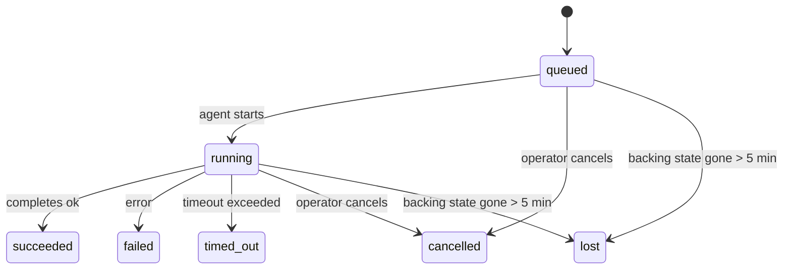

---
read_when:
    - 检查正在进行或最近完成的后台工作
    - 调试分离式智能体运行的消息投递失败
    - 了解后台运行与会话、cron 和 Heartbeat 的关系
sidebarTitle: Background tasks
summary: ACP 运行、子智能体、定时任务执行和 CLI 操作的后台任务跟踪
title: 后台任务
x-i18n:
    generated_at: "2026-07-11T20:18:45Z"
    model: gpt-5.6
    postprocess_version: locale-links-v1
    provider: openai
    source_hash: 0a945e8103c5df5a64785f326a9d0b08784ac32a2ca6fa3d4c399d75fc54be2b
    source_path: automation/tasks.md
    workflow: 16
---

<Note>
想要安排定时执行？请参阅[自动化](/zh-CN/automation)，以选择合适的机制。本页是后台工作的活动台账，不是调度器。
</Note>

后台任务会跟踪**在主对话会话之外**运行的工作：ACP 运行、子智能体生成、定时任务执行，以及由 CLI 发起的操作。

任务**不会**取代会话、定时任务或 Heartbeat——它们是记录已发生的分离式工作、发生时间以及是否成功的**活动台账**。

<Note>
并非每次智能体运行都会创建任务。Heartbeat 轮次和普通交互式聊天不会创建任务。所有定时任务执行、ACP 生成、子智能体生成，以及由 Gateway 网关分派的 CLI 智能体命令都会创建任务。
</Note>

## 摘要

- 任务是**记录**，而非调度器——定时任务和 Heartbeat 决定工作在_何时_运行，任务则跟踪_发生了什么_。
- ACP、子智能体、所有定时任务和 CLI 操作都会创建任务。Heartbeat 轮次不会。
- 每个任务都会依次经历 `queued → running → terminal`（成功、失败、超时、已取消或丢失）。
- 只要定时任务运行时仍持有该作业，定时任务就会保持活跃；如果内存中的运行时状态已消失，任务维护会先检查持久化的定时任务运行历史，然后才将任务标记为丢失。
- 完成过程由推送驱动：分离式工作完成时，可以直接发送通知，或唤醒请求方会话/Heartbeat，因此状态轮询循环通常不是合适的模式。
- 独立定时任务运行和子智能体完成后，会尽力清理由其子会话跟踪的浏览器标签页/进程，然后再执行最终清理记录。
- 当后代子智能体工作仍在收尾时，独立定时任务的交付会抑制过时的中间父级回复；如果最终后代输出在交付前到达，则优先使用该输出。
- 完成通知会直接交付到渠道，或排队等待下一次 Heartbeat。
- `openclaw tasks list` 显示所有任务；`openclaw tasks audit` 会呈现问题。
- 终止状态记录保留 7 天（`lost` 记录保留 24 小时），之后自动清理。

## 快速开始

<Tabs>
  <Tab title="列出和筛选">
    ```bash
    # 列出所有任务（最新的在前）
    openclaw tasks list

    # 按运行时或状态筛选
    openclaw tasks list --runtime acp
    openclaw tasks list --status running
    ```

  </Tab>
  <Tab title="检查">
    ```bash
    # 显示特定任务的详细信息（按任务 ID、运行 ID 或会话键）
    openclaw tasks show <lookup>
    ```
  </Tab>
  <Tab title="取消和通知">
    ```bash
    # 取消正在运行的任务（终止子会话）
    openclaw tasks cancel <lookup>

    # 更改任务的通知策略
    openclaw tasks notify <lookup> state_changes
    ```

  </Tab>
  <Tab title="审计和维护">
    ```bash
    # 运行健康审计
    openclaw tasks audit

    # 预览或应用维护
    openclaw tasks maintenance
    openclaw tasks maintenance --apply
    ```

  </Tab>
  <Tab title="任务流程">
    ```bash
    # 检查 TaskFlow 状态
    openclaw tasks flow list
    openclaw tasks flow show <lookup>
    openclaw tasks flow cancel <lookup>
    ```
  </Tab>
</Tabs>

## 哪些操作会创建任务

| 来源                   | 运行时类型   | 创建任务记录的时机                                                    | 默认通知策略 |
| ---------------------- | ------------ | ---------------------------------------------------------------------- | ------------ |
| ACP 后台运行           | `acp`        | 生成 ACP 子会话                                                        | `done_only`  |
| 子智能体编排           | `subagent`   | 通过 `sessions_spawn` 生成子智能体                                    | `done_only`  |
| 定时任务（所有类型）   | `cron`       | 每次定时任务执行（主会话和独立运行）                                  | `silent`     |
| CLI 操作               | `cli`        | 通过 Gateway 网关运行的 `openclaw agent` 命令                         | `silent`     |
| 智能体媒体作业         | `cli`        | 基于会话的 `image_generate`/`music_generate`/`video_generate` 运行    | `silent`     |

<AccordionGroup>
  <Accordion title="定时任务和媒体任务的通知默认值">
    定时任务（主会话和独立运行）使用 `silent` 通知策略——它们会创建用于跟踪的记录，但不会自行生成任务通知；定时任务拥有自己的交付路径。

    基于会话的 `image_generate`、`music_generate` 和 `video_generate` 运行也使用 `silent` 通知策略。它们仍会创建任务记录，但完成结果会作为内部唤醒信号返回原始智能体会话，使智能体能够编写后续消息并自行附加已完成的媒体。请求方智能体遵循其正常的可见回复约定：配置后自动发送最终回复；如果会话要求通过消息工具回复，则使用 `message(action="send")` 加 `NO_REPLY`。如果请求方会话已不再活跃或其主动唤醒失败，并且完成智能体遗漏了部分或全部已生成媒体，OpenClaw 会向原始渠道目标发送幂等的直接回退消息，其中仅包含遗漏的媒体。

  </Accordion>
  <Accordion title="并发媒体生成防护机制">
    当基于会话的媒体生成任务仍处于活跃状态时，`image_generate`、`music_generate` 和 `video_generate` 会防止意外重试：对同一提示词/请求重复调用时，会返回匹配的活跃任务状态，而不是启动重复任务；不同的提示词则可以启动自己的任务。如果希望从智能体侧显式查询进度/状态，请使用 `action: "status"`。
  </Accordion>
  <Accordion title="哪些操作不会创建任务">
    - Heartbeat 轮次——主会话；参阅 [Heartbeat](/zh-CN/gateway/heartbeat)
    - 普通交互式聊天轮次
    - 直接 `/command` 响应

  </Accordion>
</AccordionGroup>

## 任务生命周期



| 状态        | 含义                                                                          |
| ----------- | ----------------------------------------------------------------------------- |
| `queued`    | 已创建，正在等待智能体启动                                                    |
| `running`   | 智能体轮次正在执行                                                            |
| `succeeded` | 已成功完成                                                                    |
| `failed`    | 因错误而结束                                                                  |
| `timed_out` | 超过配置的超时时间                                                            |
| `cancelled` | 操作员通过 `openclaw tasks cancel` 将其停止，或该运行已中止                   |
| `lost`      | 经过 5 分钟宽限期后，运行时丢失了权威后备状态                                |

状态转换会自动发生——智能体运行生命周期事件（开始、结束、错误）会更新任务状态；你无需手动管理。

对于活跃任务记录，智能体运行完成结果具有权威性。成功的分离式运行最终状态为 `succeeded`，普通运行错误最终状态为 `failed`，超时最终状态为 `timed_out`，取消/中止结果最终状态为 `cancelled`。任务进入终止状态后，后续生命周期信号不会降低其状态——即使之后收到成功信号，由操作员取消或已经处于 `failed`/`timed_out`/`lost` 状态的任务仍会保持原状态。

`lost` 会根据运行时判断：

- ACP 任务：只有 Gateway 网关进程中仍在运行的 ACP 轮次才能证明该运行仍然存活；仅有持久化的会话元数据并不足以证明。离线 CLI 审计会保持保守，绝不会回收 ACP 任务。
- 子智能体任务：后备子会话已从目标智能体存储中消失（或带有重启恢复墓碑）。
- 定时任务：定时任务运行时不再将该作业跟踪为活跃状态，并且持久化的定时任务运行历史中没有显示该次运行的终止结果。离线 CLI 审计不会将自身为空的进程内定时任务运行时状态视为权威依据。
- CLI 任务：带有运行 ID/来源 ID 的任务使用实时运行上下文，因此在 Gateway 网关拥有的运行消失后，残留的子会话或聊天会话记录不会使其继续保持活跃。没有运行身份信息的旧版 CLI 任务仍会回退到子会话。由 Gateway 网关支持的 `openclaw agent` 运行也会根据其运行结果完成状态转换，因此已完成的运行不会一直保持活跃，直至清理程序将其标记为 `lost`。

## 交付和通知

当任务进入终止状态时，OpenClaw 会通知你。共有两种交付路径：

**直接交付**——如果任务具有渠道目标（即 `requesterOrigin`），完成消息会直接发送到该渠道（Discord、Slack、Telegram 等）。对于群组和频道中的任务完成消息，则会通过请求方会话进行路由，使父智能体能够编写可见回复。对于子智能体完成消息，OpenClaw 还会在可用时保留已绑定的线程/主题路由；在放弃直接交付之前，还可以根据请求方会话存储的路由（`lastChannel` / `lastTo` / `lastAccountId`）补充缺失的 `to` / 账号。

**会话排队交付**——如果直接交付失败或未设置来源，更新会作为系统事件排入请求方会话，并在下一次 Heartbeat 时呈现。

<Tip>
排入会话的任务完成事件会立即触发 Heartbeat 唤醒，因此你可以很快看到结果——无需等待下一次计划的 Heartbeat 周期。
</Tip>

这意味着常规工作流以推送为基础：只需启动一次分离式工作，然后让运行时在完成时唤醒你或通知你。仅当需要调试、干预或显式审计时，才轮询任务状态。

### 通知策略

控制每项任务向你报告信息的详细程度：

| 策略                  | 交付内容                                                  |
| --------------------- | --------------------------------------------------------- |
| `done_only`（默认）   | 仅交付终止状态（成功、失败等）                            |
| `state_changes`       | 交付每次状态转换和进度更新                                |
| `silent`              | 完全不交付（定时任务、CLI 和媒体任务的默认策略）          |

在任务运行期间更改策略：

```bash
openclaw tasks notify <lookup> state_changes
```

## CLI 参考

<AccordionGroup>
  <Accordion title="tasks list">
    ```bash
    openclaw tasks list [--runtime <acp|subagent|cron|cli>] [--status <status>] [--json]
    ```

    输出列：任务、类型、状态、交付、运行、子会话、摘要。直接运行 `openclaw tasks` 的行为与 `openclaw tasks list` 相同。

  </Accordion>
  <Accordion title="tasks show">
    ```bash
    openclaw tasks show <lookup> [--json]
    ```

    查询标记可接受任务 ID、运行 ID 或会话键。显示完整记录，包括时间信息、交付状态、错误和终止摘要。

  </Accordion>
  <Accordion title="tasks cancel">
    ```bash
    openclaw tasks cancel <lookup>
    ```

    对于 ACP 和子智能体任务，此命令会终止子会话；ACP 和定时任务的取消操作会通过正在运行的 Gateway 网关进行路由（`tasks.cancel`）。对于由 CLI 跟踪的任务，取消操作会记录在任务注册表中（不存在单独的子运行时句柄）。状态会转换为 `cancelled`，并在适用时发送交付通知。

  </Accordion>
  <Accordion title="tasks notify">
    ```bash
    openclaw tasks notify <lookup> <done_only|state_changes|silent>
    ```
  </Accordion>
  <Accordion title="tasks audit">
    ```bash
    openclaw tasks audit [--severity <warn|error>] [--code <name>] [--limit <n>] [--json]
    ```

    在一份报告中呈现任务**和** TaskFlow 的运行问题。检测到问题时，结果也会显示在 `openclaw status` 中。

    任务检查结果：

    | 发现项                    | 严重程度   | 触发条件                                                                                                  |
    | ------------------------- | ---------- | --------------------------------------------------------------------------------------------------------- |
    | `stale_queued`            | warn       | 排队超过 10 分钟                                                                                          |
    | `stale_running`           | error      | 运行超过 30 分钟                                                                                          |
    | `lost`                    | warn/error | 由运行时支持的任务所有权已消失；保留的丢失任务在 `cleanupAfter` 之前产生警告，之后变为错误                 |
    | `delivery_failed`         | warn       | 交付失败且通知策略不是 `silent`                                                                           |
    | `missing_cleanup`         | warn       | 终止任务没有清理时间戳                                                                                    |
    | `inconsistent_timestamps` | warn       | 时间线违规（例如结束时间早于开始时间）                                                                    |

    TaskFlow 发现项：

    | 发现项                 | 严重程度   | 触发条件                                                                    |
    | ---------------------- | ---------- | --------------------------------------------------------------------------- |
    | `restore_failed`       | error      | 无法从 SQLite 恢复流程注册表                                                 |
    | `stale_running`        | error      | 正在运行的流程超过 30 分钟没有进展                                          |
    | `stale_waiting`        | warn       | 正在等待的流程超过 30 分钟没有进展                                          |
    | `stale_blocked`        | warn       | 被阻塞的流程超过 30 分钟没有进展                                            |
    | `cancel_stuck`         | warn       | 已在 5 分钟前请求取消，没有活跃的子任务，但仍未终止                         |
    | `missing_linked_tasks` | warn/error | 陈旧的托管流程没有关联任务或等待状态                                        |
    | `blocked_task_missing` | warn       | 被阻塞的流程指向一个已不存在的任务 ID                                       |

  </Accordion>
  <Accordion title="tasks maintenance">
    ```bash
    openclaw tasks maintenance [--json]
    openclaw tasks maintenance --apply [--json]
    ```

    使用此命令可预览或应用任务、TaskFlow 状态以及陈旧 cron 运行会话注册表行的协调、清理时间戳设置和修剪。

    协调过程会感知运行时状态：

    - ACP 任务要求 Gateway 网关中存在活跃的进程内轮次；子智能体任务会检查其对应的子会话。
    - 如果子智能体任务的子会话存在重启恢复墓碑，该任务会被标记为丢失，而不会将该子会话视为可恢复的支持会话。
    - Cron 任务会检查 cron 运行时是否仍拥有该作业，然后尝试从持久化的 cron 运行日志或作业状态中恢复终止状态，最后才回退为 `lost`。只有 Gateway 网关进程才是内存中 cron 活跃作业集合的权威来源；离线 CLI 审计会使用持久化历史记录，但不会仅因本地集合为空就将 cron 任务标记为丢失。
    - 具有运行标识的 CLI 任务会检查拥有该任务的活跃运行上下文，而不仅仅检查子会话或聊天会话行。

    完成后的清理也会感知运行时状态：

    - 子智能体完成后，会尽力在继续执行通知清理之前关闭为该子会话追踪的浏览器标签页和进程。
    - 隔离的 cron 运行完成后，会尽力在运行完全拆除之前关闭为该 cron 会话追踪的浏览器标签页和进程。
    - 隔离的 cron 交付会在必要时等待后代子智能体完成后续工作，并抑制陈旧的父级确认文本，而不是将其发出。
    - 子智能体完成交付只使用子会话中最新的可见助手文本。工具或 `toolResult` 输出不会被提升为子任务结果文本。以失败终止的运行会通知失败状态，但不会重放捕获的回复文本。
    - 清理失败不会掩盖真实的任务结果。

    应用维护时，OpenClaw 还会删除超过 7 天的陈旧 `cron:<jobId>:run:<runId>` 会话注册表行，同时保留当前正在运行的 cron 作业对应的行，并且不会修改非 cron 会话行。

  </Accordion>
  <Accordion title="tasks flow list | show | cancel">
    ```bash
    openclaw tasks flow list [--status <status>] [--json]
    openclaw tasks flow show <lookup> [--json]
    openclaw tasks flow cancel <lookup>
    ```

    流程查找令牌接受流程 ID 或所有者键。当你关注的是负责协调的 [Task Flow](/zh-CN/automation/taskflow)，而不是某一条单独的后台任务记录时，请使用这些命令。

  </Accordion>
</AccordionGroup>

## 聊天任务面板（`/tasks`）

在任意聊天会话中使用 `/tasks`，即可查看关联到该会话的后台任务。面板最多显示五个活跃或最近完成的任务，并包含运行时、状态、时间以及进度或错误详情。

当当前会话没有可见的关联任务时，`/tasks` 会回退到 Agent 本地任务计数，使你仍能获得概览，同时不会泄露其他会话的详细信息。

如需查看完整的操作员账本，请使用 CLI：`openclaw tasks list`。

### Control UI

Web 版 Control UI 的侧边栏中有一个**任务**页面，其中显示实时的活跃任务和最近的后台任务。你可以使用它检查进度、打开关联会话、刷新账本，或取消已排队和正在运行的任务。

聊天窗格中还有一个限定于该窗格 Agent 的可折叠**后台任务**侧栏：其中包含带有停止控件的运行中任务和子智能体、已完成部分，以及进入每个任务子会话的“查看记录”链接。可通过窗格标题栏中的活动开关打开它（在单窗格聊天中，也可使用浮动活动按钮）。

## 状态集成（任务压力）

`openclaw status` 包含一行用于快速浏览任务状态的摘要：

```
Tasks    2 active · 1 queued · 1 running · 1 issue · audit clean · 6 tracked
```

摘要会统计活跃工作（`queued` + `running`）、失败（`failed` + `timed_out` + `lost`）、审计发现项以及追踪记录总数；JSON 载荷还会按运行时（`acp`、`subagent`、`cron`、`cli`）细分计数。

`/status` 和 `session_status` 工具都使用感知清理状态的任务快照：优先显示活跃任务，隐藏已过期的行，并且只在较短的近期窗口（5 分钟）内显示终止任务；当没有活跃工作时，会重点显示失败任务。这样可让状态卡片聚焦于当前最重要的内容。

## 存储和维护

### 任务的存储位置

任务记录和交付状态持久化在 OpenClaw 的共享 SQLite 状态数据库中：

```
~/.openclaw/state/openclaw.sqlite   (tables: task_runs, task_delivery_state, flow_runs)
```

设置 `OPENCLAW_STATE_DIR` 可将整个状态根目录（默认为 `~/.openclaw`）移动到其他位置；共享数据库路径也会随之移动。

注册表会在首次使用时加载到内存中，并将每次写入持久化回 SQLite，因此记录可在 Gateway 网关重启后继续保留。SQLite 的默认自动检查点阈值与定期 `PASSIVE` 检查点会限制 WAL 的增长；关闭和显式维护检查点使用 `TRUNCATE`，使正常关闭能够回收 WAL 空间，而不必让后台清理器等待活跃读取器。

旧版安装中的遗留伴随存储（`tasks/runs.sqlite`、`flows/registry.sqlite`）会由 `openclaw doctor` 导入共享数据库。

### 自动维护

清理器每 **60 秒**运行一次（首次运行约在 Gateway 网关启动后 5 秒），并处理以下四项工作：

<Steps>
  <Step title="Reconciliation">
    检查活跃任务是否仍有权威的运行时支持。ACP 任务要求存在活跃的进程内轮次，子智能体任务使用子会话状态，cron 任务使用活跃作业所有权和持久化运行历史，具有运行标识的 CLI 任务则使用拥有该任务的运行上下文。如果支持状态消失超过 5 分钟（无子会话的原生子智能体任务为 30 分钟），任务会被标记为 `lost`。
  </Step>
  <Step title="ACP session repair">
    关闭已终止或成为孤儿的父级所有一次性 ACP 会话；对于陈旧且已终止或成为孤儿的持久 ACP 会话，仅在不再存在活跃的对话绑定时关闭。
  </Step>
  <Step title="Cleanup stamping">
    为终止任务设置 `cleanupAfter` 时间戳（终止时间加保留窗口）。在保留期内，丢失任务仍会在审计中显示为警告；当 `cleanupAfter` 过期或缺少清理元数据时，它们会变为错误。
  </Step>
  <Step title="Pruning">
    删除超过其 `cleanupAfter` 日期的记录。
  </Step>
</Steps>

<Note>
**保留期限：**终止任务记录会保留 **7 天**（`lost` 记录保留 **24 小时**），之后自动修剪。无需配置。
</Note>

## 任务与其他系统的关系

<AccordionGroup>
  <Accordion title="Tasks and Task Flow">
    [Task Flow](/zh-CN/automation/taskflow) 是位于后台任务之上的流程编排层。单个流程可在其生命周期内使用托管或镜像同步模式协调多个任务。使用 `openclaw tasks` 检查单独的任务记录，使用 `openclaw tasks flow` 检查负责协调的流程。

  </Accordion>
  <Accordion title="Tasks and cron">
    Cron 作业定义、运行时执行状态和运行历史记录存储在 OpenClaw 的共享 SQLite 状态数据库中。**每次** cron 执行都会创建一条任务记录，包括主会话和隔离会话，并采用 `silent` 通知策略，因此可以追踪 cron 运行，而不会由任务自身生成通知。

    请参阅 [Cron 作业](/zh-CN/automation/cron-jobs)。

  </Accordion>
  <Accordion title="Tasks and heartbeat">
    Heartbeat 运行属于主会话轮次，不会创建任务记录。当任务完成时，它可以触发 Heartbeat 唤醒，使你及时看到结果。

    请参阅 [Heartbeat](/zh-CN/gateway/heartbeat)。

  </Accordion>
  <Accordion title="Tasks and sessions">
    任务可以引用 `childSessionKey`（工作运行的位置）和 `requesterSessionKey`（发起者）。其 `agentId` 标识执行工作的 Agent，而请求者和所有者字段会保留启动与控制上下文。会话是对话上下文；任务是在其之上的活动追踪层。
  </Accordion>
  <Accordion title="Tasks and agent runs">
    任务的 `runId` 会关联到执行该工作的 Agent 运行。Agent 生命周期事件（开始、结束、错误）会自动更新任务状态，你无需手动管理生命周期。
  </Accordion>
</AccordionGroup>

## 相关内容

- [自动化](/zh-CN/automation) - 快速浏览所有自动化机制
- [CLI：任务](/zh-CN/cli/tasks) - CLI 命令参考
- [Heartbeat](/zh-CN/gateway/heartbeat) - 定期执行的主会话轮次
- [定时任务](/zh-CN/automation/cron-jobs) - 调度后台工作
- [Task Flow](/zh-CN/automation/taskflow) - 位于任务之上的流程编排
