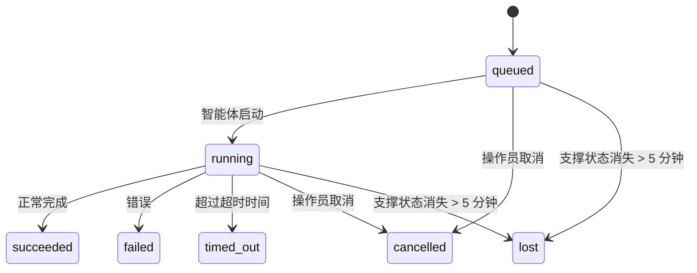

---
read_when:
    - 检查正在进行或最近完成的后台工作
    - 调试分离式智能体运行的消息投递失败
    - 了解后台运行与会话、cron 和 Heartbeat 的关系
sidebarTitle: Background tasks
summary: ACP 运行、子智能体、cron 执行和 CLI 操作的后台任务跟踪
title: 后台任务
x-i18n:
    generated_at: "2026-07-12T14:17:50Z"
    model: gpt-5.6
    postprocess_version: locale-links-v1
    prompt_version: 15
    provider: openai
    source_hash: 0a945e8103c5df5a64785f326a9d0b08784ac32a2ca6fa3d4c399d75fc54be2b
    source_path: automation/tasks.md
    workflow: 16
---

<Note>
想要进行定时调度？请参阅[自动化](/zh-CN/automation)，以选择合适的机制。本页是后台工作的活动账本，而非调度器。
</Note>

后台任务跟踪在**主对话会话之外**运行的工作：ACP 运行、子智能体生成、cron 作业执行以及通过 CLI 发起的操作。

任务**不会**取代会话、cron 作业或 Heartbeat——它们是记录哪些分离式工作已发生、发生时间及其是否成功的**活动账本**。

<Note>
并非每次智能体运行都会创建任务。Heartbeat 轮次和普通交互式聊天不会。所有 cron 执行、ACP 生成、子智能体生成以及 Gateway 网关分派的 CLI 智能体命令都会创建任务。
</Note>

## 摘要

- 任务是**记录**，而非调度器——cron 和 Heartbeat 决定工作_何时_运行，任务则跟踪_发生了什么_。
- ACP、子智能体、所有 cron 作业和 CLI 操作都会创建任务。Heartbeat 轮次不会。
- 每个任务都会经历 `queued → running → terminal`（成功、失败、超时、已取消或丢失）。
- 只要 cron 运行时仍拥有作业，cron 任务就会保持活动状态；如果内存中的运行时状态已消失，任务维护会先检查持久化的 cron 运行历史，然后再将任务标记为丢失。
- 完成流程由推送驱动：分离式工作完成时可以直接通知，或唤醒请求方会话/Heartbeat，因此状态轮询循环通常不是正确的实现方式。
- 在执行最终清理记录之前，隔离的 cron 运行和子智能体完成流程会尽力清理其子会话中受跟踪的浏览器标签页/进程。
- 当后代子智能体工作仍在收尾时，隔离 cron 的交付会抑制过时的父级中间回复；如果最终后代输出在交付前到达，则优先使用该输出。
- 完成通知会直接交付到渠道，或排队等待下一次 Heartbeat。
- `openclaw tasks list` 显示所有任务；`openclaw tasks audit` 会呈现问题。
- 终态记录保留 7 天（`lost` 记录保留 24 小时），之后自动清理。

## 快速开始

<Tabs>
  <Tab title="列出和筛选">
    ```bash
    # 列出所有任务（最新的优先）
    openclaw tasks list

    # 按运行时或状态筛选
    openclaw tasks list --runtime acp
    openclaw tasks list --status running
    ```

  </Tab>
  <Tab title="检查">
    ```bash
    # 显示特定任务的详细信息（按任务 ID、运行 ID 或会话键）
    openclaw tasks show <lookup>
    ```
  </Tab>
  <Tab title="取消和通知">
    ```bash
    # 取消正在运行的任务（终止子会话）
    openclaw tasks cancel <lookup>

    # 更改任务的通知策略
    openclaw tasks notify <lookup> state_changes
    ```

  </Tab>
  <Tab title="审计和维护">
    ```bash
    # 运行健康审计
    openclaw tasks audit

    # 预览或应用维护操作
    openclaw tasks maintenance
    openclaw tasks maintenance --apply
    ```

  </Tab>
  <Tab title="任务流">
    ```bash
    # 检查 TaskFlow 状态
    openclaw tasks flow list
    openclaw tasks flow show <lookup>
    openclaw tasks flow cancel <lookup>
    ```
  </Tab>
</Tabs>

## 哪些操作会创建任务

| 来源                   | 运行时类型 | 创建任务记录的时机                                                       | 默认通知策略 |
| ---------------------- | ---------- | ------------------------------------------------------------------------ | ------------ |
| ACP 后台运行           | `acp`      | 生成子 ACP 会话                                                          | `done_only`  |
| 子智能体编排           | `subagent` | 通过 `sessions_spawn` 生成子智能体                                       | `done_only`  |
| cron 作业（所有类型）  | `cron`     | 每次 cron 执行（主会话和隔离会话）                                       | `silent`     |
| CLI 操作               | `cli`      | 通过 Gateway 网关运行的 `openclaw agent` 命令                            | `silent`     |
| 智能体媒体作业         | `cli`      | 由会话支持的 `image_generate`/`music_generate`/`video_generate` 运行     | `silent`     |

<AccordionGroup>
  <Accordion title="cron 和媒体的默认通知设置">
    cron 任务（主会话和隔离会话）使用 `silent` 通知策略——它们会创建用于跟踪的记录，但不会自行生成任务通知；cron 负责自己的交付路径。

    由会话支持的 `image_generate`、`music_generate` 和 `video_generate` 运行也使用 `silent` 通知策略。它们仍会创建任务记录，但完成结果会作为内部唤醒信号交回原始智能体会话，以便智能体编写后续消息并自行附加已生成的媒体。请求方智能体遵循其正常的可见回复契约：配置后自动发送最终回复，或者当会话要求使用消息工具回复时，使用 `message(action="send")` 加 `NO_REPLY`。如果请求方会话已不再处于活动状态或其主动唤醒失败，并且完成智能体遗漏了部分或全部已生成媒体，OpenClaw 会向原始渠道目标发送幂等的直接回退消息，其中仅包含缺失的媒体。

  </Accordion>
  <Accordion title="并发媒体生成防护">
    当由会话支持的媒体生成任务仍处于活动状态时，`image_generate`、`music_generate` 和 `video_generate` 会防止意外重试：对于相同提示词/请求的重复调用，会返回匹配的活动任务状态，而不会启动重复任务；不同的提示词则可以启动自己的任务。如果需要从智能体侧显式查询进度/状态，请使用 `action: "status"`。
  </Accordion>
  <Accordion title="哪些操作不会创建任务">
    - Heartbeat 轮次——主会话；请参阅 [Heartbeat](/zh-CN/gateway/heartbeat)
    - 普通交互式聊天轮次
    - 直接的 `/command` 响应

  </Accordion>
</AccordionGroup>

## 任务生命周期



| 状态        | 含义                                                                           |
| ----------- | ------------------------------------------------------------------------------ |
| `queued`    | 已创建，正在等待智能体启动                                                     |
| `running`   | 智能体轮次正在执行                                                             |
| `succeeded` | 已成功完成                                                                     |
| `failed`    | 因错误而完成                                                                   |
| `timed_out` | 超过配置的超时时间                                                             |
| `cancelled` | 由操作员通过 `openclaw tasks cancel` 停止，或运行已中止                        |
| `lost`      | 运行时在 5 分钟宽限期后丢失了权威支撑状态                                      |

状态转换会自动发生——智能体运行生命周期事件（开始、结束、错误）会更新任务状态；你无需手动管理。

对于活动任务记录，智能体运行完成状态是权威依据。成功的分离式运行最终记为 `succeeded`，普通运行错误最终记为 `failed`，超时最终记为 `timed_out`，取消/中止结果最终记为 `cancelled`。任务一旦进入终态，后续生命周期信号不会将其降级——即使之后收到成功信号，由操作员取消或已经处于 `failed`/`timed_out`/`lost` 状态的任务也会保持原状。

`lost` 会考虑运行时类型：

- ACP 任务：只有 Gateway 网关进程内仍存活的 ACP 轮次才能证明运行仍处于活动状态；仅有持久化会话元数据并不能证明这一点。离线 CLI 审计会保持保守，绝不会回收 ACP 任务。
- 子智能体任务：支撑它的子会话已从目标智能体存储中消失（或带有重启恢复墓碑）。
- cron 任务：cron 运行时不再将作业跟踪为活动状态，并且持久化的 cron 运行历史未显示该次运行的终态结果。离线 CLI 审计不会将自身为空的进程内 cron 运行时状态视为权威依据。
- CLI 任务：具有运行 ID/来源 ID 的任务使用实时运行上下文，因此在 Gateway 网关拥有的运行消失后，残留的子会话或聊天会话行不会使其继续保持活动状态。没有运行标识的旧版 CLI 任务仍会回退到子会话。由 Gateway 网关支持的 `openclaw agent` 运行也会根据其运行结果结束，因此已完成的运行不会一直保持活动状态，直到清理器将其标记为 `lost`。

## 交付和通知

当任务进入终态时，OpenClaw 会通知你。共有两种交付路径：

**直接交付**——如果任务具有渠道目标（`requesterOrigin`），完成消息会直接发送到该渠道（Discord、Slack、Telegram 等）。群组和渠道任务的完成消息则通过请求方会话路由，以便父智能体编写可见回复。对于子智能体完成消息，OpenClaw 还会在可用时保留绑定的线程/话题路由，并且可以在放弃直接交付之前，使用请求方会话存储的路由（`lastChannel` / `lastTo` / `lastAccountId`）补全缺失的 `to` / 账号。

**会话排队交付**——如果直接交付失败或未设置来源，更新会作为系统事件排入请求方会话，并在下一次 Heartbeat 时呈现。

<Tip>
会话排队的任务完成事件会立即触发 Heartbeat 唤醒，因此你可以很快看到结果——无需等待下一次计划的 Heartbeat 周期。
</Tip>

这意味着常规工作流基于推送：启动一次分离式工作，然后让运行时在完成时唤醒或通知你。仅在需要调试、干预或显式审计时轮询任务状态。

### 通知策略

控制你接收每个任务通知的详细程度：

| 策略                  | 交付内容                                                   |
| --------------------- | ---------------------------------------------------------- |
| `done_only`（默认）   | 仅终态（成功、失败等）                                     |
| `state_changes`       | 每次状态转换和进度更新                                     |
| `silent`              | 完全不交付（cron、CLI 和媒体任务的默认设置）               |

在任务运行期间更改策略：

```bash
openclaw tasks notify <lookup> state_changes
```

## CLI 参考

<AccordionGroup>
  <Accordion title="tasks list">
    ```bash
    openclaw tasks list [--runtime <acp|subagent|cron|cli>] [--status <status>] [--json]
    ```

    输出列：任务、种类、状态、交付、运行、子会话、摘要。不带参数的 `openclaw tasks` 与 `openclaw tasks list` 行为相同。

  </Accordion>
  <Accordion title="tasks show">
    ```bash
    openclaw tasks show <lookup> [--json]
    ```

    查找令牌接受任务 ID、运行 ID 或会话键。显示完整记录，包括时间信息、交付状态、错误和终态摘要。

  </Accordion>
  <Accordion title="tasks cancel">
    ```bash
    openclaw tasks cancel <lookup>
    ```

    对于 ACP 和子智能体任务，此操作会终止子会话；ACP 和 cron 取消操作通过正在运行的 Gateway 网关（`tasks.cancel`）进行路由。对于由 CLI 跟踪的任务，取消操作会记录在任务注册表中（不存在单独的子运行时句柄）。状态会转换为 `cancelled`，并在适用时发送交付通知。

  </Accordion>
  <Accordion title="tasks notify">
    ```bash
    openclaw tasks notify <lookup> <done_only|state_changes|silent>
    ```
  </Accordion>
  <Accordion title="tasks audit">
    ```bash
    openclaw tasks audit [--severity <warn|error>] [--code <name>] [--limit <n>] [--json]
    ```

    在一份报告中呈现任务**以及** TaskFlow 的运行问题。检测到问题时，发现项也会显示在 `openclaw status` 中。

    任务发现项：

    | 发现项                    | 严重程度   | 触发条件                                                                                                     |
    | ------------------------- | ---------- | ------------------------------------------------------------------------------------------------------------ |
    | `stale_queued`            | 警告       | 排队超过 10 分钟                                                                                             |
    | `stale_running`           | 错误       | 运行超过 30 分钟                                                                                             |
    | `lost`                    | 警告/错误  | 由运行时支持的任务所有权已消失；保留的丢失任务在 `cleanupAfter` 之前发出警告，之后变为错误                    |
    | `delivery_failed`         | 警告       | 递送失败且通知策略不是 `silent`                                                                              |
    | `missing_cleanup`         | 警告       | 终止任务没有清理时间戳                                                                                       |
    | `inconsistent_timestamps` | 警告       | 时间线违规（例如结束时间早于开始时间）                                                                       |

    TaskFlow 发现项：

    | 发现项                 | 严重程度   | 触发条件                                                                      |
    | ---------------------- | ---------- | ----------------------------------------------------------------------------- |
    | `restore_failed`       | 错误       | 从 SQLite 恢复流程注册表失败                                                   |
    | `stale_running`        | 错误       | 正在运行的流程超过 30 分钟没有进展                                             |
    | `stale_waiting`        | 警告       | 正在等待的流程超过 30 分钟没有进展                                             |
    | `stale_blocked`        | 警告       | 被阻塞的流程超过 30 分钟没有进展                                               |
    | `cancel_stuck`         | 警告       | 取消请求已发出超过 5 分钟，没有活跃的子任务，但仍未终止                        |
    | `missing_linked_tasks` | 警告/错误  | 过期的托管流程没有关联任务或等待状态                                           |
    | `blocked_task_missing` | 警告       | 被阻塞的流程指向一个已不存在的任务 ID                                          |

  </Accordion>
  <Accordion title="任务维护">
    ```bash
    openclaw tasks maintenance [--json]
    openclaw tasks maintenance --apply [--json]
    ```

    使用此命令预览或应用任务、TaskFlow 状态和过期 cron 运行会话注册表行的协调、清理时间戳写入和裁剪。

    协调过程会感知运行时状态：

    - ACP 任务要求 Gateway 网关中存在活跃的进程内轮次；子智能体任务会检查其后备子会话。
    - 如果子智能体任务的子会话具有重启恢复墓碑，则该任务会被标记为丢失，而不会将该会话视为可恢复的后备会话。
    - Cron 任务会检查 cron 运行时是否仍拥有该作业，然后从持久化的 cron 运行日志/作业状态中恢复终止状态，最后才回退到 `lost`。只有 Gateway 网关进程对内存中的 cron 活跃作业集合具有权威性；离线 CLI 审计会使用持久化历史记录，但不会仅因本地集合为空就将 cron 任务标记为丢失。
    - 具有运行标识的 CLI 任务会检查所属的活跃运行上下文，而不只是子会话或聊天会话行。

    完成清理也会感知运行时状态：

    - 子智能体完成后，在继续执行通知清理前，会尽力关闭为子会话跟踪的浏览器标签页/进程。
    - 隔离的 cron 完成后，在运行完全拆除前，会尽力关闭为 cron 会话跟踪的浏览器标签页/进程。
    - 隔离的 cron 递送会在需要时等待后代子智能体完成后续处理，并抑制过期的父级确认文本，而不是将其发布。
    - 子智能体完成递送仅使用子级最新的可见助手文本。不会将工具/工具结果输出提升为子级结果文本。已终止的失败运行会发布失败状态，但不会重放捕获的回复文本。
    - 清理失败不会掩盖真实的任务结果。

    应用维护时，OpenClaw 还会删除超过 7 天的过期 `cron:<jobId>:run:<runId>` 会话注册表行，同时保留当前正在运行的 cron 作业对应行，并且不改动非 cron 会话行。

  </Accordion>
  <Accordion title="任务流程列表 | 查看 | 取消">
    ```bash
    openclaw tasks flow list [--status <status>] [--json]
    openclaw tasks flow show <lookup> [--json]
    openclaw tasks flow cancel <lookup>
    ```

    流程查找令牌接受流程 ID 或所有者键。如果你关心的是编排用的 [Task Flow](/zh-CN/automation/taskflow)，而不是某一条单独的后台任务记录，请使用这些命令。

  </Accordion>
</AccordionGroup>

## 聊天任务看板（`/tasks`）

在任意聊天会话中使用 `/tasks`，可查看与该会话关联的后台任务。看板最多显示五个活跃和最近完成的任务，并提供运行时、状态、时间和进度或错误详情。

当前会话没有可见的关联任务时，`/tasks` 会回退显示 Agent 本地任务计数，使你仍可获得概览，同时不会泄露其他会话的详情。

要查看完整的操作员账本，请使用 CLI：`openclaw tasks list`。

### Control UI

Web Control UI 的侧边栏中有一个 **任务** 页面，其中实时显示活跃和最近的后台任务。你可以用它检查进度、打开关联会话、刷新账本，或取消排队中和运行中的任务。

聊天窗格还有一个可折叠的 **后台任务** 侧栏，其范围限定为该窗格的 Agent：其中包括带停止控件的运行中任务和子智能体、已完成部分，以及指向各任务子会话的“查看转录记录”链接。可通过窗格标题栏中的活动切换按钮打开它（在单窗格聊天中也可通过浮动活动按钮打开）。

## 状态集成（任务压力）

`openclaw status` 包含一行一目了然的任务信息：

```
任务    2 个活跃 · 1 个已排队 · 1 个运行中 · 1 个问题 · 审计无异常 · 共跟踪 6 条
```

摘要会统计活跃工作（`queued` + `running`）、失败（`failed` + `timed_out` + `lost`）、审计发现和跟踪记录总数；JSON 负载还会按运行时（`acp`、`subagent`、`cron`、`cli`）细分计数。

`/status` 和 `session_status` 工具都使用可感知清理状态的任务快照：优先显示活跃任务，隐藏已过期的行，终止任务仅在最近的短时间窗口（5 分钟）内显示；当没有剩余活跃工作时，会重点显示失败任务。这样，状态卡片就能聚焦当前最重要的信息。

## 存储和维护

### 任务的存储位置

任务记录和交付状态持久化在 OpenClaw 的共享 SQLite 状态数据库中：

```
~/.openclaw/state/openclaw.sqlite   （表：task_runs、task_delivery_state、flow_runs）
```

设置 `OPENCLAW_STATE_DIR` 可将整个状态根目录（默认为 `~/.openclaw`）移至其他位置；共享数据库路径也会随之移动。

注册表在首次使用时加载到内存中，并将每次写入持久化回 SQLite，因此记录可在 Gateway 网关重启后保留。通过 SQLite 的默认自动检查点阈值和定期 `PASSIVE` 检查点，WAL 增长会保持在有限范围内；关闭和显式维护检查点使用 `TRUNCATE`，因此正常关闭时可以回收 WAL 空间，而无需让后台清理器等待活跃读取器。

旧版安装中的遗留旁路存储（`tasks/runs.sqlite`、`flows/registry.sqlite`）由 `openclaw doctor` 导入共享数据库。

### 自动维护

清理器每 **60 秒**运行一次（首次运行约在 Gateway 网关启动 5 秒后），处理以下四项工作：

<Steps>
  <Step title="对账">
    检查活跃任务是否仍有权威运行时作为支撑。ACP 任务要求存在活跃的进程内轮次，子智能体任务使用子会话状态，cron 任务使用活跃作业所有权和持久运行历史记录，具有运行标识的 CLI 任务使用其所属的运行上下文。如果支撑状态消失超过 5 分钟（无子会话的原生子智能体任务为 30 分钟），该任务会被标记为 `lost`。
  </Step>
  <Step title="ACP 会话修复">
    关闭已终止或已成为孤儿且由父级拥有的一次性 ACP 会话；仅当不存在活跃的对话绑定时，才关闭陈旧的已终止或孤立的持久 ACP 会话。
  </Step>
  <Step title="清理时间标记">
    为终止任务设置 `cleanupAfter` 时间戳（终止时间 + 保留窗口）。在保留期内，丢失任务仍会在审计中显示为警告；当 `cleanupAfter` 过期或缺少清理元数据时，它们会变为错误。
  </Step>
  <Step title="修剪">
    删除超过其 `cleanupAfter` 日期的记录。
  </Step>
</Steps>

<Note>
**保留期限：**终止任务记录会保留 **7 天**（`lost` 记录保留 **24 小时**），然后自动修剪。无需配置。
</Note>

## 任务与其他系统的关系

<AccordionGroup>
  <Accordion title="任务与 Task Flow">
    [Task Flow](/zh-CN/automation/taskflow) 是后台任务之上的流程编排层。单个流程可在其生命周期内通过托管或镜像同步模式协调多个任务。使用 `openclaw tasks` 检查单个任务记录，使用 `openclaw tasks flow` 检查负责编排的流程。

  </Accordion>
  <Accordion title="任务与 cron">
    Cron 作业定义、运行时执行状态和运行历史记录存储在 OpenClaw 的共享 SQLite 状态数据库中。**每次** cron 执行都会创建一条任务记录，无论是主会话还是隔离会话，其通知策略均为 `silent`，因此 cron 运行会被跟踪，但不会自行生成任务通知。

    请参阅 [Cron 作业](/zh-CN/automation/cron-jobs)。

  </Accordion>
  <Accordion title="任务与 Heartbeat">
    Heartbeat 运行属于主会话轮次，不会创建任务记录。任务完成时，它可以触发 Heartbeat 唤醒，让你及时看到结果。

    请参阅 [Heartbeat](/zh-CN/gateway/heartbeat)。

  </Accordion>
  <Accordion title="任务与会话">
    任务可以引用 `childSessionKey`（工作运行的位置）和 `requesterSessionKey`（发起者）。其 `agentId` 标识执行工作的智能体，而请求者和所有者字段则保留启动和控制上下文。会话是对话上下文；任务是在其之上的活动跟踪。
  </Accordion>
  <Accordion title="任务与智能体运行">
    任务的 `runId` 链接到执行该工作的智能体运行。智能体生命周期事件（开始、结束、错误）会自动更新任务状态，无需你手动管理生命周期。
  </Accordion>
</AccordionGroup>

## 相关内容

- [自动化](/zh-CN/automation) - 一览所有自动化机制
- [CLI：任务](/zh-CN/cli/tasks) - CLI 命令参考
- [Heartbeat](/zh-CN/gateway/heartbeat) - 定期主会话轮次
- [定时任务](/zh-CN/automation/cron-jobs) - 调度后台工作
- [Task Flow](/zh-CN/automation/taskflow) - 任务之上的流程编排
