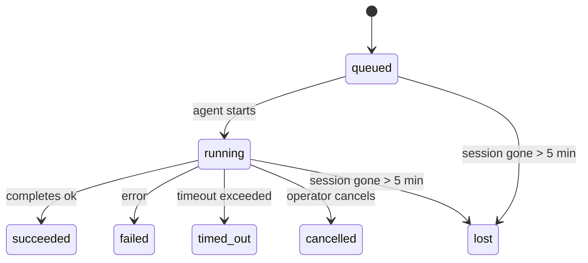

---
read_when:
    - 检查正在进行中或最近完成的后台工作
    - 调试分离式智能体运行的交付失败问题
    - 了解后台运行与会话、cron 和心跳之间的关系
sidebarTitle: Background tasks
summary: 用于 ACP 运行、子智能体、隔离的 cron 作业和 CLI 操作的后台任务跟踪
title: 后台任务
x-i18n:
    generated_at: "2026-04-26T06:29:02Z"
    model: gpt-5.4
    provider: openai
    source_hash: 46952a378babdee9f43102bfa71dbd35b6ca7ecb142ffce3785eeb479e19d6b6
    source_path: automation/tasks.md
    workflow: 15
---

<Note>
在寻找调度方式？请参阅 [Automation & Tasks](/zh-CN/automation) 以选择合适的机制。本页介绍的是如何**跟踪**后台工作，而不是如何调度它。
</Note>

后台任务用于跟踪**在你的主会话之外**运行的工作：ACP 运行、子智能体生成、隔离的 cron 作业执行，以及由 CLI 发起的操作。

任务**不会**替代会话、cron 作业或心跳——它们是记录分离式工作发生了什么、何时发生以及是否成功的**活动账本**。

<Note>
并非每次智能体运行都会创建任务。心跳轮次和普通交互式聊天不会创建任务。所有 cron 执行、ACP 生成、子智能体生成以及 CLI 智能体命令都会创建任务。
</Note>

## TL;DR

- 任务是**记录**，不是调度器——cron 和心跳决定工作**何时**运行，任务则跟踪**发生了什么**。
- ACP、子智能体、所有 cron 作业和 CLI 操作都会创建任务。心跳轮次不会。
- 每个任务都会经历 `queued → running → terminal`（succeeded、failed、timed_out、cancelled 或 lost）。
- 只要 cron 运行时仍然拥有该作业，cron 任务就会保持活动状态；如果内存中的运行时状态已经丢失，任务维护会先检查持久化的 cron 运行历史，再决定是否将任务标记为 lost。
- 完成采用推送驱动：分离式工作完成时可以直接通知，或唤醒请求者会话/心跳，因此状态轮询循环通常不是合适的方式。
- 隔离的 cron 运行和子智能体完成后，会尽力为其子会话清理已跟踪的浏览器标签页/进程，然后再完成最终清理记账。
- 隔离的 cron 交付会在后代子智能体工作仍在清空期间抑制陈旧的中间父级回复，并且如果最终后代输出在交付前到达，会优先使用它。
- 完成通知会直接发送到某个渠道，或排队等待下一次心跳。
- `openclaw tasks list` 显示所有任务；`openclaw tasks audit` 会显示问题。
- 终态记录会保留 7 天，之后自动清理。

## 快速开始

<Tabs>
  <Tab title="列出并筛选">
    ```bash
    # 列出所有任务（最新的在前）
    openclaw tasks list

    # 按运行时或状态筛选
    openclaw tasks list --runtime acp
    openclaw tasks list --status running
    ```

  </Tab>
  <Tab title="查看">
    ```bash
    # 显示特定任务的详细信息（通过 ID、运行 ID 或会话键）
    openclaw tasks show <lookup>
    ```
  </Tab>
  <Tab title="取消并通知">
    ```bash
    # 取消正在运行的任务（终止子会话）
    openclaw tasks cancel <lookup>

    # 更改任务的通知策略
    openclaw tasks notify <lookup> state_changes
    ```

  </Tab>
  <Tab title="审计与维护">
    ```bash
    # 运行健康审计
    openclaw tasks audit

    # 预览或应用维护
    openclaw tasks maintenance
    openclaw tasks maintenance --apply
    ```

  </Tab>
  <Tab title="任务流">
    ```bash
    # 检查 TaskFlow 状态
    openclaw tasks flow list
    openclaw tasks flow show <lookup>
    openclaw tasks flow cancel <lookup>
    ```
  </Tab>
</Tabs>

## 什么会创建任务

| 来源 | 运行时类型 | 何时创建任务记录 | 默认通知策略 |
| ---------------------- | ------------ | ------------------------------------------------------ | --------------------- |
| ACP 后台运行 | `acp` | 生成 ACP 子会话时 | `done_only` |
| 子智能体编排 | `subagent` | 通过 `sessions_spawn` 生成子智能体时 | `done_only` |
| cron 作业（所有类型） | `cron` | 每次 cron 执行时（主会话和隔离执行都包括） | `silent` |
| CLI 操作 | `cli` | 通过 Gateway 网关运行的 `openclaw agent` 命令 | `silent` |
| 智能体媒体作业 | `cli` | 由会话支持的 `video_generate` 运行 | `silent` |

<AccordionGroup>
  <Accordion title="cron 和媒体的默认通知">
    主会话 cron 任务默认使用 `silent` 通知策略——它们会创建用于跟踪的记录，但不会生成通知。隔离的 cron 任务也默认使用 `silent`，但由于它们在自己的会话中运行，因此更容易被看到。

    由会话支持的 `video_generate` 运行也使用 `silent` 通知策略。它们仍然会创建任务记录，但完成结果会作为内部唤醒返回给原始智能体会话，以便智能体自行编写后续消息并附加已完成的视频。如果你启用了 `tools.media.asyncCompletion.directSend`，异步 `music_generate` 和 `video_generate` 完成时会先尝试直接发送到渠道，然后在失败时回退到请求者会话唤醒路径。

  </Accordion>
  <Accordion title="并发 video_generate 防护">
    当某个由会话支持的 `video_generate` 任务仍在活动中时，该工具还会充当一道防护：同一会话中重复调用 `video_generate` 会返回活动任务状态，而不是启动第二个并发生成任务。当你希望智能体端显式查询进度/状态时，请使用 `action: "status"`。
  </Accordion>
  <Accordion title="哪些情况不会创建任务">
    - 心跳轮次——主会话；请参阅 [Heartbeat](/zh-CN/gateway/heartbeat)
    - 普通交互式聊天轮次
    - 直接 `/command` 响应
  </Accordion>
</AccordionGroup>

## 任务生命周期



| 状态 | 含义 |
| ----------- | -------------------------------------------------------------------------- |
| `queued` | 已创建，等待智能体启动 |
| `running` | 智能体轮次正在主动执行 |
| `succeeded` | 已成功完成 |
| `failed` | 已因错误完成 |
| `timed_out` | 已超出配置的超时时间 |
| `cancelled` | 由操作员通过 `openclaw tasks cancel` 停止 |
| `lost` | 运行时在 5 分钟宽限期后丢失了权威的支撑状态 |

状态转换会自动发生——当关联的智能体运行结束时，任务状态会更新为对应结果。

对于活动任务记录，智能体运行完成是权威依据。成功完成的分离式运行会最终记为 `succeeded`，普通运行错误会最终记为 `failed`，超时或中止结果会最终记为 `timed_out`。如果操作员已经取消该任务，或者运行时已经记录了更强的终态，例如 `failed`、`timed_out` 或 `lost`，那么后续的成功信号不会降低该终态状态。

`lost` 具备运行时感知能力：

- ACP 任务：底层 ACP 子会话元数据已消失。
- 子智能体任务：目标智能体存储中的底层子会话已消失。
- cron 任务：cron 运行时不再将该作业跟踪为活动状态，且持久化 cron 运行历史中也未显示该运行的终态结果。离线 CLI 审计不会把它自身空的进程内 cron 运行时状态视为权威依据。
- CLI 任务：隔离的子会话任务使用子会话；由聊天支持的 CLI 任务则改用实时运行上下文，因此残留的渠道/群组/私信会话行不会让它们保持活动。由 Gateway 网关支持的 `openclaw agent` 运行也会根据其运行结果完成终结，因此已完成的运行不会一直保持活动，直到清扫器将其标记为 `lost`。

## 交付与通知

当任务到达终态时，OpenClaw 会通知你。有两种交付路径：

**直接交付**——如果任务有渠道目标（`requesterOrigin`），完成消息会直接发送到该渠道（Telegram、Discord、Slack 等）。对于子智能体完成，OpenClaw 还会在可用时保留绑定的线程/主题路由，并且在放弃直接交付前，可以使用请求者会话中存储的路由（`lastChannel` / `lastTo` / `lastAccountId`）来补全缺失的 `to` / account。

**会话排队交付**——如果直接交付失败，或者未设置来源，则更新会作为系统事件排入请求者会话，并在下一次心跳时显示。

<Tip>
任务完成会立即触发一次心跳唤醒，因此你能很快看到结果——不必等待下一次计划中的心跳 tick。
</Tip>

这意味着通常的工作流是基于推送的：只需启动一次分离式工作，然后让运行时在完成时唤醒或通知你。只有在你需要调试、干预或进行显式审计时，才去轮询任务状态。

### 通知策略

控制你希望收到每个任务的多少信息：

| 策略 | 将交付的内容 |
| --------------------- | ----------------------------------------------------------------------- |
| `done_only`（默认） | 仅终态（succeeded、failed 等）——**这是默认值** |
| `state_changes` | 每次状态转换和进度更新 |
| `silent` | 完全不通知 |

在任务运行期间更改策略：

```bash
openclaw tasks notify <lookup> state_changes
```

## CLI 参考

<AccordionGroup>
  <Accordion title="tasks list">
    ```bash
    openclaw tasks list [--runtime <acp|subagent|cron|cli>] [--status <status>] [--json]
    ```

    输出列：Task ID、类型、状态、交付、Run ID、子会话、摘要。

  </Accordion>
  <Accordion title="tasks show">
    ```bash
    openclaw tasks show <lookup>
    ```

    查找标记接受任务 ID、运行 ID 或会话键。会显示完整记录，包括时间、交付状态、错误和终态摘要。

  </Accordion>
  <Accordion title="tasks cancel">
    ```bash
    openclaw tasks cancel <lookup>
    ```

    对于 ACP 和子智能体任务，这会终止子会话。对于由 CLI 跟踪的任务，取消操作会记录在任务注册表中（没有单独的子运行时句柄）。状态会转换为 `cancelled`，并在适用时发送交付通知。

  </Accordion>
  <Accordion title="tasks notify">
    ```bash
    openclaw tasks notify <lookup> <done_only|state_changes|silent>
    ```
  </Accordion>
  <Accordion title="tasks audit">
    ```bash
    openclaw tasks audit [--json]
    ```

    显示运维问题。检测到问题时，相关发现也会出现在 `openclaw status` 中。

    | 发现项 | 严重级别 | 触发条件 |
    | ------------------------- | ---------- | ------------------------------------------------------------------------------------------------------------ |
    | `stale_queued` | warn | 排队超过 10 分钟 |
    | `stale_running` | error | 运行超过 30 分钟 |
    | `lost` | warn/error | 由运行时支持的任务归属状态已消失；保留的 lost 任务在 `cleanupAfter` 之前显示为警告，之后变为错误 |
    | `delivery_failed` | warn | 交付失败，且通知策略不是 `silent` |
    | `missing_cleanup` | warn | 终态任务没有清理时间戳 |
    | `inconsistent_timestamps` | warn | 时间线冲突（例如结束时间早于开始时间） |

  </Accordion>
  <Accordion title="tasks maintenance">
    ```bash
    openclaw tasks maintenance [--json]
    openclaw tasks maintenance --apply [--json]
    ```

    使用此命令可预览或应用任务和 Task Flow 状态的协调、清理标记和裁剪。

    协调具备运行时感知能力：

    - ACP/子智能体任务会检查其底层子会话。
    - cron 任务会检查 cron 运行时是否仍然拥有该作业，然后在回退到 `lost` 之前，从持久化的 cron 运行日志/作业状态中恢复终态状态。只有 Gateway 网关进程才是内存中 cron 活动作业集合的权威来源；离线 CLI 审计会使用持久化历史，但不会仅因为本地 Set 为空就将某个 cron 任务标记为 lost。
    - 由聊天支持的 CLI 任务会检查其所属的实时运行上下文，而不只是聊天会话行。

    完成清理同样具备运行时感知能力：

    - 子智能体完成时，会尽力在继续公告清理之前关闭该子会话已跟踪的浏览器标签页/进程。
    - 隔离的 cron 完成时，会尽力在该运行完全拆除之前关闭 cron 会话已跟踪的浏览器标签页/进程。
    - 隔离的 cron 交付会在需要时等待后代子智能体的后续处理完成，并抑制陈旧的父级确认文本，而不是将其公告出去。
    - 子智能体完成交付会优先采用最新的可见 assistant 文本；如果该文本为空，则回退到已清理的最新 tool/toolResult 文本，而仅包含超时工具调用的运行可以收缩为简短的部分进度摘要。终态失败的运行会公告失败状态，而不会重放已捕获的回复文本。
    - 清理失败不会掩盖真实的任务结果。

  </Accordion>
  <Accordion title="tasks flow list | show | cancel">
    ```bash
    openclaw tasks flow list [--status <status>] [--json]
    openclaw tasks flow show <lookup> [--json]
    openclaw tasks flow cancel <lookup>
    ```

    当你关心的是编排中的 Task Flow，而不是某一条单独的后台任务记录时，请使用这些命令。

  </Accordion>
</AccordionGroup>

## 聊天任务看板（`/tasks`）

在任意聊天会话中使用 `/tasks` 可查看与该会话关联的后台任务。该看板会显示活动中和最近完成的任务，包括运行时、状态、时间，以及进度或错误详情。

如果当前会话没有可见的关联任务，`/tasks` 会回退为显示智能体本地任务计数，这样你仍然可以看到概览，同时不会泄露其他会话的详细信息。

如需查看完整的操作员账本，请使用 CLI：`openclaw tasks list`。

## Status 集成（任务压力）

`openclaw status` 包含一个任务概览摘要：

```
Tasks: 3 queued · 2 running · 1 issues
```

该摘要报告：

- **active** — `queued` + `running` 的数量
- **failures** — `failed` + `timed_out` + `lost` 的数量
- **byRuntime** — 按 `acp`、`subagent`、`cron`、`cli` 的分类明细

`/status` 和 `session_status` 工具都会使用具备清理感知能力的任务快照：优先显示活动任务，隐藏陈旧的已完成记录，且只有在没有活动工作剩余时才显示近期失败。这让状态卡片聚焦于当前真正重要的内容。

## 存储与维护

### 任务存储位置

任务记录持久化到以下 SQLite 位置：

```
$OPENCLAW_STATE_DIR/tasks/runs.sqlite
```

注册表会在 Gateway 网关启动时加载到内存中，并将写入同步到 SQLite，以确保重启后的持久性。

### 自动维护

清扫器每 **60 秒** 运行一次，并处理三件事：

<Steps>
  <Step title="协调">
    检查活动任务是否仍然具有权威的运行时支撑。ACP/子智能体任务使用子会话状态，cron 任务使用活动作业归属状态，而由聊天支持的 CLI 任务使用其所属的运行上下文。如果该支撑状态消失超过 5 分钟，任务会被标记为 `lost`。
  </Step>
  <Step title="清理标记">
    为终态任务设置 `cleanupAfter` 时间戳（`endedAt + 7 days`）。在保留期内，lost 任务在审计中仍显示为警告；在 `cleanupAfter` 到期后或缺少清理元数据时，它们会显示为错误。
  </Step>
  <Step title="裁剪">
    删除已超过其 `cleanupAfter` 日期的记录。
  </Step>
</Steps>

<Note>
**保留期：** 终态任务记录会保留 **7 天**，然后自动清理。无需任何配置。
</Note>

## 任务与其他系统的关系

<AccordionGroup>
  <Accordion title="任务与 Task Flow">
    [Task Flow](/zh-CN/automation/taskflow) 是位于后台任务之上的流程编排层。单个 flow 在其生命周期内可以通过托管或镜像同步模式来协调多个任务。使用 `openclaw tasks` 检查单个任务记录，使用 `openclaw tasks flow` 检查编排 flow。

    详情请参阅 [Task Flow](/zh-CN/automation/taskflow)。

  </Accordion>
  <Accordion title="任务与 cron">
    cron 作业**定义**位于 `~/.openclaw/cron/jobs.json`；运行时执行状态位于其旁边的 `~/.openclaw/cron/jobs-state.json`。**每一次** cron 执行都会创建一条任务记录——无论是主会话还是隔离执行。主会话 cron 任务默认使用 `silent` 通知策略，因此它们会被跟踪，但不会生成通知。

    请参阅 [Cron Jobs](/zh-CN/automation/cron-jobs)。

  </Accordion>
  <Accordion title="任务与心跳">
    心跳运行属于主会话轮次——它们不会创建任务记录。任务完成时，它可以触发一次心跳唤醒，以便你及时看到结果。

    请参阅 [Heartbeat](/zh-CN/gateway/heartbeat)。

  </Accordion>
  <Accordion title="任务与会话">
    任务可能会引用 `childSessionKey`（工作运行的位置）和 `requesterSessionKey`（启动它的人）。会话是对话上下文；任务则是在其之上的活动跟踪。
  </Accordion>
  <Accordion title="任务与智能体运行">
    任务的 `runId` 会链接到执行该工作的智能体运行。智能体生命周期事件（开始、结束、错误）会自动更新任务状态——你无需手动管理生命周期。
  </Accordion>
</AccordionGroup>

## 相关内容

- [Automation & Tasks](/zh-CN/automation) — 所有自动化机制一览
- [CLI: Tasks](/zh-CN/cli/tasks) — CLI 命令参考
- [Heartbeat](/zh-CN/gateway/heartbeat) — 周期性的主会话轮次
- [Scheduled Tasks](/zh-CN/automation/cron-jobs) — 调度后台工作
- [Task Flow](/zh-CN/automation/taskflow) — 位于任务之上的流程编排
