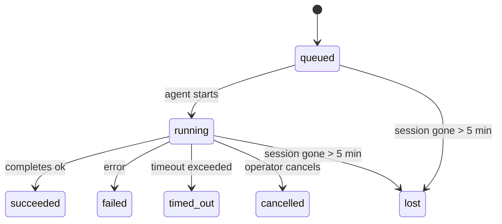

---
read_when:
    - 检查正在进行中或最近完成的后台工作
    - 调试已分离智能体运行的交付失败问题
    - 了解后台运行与会话、cron 和心跳之间的关系
sidebarTitle: Background tasks
summary: 用于 ACP 运行、子智能体、隔离的 cron 作业和 CLI 操作的后台任务跟踪
title: 后台任务
x-i18n:
    generated_at: "2026-04-27T12:50:24Z"
    model: gpt-5.4
    provider: openai
    source_hash: 49e52482083aa0e1eac40dcea0246ef73a396f22eef4f26649ff2e6ccbd6965d
    source_path: automation/tasks.md
    workflow: 15
---

<Note>
在寻找调度方式？请参阅 [Automation and tasks](/zh-CN/automation) 以选择合适的机制。本页是后台工作的活动账本，不是调度器。
</Note>

后台任务用于跟踪**主对话会话之外**运行的工作：ACP 运行、子智能体派生、隔离的 cron 作业执行，以及由 CLI 发起的操作。

任务**不会**替代会话、cron 作业或心跳——它们是记录已分离工作发生了什么、何时发生以及是否成功的**活动账本**。

<Note>
并非每次智能体运行都会创建任务。心跳轮次和普通交互式聊天不会。所有 cron 执行、ACP 派生、子智能体派生和 CLI 智能体命令都会创建任务。
</Note>

## TL;DR

- 任务是**记录**，不是调度器——cron 和心跳决定工作_何时_运行，任务跟踪_发生了什么_。
- ACP、子智能体、所有 cron 作业和 CLI 操作都会创建任务。心跳轮次不会。
- 每个任务都会经历 `queued → running → terminal`（`succeeded`、`failed`、`timed_out`、`cancelled` 或 `lost`）。
- 只要 cron 运行时仍然持有该作业，cron 任务就会保持活动状态；如果内存中的运行时状态已丢失，任务维护会先检查持久化的 cron 运行历史，再决定是否将任务标记为 `lost`。
- 完成是由推送驱动的：已分离工作完成时，可以直接通知，也可以唤醒请求方会话/心跳，因此轮询状态通常不是合适的方式。
- 隔离的 cron 运行和子智能体完成时，会尽力清理其子会话所跟踪的浏览器标签页/进程，然后再完成最终清理记账。
- 当后代子智能体工作仍在收尾时，隔离的 cron 交付会抑制陈旧的中间父级回复；如果后代最终输出在交付前到达，则优先使用后代最终输出。
- 完成通知会直接投递到某个渠道，或排队等待下一次心跳。
- `openclaw tasks list` 显示所有任务；`openclaw tasks audit` 会显示问题。
- 终态记录会保留 7 天，然后自动清理。

## 快速开始

<Tabs>
  <Tab title="列出并筛选">
    ```bash
    # 列出所有任务（最新优先）
    openclaw tasks list

    # 按运行时或状态筛选
    openclaw tasks list --runtime acp
    openclaw tasks list --status running
    ```

  </Tab>
  <Tab title="检查">
    ```bash
    # 显示特定任务的详细信息（按 ID、运行 ID 或会话键）
    openclaw tasks show <lookup>
    ```
  </Tab>
  <Tab title="取消并通知">
    ```bash
    # 取消一个正在运行的任务（会终止子会话）
    openclaw tasks cancel <lookup>

    # 更改任务的通知策略
    openclaw tasks notify <lookup> state_changes
    ```

  </Tab>
  <Tab title="审计和维护">
    ```bash
    # 运行健康审计
    openclaw tasks audit

    # 预览或应用维护
    openclaw tasks maintenance
    openclaw tasks maintenance --apply
    ```

  </Tab>
  <Tab title="任务流">
    ```bash
    # 检查 TaskFlow 状态
    openclaw tasks flow list
    openclaw tasks flow show <lookup>
    openclaw tasks flow cancel <lookup>
    ```
  </Tab>
</Tabs>

## 什么会创建任务

| 来源 | Runtime 类型 | 何时创建任务记录 | 默认通知策略 |
| ---------------------- | ------------ | ------------------------------------------------------ | --------------------- |
| ACP 后台运行 | `acp` | 派生一个 ACP 子会话时 | `done_only` |
| 子智能体编排 | `subagent` | 通过 `sessions_spawn` 派生子智能体时 | `done_only` |
| cron 作业（所有类型） | `cron` | 每次 cron 执行时（主会话和隔离运行都包括） | `silent` |
| CLI 操作 | `cli` | 通过 Gateway 网关运行的 `openclaw agent` 命令 | `silent` |
| 智能体媒体作业 | `cli` | 具备会话支持的 `video_generate` 运行 | `silent` |

<AccordionGroup>
  <Accordion title="cron 和媒体的通知默认值">
    主会话 cron 任务默认使用 `silent` 通知策略——它们会创建用于跟踪的记录，但不会生成通知。隔离的 cron 任务也默认使用 `silent`，但由于它们在自己的会话中运行，因此更容易被看到。

    具备会话支持的 `video_generate` 运行同样使用 `silent` 通知策略。它们仍会创建任务记录，但完成结果会作为内部唤醒返回给原始智能体会话，以便智能体自行编写后续消息并附加生成完成的视频。如果你启用了 `tools.media.asyncCompletion.directSend`，异步 `music_generate` 和 `video_generate` 完成时会优先尝试直接投递到渠道，失败后再回退到唤醒请求方会话的路径。

  </Accordion>
  <Accordion title="并发 video_generate 防护">
    当具备会话支持的 `video_generate` 任务仍处于活动状态时，该工具还会充当防护：同一会话中重复调用 `video_generate` 会返回活动任务状态，而不会启动第二个并发生成。如果你想从智能体侧显式查询进度/状态，请使用 `action: "status"`。
  </Accordion>
  <Accordion title="哪些情况不会创建任务">
    - 心跳轮次——主会话；参见 [Heartbeat](/zh-CN/gateway/heartbeat)
    - 普通交互式聊天轮次
    - 直接 `/command` 响应
  </Accordion>
</AccordionGroup>

## 任务生命周期



| Status | 含义 |
| ----------- | -------------------------------------------------------------------------- |
| `queued` | 已创建，正在等待智能体启动 |
| `running` | 智能体轮次正在积极执行 |
| `succeeded` | 已成功完成 |
| `failed` | 已因错误完成 |
| `timed_out` | 超过了配置的超时时间 |
| `cancelled` | 由操作者通过 `openclaw tasks cancel` 停止 |
| `lost` | 经过 5 分钟宽限期后，运行时丢失了权威的后端状态 |

状态转换会自动发生——当关联的智能体运行结束时，任务状态会更新为相应结果。

对于活动任务记录，智能体运行完成是权威依据。成功的已分离运行会最终记为 `succeeded`，普通运行错误会最终记为 `failed`，超时或中止结果会最终记为 `timed_out`。如果操作者已经取消了任务，或者运行时已经记录了更强的终态，例如 `failed`、`timed_out` 或 `lost`，则后续的成功信号不会降低该终态状态。

`lost` 是感知运行时类型的：

- ACP 任务：其后端 ACP 子会话元数据已消失。
- 子智能体任务：其后端子会话已从目标智能体存储中消失。
- cron 任务：cron 运行时不再将该作业视为活动状态，且持久化的 cron 运行历史中也没有该次运行的终态结果。离线 CLI 审计不会把它自身空的进程内 cron 运行时状态视为权威依据。
- CLI 任务：隔离的子会话任务使用子会话；基于聊天的 CLI 任务则改为使用实时运行上下文，因此持续存在的渠道/群组/私信会话行不会让它们继续保持活动。由 Gateway 网关支持的 `openclaw agent` 运行也会根据其运行结果完成最终状态，因此已完成的运行不会一直保持活动，直到清扫器把它们标记为 `lost`。

## 交付和通知

当任务到达终态时，OpenClaw 会通知你。有两种交付路径：

**直接交付**——如果任务具有渠道目标（即 `requesterOrigin`），完成消息会直接发送到该渠道（Telegram、Discord、Slack 等）。对于子智能体完成，OpenClaw 还会在可用时保留已绑定的线程/话题路由，并且在直接交付放弃之前，可以从请求方会话存储的路由（`lastChannel` / `lastTo` / `lastAccountId`）中补全缺失的 `to` / account。

**会话排队交付**——如果直接交付失败，或者未设置来源，更新会作为系统事件排入请求方会话，并在下一次心跳时显示出来。

<Tip>
任务完成会立即触发一次心跳唤醒，因此你可以很快看到结果——不必等到下一次计划中的心跳触发。
</Tip>

这意味着通常的工作流是基于推送的：启动一次已分离工作，然后让运行时在完成时唤醒或通知你。只有在你需要调试、干预或进行显式审计时，才去轮询任务状态。

### 通知策略

控制你希望听到每个任务的哪些信息：

| 策略 | 会交付的内容 |
| --------------------- | ----------------------------------------------------------------------- |
| `done_only` (默认) | 仅终态（`succeeded`、`failed` 等）——**这是默认值** |
| `state_changes` | 每次状态变化和进度更新 |
| `silent` | 完全不通知 |

在任务运行期间更改策略：

```bash
openclaw tasks notify <lookup> state_changes
```

## CLI 参考

<AccordionGroup>
  <Accordion title="tasks list">
    ```bash
    openclaw tasks list [--runtime <acp|subagent|cron|cli>] [--status <status>] [--json]
    ```

    输出列：任务 ID、种类、状态、交付、运行 ID、子会话、摘要。

  </Accordion>
  <Accordion title="tasks show">
    ```bash
    openclaw tasks show <lookup>
    ```

    查找标记接受任务 ID、运行 ID 或会话键。显示完整记录，包括计时、交付状态、错误和终态摘要。

  </Accordion>
  <Accordion title="tasks cancel">
    ```bash
    openclaw tasks cancel <lookup>
    ```

    对于 ACP 和子智能体任务，这会终止子会话。对于由 CLI 跟踪的任务，取消操作会记录在任务注册表中（没有单独的子运行时句柄）。状态会转为 `cancelled`，并在适用时发送交付通知。

  </Accordion>
  <Accordion title="tasks notify">
    ```bash
    openclaw tasks notify <lookup> <done_only|state_changes|silent>
    ```
  </Accordion>
  <Accordion title="tasks audit">
    ```bash
    openclaw tasks audit [--json]
    ```

    显示运行相关问题。检测到问题时，这些发现也会出现在 `openclaw status` 中。

    | 发现项 | 严重级别 | 触发条件 |
    | ------------------------- | ---------- | ------------------------------------------------------------------------------------------------------------ |
    | `stale_queued` | warn | 已排队超过 10 分钟 |
    | `stale_running` | error | 已运行超过 30 分钟 |
    | `lost` | warn/error | 由运行时支持的任务归属已消失；保留的 `lost` 任务在 `cleanupAfter` 之前为警告，之后变为错误 |
    | `delivery_failed` | warn | 交付失败，且通知策略不是 `silent` |
    | `missing_cleanup` | warn | 处于终态但没有清理时间戳的任务 |
    | `inconsistent_timestamps` | warn | 时间线冲突（例如结束时间早于开始时间） |

  </Accordion>
  <Accordion title="tasks maintenance">
    ```bash
    openclaw tasks maintenance [--json]
    openclaw tasks maintenance --apply [--json]
    ```

    用它来预览或应用任务及 Task Flow 状态的对账、清理标记和清除。

    对账是感知运行时类型的：

    - ACP/子智能体任务会检查其后端子会话。
    - cron 任务会检查 cron 运行时是否仍持有该作业，然后在回退为 `lost` 之前，从持久化的 cron 运行日志/作业状态中恢复终态。只有 Gateway 网关进程对内存中的 cron 活动作业集合具有权威性；离线 CLI 审计会使用持久化历史，但不会仅因本地该 Set 为空就将 cron 任务标记为 `lost`。
    - 基于聊天的 CLI 任务会检查拥有该任务的实时运行上下文，而不只是聊天会话行。

    完成清理同样是感知运行时类型的：

    - 子智能体完成时，会尽力在通知清理继续前关闭子会话所跟踪的浏览器标签页/进程。
    - 隔离的 cron 完成时，会尽力在该次运行彻底拆除前关闭 cron 会话所跟踪的浏览器标签页/进程。
    - 必要时，隔离的 cron 交付会等待后代子智能体的后续处理完成，并抑制陈旧的父级确认文本，而不是将其通告出去。
    - 子智能体完成交付会优先使用最新的可见 assistant 文本；如果该文本为空，则回退到已净化的最新 tool/toolResult 文本，而仅有超时的工具调用运行可以折叠为简短的部分进度摘要。终态失败的运行会通告失败状态，而不会重放已捕获的回复文本。
    - 清理失败不会掩盖真实的任务结果。

  </Accordion>
  <Accordion title="tasks flow list | show | cancel">
    ```bash
    openclaw tasks flow list [--status <status>] [--json]
    openclaw tasks flow show <lookup> [--json]
    openclaw tasks flow cancel <lookup>
    ```

    当你关心的是编排中的 Task Flow，而不是某一条单独的后台任务记录时，请使用这些命令。

  </Accordion>
</AccordionGroup>

## 聊天任务面板（`/tasks`）

在任意聊天会话中使用 `/tasks` 可查看与该会话关联的后台任务。面板会显示活动中和最近完成的任务，包括运行时、状态、时序以及进度或错误详情。

当当前会话没有可见的关联任务时，`/tasks` 会回退为智能体本地任务计数，这样你仍能获得概览，同时不会泄露其他会话的细节。

如需完整的操作者账本，请使用 CLI：`openclaw tasks list`。

## Status 集成（任务压力）

`openclaw status` 包含一个可快速查看的任务摘要：

```
Tasks: 3 queued · 2 running · 1 issues
```

该摘要会报告：

- **active** —— `queued` + `running` 的数量
- **failures** —— `failed` + `timed_out` + `lost` 的数量
- **byRuntime** —— 按 `acp`、`subagent`、`cron`、`cli` 分类的明细

`/status` 和 `session_status` 工具都使用感知清理状态的任务快照：优先显示活动任务，隐藏陈旧的已完成记录，且仅在没有活动工作残留时才显示最近失败。这使状态卡片聚焦于当前最重要的内容。

## 存储和维护

### 任务存储位置

任务记录会持久化到以下 SQLite 路径：

```
$OPENCLAW_STATE_DIR/tasks/runs.sqlite
```

注册表会在 Gateway 网关启动时加载到内存中，并将写入同步到 SQLite，以确保重启后仍具备持久性。
Gateway 网关会使用 SQLite 默认的自动检查点阈值，以及周期性和关闭时的 `TRUNCATE` 检查点，将 SQLite 的预写日志保持在受控范围内。

### 自动维护

清扫器每 **60 秒** 运行一次，并处理三项内容：

<Steps>
  <Step title="对账">
    检查活动任务是否仍有权威的运行时后端支持。ACP/子智能体任务使用子会话状态，cron 任务使用活动作业归属，基于聊天的 CLI 任务使用拥有该任务的运行上下文。如果该后端状态消失超过 5 分钟，任务就会被标记为 `lost`。
  </Step>
  <Step title="清理标记">
    为终态任务设置 `cleanupAfter` 时间戳（`endedAt + 7 days`）。在保留期内，`lost` 任务在审计中仍显示为警告；当 `cleanupAfter` 过期或缺少清理元数据时，它们就会变为错误。
  </Step>
  <Step title="清除">
    删除超过其 `cleanupAfter` 日期的记录。
  </Step>
</Steps>

<Note>
**保留期：** 终态任务记录会保留 **7 天**，之后自动清除。无需任何配置。
</Note>

## 任务与其他系统的关系

<AccordionGroup>
  <Accordion title="任务与 Task Flow">
    [Task Flow](/zh-CN/automation/taskflow) 是位于后台任务之上的流程编排层。单个流程在其生命周期内可能通过托管或镜像同步模式协调多个任务。使用 `openclaw tasks` 检查单个任务记录，使用 `openclaw tasks flow` 检查编排流程。

    详见 [Task Flow](/zh-CN/automation/taskflow)。

  </Accordion>
  <Accordion title="任务与 cron">
    cron 作业的**定义**位于 `~/.openclaw/cron/jobs.json`；运行时执行状态位于其旁边的 `~/.openclaw/cron/jobs-state.json`。**每次** cron 执行都会创建一条任务记录——无论是主会话还是隔离运行。主会话 cron 任务默认使用 `silent` 通知策略，因此它们会被跟踪，但不会生成通知。

    参见 [Cron Jobs](/zh-CN/automation/cron-jobs)。

  </Accordion>
  <Accordion title="任务与心跳">
    心跳运行属于主会话轮次——它们不会创建任务记录。当任务完成时，它可以触发一次心跳唤醒，以便你及时看到结果。

    参见 [Heartbeat](/zh-CN/gateway/heartbeat)。

  </Accordion>
  <Accordion title="任务与会话">
    一个任务可能会引用 `childSessionKey`（工作运行的位置）和 `requesterSessionKey`（启动它的人）。会话是对话上下文；任务是在其之上的活动跟踪。
  </Accordion>
  <Accordion title="任务与智能体运行">
    任务的 `runId` 会链接到执行该工作的智能体运行。智能体生命周期事件（开始、结束、错误）会自动更新任务状态——你无需手动管理生命周期。
  </Accordion>
</AccordionGroup>

## 相关内容

- [Automation & Tasks](/zh-CN/automation) —— 自动化机制总览
- [CLI: Tasks](/zh-CN/cli/tasks) —— CLI 命令参考
- [Heartbeat](/zh-CN/gateway/heartbeat) —— 周期性的主会话轮次
- [Scheduled Tasks](/zh-CN/automation/cron-jobs) —— 调度后台工作
- [Task Flow](/zh-CN/automation/taskflow) —— 位于任务之上的流程编排
