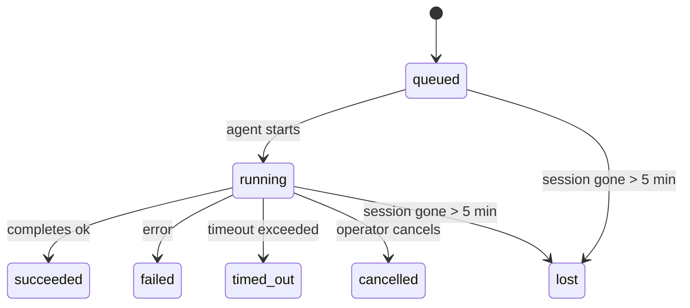

---
read_when:
    - 检查正在进行或最近完成的后台工作
    - 调试分离式智能体运行的投递失败
    - 了解后台运行与会话、cron 和 Heartbeat 的关系
sidebarTitle: Background tasks
summary: 用于 ACP 运行、子智能体、隔离 cron 作业和 CLI 操作的后台任务跟踪
title: 后台任务
x-i18n:
    generated_at: "2026-05-05T05:18:10Z"
    model: gpt-5.5
    provider: openai
    source_hash: bafd959feaf2e220820ec56bf1ef144207d05757418e9971ebf427844cf30c46
    source_path: automation/tasks.md
    workflow: 16
---

<Note>
在选择合适的机制时，如果要找调度相关内容，请参见[自动化和任务](/zh-CN/automation)。本页是后台工作的活动台账，不是调度器。
</Note>

后台任务跟踪在**主对话会话之外**运行的工作：ACP 运行、子智能体生成、隔离 cron job 执行，以及由 CLI 发起的操作。

任务**不会**取代会话、cron job 或 Heartbeat —— 它们是记录发生了哪些分离式工作、发生时间以及是否成功的**活动台账**。

<Note>
并非每次智能体运行都会创建任务。Heartbeat 轮次和普通交互式聊天不会。所有 cron 执行、ACP 生成、子智能体生成以及 CLI 智能体命令都会创建任务。
</Note>

## TL;DR

- 任务是**记录**，不是调度器 —— cron 和 Heartbeat 决定工作_何时_运行，任务跟踪_发生了什么_。
- ACP、子智能体、所有 cron job 和 CLI 操作会创建任务。Heartbeat 轮次不会。
- 每个任务都会经过 `queued → running → terminal`（succeeded、failed、timed_out、cancelled 或 lost）。
- 只要 cron 运行时仍然拥有该作业，cron 任务就会保持活动状态；如果
  内存中的运行时状态已经消失，任务维护会先检查持久化 cron
  运行历史，再将任务标记为 lost。
- 完成由推送驱动：分离式工作可以在完成时直接通知，或唤醒
  请求方会话/Heartbeat，因此状态轮询循环通常不是合适的形态。
- 隔离 cron 运行和子智能体完成会尽力清理其子会话中已跟踪的浏览器标签页/进程，然后再进行最终清理记账。
- 隔离 cron 投递会在后代子智能体工作仍在排空时抑制过时的临时父级回复，并且如果最终后代输出在投递前到达，会优先使用它。
- 完成通知会直接投递到渠道，或排队等待下一次 Heartbeat。
- `openclaw tasks list` 显示所有任务；`openclaw tasks audit` 会呈现问题。
- 终态记录会保留 7 天，然后自动清理。

## 快速开始

<Tabs>
  <Tab title="列出和筛选">
    ```bash
    # 列出所有任务（最新在前）
    openclaw tasks list

    # 按运行时或状态筛选
    openclaw tasks list --runtime acp
    openclaw tasks list --status running
    ```

  </Tab>
  <Tab title="检查">
    ```bash
    # 显示特定任务的详情（按 ID、运行 ID 或会话键）
    openclaw tasks show <lookup>
    ```
  </Tab>
  <Tab title="取消和通知">
    ```bash
    # 取消正在运行的任务（终止子会话）
    openclaw tasks cancel <lookup>

    # 更改任务的通知策略
    openclaw tasks notify <lookup> state_changes
    ```

  </Tab>
  <Tab title="审计和维护">
    ```bash
    # 运行健康审计
    openclaw tasks audit

    # 预览或应用维护
    openclaw tasks maintenance
    openclaw tasks maintenance --apply
    ```

  </Tab>
  <Tab title="任务流">
    ```bash
    # 检查 TaskFlow 状态
    openclaw tasks flow list
    openclaw tasks flow show <lookup>
    openclaw tasks flow cancel <lookup>
    ```
  </Tab>
</Tabs>

## 什么会创建任务

| 来源                   | 运行时类型 | 任务记录的创建时机                                       | 默认通知策略 |
| ---------------------- | ---------- | -------------------------------------------------------- | ------------ |
| ACP 后台运行           | `acp`      | 生成子 ACP 会话                                          | `done_only`  |
| 子智能体编排           | `subagent` | 通过 `sessions_spawn` 生成子智能体                       | `done_only`  |
| Cron job（所有类型）   | `cron`     | 每次 cron 执行（主会话和隔离）                           | `silent`     |
| CLI 操作               | `cli`      | 通过 Gateway 网关运行的 `openclaw agent` 命令            | `silent`     |
| 智能体媒体作业         | `cli`      | 由会话支持的 `music_generate`/`video_generate` 运行      | `silent`     |

<AccordionGroup>
  <Accordion title="cron 和媒体的通知默认值">
    主会话 cron 任务默认使用 `silent` 通知策略 —— 它们会创建用于跟踪的记录，但不会生成通知。隔离 cron 任务也默认使用 `silent`，但由于它们在自己的会话中运行，因此更容易被看到。

    由会话支持的 `music_generate` 和 `video_generate` 运行也使用 `silent` 通知策略。它们仍会创建任务记录，但完成会作为内部唤醒交还给原始智能体会话，以便智能体自行写入后续消息并附加完成的媒体。群组/渠道完成会遵循正常的可见回复策略，因此当来源投递需要时，智能体会使用消息工具。如果完成智能体在仅工具路由中未能产生消息工具投递证据，OpenClaw 会将完成回退直接发送到原始渠道，而不是让媒体保持私有。

  </Accordion>
  <Accordion title="并发 video_generate 防护栏">
    当由会话支持的 `video_generate` 任务仍处于活动状态时，该工具也会充当防护栏：同一会话中重复的 `video_generate` 调用会返回活动任务状态，而不是启动第二个并发生成。当你希望从智能体侧显式查询进度/状态时，请使用 `action: "status"`。
  </Accordion>
  <Accordion title="什么不会创建任务">
    - Heartbeat 轮次 —— 主会话；参见 [Heartbeat](/zh-CN/gateway/heartbeat)
    - 普通交互式聊天轮次
    - 直接 `/command` 响应

  </Accordion>
</AccordionGroup>

## 任务生命周期



| 状态        | 含义                                                                       |
| ----------- | -------------------------------------------------------------------------- |
| `queued`    | 已创建，等待智能体启动                                                     |
| `running`   | 智能体轮次正在主动执行                                                     |
| `succeeded` | 已成功完成                                                                 |
| `failed`    | 已完成但出现错误                                                           |
| `timed_out` | 超过了配置的超时时间                                                       |
| `cancelled` | 操作者通过 `openclaw tasks cancel` 停止                                    |
| `lost`      | 运行时在 5 分钟宽限期后丢失了权威后备状态                                  |

转换会自动发生 —— 当关联的智能体运行结束时，任务状态会更新为匹配的状态。

对于活动任务记录，智能体运行完成是权威依据。成功的分离式运行会最终确定为 `succeeded`，普通运行错误会最终确定为 `failed`，超时或中止结果会最终确定为 `timed_out`。如果操作者已经取消任务，或运行时已经记录了更强的终态，例如 `failed`、`timed_out` 或 `lost`，后续的成功信号不会降级该终态状态。

`lost` 具有运行时感知能力：

- ACP 任务：后备 ACP 子会话元数据消失。
- 子智能体任务：后备子会话从目标智能体存储中消失。
- Cron 任务：cron 运行时不再将作业跟踪为活动状态，并且持久化
  cron 运行历史没有显示该运行的终态结果。离线 CLI
  审计不会将自身空的进程内 cron 运行时状态视为权威依据。
- CLI 任务：隔离子会话任务使用子会话；由聊天支持的
  CLI 任务改用实时运行上下文，因此残留的
  渠道/群组/直接会话行不会让它们保持活动状态。由 Gateway 网关支持的
  `openclaw agent` 运行也会根据其运行结果最终确定，因此已完成的运行
  不会一直处于活动状态，直到清扫器将其标记为 `lost`。

## 投递和通知

当任务达到终态时，OpenClaw 会通知你。有两条投递路径：

**直接投递** —— 如果任务有渠道目标（`requesterOrigin`），完成消息会直接发送到该渠道（Telegram、Discord、Slack 等）。对于子智能体完成，OpenClaw 还会在可用时保留绑定的线程/topic 路由，并且可以在放弃直接投递前，从请求方会话存储的路由（`lastChannel` / `lastTo` / `lastAccountId`）中填补缺失的 `to` / 账户。

**会话排队投递** —— 如果直接投递失败或未设置 origin，更新会作为系统事件排入请求方的会话，并在下一次 Heartbeat 时呈现。

<Tip>
任务完成会触发一次即时 Heartbeat 唤醒，因此你可以快速看到结果 —— 不必等到下一次计划的 Heartbeat tick。
</Tip>

这意味着通常的工作流是基于推送的：启动一次分离式工作，然后让运行时在完成时唤醒或通知你。只有在需要调试、干预或显式审计时，才轮询任务状态。

### 通知策略

控制每个任务的通知量：

| 策略                  | 投递内容                                                                 |
| --------------------- | ------------------------------------------------------------------------ |
| `done_only`（默认）   | 仅终态（succeeded、failed 等）—— **这是默认值**                          |
| `state_changes`       | 每次状态转换和进度更新                                                   |
| `silent`              | 完全不投递                                                               |

在任务运行时更改策略：

```bash
openclaw tasks notify <lookup> state_changes
```

## CLI 参考

<AccordionGroup>
  <Accordion title="tasks list">
    ```bash
    openclaw tasks list [--runtime <acp|subagent|cron|cli>] [--status <status>] [--json]
    ```

    输出列：任务 ID、种类、状态、投递、运行 ID、子会话、摘要。

  </Accordion>
  <Accordion title="tasks show">
    ```bash
    openclaw tasks show <lookup>
    ```

    lookup 令牌接受任务 ID、运行 ID 或会话键。显示完整记录，包括计时、投递状态、错误和终态摘要。

  </Accordion>
  <Accordion title="tasks cancel">
    ```bash
    openclaw tasks cancel <lookup>
    ```

    对于 ACP 和子智能体任务，这会终止子会话。对于由 CLI 跟踪的任务，取消会记录在任务注册表中（没有单独的子运行时句柄）。状态会转换为 `cancelled`，并在适用时发送投递通知。

  </Accordion>
  <Accordion title="tasks notify">
    ```bash
    openclaw tasks notify <lookup> <done_only|state_changes|silent>
    ```
  </Accordion>
  <Accordion title="tasks audit">
    ```bash
    openclaw tasks audit [--json]
    ```

    呈现运维问题。检测到问题时，发现项也会显示在 `openclaw status` 中。

    | 发现                      | 严重级别   | 触发条件                                                                                                      |
    | ------------------------- | ---------- | ------------------------------------------------------------------------------------------------------------ |
    | `stale_queued`            | 警告       | 排队超过 10 分钟                                                                              |
    | `stale_running`           | 错误      | 运行超过 30 分钟                                                                             |
    | `lost`                    | 警告/错误 | 运行时支撑的任务所有权消失；保留的丢失任务在 `cleanupAfter` 之前会发出警告，之后会变为错误 |
    | `delivery_failed`         | 警告       | 投递失败且通知策略不是 `silent`                                                            |
    | `missing_cleanup`         | 警告       | 终端任务没有清理时间戳                                                                      |
    | `inconsistent_timestamps` | 警告       | 时间线违规（例如结束早于开始）                                                        |

  </Accordion>
  <Accordion title="任务维护">
    ```bash
    openclaw tasks maintenance [--json]
    openclaw tasks maintenance --apply [--json]
    ```

    用它来预览或应用任务和 Task Flow 状态的协调、清理标记和修剪。

    协调会感知运行时：

    - ACP/子智能体任务会检查其支撑的子会话。
    - 如果子智能体任务的子会话带有重启恢复墓碑，则会被标记为丢失，而不是被当作可恢复的支撑会话处理。
    - Cron 任务会检查 cron 运行时是否仍拥有该作业，然后先从持久化的 cron 运行日志/作业状态恢复终端状态，再回退到 `lost`。只有 Gateway 网关进程对内存中的 cron 活动作业集具有权威性；离线 CLI 审计会使用持久历史记录，但不会仅仅因为该本地 Set 为空就把 cron 任务标记为丢失。
    - 聊天支撑的 CLI 任务会检查所属的实时运行上下文，而不只是聊天会话行。

    完成清理也会感知运行时：

    - 子智能体完成时，会在公告清理继续之前尽力关闭为子会话跟踪的浏览器标签页/进程。
    - 隔离的 cron 完成时，会在运行完全拆除之前尽力关闭为 cron 会话跟踪的浏览器标签页/进程。
    - 隔离的 cron 投递会在需要时等待后代子智能体的后续处理，并抑制过期的父级确认文本，而不是公告它。
    - 子智能体完成投递优先使用最新可见的助手文本；如果为空，则回退到经过清理的最新工具/toolResult 文本，且仅因超时结束的工具调用运行可以折叠成简短的部分进度摘要。终端失败的运行会公告失败状态，而不会重放捕获到的回复文本。
    - 清理失败不会掩盖真实的任务结果。

  </Accordion>
  <Accordion title="任务流 list | show | cancel">
    ```bash
    openclaw tasks flow list [--status <status>] [--json]
    openclaw tasks flow show <lookup> [--json]
    openclaw tasks flow cancel <lookup>
    ```

    当你关心的是编排用 Task Flow，而不是某一条单独的后台任务记录时，使用这些命令。

  </Accordion>
</AccordionGroup>

## 聊天任务板（`/tasks`）

在任何聊天会话中使用 `/tasks`，查看链接到该会话的后台任务。该面板会显示活跃任务和最近完成的任务，并包含运行时、状态、计时以及进度或错误详情。

当当前会话没有可见的已链接任务时，`/tasks` 会回退到智能体本地任务计数，这样你仍能获得概览，同时不会泄露其他会话的详情。

要查看完整的操作员账本，请使用 CLI：`openclaw tasks list`。

## Status 集成（任务压力）

`openclaw status` 包含一眼可见的任务摘要：

```
Tasks: 3 queued · 2 running · 1 issues
```

该摘要报告：

- **活跃** — `queued` + `running` 的数量
- **失败** — `failed` + `timed_out` + `lost` 的数量
- **按运行时** — 按 `acp`、`subagent`、`cron`、`cli` 拆分

`/status` 和 `session_status` 工具都使用感知清理的任务快照：优先显示活跃任务，隐藏过期的已完成行，且仅在没有剩余活跃工作时显示最近失败。这能让状态卡片聚焦于当前真正重要的内容。

## 存储和维护

### 任务存放位置

任务记录会持久化到 SQLite：

```
$OPENCLAW_STATE_DIR/tasks/runs.sqlite
```

注册表会在 Gateway 网关启动时加载到内存中，并将写入同步到 SQLite，以便跨重启持久保存。
Gateway 网关通过使用 SQLite 的默认自动检查点阈值，以及定期和关机时的 `TRUNCATE` 检查点，来限制 SQLite 预写日志的大小。

### 自动维护

清扫器每 **60 秒**运行一次，并处理四件事：

<Steps>
  <Step title="协调">
    检查活跃任务是否仍有权威的运行时支撑。ACP/子智能体任务使用子会话状态，cron 任务使用活动作业所有权，聊天支撑的 CLI 任务使用所属的运行上下文。如果该支撑状态消失超过 5 分钟，任务会被标记为 `lost`。
  </Step>
  <Step title="ACP 会话修复">
    关闭终端或孤立的父级拥有的一次性 ACP 会话，并且仅在没有剩余活跃对话绑定时，关闭过期的终端或孤立的持久 ACP 会话。
  </Step>
  <Step title="清理标记">
    为终端任务设置 `cleanupAfter` 时间戳（endedAt + 7 天）。在保留期内，丢失任务仍会在审计中显示为警告；在 `cleanupAfter` 过期后，或者清理元数据缺失时，它们会显示为错误。
  </Step>
  <Step title="修剪">
    删除超过其 `cleanupAfter` 日期的记录。
  </Step>
</Steps>

<Note>
**保留：** 终端任务记录会保留 **7 天**，然后自动修剪。无需配置。
</Note>

## 任务与其他系统的关系

<AccordionGroup>
  <Accordion title="任务和 Task Flow">
    [Task Flow](/zh-CN/automation/taskflow) 是后台任务之上的流编排层。单个流可以在其生命周期中使用托管或镜像同步模式协调多个任务。使用 `openclaw tasks` 检查单独的任务记录，使用 `openclaw tasks flow` 检查编排流。

    详见 [Task Flow](/zh-CN/automation/taskflow)。

  </Accordion>
  <Accordion title="任务和 cron">
    cron 作业**定义**位于 `~/.openclaw/cron/jobs.json`；运行时执行状态位于旁边的 `~/.openclaw/cron/jobs-state.json`。**每次** cron 执行都会创建一条任务记录，包括主会话和隔离会话。主会话 cron 任务默认使用 `silent` 通知策略，因此它们会被跟踪但不会生成通知。

    参见 [Cron Jobs](/zh-CN/automation/cron-jobs)。

  </Accordion>
  <Accordion title="任务和 Heartbeat">
    Heartbeat 运行是主会话轮次，不会创建任务记录。任务完成时，可以触发一次 Heartbeat 唤醒，这样你能及时看到结果。

    参见 [Heartbeat](/zh-CN/gateway/heartbeat)。

  </Accordion>
  <Accordion title="任务和会话">
    任务可以引用 `childSessionKey`（工作运行的位置）和 `requesterSessionKey`（启动它的人）。会话是对话上下文；任务是在其上进行的活动跟踪。
  </Accordion>
  <Accordion title="任务和智能体运行">
    任务的 `runId` 会链接到执行工作的智能体运行。智能体生命周期事件（开始、结束、错误）会自动更新任务状态，你不需要手动管理生命周期。
  </Accordion>
</AccordionGroup>

## 相关

- [自动化与任务](/zh-CN/automation) — 一眼了解所有自动化机制
- [CLI：任务](/zh-CN/cli/tasks) — CLI 命令参考
- [Heartbeat](/zh-CN/gateway/heartbeat) — 定期的主会话轮次
- [定时任务](/zh-CN/automation/cron-jobs) — 调度后台工作
- [Task Flow](/zh-CN/automation/taskflow) — 任务之上的流编排
