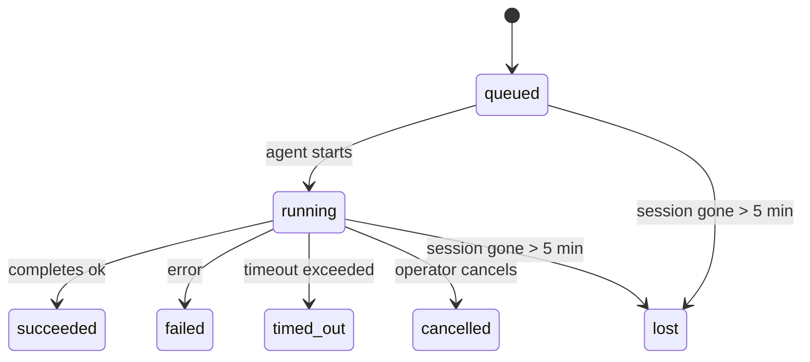

---
read_when:
    - 检查正在进行中或最近已完成的后台工作
    - 调试分离式智能体运行的投递失败问题
    - 了解后台运行如何与会话、cron 和 heartbeat 关联
summary: 用于跟踪 ACP 运行、子智能体、隔离的 cron 作业和 CLI 操作的后台任务
title: 后台任务
x-i18n:
    generated_at: "2026-04-05T08:13:49Z"
    model: gpt-5.4
    provider: openai
    source_hash: 6c95ccf4388d07e60a7bb68746b161793f4bb5ff2ba3d5ce9e51f2225dab2c4d
    source_path: automation/tasks.md
    workflow: 15
---

# 后台任务

> **在找调度方式？** 请参阅 [自动化与任务](/automation) 以选择合适的机制。本页介绍的是如何**跟踪**后台工作，而不是如何调度。

后台任务用于跟踪在**主会话之外**运行的工作：
ACP 运行、子智能体启动、隔离的 cron 作业执行，以及由 CLI 发起的操作。

任务**不会**替代会话、cron 作业或 heartbeat——它们是记录分离式工作发生了什么、何时发生以及是否成功的**活动账本**。

<Note>
并非每次智能体运行都会创建任务。Heartbeat 回合和普通交互式聊天不会。所有 cron 执行、ACP 启动、子智能体启动以及 CLI 智能体命令都会创建任务。
</Note>

## TL;DR

- 任务是**记录**，不是调度器——cron 和 heartbeat 决定工作**何时**运行，任务跟踪**发生了什么**。
- ACP、子智能体、所有 cron 作业和 CLI 操作都会创建任务。Heartbeat 回合不会。
- 每个任务都会经历 `queued → running → terminal`（succeeded、failed、timed_out、cancelled 或 lost）。
- Cron 任务只要仍由 cron 运行时拥有该作业，就会保持活动状态；基于聊天的 CLI 任务则只会在其所属运行上下文仍处于活动状态时保持活动。
- 完成通知是推送驱动的：分离式工作完成时可以直接通知，或唤醒请求方会话 / heartbeat，因此轮询状态循环通常不是正确方式。
- 隔离的 cron 运行和子智能体完成时，会尽最大努力在最终清理记账前清理其子会话所跟踪的浏览器标签页 / 进程。
- 隔离的 cron 投递会在后代子智能体工作仍在收尾时抑制过期的中间父级回复，并且如果最终后代输出在投递前到达，则优先使用该输出。
- 完成通知会直接投递到某个渠道，或排队等待下一个 heartbeat。
- `openclaw tasks list` 显示所有任务；`openclaw tasks audit` 会显示问题。
- 终态记录会保留 7 天，然后自动清理。

## 快速开始

```bash
# 列出所有任务（最新优先）
openclaw tasks list

# 按运行时或状态筛选
openclaw tasks list --runtime acp
openclaw tasks list --status running

# 显示特定任务的详情（按 ID、run ID 或 session key）
openclaw tasks show <lookup>

# 取消一个正在运行的任务（会终止子会话）
openclaw tasks cancel <lookup>

# 更改任务的通知策略
openclaw tasks notify <lookup> state_changes

# 运行健康审计
openclaw tasks audit

# 预览或应用维护操作
openclaw tasks maintenance
openclaw tasks maintenance --apply

# 检查 Task Flow 状态
openclaw tasks flow list
openclaw tasks flow show <lookup>
openclaw tasks flow cancel <lookup>
```

## 什么会创建任务

| Source                 | Runtime type | 创建任务记录的时机 | 默认通知策略 |
| ---------------------- | ------------ | ------------------------------------------------------ | --------------------- |
| ACP 后台运行 | `acp`        | 启动一个子 ACP 会话时 | `done_only`           |
| 子智能体编排 | `subagent`   | 通过 `sessions_spawn` 启动子智能体时 | `done_only`           |
| Cron 作业（所有类型） | `cron`       | 每次 cron 执行时（主会话和隔离模式都算） | `silent`              |
| CLI 操作 | `cli`        | 通过 Gateway 网关运行 `openclaw agent` 命令时 | `silent`              |

主会话 cron 任务默认使用 `silent` 通知策略——它们会创建记录用于跟踪，但不会生成通知。隔离的 cron 任务同样默认使用 `silent`，但由于它们在自己的会话中运行，因此更容易被看到。

**不会创建任务的情况：**

- Heartbeat 回合——主会话；参见 [Heartbeat](/gateway/heartbeat)
- 普通交互式聊天回合
- 直接 `/command` 响应

## 任务生命周期



| Status      | 含义 |
| ----------- | -------------------------------------------------------------------------- |
| `queued`    | 已创建，等待智能体启动 |
| `running`   | 智能体回合正在执行 |
| `succeeded` | 已成功完成 |
| `failed`    | 已出错完成 |
| `timed_out` | 超过配置的超时时间 |
| `cancelled` | 由操作员通过 `openclaw tasks cancel` 停止 |
| `lost`      | 在 5 分钟宽限期后，运行时丢失了权威后端状态 |

状态转换会自动发生——当关联的智能体运行结束时，任务状态会更新为对应结果。

`lost` 是感知运行时类型的：

- ACP 任务：后端 ACP 子会话元数据消失。
- 子智能体任务：后端子会话从目标智能体存储中消失。
- Cron 任务：cron 运行时不再将该作业视为活动作业。
- CLI 任务：隔离的子会话任务使用子会话；基于聊天的 CLI 任务则使用实时运行上下文，因此残留的渠道 / 群组 / 直接会话行不会让它们继续保持活动。

## 投递与通知

当任务进入终态时，OpenClaw 会通知你。有两种投递路径：

**直接投递**——如果任务有渠道目标（`requesterOrigin`），完成消息会直接发送到该渠道（Telegram、Discord、Slack 等）。对于子智能体完成事件，OpenClaw 还会在可用时保留已绑定的线程 / 话题路由，并且在放弃直接投递之前，可以从请求方会话存储的路由（`lastChannel` / `lastTo` / `lastAccountId`）中补全缺失的 `to` / account。

**会话排队投递**——如果直接投递失败，或者未设置 origin，则更新会作为系统事件排入请求方会话，并在下一个 heartbeat 时显示出来。

<Tip>
任务完成会立即触发 heartbeat 唤醒，因此你可以快速看到结果——无需等到下一次计划中的 heartbeat tick。
</Tip>

这意味着通常的工作流是基于推送的：只需启动一次分离式工作，然后让运行时在完成时唤醒或通知你。只有在需要调试、干预或显式审计时，才去轮询任务状态。

### 通知策略

控制你希望接收到每个任务多少信息：

| Policy                | 投递内容 |
| --------------------- | ----------------------------------------------------------------------- |
| `done_only`（默认） | 仅终态（succeeded、failed 等）——**这是默认值** |
| `state_changes`       | 每次状态变化和进度更新 |
| `silent`              | 完全不通知 |

你可以在任务运行时更改策略：

```bash
openclaw tasks notify <lookup> state_changes
```

## CLI 参考

### `tasks list`

```bash
openclaw tasks list [--runtime <acp|subagent|cron|cli>] [--status <status>] [--json]
```

输出列：任务 ID、类型、状态、投递、运行 ID、子会话、摘要。

### `tasks show`

```bash
openclaw tasks show <lookup>
```

lookup 标记接受任务 ID、run ID 或 session key。会显示完整记录，包括时间信息、投递状态、错误和终态摘要。

### `tasks cancel`

```bash
openclaw tasks cancel <lookup>
```

对于 ACP 和子智能体任务，这会终止子会话。状态会变为 `cancelled`，并发送投递通知。

### `tasks notify`

```bash
openclaw tasks notify <lookup> <done_only|state_changes|silent>
```

### `tasks audit`

```bash
openclaw tasks audit [--json]
```

显示运行问题。如果检测到问题，这些发现也会出现在 `openclaw status` 中。

| Finding                   | Severity | 触发条件 |
| ------------------------- | -------- | ----------------------------------------------------- |
| `stale_queued`            | warn     | 排队超过 10 分钟 |
| `stale_running`           | error    | 运行超过 30 分钟 |
| `lost`                    | error    | 运行时支持的任务归属消失 |
| `delivery_failed`         | warn     | 投递失败，且通知策略不是 `silent` |
| `missing_cleanup`         | warn     | 终态任务没有 cleanup 时间戳 |
| `inconsistent_timestamps` | warn     | 时间线违规（例如先结束后开始） |

### `tasks maintenance`

```bash
openclaw tasks maintenance [--json]
openclaw tasks maintenance --apply [--json]
```

使用它来预览或应用任务和 Task Flow 状态的对账、清理标记以及清理删除。

对账是感知运行时类型的：

- ACP / 子智能体任务会检查其后端子会话。
- Cron 任务会检查 cron 运行时是否仍拥有该作业。
- 基于聊天的 CLI 任务会检查所属的实时运行上下文，而不仅仅是聊天会话行。

完成后的清理同样是感知运行时类型的：

- 子智能体完成时，会尽最大努力在继续完成通知清理前关闭该子会话跟踪的浏览器标签页 / 进程。
- 隔离的 cron 完成时，会尽最大努力在运行完全拆除前关闭该 cron 会话跟踪的浏览器标签页 / 进程。
- 隔离的 cron 投递会在需要时等待后代子智能体后续处理完成，并抑制过期的父级确认文本，而不是播报它。
- 子智能体完成投递会优先使用最新可见的 assistant 文本；如果该文本为空，则回退到已清理的最新 tool / toolResult 文本，而仅包含超时工具调用的运行可以折叠为一段简短的部分进度摘要。
- 清理失败不会掩盖真实的任务结果。

### `tasks flow list|show|cancel`

```bash
openclaw tasks flow list [--status <status>] [--json]
openclaw tasks flow show <lookup> [--json]
openclaw tasks flow cancel <lookup>
```

当你关注的是编排层 Task Flow，而不是某一条单独的后台任务记录时，请使用这些命令。

## 聊天任务面板（`/tasks`）

在任意聊天会话中使用 `/tasks` 可查看与该会话关联的后台任务。该面板会显示活动中和最近完成的任务，包括运行时、状态、时间信息，以及进度或错误详情。

当当前会话没有可见的关联任务时，`/tasks` 会回退到智能体本地任务计数，这样你仍能获得概览，同时不会泄露其他会话的详情。

如需查看完整的操作员账本，请使用 CLI：`openclaw tasks list`。

## 状态集成（任务压力）

`openclaw status` 包含一个后台任务摘要概览：

```
Tasks: 3 queued · 2 running · 1 issues
```

该摘要报告：

- **active** —— `queued` + `running` 的数量
- **failures** —— `failed` + `timed_out` + `lost` 的数量
- **byRuntime** —— 按 `acp`、`subagent`、`cron`、`cli` 细分

`/status` 和 `session_status` 工具都使用感知清理状态的任务快照：优先显示活动任务，隐藏过期的已完成行，并且仅在没有活动工作剩余时才显示近期失败。这让状态卡片聚焦于当前真正重要的内容。

## 存储与维护

### 任务存储位置

任务记录持久化保存在 SQLite 中，路径为：

```
$OPENCLAW_STATE_DIR/tasks/runs.sqlite
```

注册表会在 Gateway 网关启动时加载到内存中，并将写入同步到 SQLite，以保证重启后的持久性。

### 自动维护

清理器每 **60 秒** 运行一次，处理三件事：

1. **对账**——检查活动任务是否仍具有权威运行时后端。ACP / 子智能体任务使用子会话状态，cron 任务使用活动作业归属，基于聊天的 CLI 任务使用所属运行上下文。如果该后端状态消失超过 5 分钟，任务会被标记为 `lost`。
2. **清理标记**——为终态任务设置 `cleanupAfter` 时间戳（`endedAt + 7 days`）。
3. **清理删除**——删除超过其 `cleanupAfter` 日期的记录。

**保留期**：终态任务记录会保留 **7 天**，之后自动清理。无需配置。

## 任务与其他系统的关系

### 任务与 Task Flow

[Task Flow](/automation/taskflow) 是位于后台任务之上的流程编排层。单个 flow 在其生命周期内可以使用托管或镜像同步模式协调多个任务。使用 `openclaw tasks` 检查单个任务记录，使用 `openclaw tasks flow` 检查编排 flow。

详情请参阅 [Task Flow](/automation/taskflow)。

### 任务与 cron

cron 作业**定义**保存在 `~/.openclaw/cron/jobs.json` 中。**每一次** cron 执行都会创建任务记录——包括主会话和隔离模式。主会话 cron 任务默认使用 `silent` 通知策略，因此只做跟踪而不会生成通知。

参见 [Cron Jobs](/automation/cron-jobs)。

### 任务与 heartbeat

Heartbeat 运行属于主会话回合——它们不会创建任务记录。当任务完成时，它可以触发 heartbeat 唤醒，以便你及时看到结果。

参见 [Heartbeat](/gateway/heartbeat)。

### 任务与会话

一个任务可能引用 `childSessionKey`（工作运行的位置）和 `requesterSessionKey`（是谁发起了它）。会话是对话上下文；任务则是在其之上的活动跟踪。

### 任务与智能体运行

任务的 `runId` 链接到执行该工作的智能体运行。智能体生命周期事件（开始、结束、错误）会自动更新任务状态——你不需要手动管理生命周期。

## 相关内容

- [自动化与任务](/automation) —— 所有自动化机制一览
- [Task Flow](/automation/taskflow) —— 位于任务之上的流程编排
- [计划任务](/automation/cron-jobs) —— 调度后台工作
- [Heartbeat](/gateway/heartbeat) —— 周期性主会话回合
- [CLI：Tasks](/cli/index#tasks) —— CLI 命令参考
