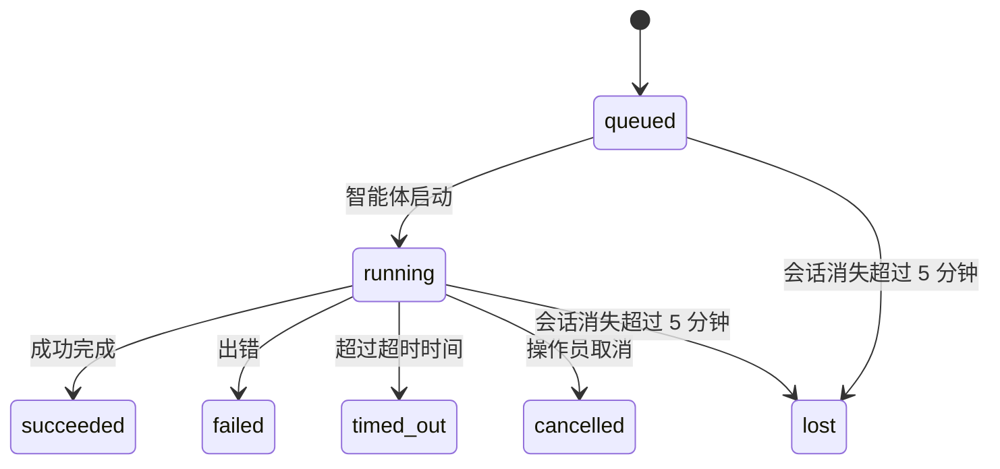

---
read_when:
    - 检查进行中或刚刚完成的后台工作
    - 调试已分离智能体运行的交付失败问题
    - 了解后台运行与会话、cron 和心跳之间的关系
summary: 用于 ACP 运行、子智能体、隔离的 cron 作业和 CLI 操作的后台任务跟踪
title: 后台任务
x-i18n:
    generated_at: "2026-04-26T03:01:22Z"
    model: gpt-5.4
    provider: openai
    source_hash: 71153c54df90aad2b87b657ad68b3d34c618e5e82d63e0fd0d5c04a7d9182da0
    source_path: automation/tasks.md
    workflow: 15
---

> **在找调度方式？** 请参阅 [Automation & Tasks](/zh-CN/automation) 以选择合适的机制。本页介绍的是如何**跟踪**后台工作，而不是如何调度它。

后台任务用于跟踪**在你的主会话之外**运行的工作：
ACP 运行、子智能体派生、隔离的 cron 作业执行，以及由 CLI 发起的操作。

任务**不会**替代会话、cron 作业或心跳 —— 它们是记录这些分离工作“发生了什么、何时发生、是否成功”的**活动台账**。

<Note>
并不是每次智能体运行都会创建任务。心跳轮次和普通交互式聊天不会创建任务。所有 cron 执行、ACP 派生、子智能体派生以及 CLI 智能体命令都会创建任务。
</Note>

## TL;DR

- 任务是**记录**，不是调度器 —— cron 和心跳决定工作_何时_运行，任务负责跟踪_发生了什么_。
- ACP、子智能体、所有 cron 作业和 CLI 操作都会创建任务。心跳轮次不会。
- 每个任务都会经历 `queued → running → terminal`（succeeded、failed、timed_out、cancelled 或 lost）。
- 只要 cron 运行时仍然持有该作业，cron 任务就会保持活动状态；而基于聊天的 CLI 任务仅在其所属运行上下文仍然处于活动状态时保持活动。
- 完成采用推送驱动：分离工作完成时可以直接通知，或唤醒请求者会话/心跳，因此通常不应该使用轮询状态的循环。
- 隔离的 cron 运行和子智能体完成时，会尽力为其子会话清理已跟踪的浏览器标签页/进程，然后再执行最终清理记账。
- 隔离的 cron 投递会在后代子智能体工作仍在收尾时抑制过时的中间父级回复，并在后代最终输出先到达时优先采用它。
- 完成通知会直接投递到渠道，或排队等待下一次心跳。
- `openclaw tasks list` 显示所有任务；`openclaw tasks audit` 会显示问题。
- 终态记录会保留 7 天，之后自动清理。

## 快速开始

```bash
# 列出所有任务（按最新优先）
openclaw tasks list

# 按运行时或状态筛选
openclaw tasks list --runtime acp
openclaw tasks list --status running

# 显示特定任务的详情（通过 ID、run ID 或 session key）
openclaw tasks show <lookup>

# 取消正在运行的任务（会终止子会话）
openclaw tasks cancel <lookup>

# 更改任务的通知策略
openclaw tasks notify <lookup> state_changes

# 运行健康审计
openclaw tasks audit

# 预览或应用维护操作
openclaw tasks maintenance
openclaw tasks maintenance --apply

# 检查 TaskFlow 状态
openclaw tasks flow list
openclaw tasks flow show <lookup>
openclaw tasks flow cancel <lookup>
```

## 什么会创建任务

| 来源 | 运行时类型 | 何时创建任务记录 | 默认通知策略 |
| ---------------------- | ------------ | ------------------------------------------------------ | --------------------- |
| ACP 后台运行 | `acp` | 派生子 ACP 会话时 | `done_only` |
| 子智能体编排 | `subagent` | 通过 `sessions_spawn` 派生子智能体时 | `done_only` |
| cron 作业（所有类型） | `cron` | 每次 cron 执行时（主会话和隔离运行都包括） | `silent` |
| CLI 操作 | `cli` | 通过 Gateway 网关运行的 `openclaw agent` 命令 | `silent` |
| 智能体媒体作业 | `cli` | 基于会话的 `video_generate` 运行 | `silent` |

主会话 cron 任务默认使用 `silent` 通知策略 —— 它们会创建记录以便跟踪，但不会生成通知。隔离的 cron 任务也默认使用 `silent`，但由于它们在各自独立的会话中运行，因此更容易被看到。

基于会话的 `video_generate` 运行也使用 `silent` 通知策略。它们仍会创建任务记录，但完成后会通过内部唤醒返回到原始智能体会话，以便智能体自行编写后续消息并附加完成的视频。如果你启用了 `tools.media.asyncCompletion.directSend`，异步 `music_generate` 和 `video_generate` 完成时会先尝试直接投递到渠道，失败后再回退到唤醒请求者会话的路径。

当基于会话的 `video_generate` 任务仍处于活动状态时，该工具还会充当保护机制：在同一会话中重复调用 `video_generate` 时，不会启动第二个并发生成，而是返回当前活动任务的状态。当你希望智能体侧明确查询进度/状态时，请使用 `action: "status"`。

**以下情况不会创建任务：**

- 心跳轮次 —— 主会话；请参阅 [Heartbeat](/zh-CN/gateway/heartbeat)
- 普通交互式聊天轮次
- 直接 `/command` 响应

## 任务生命周期



| 状态 | 含义 |
| ----------- | -------------------------------------------------------------------------- |
| `queued` | 已创建，等待智能体启动 |
| `running` | 智能体轮次正在执行 |
| `succeeded` | 已成功完成 |
| `failed` | 因错误而完成 |
| `timed_out` | 超过已配置的超时时间 |
| `cancelled` | 由操作员通过 `openclaw tasks cancel` 停止 |
| `lost` | 在 5 分钟宽限期后，运行时丢失了权威的后备状态 |

这些状态转换会自动发生 —— 当关联的智能体运行结束时，任务状态会更新为对应结果。

`lost` 是感知运行时类型的：

- ACP 任务：后备 ACP 子会话元数据消失。
- 子智能体任务：目标智能体存储中的后备子会话消失。
- cron 任务：cron 运行时不再将该作业视为活动。
- CLI 任务：隔离的子会话任务使用子会话；基于聊天的 CLI 任务则改为使用实时运行上下文，因此残留的渠道/群组/私聊会话行不会让它们继续保持活动。

## 投递与通知

当任务到达终态时，OpenClaw 会通知你。有两种投递路径：

**直接投递** —— 如果任务具有渠道目标（`requesterOrigin`），完成消息会直接发送到该渠道（Telegram、Discord、Slack 等）。对于子智能体完成，OpenClaw 还会在可用时保留已绑定的线程/话题路由，并且在直接投递失败前，可以从请求者会话保存的路由（`lastChannel` / `lastTo` / `lastAccountId`）中补齐缺失的 `to` / account。

**会话排队投递** —— 如果直接投递失败或未设置 origin，则该更新会作为系统事件排入请求者会话，并在下一次心跳时显示出来。

<Tip>
任务完成会立即触发一次心跳唤醒，因此你能很快看到结果 —— 无需等待下一次计划中的心跳 tick。
</Tip>

这意味着通常的工作流是基于推送的：只需启动一次分离工作，然后让运行时在完成时唤醒或通知你。只有在你需要调试、干预或进行明确审计时，才应轮询任务状态。

### 通知策略

控制你希望收到每个任务多少通知：

| 策略 | 会投递什么 |
| --------------------- | ----------------------------------------------------------------------- |
| `done_only`（默认） | 仅终态（succeeded、failed 等）—— **这是默认值** |
| `state_changes` | 每次状态变化和进度更新 |
| `silent` | 完全不通知 |

在任务运行时更改策略：

```bash
openclaw tasks notify <lookup> state_changes
```

## CLI 参考

### `tasks list`

```bash
openclaw tasks list [--runtime <acp|subagent|cron|cli>] [--status <status>] [--json]
```

输出列：任务 ID、类型、状态、投递、Run ID、子会话、摘要。

### `tasks show`

```bash
openclaw tasks show <lookup>
```

lookup 标记支持任务 ID、run ID 或 session key。会显示完整记录，包括时序、投递状态、错误和终态摘要。

### `tasks cancel`

```bash
openclaw tasks cancel <lookup>
```

对于 ACP 和子智能体任务，这会终止子会话。对于由 CLI 跟踪的任务，取消操作会记录到任务注册表中（没有单独的子运行时句柄）。状态会转换为 `cancelled`，并在适用时发送投递通知。

### `tasks notify`

```bash
openclaw tasks notify <lookup> <done_only|state_changes|silent>
```

### `tasks audit`

```bash
openclaw tasks audit [--json]
```

显示运行问题。检测到问题时，这些发现也会出现在 `openclaw status` 中。

| 发现项 | 严重级别 | 触发条件 |
| ------------------------- | ---------- | ------------------------------------------------------------------------------------------------------------ |
| `stale_queued` | warn | 处于 queued 超过 10 分钟 |
| `stale_running` | error | 处于 running 超过 30 分钟 |
| `lost` | warn/error | 运行时支持的任务所有权消失；保留的 lost 任务在 `cleanupAfter` 之前显示为警告，之后升级为错误 |
| `delivery_failed` | warn | 投递失败，且通知策略不是 `silent` |
| `missing_cleanup` | warn | 终态任务缺少清理时间戳 |
| `inconsistent_timestamps` | warn | 时间线冲突（例如结束时间早于开始时间） |

### `tasks maintenance`

```bash
openclaw tasks maintenance [--json]
openclaw tasks maintenance --apply [--json]
```

用它来预览或应用任务与 Task Flow 状态的对账、清理标记和清除操作。

对账是感知运行时类型的：

- ACP/子智能体任务会检查其后备子会话。
- cron 任务会检查 cron 运行时是否仍然持有该作业。
- 基于聊天的 CLI 任务会检查所属的实时运行上下文，而不只是聊天会话行。

完成清理也同样是感知运行时类型的：

- 子智能体完成时，会尽力在继续执行通知清理之前，关闭该子会话已跟踪的浏览器标签页/进程。
- 隔离的 cron 完成时，会尽力在运行彻底结束前，关闭该 cron 会话已跟踪的浏览器标签页/进程。
- 隔离的 cron 投递会在需要时等待后代子智能体的后续处理结束，并抑制过时的父级确认文本，而不是将其发布出去。
- 子智能体完成投递会优先使用最新的可见 assistant 文本；若该文本为空，则回退到已净化的最新 tool/toolResult 文本，而仅包含超时工具调用的运行可能会折叠为简短的部分进度摘要。终态失败的运行会宣告失败状态，而不会重放捕获到的回复文本。
- 清理失败不会掩盖任务的真实结果。

### `tasks flow list|show|cancel`

```bash
openclaw tasks flow list [--status <status>] [--json]
openclaw tasks flow show <lookup> [--json]
openclaw tasks flow cancel <lookup>
```

当你关心的是编排中的 Task Flow，而不是某一条单独的后台任务记录时，请使用这些命令。

## 聊天任务面板（`/tasks`）

在任何聊天会话中使用 `/tasks` 可查看链接到该会话的后台任务。该面板会显示活动中和最近完成的任务，包括运行时、状态、时序，以及进度或错误详情。

当当前会话没有可见的已链接任务时，`/tasks` 会回退为显示智能体本地任务计数，这样你仍然可以获得概览，同时不会泄露其他会话的详细信息。

如需查看完整的操作员台账，请使用 CLI：`openclaw tasks list`。

## Status 集成（任务压力）

`openclaw status` 包含一个可快速查看的任务摘要：

```
Tasks: 3 queued · 2 running · 1 issues
```

该摘要会报告：

- **active** —— `queued` + `running` 的数量
- **failures** —— `failed` + `timed_out` + `lost` 的数量
- **byRuntime** —— 按 `acp`、`subagent`、`cron`、`cli` 分类的明细

`/status` 和 `session_status` 工具都会使用感知清理状态的任务快照：优先显示活动任务，隐藏过时的已完成记录，并且仅在没有剩余活动工作时才显示最近失败项。这使状态卡片聚焦于当前最重要的内容。

## 存储与维护

### 任务存储位置

任务记录会持久化到 SQLite，路径为：

```
$OPENCLAW_STATE_DIR/tasks/runs.sqlite
```

该注册表会在 Gateway 网关启动时加载到内存中，并将写入同步到 SQLite，以保证重启后的持久性。

### 自动维护

清扫器每 **60 秒** 运行一次，并处理三件事：

1. **对账** —— 检查活动任务是否仍然具有权威的运行时后备状态。ACP/子智能体任务使用子会话状态，cron 任务使用活动作业所有权，基于聊天的 CLI 任务使用其所属运行上下文。如果该后备状态消失超过 5 分钟，则任务会被标记为 `lost`。
2. **清理标记** —— 为终态任务设置 `cleanupAfter` 时间戳（`endedAt + 7 days`）。在保留期内，`lost` 任务仍会在审计中显示为警告；当 `cleanupAfter` 过期或缺少清理元数据时，它们会变成错误。
3. **清除** —— 删除超过 `cleanupAfter` 日期的记录。

**保留期**：终态任务记录会保留 **7 天**，之后自动清除。无需额外配置。

## 任务与其他系统的关系

### 任务与 Task Flow

[Task Flow](/zh-CN/automation/taskflow) 是位于后台任务之上的流程编排层。单个 flow 在其生命周期内可能通过托管或镜像同步模式协调多个任务。使用 `openclaw tasks` 检查单个任务记录，使用 `openclaw tasks flow` 检查编排 flow。

详情请参阅 [Task Flow](/zh-CN/automation/taskflow)。

### 任务与 cron

cron 作业的**定义**存储在 `~/.openclaw/cron/jobs.json`；运行时执行状态则存储在其旁边的 `~/.openclaw/cron/jobs-state.json` 中。**每一次** cron 执行都会创建任务记录 —— 无论是主会话还是隔离运行。主会话 cron 任务默认使用 `silent` 通知策略，因此它们会被跟踪，但不会生成通知。

请参阅 [Cron Jobs](/zh-CN/automation/cron-jobs)。

### 任务与心跳

心跳运行属于主会话轮次 —— 它们不会创建任务记录。当任务完成时，它可以触发一次心跳唤醒，以便你及时看到结果。

请参阅 [Heartbeat](/zh-CN/gateway/heartbeat)。

### 任务与会话

一个任务可能会引用 `childSessionKey`（工作实际运行的位置）和 `requesterSessionKey`（启动它的是谁）。会话是对话上下文；任务则是在其之上的活动跟踪机制。

### 任务与智能体运行

任务的 `runId` 会链接到执行该工作的智能体运行。智能体生命周期事件（开始、结束、错误）会自动更新任务状态 —— 你无需手动管理生命周期。

## 相关内容

- [Automation & Tasks](/zh-CN/automation) —— 所有自动化机制总览
- [Task Flow](/zh-CN/automation/taskflow) —— 位于任务之上的流程编排
- [Scheduled Tasks](/zh-CN/automation/cron-jobs) —— 调度后台工作
- [Heartbeat](/zh-CN/gateway/heartbeat) —— 周期性的主会话轮次
- [CLI: Tasks](/zh-CN/cli/tasks) —— CLI 命令参考
