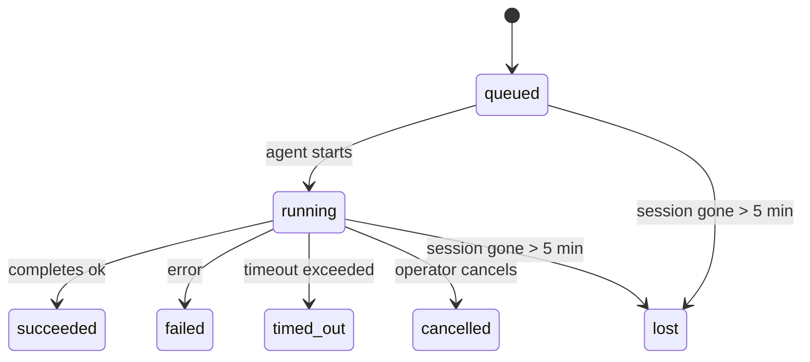

---
read_when:
    - 查看正在进行或最近完成的后台工作
    - 调试分离式智能体运行的投递失败
    - 了解后台运行与会话、cron 和心跳的关系
sidebarTitle: Background tasks
summary: 用于 ACP 运行、子智能体、隔离的 cron 作业和 CLI 操作的后台任务跟踪
title: 后台任务
x-i18n:
    generated_at: "2026-04-28T20:08:43Z"
    model: gpt-5.5
    provider: openai
    source_hash: ff4f22f98148b01c1b044a5213a5946eac8c5d763f0d22c992e6a4a2297bc308
    source_path: automation/tasks.md
    workflow: 16
---

<Note>
在查找调度功能？请参阅 [自动化和任务](/zh-CN/automation) 以选择合适的机制。本页是后台工作的活动台账，而不是调度器。
</Note>

后台任务跟踪**主对话会话之外**运行的工作：ACP 运行、子智能体生成、隔离的 cron 作业执行，以及 CLI 发起的操作。

任务**不会**取代会话、cron 作业或心跳；它们是记录分离工作发生了什么、何时发生以及是否成功的**活动台账**。

<Note>
并非每次智能体运行都会创建任务。心跳轮次和普通交互式聊天不会。所有 cron 执行、ACP 生成、子智能体生成和 CLI 智能体命令都会创建任务。
</Note>

## 摘要

- 任务是**记录**，不是调度器；cron 和心跳决定工作在_何时_运行，任务跟踪_发生了什么_。
- ACP、子智能体、所有 cron 作业和 CLI 操作都会创建任务。心跳轮次不会。
- 每个任务都会经历 `queued → running → terminal`（succeeded、failed、timed_out、cancelled 或 lost）。
- 只要 cron 运行时仍然拥有该作业，cron 任务就会保持活动；如果内存中的运行时状态已消失，任务维护会先检查持久化 cron 运行历史，然后才将任务标记为 lost。
- 完成由推送驱动：分离工作完成时可以直接通知，或唤醒请求方会话/心跳，因此状态轮询循环通常不是合适的形态。
- 隔离的 cron 运行和子智能体完成会尽力为其子会话清理已跟踪的浏览器标签页/进程，然后再进行最终清理记账。
- 当后代子智能体工作仍在排空时，隔离的 cron 送达会抑制过时的中间父级回复，并且如果最终后代输出在送达前到达，则优先使用该输出。
- 完成通知会直接送达到渠道，或排队等待下一次心跳。
- `openclaw tasks list` 显示所有任务；`openclaw tasks audit` 暴露问题。
- 终态记录会保留 7 天，然后自动清理。

## 快速开始

<Tabs>
  <Tab title="列出和筛选">
    ```bash
    # List all tasks (newest first)
    openclaw tasks list

    # Filter by runtime or status
    openclaw tasks list --runtime acp
    openclaw tasks list --status running
    ```

  </Tab>
  <Tab title="检查">
    ```bash
    # Show details for a specific task (by ID, run ID, or session key)
    openclaw tasks show <lookup>
    ```
  </Tab>
  <Tab title="取消和通知">
    ```bash
    # Cancel a running task (kills the child session)
    openclaw tasks cancel <lookup>

    # Change notification policy for a task
    openclaw tasks notify <lookup> state_changes
    ```

  </Tab>
  <Tab title="审计和维护">
    ```bash
    # Run a health audit
    openclaw tasks audit

    # Preview or apply maintenance
    openclaw tasks maintenance
    openclaw tasks maintenance --apply
    ```

  </Tab>
  <Tab title="任务流程">
    ```bash
    # Inspect TaskFlow state
    openclaw tasks flow list
    openclaw tasks flow show <lookup>
    openclaw tasks flow cancel <lookup>
    ```
  </Tab>
</Tabs>

## 什么会创建任务

| 来源                   | 运行时类型 | 任务记录创建时机                                       | 默认通知策略 |
| ---------------------- | ---------- | ------------------------------------------------------ | ------------ |
| ACP 后台运行           | `acp`      | 生成子 ACP 会话                                        | `done_only`  |
| 子智能体编排           | `subagent` | 通过 `sessions_spawn` 生成子智能体                     | `done_only`  |
| Cron 作业（所有类型）  | `cron`     | 每次 cron 执行（主会话和隔离会话）                     | `silent`     |
| CLI 操作               | `cli`      | 通过 Gateway 网关运行的 `openclaw agent` 命令          | `silent`     |
| 智能体媒体作业         | `cli`      | 由会话支撑的 `video_generate` 运行                     | `silent`     |

<AccordionGroup>
  <Accordion title="cron 和媒体的默认通知设置">
    主会话 cron 任务默认使用 `silent` 通知策略：它们会创建记录用于跟踪，但不会生成通知。隔离的 cron 任务也默认使用 `silent`，但因为它们在自己的会话中运行，所以更容易看到。

    由会话支撑的 `video_generate` 运行也使用 `silent` 通知策略。它们仍会创建任务记录，但完成结果会作为内部唤醒交还给原始智能体会话，让智能体自行写入后续消息并附加生成完成的视频。如果你启用 `tools.media.asyncCompletion.directSend`，异步 `music_generate` 和 `video_generate` 完成会先尝试直接渠道送达，然后再回退到请求方会话唤醒路径。

  </Accordion>
  <Accordion title="并发 video_generate 保护机制">
    当由会话支撑的 `video_generate` 任务仍处于活动状态时，该工具也会作为保护机制：同一会话中重复的 `video_generate` 调用会返回活动任务状态，而不是启动第二个并发生成。需要从智能体侧显式查询进度/状态时，请使用 `action: "status"`。
  </Accordion>
  <Accordion title="哪些不会创建任务">
    - 心跳轮次：主会话；参见 [心跳](/zh-CN/gateway/heartbeat)
    - 普通交互式聊天轮次
    - 直接 `/command` 响应

  </Accordion>
</AccordionGroup>

## 任务生命周期



| Status      | 含义                                                                       |
| ----------- | -------------------------------------------------------------------------- |
| `queued`    | 已创建，正在等待智能体启动                                                 |
| `running`   | 智能体轮次正在主动执行                                                     |
| `succeeded` | 已成功完成                                                                 |
| `failed`    | 已完成但出现错误                                                           |
| `timed_out` | 超过配置的超时时间                                                         |
| `cancelled` | 操作员通过 `openclaw tasks cancel` 停止                                    |
| `lost`      | 运行时在 5 分钟宽限期后丢失了权威支撑状态                                  |

转换会自动发生；当关联的智能体运行结束时，任务状态会更新为匹配的状态。

智能体运行完成是活动任务记录的权威依据。成功的分离运行会最终记为 `succeeded`，普通运行错误会最终记为 `failed`，超时或中止结果会最终记为 `timed_out`。如果操作员已经取消该任务，或者运行时已经记录了更强的终态，例如 `failed`、`timed_out` 或 `lost`，后续的成功信号不会降级该终态。

`lost` 具有运行时感知能力：

- ACP 任务：支撑的 ACP 子会话元数据已消失。
- 子智能体任务：支撑的子会话已从目标智能体存储中消失。
- Cron 任务：cron 运行时不再将该作业跟踪为活动状态，并且持久化 cron 运行历史未显示该运行的终态结果。离线 CLI 审计不会将其自身空的进程内 cron 运行时状态视为权威依据。
- CLI 任务：隔离的子会话任务使用子会话；由聊天支撑的 CLI 任务改用实时运行上下文，因此残留的渠道/群组/私信会话行不会让它们保持活动。由 Gateway 网关支撑的 `openclaw agent` 运行也会根据其运行结果最终确定状态，因此已完成的运行不会一直保持活动，直到清理器将它们标记为 `lost`。

## 送达和通知

当任务达到终态时，OpenClaw 会通知你。有两条送达路径：

**直接送达**：如果任务有渠道目标（`requesterOrigin`），完成消息会直接发送到该渠道（Telegram、Discord、Slack 等）。对于子智能体完成，OpenClaw 还会在可用时保留绑定的线程/主题路由，并且可以在放弃直接送达前，从请求方会话存储的路由（`lastChannel` / `lastTo` / `lastAccountId`）补齐缺失的 `to` / 账号。

**会话排队送达**：如果直接送达失败或未设置来源，更新会作为系统事件排队到请求方会话中，并在下一次心跳时浮现。

<Tip>
任务完成会触发一次即时心跳唤醒，因此你能快速看到结果；无需等待下一次计划的心跳节拍。
</Tip>

这意味着常规工作流是推送式的：启动一次分离工作，然后让运行时在完成时唤醒或通知你。只有在需要调试、干预或显式审计时，才轮询任务状态。

### 通知策略

控制你收到每个任务多少信息：

| 策略                  | 送达内容                                                                |
| --------------------- | ----------------------------------------------------------------------- |
| `done_only`（默认）   | 仅终态（succeeded、failed 等）；**这是默认值**                          |
| `state_changes`       | 每次状态转换和进度更新                                                  |
| `silent`              | 完全不送达                                                              |

在任务运行时更改策略：

```bash
openclaw tasks notify <lookup> state_changes
```

## CLI 参考

<AccordionGroup>
  <Accordion title="tasks list">
    ```bash
    openclaw tasks list [--runtime <acp|subagent|cron|cli>] [--status <status>] [--json]
    ```

    输出列：任务 ID、类别、Status、送达、运行 ID、子会话、摘要。

  </Accordion>
  <Accordion title="tasks show">
    ```bash
    openclaw tasks show <lookup>
    ```

    查询标记接受任务 ID、运行 ID 或会话键。显示完整记录，包括时序、送达状态、错误和终态摘要。

  </Accordion>
  <Accordion title="tasks cancel">
    ```bash
    openclaw tasks cancel <lookup>
    ```

    对于 ACP 和子智能体任务，这会终止子会话。对于由 CLI 跟踪的任务，取消操作会记录在任务注册表中（没有单独的子运行时句柄）。Status 会转换为 `cancelled`，并在适用时发送送达通知。

  </Accordion>
  <Accordion title="tasks notify">
    ```bash
    openclaw tasks notify <lookup> <done_only|state_changes|silent>
    ```
  </Accordion>
  <Accordion title="tasks audit">
    ```bash
    openclaw tasks audit [--json]
    ```

    暴露运行问题。检测到问题时，发现项也会出现在 `openclaw status` 中。

    | 发现项                    | 严重性     | 触发条件                                                                                                     |
    | ------------------------- | ---------- | ------------------------------------------------------------------------------------------------------------ |
    | `stale_queued`            | warn       | 排队超过 10 分钟                                                                                             |
    | `stale_running`           | error      | 运行超过 30 分钟                                                                                             |
    | `lost`                    | warn/error | 由运行时支持的任务所有权消失；保留的丢失任务在 `cleanupAfter` 前发出警告，之后变为错误                      |
    | `delivery_failed`         | warn       | 投递失败且通知策略不是 `silent`                                                                              |
    | `missing_cleanup`         | warn       | 终止任务没有清理时间戳                                                                                       |
    | `inconsistent_timestamps` | warn       | 时间线违规（例如结束早于开始）                                                                               |

  </Accordion>
  <Accordion title="任务维护">
    ```bash
    openclaw tasks maintenance [--json]
    openclaw tasks maintenance --apply [--json]
    ```

    使用此命令可预览或应用针对任务和任务流状态的协调、清理标记和修剪。

    协调会感知运行时：

    - ACP/子智能体任务会检查其背后的子会话。
    - Cron 任务会检查 cron 运行时是否仍拥有该作业，然后先从持久化的 cron 运行日志/作业状态恢复终止状态，再回退到 `lost`。只有 Gateway 网关进程对内存中的 cron 活动作业集合具有权威性；离线 CLI 审计会使用持久历史记录，但不会仅因为该本地 Set 为空就将 cron 任务标记为丢失。
    - 由聊天支持的 CLI 任务会检查所属的实时运行上下文，而不只是聊天会话行。

    完成清理也会感知运行时：

    - 子智能体完成后，会尽力在公告清理继续之前关闭为子会话跟踪的浏览器标签页/进程。
    - 隔离 cron 完成后，会尽力在运行完全拆除前关闭为 cron 会话跟踪的浏览器标签页/进程。
    - 隔离 cron 投递会在需要时等待后代子智能体的后续操作，并抑制过期的父级确认文本，而不是公告它。
    - 子智能体完成投递优先使用最新可见的助手文本；如果为空，则回退到经过清理的最新工具/toolResult 文本；仅超时的工具调用运行可以折叠为简短的部分进度摘要。终止失败的运行会公告失败状态，而不会重放捕获的回复文本。
    - 清理失败不会掩盖真实的任务结果。

  </Accordion>
  <Accordion title="任务流列表 | 显示 | 取消">
    ```bash
    openclaw tasks flow list [--status <status>] [--json]
    openclaw tasks flow show <lookup> [--json]
    openclaw tasks flow cancel <lookup>
    ```

    当你关心的是编排任务流，而不是某一条单独的后台任务记录时，请使用这些命令。

  </Accordion>
</AccordionGroup>

## 聊天任务看板（`/tasks`）

在任意聊天会话中使用 `/tasks` 查看链接到该会话的后台任务。看板会显示活动任务和最近完成的任务，以及运行时、Status、计时、进度或错误详情。

当当前会话没有可见的链接任务时，`/tasks` 会回退到智能体本地任务计数，这样你仍能获得概览，而不会泄露其他会话的详情。

要查看完整的操作员账本，请使用 CLI：`openclaw tasks list`。

## Status 集成（任务压力）

`openclaw status` 包含一眼可见的任务摘要：

```
Tasks: 3 queued · 2 running · 1 issues
```

摘要报告：

- **active** — `queued` + `running` 的数量
- **failures** — `failed` + `timed_out` + `lost` 的数量
- **byRuntime** — 按 `acp`、`subagent`、`cron`、`cli` 的明细

`/status` 和 `session_status` 工具都使用感知清理的任务快照：优先显示活动任务，隐藏过期的已完成行，并且只有在没有剩余活动工作时才显示最近失败。这会让状态卡片聚焦于当前真正重要的内容。

## 存储和维护

### 任务存放位置

任务记录持久化在 SQLite 中，位置为：

```
$OPENCLAW_STATE_DIR/tasks/runs.sqlite
```

注册表会在 Gateway 网关启动时加载到内存，并将写入同步到 SQLite，以便在重启后保持持久性。
Gateway 网关通过 SQLite 的默认自动检查点阈值，以及周期性和关闭时的 `TRUNCATE` 检查点，限制 SQLite 预写日志大小。

### 自动维护

清扫器每 **60 秒** 运行一次，并处理四件事：

<Steps>
  <Step title="协调">
    检查活动任务是否仍有权威运行时支持。ACP/子智能体任务使用子会话状态，cron 任务使用活动作业所有权，由聊天支持的 CLI 任务使用所属运行上下文。如果该支持状态消失超过 5 分钟，任务会被标记为 `lost`。
  </Step>
  <Step title="ACP 会话修复">
    关闭终止的父级拥有的一次性 ACP 会话，并且仅在没有剩余活动对话绑定时关闭过期的终止持久 ACP 会话。
  </Step>
  <Step title="清理标记">
    为终止任务设置 `cleanupAfter` 时间戳（endedAt + 7 天）。在保留期内，丢失任务仍会在审计中显示为警告；在 `cleanupAfter` 过期后，或当清理元数据缺失时，它们会变为错误。
  </Step>
  <Step title="修剪">
    删除超过其 `cleanupAfter` 日期的记录。
  </Step>
</Steps>

<Note>
**保留：** 终止任务记录会保留 **7 天**，然后自动修剪。无需配置。
</Note>

## 任务与其他系统的关系

<AccordionGroup>
  <Accordion title="任务和任务流">
    [任务流](/zh-CN/automation/taskflow) 是后台任务之上的流程编排层。单个流程可能在其生命周期内使用托管或镜像同步模式协调多个任务。使用 `openclaw tasks` 检查单条任务记录，使用 `openclaw tasks flow` 检查编排流程。

    了解详情请参阅[任务流](/zh-CN/automation/taskflow)。

  </Accordion>
  <Accordion title="任务和 cron">
    cron 作业**定义**位于 `~/.openclaw/cron/jobs.json`；运行时执行状态位于旁边的 `~/.openclaw/cron/jobs-state.json`。**每次** cron 执行都会创建一条任务记录，包括主会话和隔离会话。主会话 cron 任务默认使用 `silent` 通知策略，因此它们只跟踪而不生成通知。

    请参阅 [Cron 作业](/zh-CN/automation/cron-jobs)。

  </Accordion>
  <Accordion title="任务和心跳">
    心跳运行属于主会话轮次，不会创建任务记录。任务完成时，它可以触发一次心跳唤醒，让你及时看到结果。

    请参阅[心跳](/zh-CN/gateway/heartbeat)。

  </Accordion>
  <Accordion title="任务和会话">
    任务可以引用 `childSessionKey`（工作运行的位置）和 `requesterSessionKey`（启动它的人）。会话是对话上下文；任务是在其之上的活动跟踪。
  </Accordion>
  <Accordion title="任务和智能体运行">
    任务的 `runId` 会链接到执行工作的智能体运行。智能体生命周期事件（开始、结束、错误）会自动更新任务 Status，你不需要手动管理生命周期。
  </Accordion>
</AccordionGroup>

## 相关

- [自动化与任务](/zh-CN/automation) — 所有自动化机制一览
- [CLI：任务](/zh-CN/cli/tasks) — CLI 命令参考
- [心跳](/zh-CN/gateway/heartbeat) — 周期性主会话轮次
- [计划任务](/zh-CN/automation/cron-jobs) — 调度后台工作
- [任务流](/zh-CN/automation/taskflow) — 任务之上的流程编排
