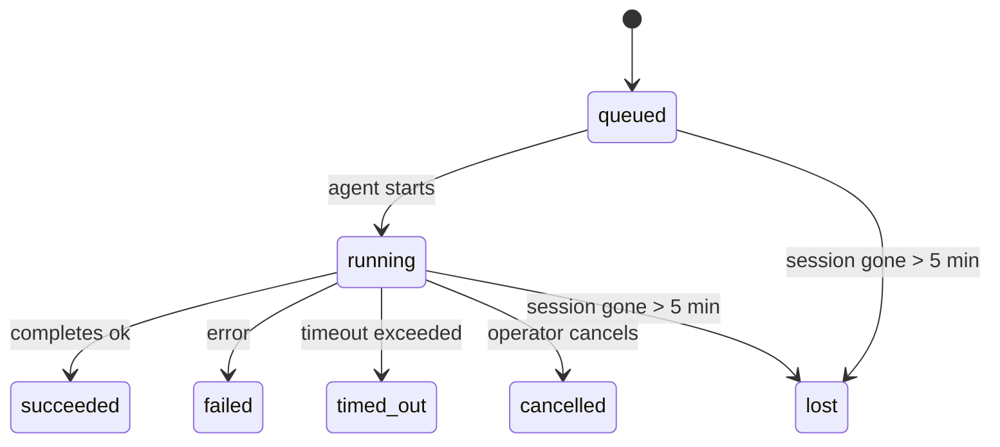

---
read_when:
    - 检查正在进行或最近完成的后台工作
    - 调试分离式智能体运行的递送失败
    - 了解后台运行与会话、cron 和 Heartbeat 的关系
sidebarTitle: Background tasks
summary: ACP 运行、子智能体、隔离的 cron 作业和 CLI 操作的后台任务跟踪
title: 后台任务
x-i18n:
    generated_at: "2026-06-27T01:19:01Z"
    model: gpt-5.5
    postprocess_version: locale-links-v1
    provider: openai
    source_hash: 4a630a52d0d6bfd387a37415dd63fc4bfbce23f99eaa8cb780c3d6f8913675fd
    source_path: automation/tasks.md
    workflow: 16
---

<Note>
在找调度功能？请参阅 [自动化](/zh-CN/automation)，以选择合适的机制。本页是后台工作的活动账本，不是调度器。
</Note>

后台任务用于跟踪在**你的主对话会话之外**运行的工作：ACP 运行、子智能体派生、隔离的 cron 作业执行，以及 CLI 发起的操作。

任务**不会**取代会话、cron 作业或 Heartbeat；它们是**活动账本**，记录发生了哪些分离式工作、发生时间以及是否成功。

<Note>
并非每次智能体运行都会创建任务。Heartbeat 轮次和普通交互式聊天不会创建任务。所有 cron 执行、ACP 派生、子智能体派生和 CLI 智能体命令都会创建任务。
</Note>

## TL;DR

- 任务是**记录**，不是调度器；cron 和 Heartbeat 决定工作_何时_运行，任务跟踪_发生了什么_。
- ACP、子智能体、所有 cron 作业和 CLI 操作都会创建任务。Heartbeat 轮次不会。
- 每个任务都会经历 `queued → running → terminal`（succeeded、failed、timed_out、cancelled 或 lost）。
- 只要 cron 运行时仍然拥有该作业，cron 任务就会保持活跃；如果内存中的运行时状态已经消失，任务维护会先检查持久化的 cron 运行历史，再将任务标记为 lost。
- 完成由推送驱动：分离式工作可以直接通知，或在完成时唤醒请求方会话/Heartbeat，因此状态轮询循环通常不是正确的形态。
- 隔离的 cron 运行和子智能体完成后，会尽力清理其子会话所跟踪的浏览器标签页/进程，然后再进行最终清理记账。
- 当后代子智能体工作仍在收尾时，隔离的 cron 投递会抑制过时的临时父级回复；如果最终后代输出在投递前到达，它会优先使用该输出。
- 完成通知会直接投递到渠道，或排队等待下一次 Heartbeat。
- `openclaw tasks list` 显示所有任务；`openclaw tasks audit` 会暴露问题。
- 终端记录保留 7 天，然后自动清理。

## 快速开始

<Tabs>
  <Tab title="列出和筛选">
    ```bash
    # List all tasks (newest first)
    openclaw tasks list

    # Filter by runtime or status
    openclaw tasks list --runtime acp
    openclaw tasks list --status running
    ```

  </Tab>
  <Tab title="检查">
    ```bash
    # Show details for a specific task (by ID, run ID, or session key)
    openclaw tasks show <lookup>
    ```
  </Tab>
  <Tab title="取消和通知">
    ```bash
    # Cancel a running task (kills the child session)
    openclaw tasks cancel <lookup>

    # Change notification policy for a task
    openclaw tasks notify <lookup> state_changes
    ```

  </Tab>
  <Tab title="审计和维护">
    ```bash
    # Run a health audit
    openclaw tasks audit

    # Preview or apply maintenance
    openclaw tasks maintenance
    openclaw tasks maintenance --apply
    ```

  </Tab>
  <Tab title="任务流">
    ```bash
    # Inspect TaskFlow state
    openclaw tasks flow list
    openclaw tasks flow show <lookup>
    openclaw tasks flow cancel <lookup>
    ```
  </Tab>
</Tabs>

## 什么会创建任务

| 来源                   | 运行时类型 | 创建任务记录的时机                                                       | 默认通知策略 |
| ---------------------- | ---------- | ------------------------------------------------------------------------ | ------------ |
| ACP 后台运行           | `acp`      | 派生子 ACP 会话                                                          | `done_only`  |
| 子智能体编排           | `subagent` | 通过 `sessions_spawn` 派生子智能体                                       | `done_only`  |
| cron 作业（所有类型）  | `cron`     | 每次 cron 执行（主会话和隔离执行）                                       | `silent`     |
| CLI 操作               | `cli`      | 通过 Gateway 网关运行的 `openclaw agent` 命令                            | `silent`     |
| 智能体媒体作业         | `cli`      | 基于会话的 `image_generate`/`music_generate`/`video_generate` 运行       | `silent`     |

<AccordionGroup>
  <Accordion title="cron 和媒体的通知默认值">
    主会话 cron 任务默认使用 `silent` 通知策略；它们会创建记录用于跟踪，但不会生成通知。隔离的 cron 任务也默认使用 `silent`，但由于它们在自己的会话中运行，因此更可见。

    基于会话的 `image_generate`、`music_generate` 和 `video_generate` 运行也使用 `silent` 通知策略。它们仍会创建任务记录，但完成结果会作为内部唤醒交还给原始智能体会话，让智能体自己写后续消息并附加完成的媒体。请求方智能体遵循其正常的可见回复契约：配置后自动发送最终回复，或在会话要求消息工具回复时使用 `message(action="send")` 加 `NO_REPLY`。如果请求方会话不再活跃，或其活跃唤醒失败，并且完成智能体遗漏了部分或全部生成媒体，OpenClaw 会向原始渠道目标发送一次幂等的直接兜底消息，只包含缺失的媒体。

  </Accordion>
  <Accordion title="并发媒体生成防护栏">
    当基于会话的媒体生成任务仍处于活跃状态时，媒体工具也会充当防止意外重试的防护栏。针对同一提示词重复调用 `image_generate` 会返回匹配的活跃任务状态，而不同的图像提示词可以启动自己的任务。`music_generate` 和 `video_generate` 调用仍会返回该会话的活跃任务状态，而不是启动第二个并发生成。需要从智能体侧显式查询进度/状态时，请使用 `action: "status"`。
  </Accordion>
  <Accordion title="什么不会创建任务">
    - Heartbeat 轮次；主会话；参见 [Heartbeat](/zh-CN/gateway/heartbeat)
    - 普通交互式聊天轮次
    - 直接 `/command` 响应

  </Accordion>
</AccordionGroup>

## 任务生命周期



| 状态        | 含义                                                                       |
| ----------- | -------------------------------------------------------------------------- |
| `queued`    | 已创建，等待智能体启动                                                     |
| `running`   | 智能体轮次正在执行                                                         |
| `succeeded` | 已成功完成                                                                 |
| `failed`    | 已完成但发生错误                                                           |
| `timed_out` | 超过配置的超时时间                                                         |
| `cancelled` | 操作者通过 `openclaw tasks cancel` 停止                                     |
| `lost`      | 运行时在 5 分钟宽限期后丢失了权威支撑状态                                  |

状态转换会自动发生；当关联的智能体运行结束时，任务状态会更新为匹配结果。

对于活跃任务记录，智能体运行完成结果具有权威性。成功的分离式运行会最终确定为 `succeeded`，普通运行错误会最终确定为 `failed`，超时或中止结果会最终确定为 `timed_out`。如果操作者已经取消任务，或运行时已经记录了更强的终端状态，例如 `failed`、`timed_out` 或 `lost`，后续成功信号不会降级该终端状态。

`lost` 具备运行时感知能力：

- ACP 任务：支撑的 ACP 子会话元数据消失。
- 子智能体任务：支撑的子会话从目标智能体存储中消失。
- cron 任务：cron 运行时不再将该作业跟踪为活跃，并且持久化的 cron 运行历史没有显示该运行的终端结果。离线 CLI 审计不会将自身空的进程内 cron 运行时状态视为权威。
- CLI 任务：带有运行 ID/来源 ID 的任务使用实时运行上下文，因此 Gateway 网关拥有的运行消失后，残留的子会话或聊天会话行不会让它们继续保持活跃。没有运行身份的旧版 CLI 任务仍会回退到子会话。由 Gateway 网关支撑的 `openclaw agent` 运行也会根据其运行结果最终确定，因此已完成的运行不会一直保持活跃，直到清扫器将其标记为 `lost`。

## 投递和通知

当任务达到终端状态时，OpenClaw 会通知你。共有两种投递路径：

**直接投递** - 如果任务有渠道目标（`requesterOrigin`），完成消息会直接发送到该渠道（Telegram、Discord、Slack 等）。群组和频道任务完成则会通过请求方会话路由，让父级智能体可以写出可见回复。对于子智能体完成，OpenClaw 还会在可用时保留绑定的线程/主题路由，并且可以在放弃直接投递前，从请求方会话存储的路由（`lastChannel` / `lastTo` / `lastAccountId`）补齐缺失的 `to` / 账号。

**会话排队投递** - 如果直接投递失败或未设置来源，更新会作为系统事件排队到请求方会话中，并在下一次 Heartbeat 时显示。

<Tip>
任务完成会触发一次即时 Heartbeat 唤醒，因此你可以很快看到结果；无需等待下一次计划的 Heartbeat tick。
</Tip>

这意味着通常的工作流是基于推送的：启动一次分离式工作，然后让运行时在完成时唤醒或通知你。只有在需要调试、干预或显式审计时，才轮询任务状态。

### 通知策略

控制你会听到多少任务消息：

| 策略                  | 投递内容                                                                |
| --------------------- | ----------------------------------------------------------------------- |
| `done_only`（默认）   | 仅终端状态（succeeded、failed 等）；**这是默认值**                      |
| `state_changes`       | 每次状态转换和进度更新                                                  |
| `silent`              | 完全不投递                                                              |

在任务运行时更改策略：

```bash
openclaw tasks notify <lookup> state_changes
```

## CLI 参考

<AccordionGroup>
  <Accordion title="tasks list">
    ```bash
    openclaw tasks list [--runtime <acp|subagent|cron|cli>] [--status <status>] [--json]
    ```

    输出列：任务 ID、类型、状态、投递、运行 ID、子会话、摘要。

  </Accordion>
  <Accordion title="tasks show">
    ```bash
    openclaw tasks show <lookup>
    ```

    查找令牌接受任务 ID、运行 ID 或会话键。显示完整记录，包括时间、投递状态、错误和终端摘要。

  </Accordion>
  <Accordion title="tasks cancel">
    ```bash
    openclaw tasks cancel <lookup>
    ```

    对于 ACP 和子智能体任务，这会终止子会话。对于 CLI 跟踪的任务，取消操作会记录在任务注册表中（没有单独的子运行时句柄）。状态转换为 `cancelled`，并在适用时发送投递通知。

  </Accordion>
  <Accordion title="tasks notify">
    ```bash
    openclaw tasks notify <lookup> <done_only|state_changes|silent>
    ```
  </Accordion>
  <Accordion title="tasks audit">
    ```bash
    openclaw tasks audit [--json]
    ```

    暴露运行问题。检测到问题时，发现项也会显示在 `openclaw status` 中。

    | 发现                      | 严重性     | 触发条件                                                                                                     |
    | ------------------------- | ---------- | ------------------------------------------------------------------------------------------------------------ |
    | `stale_queued`            | warn       | 排队超过 10 分钟                                                                                             |
    | `stale_running`           | error      | 运行超过 30 分钟                                                                                             |
    | `lost`                    | warn/error | 运行时支撑的任务所有权消失；保留的丢失任务在 `cleanupAfter` 之前为警告，之后变为错误                        |
    | `delivery_failed`         | warn       | 投递失败且通知策略不是 `silent`                                                                              |
    | `missing_cleanup`         | warn       | 终止任务没有清理时间戳                                                                                       |
    | `inconsistent_timestamps` | warn       | 时间线违规（例如结束时间早于开始时间）                                                                       |

  </Accordion>
  <Accordion title="任务维护">
    ```bash
    openclaw tasks maintenance [--json]
    openclaw tasks maintenance --apply [--json]
    ```

    使用它来预览或应用任务、Task Flow 状态和过期 cron 运行会话注册表行的对账、清理标记和修剪。

    对账会感知运行时：

    - ACP/子智能体任务会检查其背后的子会话。
    - 如果子智能体任务的子会话带有重启恢复墓碑，则会标记为丢失，而不是当作可恢复的支撑会话处理。
    - Cron 任务会检查 cron 运行时是否仍拥有该作业，然后先从持久化的 cron 运行日志/作业状态恢复终止状态，再回退到 `lost`。只有 Gateway 网关进程对内存中的 cron 活动作业集合具有权威性；离线 CLI 审计会使用持久历史，但不会仅因为本地 Set 为空就将 cron 任务标记为丢失。
    - 带运行身份的 CLI 任务会检查所属的实时运行上下文，而不只是子会话或聊天会话行。

    完成清理同样会感知运行时：

    - 子智能体完成时，会尽力先关闭为子会话跟踪的浏览器标签页/进程，然后继续公告清理。
    - 隔离的 cron 完成时，会尽力先关闭为 cron 会话跟踪的浏览器标签页/进程，然后再完全拆除该运行。
    - 隔离的 cron 投递会在需要时等待后代子智能体的后续处理，并抑制过期的父级确认文本，而不是公告它。
    - 子智能体完成投递只使用子会话最新的可见 assistant 文本。Tool/toolResult 输出不会提升为子结果文本。终止的失败运行会公告失败状态，而不会重放捕获的回复文本。
    - 清理失败不会掩盖真实的任务结果。

    应用维护时，OpenClaw 还会移除超过 7 天的过期 `cron:<jobId>:run:<uuid>` 会话注册表行，同时保留当前正在运行的 cron 作业行，并保持非 cron 会话行不变。

  </Accordion>
  <Accordion title="任务流 list | show | cancel">
    ```bash
    openclaw tasks flow list [--status <status>] [--json]
    openclaw tasks flow show <lookup> [--json]
    openclaw tasks flow cancel <lookup>
    ```

    当你关心的是编排型 Task Flow，而不是某一条单独的后台任务记录时，请使用这些命令。

  </Accordion>
</AccordionGroup>

## 聊天任务看板（`/tasks`）

在任意聊天会话中使用 `/tasks`，查看链接到该会话的后台任务。看板会显示活动任务和最近完成的任务，包括运行时、状态、计时，以及进度或错误详情。

当当前会话没有可见的关联任务时，`/tasks` 会回退到 Agent 本地任务计数，因此你仍能获得概览，同时不会泄露其他会话的详情。

如需完整的操作员账本，请使用 CLI：`openclaw tasks list`。

## 状态集成（任务压力）

`openclaw status` 包含一目了然的任务摘要：

```
Tasks: 3 queued · 2 running · 1 issues
```

该摘要会报告：

- **active** - `queued` + `running` 的数量
- **failures** - `failed` + `timed_out` + `lost` 的数量
- **byRuntime** - 按 `acp`、`subagent`、`cron`、`cli` 细分

`/status` 和 `session_status` 工具都会使用感知清理的任务快照：优先显示活动任务，隐藏过期的已完成行，并且只有在没有剩余活动工作时才显示最近失败。这能让状态卡片聚焦于当前重要的内容。

## 存储和维护

### 任务存放位置

任务记录会持久化到 SQLite：

```
$OPENCLAW_STATE_DIR/tasks/runs.sqlite
```

注册表会在 Gateway 网关启动时加载到内存，并将写入同步到 SQLite，以便在重启后保持持久性。
Gateway 网关通过使用 SQLite 的默认自动检查点阈值加上定期 `PASSIVE` 检查点，来限制 SQLite 预写日志的大小。关闭和显式维护检查点仍使用 `TRUNCATE`，因此正常关闭可以回收 WAL 空间，而不会让后台清扫器等待活动读取者。

### 自动维护

清扫器每 **60 秒**运行一次，并处理四件事：

<Steps>
  <Step title="对账">
    检查活动任务是否仍有权威的运行时支撑。ACP/子智能体任务使用子会话状态，cron 任务使用活动作业所有权，带运行身份的 CLI 任务使用所属运行上下文。如果该支撑状态消失超过 5 分钟，任务会被标记为 `lost`。
  </Step>
  <Step title="ACP 会话修复">
    关闭终止或孤立的父级所有一次性 ACP 会话，并且仅在没有剩余活动对话绑定时，才关闭过期的终止或孤立的持久 ACP 会话。
  </Step>
  <Step title="清理标记">
    在终止任务上设置 `cleanupAfter` 时间戳（endedAt + 7 天）。在保留期内，丢失任务仍会在审计中显示为警告；当 `cleanupAfter` 过期或清理元数据缺失时，它们会成为错误。
  </Step>
  <Step title="修剪">
    删除超过其 `cleanupAfter` 日期的记录。
  </Step>
</Steps>

<Note>
**保留期：** 终止任务记录会保留 **7 天**，然后自动修剪。无需配置。
</Note>

## 任务与其他系统的关系

<AccordionGroup>
  <Accordion title="任务和 Task Flow">
    [Task Flow](/zh-CN/automation/taskflow) 是后台任务之上的流程编排层。单个流程可在其生命周期内使用托管或镜像同步模式协调多个任务。使用 `openclaw tasks` 检查单个任务记录，使用 `openclaw tasks flow` 检查编排流程。

    详情请参阅 [Task Flow](/zh-CN/automation/taskflow)。

  </Accordion>
  <Accordion title="任务和 cron">
    Cron 作业定义、运行时执行状态和运行历史存放在 OpenClaw 的共享 SQLite 状态数据库中。**每次** cron 执行都会创建一条任务记录，包括主会话和隔离会话。主会话 cron 任务默认使用 `silent` 通知策略，因此会进行跟踪但不会生成通知。

    请参阅 [Cron Jobs](/zh-CN/automation/cron-jobs)。

  </Accordion>
  <Accordion title="任务和 Heartbeat">
    Heartbeat 运行是主会话轮次，不会创建任务记录。任务完成时，可以触发一次 Heartbeat 唤醒，让你及时看到结果。

    请参阅 [Heartbeat](/zh-CN/gateway/heartbeat)。

  </Accordion>
  <Accordion title="任务和会话">
    任务可以引用 `childSessionKey`（工作运行的位置）和 `requesterSessionKey`（启动它的人）。其 `agentId` 标识执行工作的智能体，而请求者和所有者字段会保留启动和控制上下文。会话是对话上下文；任务是在其之上的活动跟踪。
  </Accordion>
  <Accordion title="任务和 Agent 运行">
    任务的 `runId` 会链接到执行工作的 Agent 运行。Agent 生命周期事件（开始、结束、错误）会自动更新任务状态，你无需手动管理生命周期。
  </Accordion>
</AccordionGroup>

## 相关

- [自动化](/zh-CN/automation) - 所有自动化机制一览
- [CLI：任务](/zh-CN/cli/tasks) - CLI 命令参考
- [Heartbeat](/zh-CN/gateway/heartbeat) - 定期主会话轮次
- [定时任务](/zh-CN/automation/cron-jobs) - 调度后台工作
- [Task Flow](/zh-CN/automation/taskflow) - 任务之上的流程编排
