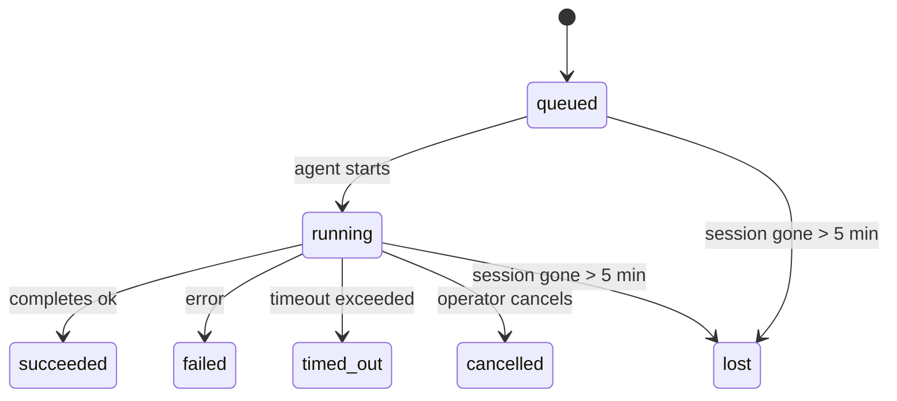

---
read_when:
    - 检查正在进行中或最近已完成的后台工作
    - 调试分离式智能体运行的交付失败问题
    - 了解后台运行与会话、cron 和心跳之间的关系
summary: ACP 运行、子智能体、隔离的 cron 作业和 CLI 操作的后台任务跟踪
title: 后台任务
x-i18n:
    generated_at: "2026-04-21T19:01:00Z"
    model: gpt-5.4
    provider: openai
    source_hash: a4cd666b3eaffde8df0b5e1533eb337e44a0824824af6f8a240f18a89f71b402
    source_path: automation/tasks.md
    workflow: 15
---

# 后台任务

> **在找调度功能？** 请参阅 [Automation & Tasks](/zh-CN/automation)，以选择合适的机制。本页介绍的是如何**跟踪**后台工作，而不是如何调度它。

后台任务用于跟踪**在你的主会话之外**运行的工作：
ACP 运行、子智能体派生、隔离的 cron 作业执行，以及由 CLI 发起的操作。

任务**不会**替代会话、cron 作业或心跳——它们是记录这些分离式工作“发生了什么、何时发生、以及是否成功”的**活动台账**。

<Note>
并非每次智能体运行都会创建任务。心跳轮次和普通交互式聊天不会。所有 cron 执行、ACP 派生、子智能体派生以及 CLI 智能体命令都会创建任务。
</Note>

## TL;DR

- 任务是**记录**，不是调度器——cron 和心跳决定工作**何时**运行，任务跟踪**发生了什么**。
- ACP、子智能体、所有 cron 作业和 CLI 操作都会创建任务。心跳轮次不会。
- 每个任务都会经历 `queued → running → terminal`（succeeded、failed、timed_out、cancelled 或 lost）。
- 只要 cron 运行时仍然拥有该作业，cron 任务就会保持活动状态；而由聊天支持的 CLI 任务只有在其所属运行上下文仍处于活动状态时才会保持活动状态。
- 完成采用推送驱动：分离式工作完成后可以直接通知，或唤醒请求方会话/心跳，因此状态轮询循环通常不是合适的模式。
- 隔离的 cron 运行和子智能体完成时，会尽力在最终清理记账前，为其子会话清理已跟踪的浏览器标签页/进程。
- 隔离的 cron 交付会在后代子智能体工作仍在收尾时抑制过时的父级中间回复，并在后代最终输出先于交付到达时优先使用该最终输出。
- 完成通知会直接发送到渠道，或排队等待下一次心跳。
- `openclaw tasks list` 显示所有任务；`openclaw tasks audit` 用于发现问题。
- 终态记录会保留 7 天，之后自动清理。

## 快速开始

```bash
# 列出所有任务（最新的在前）
openclaw tasks list

# 按运行时或状态筛选
openclaw tasks list --runtime acp
openclaw tasks list --status running

# 显示特定任务的详细信息（按 ID、run ID 或 session key）
openclaw tasks show <lookup>

# 取消正在运行的任务（终止子会话）
openclaw tasks cancel <lookup>

# 更改任务的通知策略
openclaw tasks notify <lookup> state_changes

# 运行健康审计
openclaw tasks audit

# 预览或应用维护
openclaw tasks maintenance
openclaw tasks maintenance --apply

# 检查 TaskFlow 状态
openclaw tasks flow list
openclaw tasks flow show <lookup>
openclaw tasks flow cancel <lookup>
```

## 什么会创建任务

| 来源 | 运行时类型 | 何时创建任务记录 | 默认通知策略 |
| ---------------------- | ------------ | ------------------------------------------------------ | --------------------- |
| ACP 后台运行 | `acp` | 派生 ACP 子会话时 | `done_only` |
| 子智能体编排 | `subagent` | 通过 `sessions_spawn` 派生子智能体时 | `done_only` |
| cron 作业（所有类型） | `cron` | 每次 cron 执行时（主会话和隔离式均包括） | `silent` |
| CLI 操作 | `cli` | 通过 Gateway 网关运行的 `openclaw agent` 命令 | `silent` |
| 智能体媒体作业 | `cli` | 由会话支持的 `video_generate` 运行 | `silent` |

主会话 cron 任务默认使用 `silent` 通知策略——它们会创建记录以供跟踪，但不会生成通知。隔离的 cron 任务同样默认使用 `silent`，但由于它们在自己的会话中运行，因此更容易被看到。

由会话支持的 `video_generate` 运行也使用 `silent` 通知策略。它们仍会创建任务记录，但完成结果会通过内部唤醒返还给原始智能体会话，以便智能体自行写入后续消息并附加已完成的视频。如果你启用了 `tools.media.asyncCompletion.directSend`，异步 `music_generate` 和 `video_generate` 完成时会先尝试直接发送到渠道，失败后再回退到唤醒请求方会话的路径。

当某个由会话支持的 `video_generate` 任务仍处于活动状态时，该工具也会充当护栏：在同一会话中重复调用 `video_generate` 时，不会启动第二个并发生成，而是返回当前活动任务的状态。当你希望从智能体侧显式查询进度/状态时，请使用 `action: "status"`。

**以下情况不会创建任务：**

- 心跳轮次——主会话；请参阅 [Heartbeat](/zh-CN/gateway/heartbeat)
- 普通交互式聊天轮次
- 直接的 `/command` 响应

## 任务生命周期



| 状态 | 含义 |
| ----------- | -------------------------------------------------------------------------- |
| `queued` | 已创建，等待智能体启动 |
| `running` | 智能体轮次正在执行 |
| `succeeded` | 已成功完成 |
| `failed` | 以错误结束 |
| `timed_out` | 超过配置的超时时间 |
| `cancelled` | 操作员通过 `openclaw tasks cancel` 停止 |
| `lost` | 运行时在 5 分钟宽限期后失去了权威性支撑状态 |

状态转换会自动发生——当关联的智能体运行结束时，任务状态会更新为对应结果。

`lost` 具备运行时感知能力：

- ACP 任务：支撑它的 ACP 子会话元数据已消失。
- 子智能体任务：支撑它的子会话已从目标智能体存储中消失。
- cron 任务：cron 运行时不再将该作业标记为活动状态。
- CLI 任务：隔离子会话任务使用子会话；由聊天支持的 CLI 任务则改为使用实时运行上下文，因此残留的渠道/群组/私聊会话行不会让它们继续保持活动状态。

## 交付与通知

当任务进入终态时，OpenClaw 会通知你。存在两种交付路径：

**直接交付**——如果任务具有渠道目标（`requesterOrigin`），完成消息会直接发送到该渠道（Telegram、Discord、Slack 等）。对于子智能体完成，OpenClaw 还会在可用时保留已绑定的线程/话题路由，并可在直接交付前，从请求方会话存储的路由（`lastChannel` / `lastTo` / `lastAccountId`）中补全缺失的 `to` / account。

**会话排队交付**——如果直接交付失败或未设置来源，更新将作为系统事件排入请求方会话，并在下一次心跳时呈现。

<Tip>
任务完成会立即触发一次心跳唤醒，因此你可以快速看到结果——不必等待下一次计划中的心跳触发。
</Tip>

这意味着常见工作流是基于推送的：只需启动一次分离式工作，然后让运行时在完成时唤醒你或通知你。只有在你需要调试、干预或执行显式审计时，才需要轮询任务状态。

### 通知策略

控制你希望收到每个任务多少信息：

| 策略 | 交付内容 |
| --------------------- | ----------------------------------------------------------------------- |
| `done_only`（默认） | 仅终态（succeeded、failed 等）——**这是默认值** |
| `state_changes` | 每次状态转换和进度更新 |
| `silent` | 完全不通知 |

可在任务运行期间更改策略：

```bash
openclaw tasks notify <lookup> state_changes
```

## CLI 参考

### `tasks list`

```bash
openclaw tasks list [--runtime <acp|subagent|cron|cli>] [--status <status>] [--json]
```

输出列：任务 ID、类型、状态、交付、运行 ID、子会话、摘要。

### `tasks show`

```bash
openclaw tasks show <lookup>
```

查找令牌支持任务 ID、运行 ID 或会话键。会显示完整记录，包括时间信息、交付状态、错误和终态摘要。

### `tasks cancel`

```bash
openclaw tasks cancel <lookup>
```

对于 ACP 和子智能体任务，这会终止子会话。对于由 CLI 跟踪的任务，取消会记录到任务注册表中（不存在单独的子运行时句柄）。状态会转换为 `cancelled`，并在适用时发送交付通知。

### `tasks notify`

```bash
openclaw tasks notify <lookup> <done_only|state_changes|silent>
```

### `tasks audit`

```bash
openclaw tasks audit [--json]
```

用于发现运维问题。检测到问题时，这些发现也会出现在 `openclaw status` 中。

| 发现项 | 严重级别 | 触发条件 |
| ------------------------- | -------- | ----------------------------------------------------- |
| `stale_queued` | warn | 处于 queued 超过 10 分钟 |
| `stale_running` | error | 处于 running 超过 30 分钟 |
| `lost` | error | 由运行时支撑的任务所有权已消失 |
| `delivery_failed` | warn | 交付失败且通知策略不是 `silent` |
| `missing_cleanup` | warn | 终态任务没有清理时间戳 |
| `inconsistent_timestamps` | warn | 时间线违反约束（例如结束时间早于开始时间） |

### `tasks maintenance`

```bash
openclaw tasks maintenance [--json]
openclaw tasks maintenance --apply [--json]
```

用它来预览或应用任务及 Task Flow 状态的对账、清理时间戳补写和清理裁剪。

对账具备运行时感知能力：

- ACP/子智能体任务会检查其支撑的子会话。
- cron 任务会检查 cron 运行时是否仍拥有该作业。
- 由聊天支持的 CLI 任务会检查所属的实时运行上下文，而不只是聊天会话行。

完成清理同样具备运行时感知能力：

- 子智能体完成时，会尽力先关闭该子会话已跟踪的浏览器标签页/进程，然后再继续公告清理。
- 隔离的 cron 完成时，会尽力先关闭该 cron 会话已跟踪的浏览器标签页/进程，然后再让该运行完全结束。
- 隔离的 cron 交付会在需要时等待后代子智能体后续处理完成，并抑制过时的父级确认文本，而不是将其作为结果公告。
- 子智能体完成交付会优先使用最新的可见助手文本；如果该文本为空，则回退到经清理的最新 tool/toolResult 文本；仅包含超时工具调用的运行可折叠为简短的部分进度摘要。终态失败的运行会公告失败状态，而不会重放已捕获的回复文本。
- 清理失败不会掩盖真实的任务结果。

### `tasks flow list|show|cancel`

```bash
openclaw tasks flow list [--status <status>] [--json]
openclaw tasks flow show <lookup> [--json]
openclaw tasks flow cancel <lookup>
```

当你关心的是编排中的 Task Flow，而不是单个后台任务记录时，请使用这些命令。

## 聊天任务面板（`/tasks`）

在任意聊天会话中使用 `/tasks`，可查看与该会话关联的后台任务。该面板会显示活动中和最近已完成的任务，包括运行时、状态、时间信息，以及进度或错误详情。

当当前会话没有可见的关联任务时，`/tasks` 会回退为显示智能体本地任务计数，
这样你仍然可以获得概览，而不会泄露其他会话的详细信息。

如需查看完整的操作员台账，请使用 CLI：`openclaw tasks list`。

## 状态集成（任务压力）

`openclaw status` 包含一个可快速查看的任务摘要：

```
Tasks: 3 queued · 2 running · 1 issues
```

该摘要报告：

- **active** —— `queued` + `running` 的数量
- **failures** —— `failed` + `timed_out` + `lost` 的数量
- **byRuntime** —— 按 `acp`、`subagent`、`cron`、`cli` 的细分统计

`/status` 和 `session_status` 工具都会使用带清理感知的任务快照：优先显示活动任务，隐藏陈旧的已完成记录，并且仅在没有活动工作剩余时才显示最近失败的任务。这样可以让状态卡聚焦于当前真正重要的内容。

## 存储与维护

### 任务存储位置

任务记录持久化保存在以下 SQLite 路径中：

```
$OPENCLAW_STATE_DIR/tasks/runs.sqlite
```

注册表会在 Gateway 网关启动时加载到内存中，并将写入同步到 SQLite，以便在重启后仍能保持持久性。

### 自动维护

清扫器每 **60 秒** 运行一次，处理以下三件事：

1. **对账** —— 检查活动任务是否仍有权威性的运行时支撑。ACP/子智能体任务使用子会话状态，cron 任务使用活动作业所有权，由聊天支持的 CLI 任务使用所属运行上下文。如果该支撑状态消失超过 5 分钟，任务会被标记为 `lost`。
2. **清理时间戳补写** —— 为终态任务设置 `cleanupAfter` 时间戳（`endedAt + 7 days`）。
3. **裁剪** —— 删除超过其 `cleanupAfter` 日期的记录。

**保留期**：终态任务记录会保留 **7 天**，之后自动清理。无需配置。

## 任务与其他系统的关系

### 任务与 Task Flow

[Task Flow](/zh-CN/automation/taskflow) 是位于后台任务之上的流程编排层。单个 flow 在其生命周期内可能通过受管或镜像同步模式协调多个任务。使用 `openclaw tasks` 检查单个任务记录，使用 `openclaw tasks flow` 检查编排中的 flow。

详情请参阅 [Task Flow](/zh-CN/automation/taskflow)。

### 任务与 cron

cron 作业**定义**保存在 `~/.openclaw/cron/jobs.json`；运行时执行状态保存在其旁边的 `~/.openclaw/cron/jobs-state.json` 中。**每一次** cron 执行都会创建一条任务记录——无论是主会话还是隔离式执行。主会话 cron 任务默认使用 `silent` 通知策略，因此它们会被跟踪，但不会生成通知。

请参阅 [Cron Jobs](/zh-CN/automation/cron-jobs)。

### 任务与心跳

心跳运行属于主会话轮次——它们不会创建任务记录。当任务完成时，它可以触发一次心跳唤醒，以便你及时看到结果。

请参阅 [Heartbeat](/zh-CN/gateway/heartbeat)。

### 任务与会话

一个任务可能会引用 `childSessionKey`（工作运行的位置）和 `requesterSessionKey`（发起它的人）。会话是对话上下文；任务是在其之上的活动跟踪。

### 任务与智能体运行

任务的 `runId` 会链接到执行该工作的智能体运行。智能体生命周期事件（开始、结束、错误）会自动更新任务状态——你无需手动管理生命周期。

## 相关内容

- [Automation & Tasks](/zh-CN/automation) —— 所有自动化机制总览
- [Task Flow](/zh-CN/automation/taskflow) —— 位于任务之上的流程编排
- [Scheduled Tasks](/zh-CN/automation/cron-jobs) —— 调度后台工作
- [Heartbeat](/zh-CN/gateway/heartbeat) —— 周期性的主会话轮次
- [CLI: Tasks](/cli/index#tasks) —— CLI 命令参考
