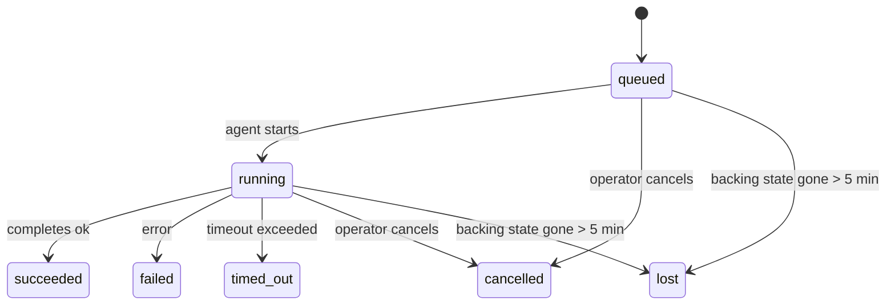

---
read_when:
    - 检查正在进行或最近完成的后台工作
    - 调试分离式智能体运行的递送失败
    - 了解后台运行与会话、cron 和 Heartbeat 的关系
sidebarTitle: Background tasks
summary: ACP 运行、子智能体、cron 执行和 CLI 操作的后台任务跟踪
title: 后台任务
x-i18n:
    generated_at: "2026-07-05T11:01:16Z"
    model: gpt-5.5
    postprocess_version: locale-links-v1
    provider: openai
    source_hash: 22f81c67fcdb5ef76f42b6afa96f3348614229f2f90dd870f821c32e9cf452a9
    source_path: automation/tasks.md
    workflow: 16
---

<Note>
在寻找调度功能？请参阅 [自动化](/zh-CN/automation) 来选择正确机制。此页面是后台工作的活动账本，而不是调度器。
</Note>

后台任务跟踪在**你的主对话会话之外**运行的工作：ACP 运行、子智能体生成、cron 作业执行，以及由 CLI 发起的操作。

任务**不会**取代会话、cron 作业或 Heartbeat - 它们是记录已分离工作发生了什么、何时发生以及是否成功的**活动账本**。

<Note>
并非每次智能体运行都会创建任务。Heartbeat 轮次和普通交互式聊天不会。所有 cron 执行、ACP 生成、子智能体生成，以及由 Gateway 网关调度的 CLI 智能体命令都会创建任务。
</Note>

## TL;DR

- 任务是**记录**，不是调度器 - cron 和 Heartbeat 决定工作_何时_运行，任务跟踪_发生了什么_。
- ACP、子智能体、所有 cron 作业和 CLI 操作都会创建任务。Heartbeat 轮次不会。
- 每个任务都会经过 `queued → running → terminal`（succeeded、failed、timed_out、cancelled 或 lost）。
- 当 cron 运行时仍然拥有该作业时，cron 任务会保持活动状态；如果内存中的运行时状态已消失，任务维护会先检查持久化的 cron 运行历史，然后才将任务标记为 lost。
- 完成是推送驱动的：分离工作完成时可以直接通知，或唤醒请求方会话/Heartbeat，因此状态轮询循环通常不是正确形态。
- 隔离的 cron 运行和子智能体完成会尽力为其子会话清理被跟踪的浏览器标签页/进程，然后再进行最终清理簿记。
- 隔离的 cron 递送会在后代子智能体工作仍在排空时抑制过期的中间父级回复，并且如果最终后代输出在递送前到达，则优先使用它。
- 完成通知会直接递送到渠道，或排队等待下一次 Heartbeat。
- `openclaw tasks list` 显示所有任务；`openclaw tasks audit` 暴露问题。
- 终端记录会保留 7 天（`lost` 记录保留 24 小时），然后自动修剪。

## 快速开始

<Tabs>
  <Tab title="列出和筛选">
    ```bash
    # List all tasks (newest first)
    openclaw tasks list

    # Filter by runtime or status
    openclaw tasks list --runtime acp
    openclaw tasks list --status running
    ```

  </Tab>
  <Tab title="检查">
    ```bash
    # Show details for a specific task (by task ID, run ID, or session key)
    openclaw tasks show <lookup>
    ```
  </Tab>
  <Tab title="取消和通知">
    ```bash
    # Cancel a running task (kills the child session)
    openclaw tasks cancel <lookup>

    # Change notification policy for a task
    openclaw tasks notify <lookup> state_changes
    ```

  </Tab>
  <Tab title="审计和维护">
    ```bash
    # Run a health audit
    openclaw tasks audit

    # Preview or apply maintenance
    openclaw tasks maintenance
    openclaw tasks maintenance --apply
    ```

  </Tab>
  <Tab title="任务流">
    ```bash
    # Inspect TaskFlow state
    openclaw tasks flow list
    openclaw tasks flow show <lookup>
    openclaw tasks flow cancel <lookup>
    ```
  </Tab>
</Tabs>

## 什么会创建任务

| 来源                   | 运行时类型 | 创建任务记录的时机                                                       | 默认通知策略 |
| ---------------------- | ------------ | ---------------------------------------------------------------------- | --------------------- |
| ACP 后台运行           | `acp`        | 生成子 ACP 会话                                                         | `done_only`           |
| 子智能体编排           | `subagent`   | 通过 `sessions_spawn` 生成子智能体                                      | `done_only`           |
| Cron 作业（所有类型）  | `cron`       | 每次 cron 执行（主会话和隔离）                                          | `silent`              |
| CLI 操作               | `cli`        | 通过 Gateway 网关运行的 `openclaw agent` 命令                           | `silent`              |
| 智能体媒体作业         | `cli`        | 由会话支持的 `image_generate`/`music_generate`/`video_generate` 运行 | `silent`              |

<AccordionGroup>
  <Accordion title="cron 和媒体的通知默认值">
    Cron 任务（主会话和隔离）使用 `silent` 通知策略 - 它们会创建记录用于跟踪，但不会自行生成任务通知；cron 拥有自己的递送路径。

    由会话支持的 `image_generate`、`music_generate` 和 `video_generate` 运行也使用 `silent` 通知策略。它们仍会创建任务记录，但完成会作为内部唤醒交回给原始智能体会话，以便该智能体自行写入后续消息并附加完成的媒体。请求方智能体遵循其正常的可见回复契约：配置时自动发送最终回复，或在会话要求消息工具回复时使用 `message(action="send")` 加 `NO_REPLY`。如果请求方会话不再活动，或其活动唤醒失败，并且完成智能体遗漏了部分或全部生成的媒体，OpenClaw 会向原始渠道目标发送幂等的直接回退，仅包含缺失的媒体。

  </Accordion>
  <Accordion title="并发媒体生成护栏">
    当由会话支持的媒体生成任务仍处于活动状态时，`image_generate`、`music_generate` 和 `video_generate` 会防止意外重试：对同一提示/请求重复调用会返回匹配的活动任务状态，而不是启动重复任务；不同提示则可以启动自己的任务。当你希望从智能体侧显式查询进度/状态时，请使用 `action: "status"`。
  </Accordion>
  <Accordion title="什么不会创建任务">
    - Heartbeat 轮次 - 主会话；请参阅 [Heartbeat](/zh-CN/gateway/heartbeat)
    - 普通交互式聊天轮次
    - 直接 `/command` 响应

  </Accordion>
</AccordionGroup>

## 任务生命周期



| 状态        | 含义                                                                        |
| ----------- | --------------------------------------------------------------------------- |
| `queued`    | 已创建，正在等待智能体启动                                                  |
| `running`   | 智能体轮次正在主动执行                                                      |
| `succeeded` | 已成功完成                                                                  |
| `failed`    | 已完成但出现错误                                                            |
| `timed_out` | 超过配置的超时时间                                                          |
| `cancelled` | 由操作员通过 `openclaw tasks cancel` 停止，或运行已中止                     |
| `lost`      | 运行时在 5 分钟宽限期后丢失权威后备状态                                     |

转换会自动发生 - 智能体运行生命周期事件（start、end、error）会更新任务状态；你不需要手动管理。

智能体运行完成对活动任务记录具有权威性。成功的分离运行会最终确定为 `succeeded`，普通运行错误会最终确定为 `failed`，超时会最终确定为 `timed_out`，取消/中止结果会最终确定为 `cancelled`。一旦任务进入终端状态，后续生命周期信号不会降低其状态 - 操作员已取消或已经是 `failed`/`timed_out`/`lost` 的任务，即使之后收到成功信号，也会保持原样。

`lost` 具备运行时感知：

- ACP 任务：只有 Gateway 网关中活动的进程内 ACP 轮次才能证明运行仍然存活；仅有持久化会话元数据并不能证明。离线 CLI 审计保持保守，绝不会回收 ACP 任务。
- 子智能体任务：后备子会话已从目标智能体存储中消失（或携带重启恢复墓碑）。
- Cron 任务：cron 运行时不再将该作业跟踪为活动状态，并且持久化的 cron 运行历史未显示该运行有终端结果。离线 CLI 审计不会把自身空的进程内 cron 运行时状态视为权威。
- CLI 任务：带有运行 ID/来源 ID 的任务使用实时运行上下文，因此在 Gateway 网关拥有的运行消失后，残留的子会话或聊天会话行不会让它们保持存活。没有运行身份的旧版 CLI 任务仍会回退到子会话。由 Gateway 网关支持的 `openclaw agent` 运行也会根据其运行结果最终确定，因此已完成的运行不会一直处于活动状态，直到清扫器将其标记为 `lost`。

## 递送和通知

当任务到达终端状态时，OpenClaw 会通知你。有两条递送路径：

**直接递送** - 如果任务有渠道目标（`requesterOrigin`），完成消息会直接发送到该渠道（Discord、Slack、Telegram 等）。群组和频道任务完成则通过请求方会话路由，以便父智能体可以写入可见回复。对于子智能体完成，OpenClaw 还会在可用时保留绑定的线程/主题路由，并且可以在放弃直接递送前，从请求方会话存储的路由（`lastChannel` / `lastTo` / `lastAccountId`）中补齐缺失的 `to` / 账号。

**会话排队递送** - 如果直接递送失败或未设置来源，更新会作为系统事件排队到请求方会话中，并在下一次 Heartbeat 时出现。

<Tip>
会话排队的任务完成会触发立即 Heartbeat 唤醒，因此你会很快看到结果 - 不必等待下一次计划的 Heartbeat tick。
</Tip>

这意味着通常工作流是基于推送的：启动一次分离工作，然后让运行时在完成时唤醒或通知你。只有在需要调试、干预或显式审计时才轮询任务状态。

### 通知策略

控制你从每个任务收到多少信息：

| 策略                  | 递送内容                                                |
| --------------------- | ------------------------------------------------------- |
| `done_only`（默认）   | 仅终端状态（succeeded、failed 等）                      |
| `state_changes`       | 每次状态转换和进度更新                                  |
| `silent`              | 完全不递送（cron、CLI 和媒体任务的默认值）              |

在任务运行时更改策略：

```bash
openclaw tasks notify <lookup> state_changes
```

## CLI 参考

<AccordionGroup>
  <Accordion title="tasks list">
    ```bash
    openclaw tasks list [--runtime <acp|subagent|cron|cli>] [--status <status>] [--json]
    ```

    输出列：Task、Kind、Status、Delivery、Run、Child Session、Summary。裸 `openclaw tasks` 的行为类似于 `openclaw tasks list`。

  </Accordion>
  <Accordion title="tasks show">
    ```bash
    openclaw tasks show <lookup> [--json]
    ```

    查找令牌接受任务 ID、运行 ID 或会话键。显示完整记录，包括时间、递送状态、错误和终端摘要。

  </Accordion>
  <Accordion title="tasks cancel">
    ```bash
    openclaw tasks cancel <lookup>
    ```

    对于 ACP 和子智能体任务，这会终止子会话；ACP 和 cron 取消会通过正在运行的 Gateway 网关（`tasks.cancel`）路由。对于由 CLI 跟踪的任务，取消会记录到任务注册表中（没有单独的子运行时句柄）。状态会转换为 `cancelled`，并在适用时发送递送通知。

  </Accordion>
  <Accordion title="tasks notify">
    ```bash
    openclaw tasks notify <lookup> <done_only|state_changes|silent>
    ```
  </Accordion>
  <Accordion title="tasks audit">
    ```bash
    openclaw tasks audit [--severity <warn|error>] [--code <name>] [--limit <n>] [--json]
    ```

    在一份报告中暴露任务**和** TaskFlow 的运营问题。检测到问题时，发现项也会出现在 `openclaw status` 中。

    任务发现项：

    | 发现                      | 严重性     | 触发条件                                                                                                     |
    | ------------------------- | ---------- | ------------------------------------------------------------------------------------------------------------ |
    | `stale_queued`            | warn       | 排队超过 10 分钟                                                                                             |
    | `stale_running`           | error      | 运行超过 30 分钟                                                                                             |
    | `lost`                    | warn/error | 运行时支撑的任务所有权消失；保留的丢失任务在 `cleanupAfter` 前发出警告，之后变为错误                         |
    | `delivery_failed`         | warn       | 交付失败且通知策略不是 `silent`                                                                              |
    | `missing_cleanup`         | warn       | 没有清理时间戳的终止任务                                                                                     |
    | `inconsistent_timestamps` | warn       | 时间线违规（例如结束早于开始）                                                                               |

    TaskFlow 发现：

    | 发现                   | 严重性     | 触发条件                                                                    |
    | ---------------------- | ---------- | --------------------------------------------------------------------------- |
    | `restore_failed`       | error      | 从 SQLite 恢复流程注册表失败                                                |
    | `stale_running`        | error      | 运行中的流程超过 30 分钟没有推进                                             |
    | `stale_waiting`        | warn       | 等待中的流程超过 30 分钟没有推进                                             |
    | `stale_blocked`        | warn       | 阻塞中的流程超过 30 分钟没有推进                                             |
    | `cancel_stuck`         | warn       | 超过 5 分钟前已请求取消，没有活动子任务，且仍未终止                         |
    | `missing_linked_tasks` | warn/error | 陈旧的托管流程没有链接任务或等待状态                                        |
    | `blocked_task_missing` | warn       | 阻塞流程指向一个已不存在的任务 id                                           |

  </Accordion>
  <Accordion title="tasks maintenance">
    ```bash
    openclaw tasks maintenance [--json]
    openclaw tasks maintenance --apply [--json]
    ```

    使用此命令预览或应用针对任务、TaskFlow 状态以及陈旧 cron 运行会话注册表行的对账、清理标记和剪枝。

    对账会感知运行时：

    - ACP 任务需要 Gateway 网关中存在实时的进程内轮次；子智能体任务会检查其背后的子会话。
    - 如果子智能体任务的子会话带有重启恢复墓碑，则会被标记为丢失，而不是被视为可恢复的支撑会话。
    - Cron 任务会检查 cron 运行时是否仍拥有该作业，然后先从持久化的 cron 运行日志/作业状态恢复终止状态，最后才回退为 `lost`。只有 Gateway 网关进程对内存中的 cron 活动作业集合具有权威性；离线 CLI 审计会使用持久化历史，但不会仅因为本地集合为空就把 cron 任务标记为丢失。
    - 带运行身份的 CLI 任务会检查所属的实时运行上下文，而不仅是子会话或聊天会话行。

    完成清理也会感知运行时：

    - 子智能体完成时，会在继续公告清理之前尽力关闭该子会话跟踪的浏览器标签页/进程。
    - 隔离 cron 完成时，会在运行完全拆除之前尽力关闭该 cron 会话跟踪的浏览器标签页/进程。
    - 隔离 cron 交付会在需要时等待后代子智能体的后续处理完成，并抑制陈旧的父级确认文本，而不是发布它。
    - 子智能体完成交付只使用子项最新的可见 assistant 文本。工具/toolResult 输出不会提升为子结果文本。终止失败的运行会公告失败状态，而不会重放捕获到的回复文本。
    - 清理失败不会掩盖真实任务结果。

    应用维护时，OpenClaw 还会移除超过 7 天的陈旧 `cron:<jobId>:run:<runId>` 会话注册表行，同时保留当前运行中的 cron 作业行，并且不触碰非 cron 会话行。

  </Accordion>
  <Accordion title="tasks flow list | show | cancel">
    ```bash
    openclaw tasks flow list [--status <status>] [--json]
    openclaw tasks flow show <lookup> [--json]
    openclaw tasks flow cancel <lookup>
    ```

    流程查找令牌接受流程 id 或所有者键。当你关心的是编排层 [Task Flow](/zh-CN/automation/taskflow)，而不是单个后台任务记录时，请使用这些命令。

  </Accordion>
</AccordionGroup>

## 聊天任务看板（`/tasks`）

在任意聊天会话中使用 `/tasks` 查看链接到该会话的后台任务。看板最多显示五个活动和最近完成的任务，并包含运行时、状态、计时、进度或错误详情。

当当前会话没有可见的链接任务时，`/tasks` 会回退到 Agent 本地任务计数，因此你仍可获得概览，同时不会泄露其他会话的详情。

如需完整的操作员账本，请使用 CLI：`openclaw tasks list`。

## 状态集成（任务压力）

`openclaw status` 包含一行一目了然的任务信息：

```
Tasks    2 active · 1 queued · 1 running · 1 issue · audit clean · 6 tracked
```

摘要会统计活动工作（`queued` + `running`）、失败（`failed` + `timed_out` + `lost`）、审计发现和跟踪记录总数；JSON 载荷还会按运行时（`acp`、`subagent`、`cron`、`cli`）拆分计数。

`/status` 和 `session_status` 工具都使用感知清理的任务快照：优先显示活动任务，隐藏过期行，终止任务只在较短的最近窗口（5 分钟）内出现，并且在没有剩余活动工作时聚焦失败。这会让状态卡片保持关注当前重要事项。

## 存储和维护

### 任务存储位置

任务记录和交付状态会持久化到共享的 OpenClaw SQLite 状态数据库：

```
~/.openclaw/state/openclaw.sqlite   (tables: task_runs, task_delivery_state, flow_runs)
```

设置 `OPENCLAW_STATE_DIR` 可将整个状态根目录（默认 `~/.openclaw`）移动到其他位置；共享数据库路径会随之移动。

注册表首次使用时加载到内存，并将每次写入持久化回 SQLite，因此记录可在 Gateway 网关重启后保留。WAL 增长会通过 SQLite 的默认自动检查点阈值以及定期 `PASSIVE` 检查点保持有界；关闭和显式维护检查点使用 `TRUNCATE`，因此正常关闭会回收 WAL 空间，而不会让后台清扫器等待活动读取者。

旧安装中的遗留 sidecar 存储（`tasks/runs.sqlite`、`flows/registry.sqlite`）会由 `openclaw doctor` 导入到共享数据库。

### 自动维护

清扫器每 **60 秒** 运行一次（Gateway 网关启动后约 5 秒执行首次检查），处理四件事：

<Steps>
  <Step title="Reconciliation">
    检查活动任务是否仍有权威的运行时支撑。ACP 任务需要实时进程内轮次，子智能体任务使用子会话状态，cron 任务使用活动作业所有权和持久化运行历史，带运行身份的 CLI 任务使用所属运行上下文。如果支撑状态消失超过 5 分钟（无子项的原生子智能体任务为 30 分钟），该任务会被标记为 `lost`。
  </Step>
  <Step title="ACP session repair">
    关闭已终止或孤立的父级拥有的一次性 ACP 会话；仅当不存在活动会话绑定时，才关闭陈旧的已终止或孤立的持久 ACP 会话。
  </Step>
  <Step title="Cleanup stamping">
    为终止任务设置 `cleanupAfter` 时间戳（终止时间 + 保留窗口）。在保留期间，丢失任务仍会在审计中以警告显示；当 `cleanupAfter` 过期或清理元数据缺失后，它们会变为错误。
  </Step>
  <Step title="Pruning">
    删除超过其 `cleanupAfter` 日期的记录。
  </Step>
</Steps>

<Note>
**保留期：**终止任务记录会保留 **7 天**（`lost` 记录保留 **24 小时**），随后自动剪枝。无需配置。
</Note>

## 任务与其他系统的关系

<AccordionGroup>
  <Accordion title="Tasks and Task Flow">
    [Task Flow](/zh-CN/automation/taskflow) 是后台任务之上的流程编排层。单个流程可以在其生命周期内使用托管或镜像同步模式协调多个任务。使用 `openclaw tasks` 检查单个任务记录，使用 `openclaw tasks flow` 检查编排流程。

  </Accordion>
  <Accordion title="Tasks and cron">
    Cron 作业定义、运行时执行状态和运行历史都存放在 OpenClaw 的共享 SQLite 状态数据库中。**每次** cron 执行都会创建一条任务记录，无论是主会话还是隔离会话，并使用 `silent` 通知策略，因此 cron 运行会被跟踪，但不会生成自己的任务通知。

    参见 [Cron 作业](/zh-CN/automation/cron-jobs)。

  </Accordion>
  <Accordion title="Tasks and heartbeat">
    Heartbeat 运行是主会话轮次，不会创建任务记录。任务完成时可以触发一次 Heartbeat 唤醒，让你及时看到结果。

    参见 [Heartbeat](/zh-CN/gateway/heartbeat)。

  </Accordion>
  <Accordion title="Tasks and sessions">
    任务可以引用 `childSessionKey`（工作运行位置）和 `requesterSessionKey`（启动者）。其 `agentId` 标识执行工作的智能体，而请求者和所有者字段会保留启动与控制上下文。会话是对话上下文；任务是在其之上的活动跟踪。
  </Accordion>
  <Accordion title="Tasks and agent runs">
    任务的 `runId` 链接到正在执行工作的智能体运行。智能体生命周期事件（开始、结束、错误）会自动更新任务状态，你无需手动管理生命周期。
  </Accordion>
</AccordionGroup>

## 相关

- [自动化](/zh-CN/automation) - 一览所有自动化机制
- [CLI：任务](/zh-CN/cli/tasks) - CLI 命令参考
- [Heartbeat](/zh-CN/gateway/heartbeat) - 周期性的主会话轮次
- [定时任务](/zh-CN/automation/cron-jobs) - 调度后台工作
- [Task Flow](/zh-CN/automation/taskflow) - 任务之上的流程编排
