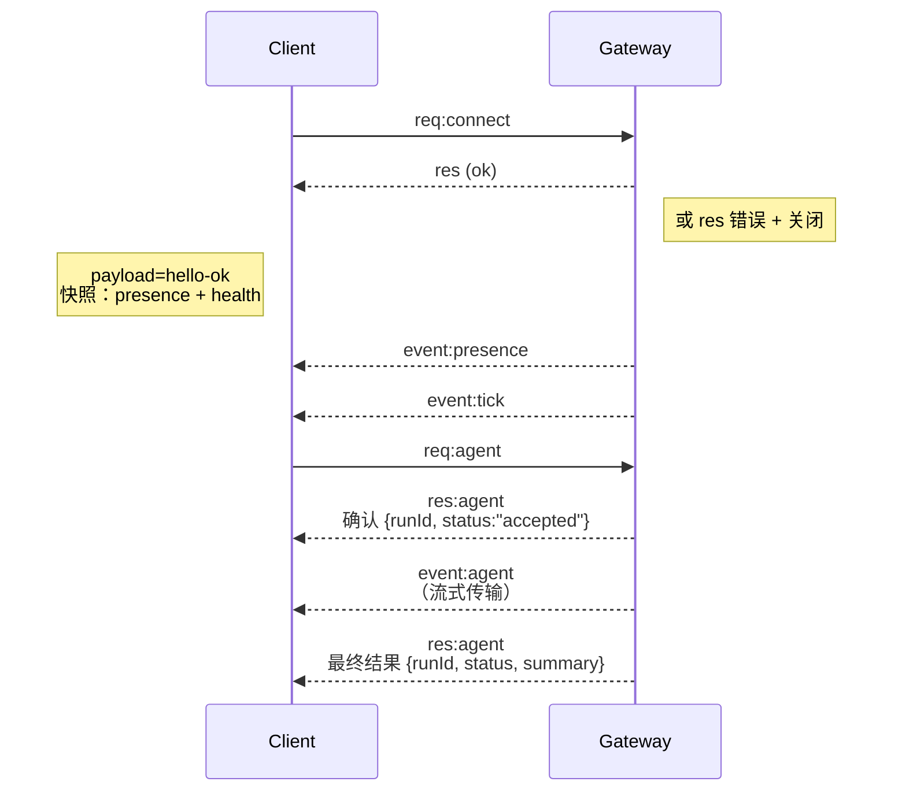

---
read_when:
    - 处理 Gateway 网关协议、客户端或传输协议相关工作
summary: WebSocket Gateway 网关架构、组件和客户端流程
title: Gateway 网关架构
x-i18n:
    generated_at: "2026-07-11T20:26:58Z"
    model: gpt-5.6
    postprocess_version: locale-links-v1
    provider: openai
    source_hash: f8054bd87f738b957c24f8d6965d55365de2293d44902530a9ba778afa597cc7
    source_path: concepts/architecture.md
    workflow: 16
---

## 概览

- 一个长期运行的 **Gateway 网关** 负责所有消息传递界面（通过 Baileys 接入 WhatsApp、通过 grammY 接入 Telegram，以及 Slack、Discord、Signal、iMessage、WebChat）。
- 控制平面客户端（macOS 应用、CLI、Web 界面、自动化程序）通过配置的绑定主机上的 **WebSocket** 连接到 Gateway 网关（默认为 `127.0.0.1:18789`）。
- **节点**（macOS/iOS/Android/无头设备）也通过 **WebSocket** 连接，但会声明 `role: node`，并明确指定能力和命令。
- 每台主机运行一个 Gateway 网关；只有它会打开 WhatsApp 会话。
- **画布主机**由 Gateway 网关的 HTTP 服务器通过以下路径提供：
  - `/__openclaw__/canvas/`（智能体可编辑的 HTML/CSS/JS）
  - `/__openclaw__/a2ui/`（A2UI 主机）

  它与 Gateway 网关使用相同端口（默认为 `18789`）。

## 组件和流程

### Gateway 网关（守护进程）

- 维护提供商连接。
- 公开类型化的 WS API（请求、响应、服务器推送事件）。
- 根据 JSON Schema 验证入站帧。
- 发出 `agent`、`chat`、`presence`、`health`、`heartbeat`、`cron` 等事件。

### 客户端（Mac 应用 / CLI / Web 管理界面）

- 每个客户端使用一个 WS 连接。
- 发送请求（`health`、`status`、`send`、`agent`、`system-presence`）。
- 订阅事件（`tick`、`agent`、`presence`、`shutdown`）。

### 节点（macOS / iOS / Android / 无头设备）

- 使用 `role: node` 连接到**同一个 WS 服务器**。
- 在 `connect` 中提供设备身份；配对**基于设备**（角色为 `node`），审批信息存储在设备配对存储中。
- 公开 `canvas.*`、`camera.*`、`screen.record`、`location.get` 等命令。

协议详情：[Gateway 网关协议](/zh-CN/gateway/protocol)

### WebChat

- 使用 Gateway 网关 WS API 获取聊天历史记录和发送消息的静态界面。
- 在远程设置中，通过与其他客户端相同的 SSH/Tailscale 隧道连接。

## 连接生命周期（单个客户端）



## 线路协议（摘要）

- 传输方式：WebSocket，使用包含 JSON 负载的文本帧。
- 第一帧**必须**是 `connect`。
- 握手后：
  - 请求：`{type:"req", id, method, params}` → `{type:"res", id, ok, payload|error}`
  - 事件：`{type:"event", event, payload, seq?, stateVersion?}`
- `hello-ok.features.methods` / `events` 是设备发现元数据，并非所有可调用辅助路由的自动生成转储。
- 共享密钥身份验证根据配置的 Gateway 网关身份验证模式，使用 `connect.params.auth.token` 或 `connect.params.auth.password`。
- Tailscale Serve（`gateway.auth.allowTailscale: true`）或非 local loopback 的 `gateway.auth.mode: "trusted-proxy"` 等带身份信息的模式通过请求标头满足身份验证要求，而不是使用 `connect.params.auth.*`。
- 私有入口的 `gateway.auth.mode: "none"` 会完全禁用共享密钥身份验证；不要在公开或不可信的入口上使用此模式。
- 具有副作用的方法（`send`、`agent`）必须提供幂等键，才能安全重试；服务器会维护一个短期去重缓存。
- 节点必须在 `connect` 中包含 `role: "node"` 以及能力、命令和权限。

## 配对和本地信任

- 所有 WS 客户端（操作员和节点）都在 `connect` 中包含**设备身份**。
- 新设备 ID 需要获得配对批准；Gateway 网关会签发**设备令牌**，用于后续连接。
- 直接通过 local loopback 建立的连接可以自动获批，以保持同一主机上的流畅体验。
- OpenClaw 还为可信的共享密钥辅助流程提供一条范围有限的后端/容器本地自连接路径。
- Tailnet 和局域网连接（包括同一主机上的 tailnet 绑定）仍需明确的配对批准。
- 所有连接都必须对 `connect.challenge` nonce 进行签名。签名负载 `v3` 还会绑定 `platform` 和 `deviceFamily`；Gateway 网关会在重新连接时固定已配对的元数据，并在元数据发生变化时要求修复配对。
- **非本地**连接仍需明确批准。
- Gateway 网关身份验证（`gateway.auth.*`）仍适用于**所有**本地或远程连接。

详情：[Gateway 网关协议](/zh-CN/gateway/protocol)、[配对](/zh-CN/channels/pairing)、
[安全性](/zh-CN/gateway/security)。

## 协议类型和代码生成

- TypeBox 架构定义协议。
- JSON Schema 由这些架构生成。
- Swift 模型由 JSON Schema 生成。

## 远程访问

- 首选：Tailscale 或 VPN。
- 替代方案：SSH 隧道

  ```bash
  ssh -N -L 18789:127.0.0.1:18789 user@gateway-host
  ```

- 通过隧道仍使用相同的握手和身份验证令牌。
- 在远程设置中，可以为 WS 启用 TLS 和可选的证书固定。

## 运维快照

- 启动：`openclaw gateway`（前台运行，将日志输出到标准输出）。
- 健康检查：通过 WS 使用 `health`（也包含在 `hello-ok` 中）。
- 进程监管：使用 launchd/systemd 实现自动重启。

## 不变量

- 每台主机只有一个 Gateway 网关控制一个 Baileys 会话。
- 必须进行握手；任何非 JSON 第一帧或第一帧不是 `connect` 的情况都会直接关闭连接。
- 事件不会重放；出现缺口时，客户端必须刷新。

## 相关内容

- [Agent loop](/zh-CN/concepts/agent-loop) — 智能体执行周期详解
- [Gateway 网关协议](/zh-CN/gateway/protocol) — WebSocket 协议约定
- [队列](/zh-CN/concepts/queue) — 命令队列和并发
- [安全性](/zh-CN/gateway/security) — 信任模型和安全强化
