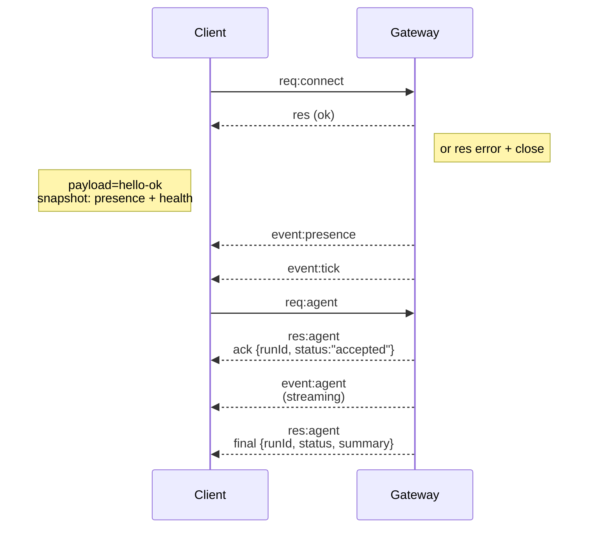

---
read_when:
    - 正在处理 Gateway 网关协议、客户端或传输层
summary: WebSocket Gateway 网关架构、组件和客户端流程
title: Gateway 网关架构
x-i18n:
    generated_at: "2026-04-05T08:20:52Z"
    model: gpt-5.4
    provider: openai
    source_hash: 2b12a2a29e94334c6d10787ac85c34b5b046f9a14f3dd53be453368ca4a7547d
    source_path: concepts/architecture.md
    workflow: 15
---

# Gateway 网关架构

## 概览

- 单个长期运行的 **Gateway 网关** 拥有所有消息表面（通过
  Baileys 接入 WhatsApp，通过 grammY 接入 Telegram，以及 Slack、Discord、Signal、iMessage、WebChat）。
- 控制平面客户端（macOS 应用、CLI、Web UI、自动化）通过配置的绑定主机上的 **WebSocket** 连接到
  Gateway 网关（默认
  `127.0.0.1:18789`）。
- **Nodes**（macOS/iOS/Android/无头环境）也通过 **WebSocket** 连接，但
  会声明 `role: node` 并显式提供 caps/commands。
- 每台主机一个 Gateway 网关；它是唯一会打开 WhatsApp 会话的地方。
- **canvas host** 由 Gateway 网关 HTTP 服务器提供，路径为：
  - `/__openclaw__/canvas/`（智能体可编辑的 HTML/CSS/JS）
  - `/__openclaw__/a2ui/`（A2UI host）
    它与 Gateway 网关使用相同端口（默认 `18789`）。

## 组件和流程

### Gateway 网关（守护进程）

- 维护提供商连接。
- 暴露类型化的 WS API（请求、响应、服务器推送事件）。
- 根据 JSON Schema 验证入站帧。
- 发出 `agent`、`chat`、`presence`、`health`、`heartbeat`、`cron` 等事件。

### 客户端（mac 应用 / CLI / Web 管理端）

- 每个客户端一个 WS 连接。
- 发送请求（`health`、`status`、`send`、`agent`、`system-presence`）。
- 订阅事件（`tick`、`agent`、`presence`、`shutdown`）。

### Nodes（macOS / iOS / Android / 无头环境）

- 使用 `role: node` 连接到**同一个 WS 服务器**。
- 在 `connect` 中提供设备身份；配对是**基于设备**的（角色为 `node`），
  审批保存在设备配对存储中。
- 暴露 `canvas.*`、`camera.*`、`screen.record`、`location.get` 等命令。

协议详情：

- [Gateway 协议](/gateway/protocol)

### WebChat

- 使用 Gateway 网关 WS API 获取聊天历史并发送消息的静态 UI。
- 在远程部署中，通过与其他
  客户端相同的 SSH/Tailscale 隧道连接。

## 连接生命周期（单个客户端）



## 线协议（摘要）

- 传输：WebSocket，使用带 JSON 负载的文本帧。
- 第一帧**必须**是 `connect`。
- 握手后：
  - 请求：`{type:"req", id, method, params}` → `{type:"res", id, ok, payload|error}`
  - 事件：`{type:"event", event, payload, seq?, stateVersion?}`
- `hello-ok.features.methods` / `events` 是发现元数据，而不是
  对每条可调用辅助路由的自动生成导出。
- 共享密钥认证使用 `connect.params.auth.token` 或
  `connect.params.auth.password`，具体取决于配置的 Gateway 网关认证模式。
- 带身份的模式，例如 Tailscale Serve
  （`gateway.auth.allowTailscale: true`）或非 loopback 的
  `gateway.auth.mode: "trusted-proxy"`，会从请求头满足认证要求，
  而不是使用 `connect.params.auth.*`。
- 私有入口 `gateway.auth.mode: "none"` 会完全禁用共享密钥认证；
  请勿在公共/不受信任的入口上启用此模式。
- 幂等键对于带副作用的方法（`send`、`agent`）是必需的，
  这样才能安全重试；服务器会保留一个短生命周期的去重缓存。
- Nodes 必须在 `connect` 中包含 `role: "node"` 以及 caps/commands/permissions。

## 配对 + 本地信任

- 所有 WS 客户端（操作员 + nodes）都会在 `connect` 时包含一个**设备身份**。
- 新设备 ID 需要配对审批；Gateway 网关会为后续连接签发一个**设备 token**。
- 直接的本地 local loopback 连接可以自动批准，以保持同主机 UX
  顺畅。
- OpenClaw 还为受信任的共享密钥辅助流程提供了一个狭窄的后端/容器本地自连接路径。
- Tailnet 和 LAN 连接，包括同主机 tailnet 绑定，仍然需要显式配对审批。
- 所有连接都必须对 `connect.challenge` nonce 进行签名。
- 签名负载 `v3` 还会绑定 `platform` + `deviceFamily`；Gateway 网关会在重新连接时固定已配对元数据，并在元数据变化时要求修复性重新配对。
- **非本地**连接仍然需要显式批准。
- Gateway 网关认证（`gateway.auth.*`）仍适用于**所有**连接，无论本地还是远程。

详情请参阅：[Gateway 协议](/gateway/protocol)、[配对](/channels/pairing)、
[Security](/gateway/security)。

## 协议类型与代码生成

- TypeBox schema 定义协议。
- JSON Schema 从这些 schema 生成。
- Swift 模型从 JSON Schema 生成。

## 远程访问

- 首选：Tailscale 或 VPN。
- 备选：SSH 隧道

  ```bash
  ssh -N -L 18789:127.0.0.1:18789 user@host
  ```

- 通过隧道时，使用相同的握手 + 认证 token。
- 在远程部署中，可为 WS 启用 TLS + 可选 pinning。

## 运维快照

- 启动：`openclaw gateway`（前台运行，日志输出到 stdout）。
- 健康检查：通过 WS 调用 `health`（也包含在 `hello-ok` 中）。
- 托管：使用 launchd/systemd 自动重启。

## 不变量

- 每台主机恰好只有一个 Gateway 网关控制单个 Baileys 会话。
- 握手是强制的；任何非 JSON 或第一帧不是 `connect` 的情况都会被硬关闭。
- 事件不会重放；客户端必须在出现缺口时自行刷新。

## 相关内容

- [Agent Loop](/concepts/agent-loop) — 详细的智能体执行周期
- [Gateway Protocol](/gateway/protocol) — WebSocket 协议契约
- [Queue](/concepts/queue) — 命令队列与并发
- [Security](/gateway/security) — 信任模型与加固
