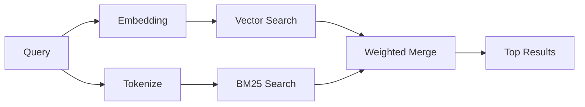

---
read_when:
    - 你想了解 memory_search 的工作原理
    - 你想选择一个嵌入提供商
    - 你想调优搜索质量
summary: 记忆搜索如何使用嵌入和混合检索查找相关笔记
title: 记忆搜索
x-i18n:
    generated_at: "2026-06-27T01:49:20Z"
    model: gpt-5.5
    postprocess_version: locale-links-v1
    provider: openai
    source_hash: b0bcb8cf400100ba8b6ddbb46bdf8b2a89a8bc32a550ee6df47c874e7e9e0879
    source_path: concepts/memory-search.md
    workflow: 16
---

`memory_search` 会从你的记忆文件中查找相关笔记，即使措辞与原文不同也可以。它的工作方式是将记忆索引为小块，然后使用嵌入、关键词或两者来搜索这些小块。

## 快速开始

记忆搜索默认使用 OpenAI 嵌入。要使用其他嵌入后端，请显式设置提供商：

```json5
{
  agents: {
    defaults: {
      memorySearch: {
        provider: "openai", // or "gemini", "local", "ollama", "openai-compatible", etc.
      },
    },
  },
}
```

对于带有记忆专用提供商的多端点设置，当该提供商设置了 `api: "ollama"` 或其他记忆嵌入适配器所有者时，`provider` 也可以是自定义的 `models.providers.<id>` 条目，例如 `ollama-5080`。

对于不需要 API key 的本地嵌入，请安装 `@openclaw/llama-cpp-provider` 并设置 `provider: "local"`。源码检出可能仍然需要原生构建批准：先运行 `pnpm approve-builds`，再运行 `pnpm rebuild node-llama-cpp`。

某些 OpenAI-compatible 嵌入端点需要非对称标签，例如搜索使用 `input_type: "query"`，已索引块使用 `input_type: "document"` 或 `"passage"`。请通过 `memorySearch.queryInputType` 和 `memorySearch.documentInputType` 配置这些项；参见 [记忆配置参考](/zh-CN/reference/memory-config#provider-specific-config)。

## 支持的提供商

| 提供商 | ID | 需要 API key | 说明 |
| ----------------- | ------------------- | ------------- | ----------------------------- |
| Bedrock | `bedrock` | 否 | 使用 AWS 凭证链 |
| DeepInfra | `deepinfra` | 是 | 默认：`BAAI/bge-m3` |
| Gemini | `gemini` | 是 | 支持图像/音频索引 |
| GitHub Copilot | `github-copilot` | 否 | 使用 Copilot 订阅 |
| Local | `local` | 否 | GGUF 模型，约 0.6 GB 下载 |
| Mistral | `mistral` | 是 | |
| Ollama | `ollama` | 否 | 本地/自托管 |
| OpenAI | `openai` | 是 | 默认 |
| OpenAI-compatible | `openai-compatible` | 通常需要 | 通用 `/v1/embeddings` |
| Voyage | `voyage` | 是 | |

## 搜索如何工作

OpenClaw 会并行运行两条检索路径并合并结果：



- **向量搜索**会查找语义相近的笔记（“gateway host” 会匹配 “the machine running OpenClaw”）。
- **BM25 关键词搜索**会查找精确匹配项（ID、错误字符串、配置键）。

如果只有一条路径可用，另一条路径会单独运行。有意使用的仅 FTS 模式（`provider: "none"`）以及自动/默认提供商选择，在嵌入不可用时仍然可以使用词法排序。

显式的非本地嵌入提供商则不同。如果你将 `memorySearch.provider` 设置为某个具体的远程后端提供商，而该提供商在运行时不可用，`memory_search` 会报告记忆不可用，而不是静默使用仅 FTS 的结果。这样可以让已配置但损坏的语义提供商保持可见。若要有意使用仅 FTS 召回，请设置 `provider: "none"`；或者修复提供商/凭证配置以恢复语义排序。

## 改善搜索质量

当你有大量笔记历史时，两个可选功能会有所帮助：

### 时间衰减

旧笔记会逐渐降低排序权重，使近期信息优先浮现。使用默认的 30 天半衰期时，上个月的一条笔记会得到其原始权重的 50%。像 `MEMORY.md` 这样的长期有效文件永远不会衰减。

<Tip>
如果你的智能体有数月的每日笔记，并且过时信息持续排在近期上下文之前，请启用时间衰减。
</Tip>

### MMR（多样性）

减少重复结果。如果五条笔记都提到同一个路由器配置，MMR 会确保顶部结果覆盖不同主题，而不是重复同一内容。

<Tip>
如果 `memory_search` 持续从不同的每日笔记返回近似重复的片段，请启用 MMR。
</Tip>

### 同时启用两者

```json5
{
  agents: {
    defaults: {
      memorySearch: {
        query: {
          hybrid: {
            mmr: { enabled: true },
            temporalDecay: { enabled: true },
          },
        },
      },
    },
  },
}
```

## 多模态记忆

使用 Gemini Embedding 2 时，你可以将图像和音频文件与 Markdown 一起建立索引。搜索查询仍然是文本，但它们会与视觉和音频内容进行匹配。设置方法参见 [记忆配置参考](/zh-CN/reference/memory-config)。

## 会话记忆搜索

你可以选择为会话转录建立索引，使 `memory_search` 能够回忆较早的对话。此功能通过 `memorySearch.experimental.sessionMemory` 选择启用。详情参见 [配置参考](/zh-CN/reference/memory-config)。

## 故障排除

**没有结果？** 运行 `openclaw memory status` 检查索引。如果为空，请运行 `openclaw memory index --force`。

**只有关键词匹配？** 你的嵌入提供商可能尚未配置。检查 `openclaw memory status --deep`。

**本地嵌入超时？** `ollama`、`lmstudio` 和 `local` 默认使用更长的内联批处理超时时间。如果主机只是较慢，请设置 `agents.defaults.memorySearch.sync.embeddingBatchTimeoutSeconds`，然后重新运行 `openclaw memory index --force`。

**找不到 CJK 文本？** 使用 `openclaw memory index --force` 重建 FTS 索引。

## 延伸阅读

- [主动记忆](/zh-CN/concepts/active-memory) -- 交互式聊天会话的子智能体记忆
- [记忆](/zh-CN/concepts/memory) -- 文件布局、后端、工具
- [记忆配置参考](/zh-CN/reference/memory-config) -- 所有配置旋钮

## 相关

- [记忆概览](/zh-CN/concepts/memory)
- [主动记忆](/zh-CN/concepts/active-memory)
- [内置记忆引擎](/zh-CN/concepts/memory-builtin)
