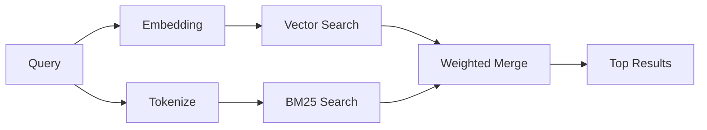

---
read_when:
    - 你想了解 memory_search 的工作原理
    - 你想选择一个嵌入提供商
    - 你想要调优搜索质量
summary: 记忆搜索如何使用嵌入和混合检索查找相关笔记
title: 记忆搜索
x-i18n:
    generated_at: "2026-04-30T14:28:18Z"
    model: gpt-5.5
    provider: openai
    source_hash: 7f40bbe32453a28070ffc67f19a4c06e2fe59a24237a2aef353f4b9b8260bcf2
    source_path: concepts/memory-search.md
    workflow: 16
---

`memory_search` 会从你的记忆文件中查找相关笔记，即使用词与原文不同也能找到。它通过将记忆索引成小块，并使用嵌入、关键字或两者来搜索这些小块。

## 快速开始

如果你已配置 GitHub Copilot 订阅，或 OpenAI、Gemini、Voyage、Mistral API key，记忆搜索会自动工作。要显式设置提供商：

```json5
{
  agents: {
    defaults: {
      memorySearch: {
        provider: "openai", // or "gemini", "local", "ollama", etc.
      },
    },
  },
}
```

对于多端点设置，当该提供商设置了 `api: "ollama"` 或其他嵌入适配器所有者时，`provider` 也可以是自定义的 `models.providers.<id>` 条目，例如 `ollama-5080`。

对于不需要 API key 的本地嵌入，设置 `provider: "local"`。打包安装会在 OpenClaw 管理的插件 runtime-deps 树中保留原生 `node-llama-cpp` 运行时；如果该树需要修复，请运行 `openclaw doctor --fix`。

某些 OpenAI 兼容的嵌入端点需要非对称标签，例如搜索使用 `input_type: "query"`，索引块使用 `input_type: "document"` 或 `"passage"`。使用 `memorySearch.queryInputType` 和 `memorySearch.documentInputType` 配置这些项；请参阅[记忆配置参考](/zh-CN/reference/memory-config#provider-specific-config)。

## 支持的提供商

| 提供商         | ID               | 需要 API key | 备注                                                 |
| -------------- | ---------------- | ------------ | ---------------------------------------------------- |
| Bedrock        | `bedrock`        | 否           | AWS 凭证链解析成功时自动检测                         |
| Gemini         | `gemini`         | 是           | 支持图像/音频索引                                    |
| GitHub Copilot | `github-copilot` | 否           | 自动检测，使用 Copilot 订阅                          |
| Local          | `local`          | 否           | GGUF 模型，下载约 0.6 GB                             |
| Mistral        | `mistral`        | 是           | 自动检测                                             |
| Ollama         | `ollama`         | 否           | 本地运行，必须显式设置                               |
| OpenAI         | `openai`         | 是           | 自动检测，速度快                                     |
| Voyage         | `voyage`         | 是           | 自动检测                                             |

## 搜索如何工作

OpenClaw 会并行运行两条检索路径并合并结果：



- **向量搜索**会查找含义相近的笔记（“gateway host”匹配“运行 OpenClaw 的机器”）。
- **BM25 关键字搜索**会查找精确匹配项（ID、错误字符串、配置键）。

如果只有一条路径可用（没有嵌入或没有 FTS），另一条路径会单独运行。

当嵌入不可用时，OpenClaw 仍会对 FTS 结果使用词法排序，而不是只回退到原始精确匹配排序。这种降级模式会提升查询词覆盖更强、文件路径更相关的块，即使没有 `sqlite-vec` 或嵌入提供商，也能保持有用的召回率。

## 提升搜索质量

当你有大量历史笔记时，两个可选功能会有所帮助：

### 时间衰减

旧笔记会逐渐降低排序权重，让近期信息优先浮现。默认半衰期为 30 天，上个月的笔记得分为其原始权重的 50%。像 `MEMORY.md` 这样的长期有效文件永远不会衰减。

<Tip>
如果你的智能体有数月的每日笔记，并且过时信息持续排在近期上下文前面，请启用时间衰减。
</Tip>

### MMR（多样性）

减少重复结果。如果五条笔记都提到相同的路由器配置，MMR 会确保顶部结果覆盖不同主题，而不是重复出现。

<Tip>
如果 `memory_search` 持续从不同的每日笔记返回近似重复的片段，请启用 MMR。
</Tip>

### 同时启用两者

```json5
{
  agents: {
    defaults: {
      memorySearch: {
        query: {
          hybrid: {
            mmr: { enabled: true },
            temporalDecay: { enabled: true },
          },
        },
      },
    },
  },
}
```

## 多模态记忆

使用 Gemini Embedding 2，你可以将图像和音频文件与 Markdown 一起索引。搜索查询仍然是文本，但会匹配视觉和音频内容。设置方法请参阅[记忆配置参考](/zh-CN/reference/memory-config)。

## 会话记忆搜索

你可以选择索引会话转录，这样 `memory_search` 就能回忆更早的对话。这需要通过 `memorySearch.experimental.sessionMemory` 主动启用。详情请参阅[配置参考](/zh-CN/reference/memory-config)。

## 故障排除

**没有结果？** 运行 `openclaw memory status` 检查索引。如果为空，运行 `openclaw memory index --force`。

**只有关键字匹配？** 你的嵌入提供商可能未配置。检查 `openclaw memory status --deep`。

**本地嵌入超时？** `ollama`、`lmstudio` 和 `local` 默认使用更长的内联批处理超时时间。如果主机只是速度慢，请设置 `agents.defaults.memorySearch.sync.embeddingBatchTimeoutSeconds`，然后重新运行 `openclaw memory index --force`。

**找不到 CJK 文本？** 使用 `openclaw memory index --force` 重建 FTS 索引。

## 延伸阅读

- [主动记忆](/zh-CN/concepts/active-memory) -- 交互式聊天会话的子智能体记忆
- [记忆](/zh-CN/concepts/memory) -- 文件布局、后端、工具
- [记忆配置参考](/zh-CN/reference/memory-config) -- 所有配置旋钮

## 相关内容

- [记忆概览](/zh-CN/concepts/memory)
- [主动记忆](/zh-CN/concepts/active-memory)
- [内置记忆引擎](/zh-CN/concepts/memory-builtin)
