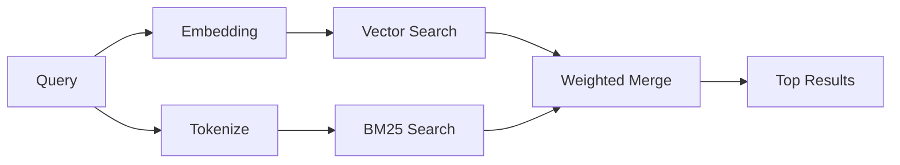

---
read_when:
    - 你想了解 memory_search 的工作原理
    - 你想选择一个嵌入提供商
    - 你想调优搜索质量
summary: 内存搜索如何使用嵌入和混合检索来查找相关笔记
title: 内存搜索
x-i18n:
    generated_at: "2026-04-15T09:41:03Z"
    model: gpt-5.4
    provider: openai
    source_hash: f5757aa8fe8f7fec30ef5c826f72230f591ce4cad591d81a091189d50d4262ed
    source_path: concepts/memory-search.md
    workflow: 15
---

# 内存搜索

`memory_search` 会从你的内存文件中找到相关笔记，即使措辞与原文不同也可以。它的工作方式是将内存内容索引为较小的分块，然后使用嵌入、关键词，或两者结合进行搜索。

## 快速开始

如果你已配置 GitHub Copilot 订阅、OpenAI、Gemini、Voyage 或 Mistral 的 API 密钥，内存搜索会自动工作。若要显式设置提供商：

```json5
{
  agents: {
    defaults: {
      memorySearch: {
        provider: "openai", // 或 "gemini"、"local"、"ollama" 等。
      },
    },
  },
}
```

如果你想在本地使用嵌入且不使用 API 密钥，请使用 `provider: "local"`（需要 `node-llama-cpp`）。

## 支持的提供商

| 提供商 | ID | 需要 API 密钥 | 说明 |
| -------------- | ---------------- | ------------- | ---------------------------------------------------- |
| Bedrock | `bedrock` | 否 | 当 AWS 凭证链可解析时自动检测 |
| Gemini | `gemini` | 是 | 支持图像/音频索引 |
| GitHub Copilot | `github-copilot` | 否 | 自动检测，使用 Copilot 订阅 |
| Local | `local` | 否 | GGUF 模型，下载约 0.6 GB |
| Mistral | `mistral` | 是 | 自动检测 |
| Ollama | `ollama` | 否 | 本地使用，必须显式设置 |
| OpenAI | `openai` | 是 | 自动检测，速度快 |
| Voyage | `voyage` | 是 | 自动检测 |

## 搜索如何工作

OpenClaw 会并行运行两条检索路径，并合并结果：



- **向量搜索** 会找到语义相近的笔记（“gateway host” 可匹配 “运行 OpenClaw 的机器”）。
- **BM25 关键词搜索** 会找到精确匹配项（ID、错误字符串、配置键）。

如果只有一条路径可用（没有嵌入或没有 FTS），则只运行另一条路径。

当嵌入不可用时，OpenClaw 仍会对 FTS 结果使用词法排序，而不是只退回到原始的精确匹配顺序。在这种降级模式下，它会提升那些查询词覆盖更强且文件路径更相关的分块，即使没有 `sqlite-vec` 或嵌入提供商，也能保持有用的召回效果。

## 提升搜索质量

当你拥有大量笔记历史时，有两个可选功能会很有帮助：

### 时间衰减

旧笔记会逐渐失去排序权重，因此最近的信息会优先显示。按默认的 30 天半衰期计算，上个月的一条笔记得分会降为原始权重的 50%。像 `MEMORY.md` 这样的常青文件永远不会衰减。

<Tip>
如果你的智能体积累了数个月的每日笔记，且过时信息总是排在近期上下文之前，请启用时间衰减。
</Tip>

### MMR（多样性）

减少重复结果。如果有五条笔记都提到同一个路由器配置，MMR 会确保靠前结果覆盖不同主题，而不是重复同类内容。

<Tip>
如果 `memory_search` 总是从不同的每日笔记中返回几乎重复的片段，请启用 MMR。
</Tip>

### 同时启用两者

```json5
{
  agents: {
    defaults: {
      memorySearch: {
        query: {
          hybrid: {
            mmr: { enabled: true },
            temporalDecay: { enabled: true },
          },
        },
      },
    },
  },
}
```

## 多模态内存

使用 Gemini Embedding 2 时，你可以将图像和音频文件与 Markdown 一起建立索引。搜索查询仍然是文本，但它们会与视觉和音频内容进行匹配。设置方法请参阅 [内存配置参考](/zh-CN/reference/memory-config)。

## 会话内存搜索

你还可以选择为会话转录建立索引，这样 `memory_search` 就能回忆更早的对话。这是通过 `memorySearch.experimental.sessionMemory` 选择启用的。详情请参阅[配置参考](/zh-CN/reference/memory-config)。

## 故障排除

**没有结果？** 运行 `openclaw memory status` 检查索引。如果索引为空，运行 `openclaw memory index --force`。

**只有关键词匹配？** 你的嵌入提供商可能尚未配置。请检查 `openclaw memory status --deep`。

**找不到 CJK 文本？** 请使用 `openclaw memory index --force` 重建 FTS 索引。

## 延伸阅读

- [Active Memory](/zh-CN/concepts/active-memory) —— 用于交互式聊天会话的子智能体内存
- [Memory](/zh-CN/concepts/memory) —— 文件布局、后端、工具
- [Memory configuration reference](/zh-CN/reference/memory-config) —— 所有配置选项
