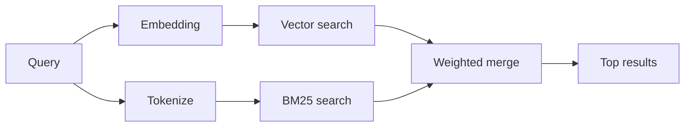

---
read_when:
    - 你想了解 memory_search 是如何工作的
    - 你想选择一个嵌入提供商
    - 你想调整搜索质量
summary: 记忆搜索如何使用嵌入和混合检索查找相关笔记
title: 记忆搜索
x-i18n:
    generated_at: "2026-07-05T11:14:30Z"
    model: gpt-5.5
    postprocess_version: locale-links-v1
    provider: openai
    source_hash: 1a29115d09ffc919e48a08e4b1ae4945f40b1e49c71c8a0a63af6f9f5ead1ddc
    source_path: concepts/memory-search.md
    workflow: 16
---

`memory_search` 会从你的记忆文件中查找相关笔记，即使表述与原始文本不同。它会将记忆分块成小片段，并使用嵌入、关键词或两者进行搜索。

## 快速开始

OpenClaw 默认使用 OpenAI 嵌入。若要使用其他提供商，请显式设置：

```json5
{
  agents: {
    defaults: {
      memorySearch: {
        provider: "openai", // or "gemini", "voyage", "mistral", "bedrock", "local", "ollama", "lmstudio", "github-copilot", "openai-compatible"
      },
    },
  },
}
```

`provider` 也可以引用自定义 `models.providers.<id>` 条目（例如 `ollama-5080`），只要该条目将 `api` 设置为 `"ollama"`，或设置为另一个带有记忆嵌入适配器的提供商 ID。

对于无需 API key 的本地嵌入，请安装官方 llama.cpp provider 插件，并设置 `provider: "local"`：

```bash
openclaw plugins install @openclaw/llama-cpp-provider
```

源码检出仍然需要原生构建批准：`pnpm approve-builds`，然后运行 `pnpm rebuild node-llama-cpp`。

某些 OpenAI 兼容嵌入端点需要非对称 `input_type` 标签，例如搜索使用 `"query"`，索引块使用 `"document"`/`"passage"`。请使用 `queryInputType` 和 `documentInputType` 设置这些值；参见[记忆配置参考](/zh-CN/reference/memory-config#provider-specific-config)。

## 支持的提供商

| 提供商            | ID                  | 需要 API key | 说明                              |
| ----------------- | ------------------- | ------------ | --------------------------------- |
| Bedrock           | `bedrock`           | 否           | 使用 AWS 凭证链                  |
| DeepInfra         | `deepinfra`         | 是           | 默认模型 `BAAI/bge-m3`            |
| Gemini            | `gemini`            | 是           | 支持图像/音频索引                |
| GitHub Copilot    | `github-copilot`    | 否           | 使用你的 Copilot 订阅            |
| 本地              | `local`             | 否           | GGUF 模型，约 0.6 GB 自动下载     |
| LM Studio         | `lmstudio`          | 否           | 本地/自托管服务器                |
| Mistral           | `mistral`           | 是           |                                   |
| Ollama            | `ollama`            | 否           | 本地/自托管服务器                |
| OpenAI            | `openai`            | 是           | 默认                              |
| OpenAI 兼容       | `openai-compatible` | 通常         | 通用 `/v1/embeddings` 端点        |
| Voyage            | `voyage`            | 是           |                                   |

## 搜索工作原理

OpenClaw 会并行运行两条检索路径，并合并结果：



- **向量搜索**匹配相似含义（“gateway host” 可匹配 “the
  machine running OpenClaw”）。
- **BM25 关键词搜索**匹配精确术语（ID、错误字符串、配置键）。

如果只有一条路径可用，则仅运行该路径。

**仅 FTS 模式。** 设置 `provider: "none"` 可有意禁用嵌入，并仅使用关键词搜索。若 `provider` 未设置或设置为 `"auto"`，在没有配置嵌入凭证时，也会回退到仅关键词排序且不报错；`provider: "local"`（GGUF/llama.cpp provider）失败时也是如此。

**显式提供商不可用。** 如果你显式指定任何其他提供商（例如 `openai`、`ollama`、`gemini`），而它在请求时变得不可用（凭证错误、网络失败），`memory_search` 会报告记忆不可用，而不是静默降级为仅 FTS 结果。这样可以让配置损坏的提供商保持可见。若要有意使用仅 FTS 召回，请设置 `provider: "none"`；或修复提供商/凭证配置以恢复语义排序。

## 提升搜索质量

两个可选功能有助于处理大量笔记历史。

### 时间衰减

旧笔记会逐渐降低排序权重，使近期信息优先浮现。使用默认 30 天半衰期时，上个月的笔记得分为其原始权重的 50%。`MEMORY.md` 和 `memory/` 下其他无日期文件是常青内容，永不衰减；只有带日期的 `memory/YYYY-MM-DD.md` 文件会衰减。

<Tip>
如果你的智能体已有数月的每日笔记，而陈旧信息总是排在近期上下文之前，请启用此功能。
</Tip>

### MMR（多样性）

减少重复结果。如果五条笔记都提到同一个路由器配置，MMR 会确保顶部结果覆盖不同主题，而不是重复同一内容。

<Tip>
如果 `memory_search` 总是从不同每日笔记返回近似重复的片段，请启用此功能。
</Tip>

### 同时启用两者

```json5
{
  agents: {
    defaults: {
      memorySearch: {
        query: {
          hybrid: {
            mmr: { enabled: true },
            temporalDecay: { enabled: true },
          },
        },
      },
    },
  },
}
```

## 多模态记忆

使用 `gemini-embedding-2-preview` 时，你可以在 Markdown 之外同时索引图像和音频。这仅适用于 `memorySearch.extraPaths` 下的文件；默认记忆根（`MEMORY.md`、`memory/*.md`）仍仅支持 Markdown。搜索查询仍是文本，但会匹配视觉和音频内容。设置方法参见[记忆配置参考](/zh-CN/reference/memory-config#multimodal-memory-gemini)。

## 会话记忆搜索

可以选择索引会话转录，使 `memory_search` 能召回较早的对话。这是可选功能：设置 `experimental.sessionMemory: true`，并将 `"sessions"` 添加到 `sources`（默认 `sources` 为 `["memory"]`）。

会话命中遵循 `tools.sessions.visibility`：默认 `"tree"` 仅暴露当前会话及其派生的会话。若要从不同会话中召回无关的同一智能体会话（例如来自私信的 Gateway 网关分发会话），请将可见性扩大为 `"agent"`。

使用 QMD 后端时，还要设置 `memory.qmd.sessions.enabled: true`，以便将转录导出到 QMD 集合；仅设置 `experimental.sessionMemory` 和 `sources` 不会把转录导出到 QMD。参见[配置参考](/zh-CN/reference/memory-config#session-memory-search-experimental)。

## 故障排查

**没有结果？** 运行 `openclaw memory status` 检查索引。如果为空，请运行 `openclaw memory index --force`。

**只有关键词匹配？** 你的嵌入提供商可能尚未配置。检查 `openclaw memory status --deep`。

**本地嵌入超时？** `ollama`、`lmstudio` 和 `local` 默认使用更长的内联批处理超时。如果主机只是速度较慢，请设置 `agents.defaults.memorySearch.sync.embeddingBatchTimeoutSeconds`，然后重新运行 `openclaw memory index --force`。

**找不到 CJK 文本？** 使用 `openclaw memory index --force` 重建 FTS 索引。

## 相关

- [记忆概览](/zh-CN/concepts/memory)
- [主动记忆](/zh-CN/concepts/active-memory)
- [内置记忆引擎](/zh-CN/concepts/memory-builtin)
- [记忆配置参考](/zh-CN/reference/memory-config)
