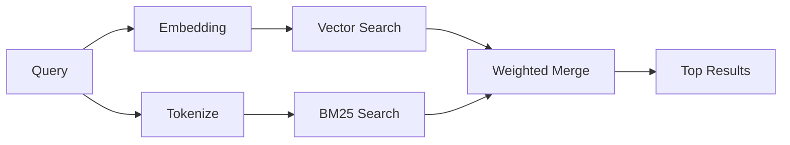

---
read_when:
    - 你想了解 `memory_search` 的工作方式
    - 你想选择一个嵌入提供商
    - 你想调优搜索质量
summary: 记忆搜索如何使用嵌入和混合检索来查找相关笔记
title: 记忆搜索
x-i18n:
    generated_at: "2026-04-05T08:21:24Z"
    model: gpt-5.4
    provider: openai
    source_hash: 87b1cb3469c7805f95bca5e77a02919d1e06d626ad3633bbc5465f6ab9db12a2
    source_path: concepts/memory-search.md
    workflow: 15
---

# 记忆搜索

`memory_search` 会从你的记忆文件中查找相关笔记，即使
措辞与原始文本不同也可以。它的工作方式是将记忆索引为较小的
分块，然后使用嵌入、关键词或两者结合进行搜索。

## 快速开始

如果你已配置 OpenAI、Gemini、Voyage 或 Mistral API 密钥，记忆
搜索会自动生效。若要显式设置提供商：

```json5
{
  agents: {
    defaults: {
      memorySearch: {
        provider: "openai", // 或 "gemini"、"local"、"ollama" 等
      },
    },
  },
}
```

若要使用无 API 密钥的本地嵌入，请使用 `provider: "local"`（需要
`node-llama-cpp`）。

## 支持的提供商

| Provider | ID        | Needs API key | Notes                    |
| -------- | --------- | ------------- | ------------------------ |
| OpenAI   | `openai`  | Yes           | 自动检测，速度快         |
| Gemini   | `gemini`  | Yes           | 支持图片/音频索引        |
| Voyage   | `voyage`  | Yes           | 自动检测                 |
| Mistral  | `mistral` | Yes           | 自动检测                 |
| Ollama   | `ollama`  | No            | 本地，必须显式设置       |
| Local    | `local`   | No            | GGUF 模型，约 0.6 GB 下载 |

## 搜索如何工作

OpenClaw 会并行运行两条检索路径，并合并结果：



- **向量搜索**会查找语义相近的笔记（“gateway host” 可以匹配
  “运行 OpenClaw 的那台机器”）。
- **BM25 关键词搜索**会查找精确匹配（ID、错误字符串、配置
  键）。

如果只有一条路径可用（没有嵌入或没有 FTS），则只运行另一条路径。

## 提高搜索质量

当你有大量笔记历史时，有两个可选功能会很有帮助：

### 时间衰减

旧笔记会逐渐降低排序权重，从而让较新的信息优先出现。
在默认的 30 天半衰期下，上个月的笔记得分会降为其原始权重的 50%。
像 `MEMORY.md` 这样的常青文件永远不会衰减。

<Tip>
如果你的智能体积累了数月的每日笔记，而过时
信息总是排在较新的上下文之前，请启用时间衰减。
</Tip>

### MMR（多样性）

减少重复结果。如果有五条笔记都提到了相同的路由器配置，MMR
会确保顶部结果覆盖不同主题，而不是重复出现。

<Tip>
如果 `memory_search` 总是返回来自
不同每日笔记但内容近乎重复的片段，请启用 MMR。
</Tip>

### 同时启用两者

```json5
{
  agents: {
    defaults: {
      memorySearch: {
        query: {
          hybrid: {
            mmr: { enabled: true },
            temporalDecay: { enabled: true },
          },
        },
      },
    },
  },
}
```

## 多模态记忆

使用 Gemini Embedding 2 时，你可以连同
Markdown 一起索引图片和音频文件。搜索查询仍然是文本，但会与视觉和音频
内容进行匹配。设置方法请参阅[记忆配置参考](/reference/memory-config)。

## 会话记忆搜索

你还可以选择为会话转录建立索引，这样 `memory_search` 就能回忆起
更早的对话。这是通过
`memorySearch.experimental.sessionMemory` 选择启用的。详情请参阅
[配置参考](/reference/memory-config)。

## 故障排除

**没有结果？** 运行 `openclaw memory status` 检查索引。如果索引为空，请运行
`openclaw memory index --force`。

**只有关键词匹配？** 你的嵌入提供商可能尚未配置。请检查
`openclaw memory status --deep`。

**找不到 CJK 文本？** 请使用
`openclaw memory index --force` 重建 FTS 索引。

## 延伸阅读

- [记忆](/concepts/memory) -- 文件布局、后端、工具
- [记忆配置参考](/reference/memory-config) -- 所有配置项
