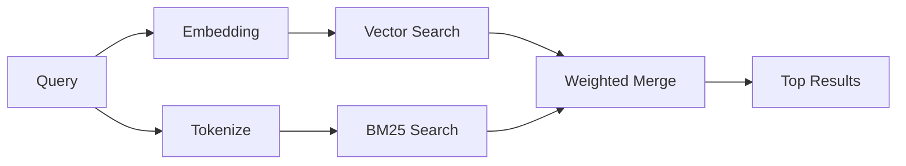

---
read_when:
    - 你想了解 memory_search 是如何工作的
    - 你想选择一个嵌入提供商
    - 你想调整搜索质量
summary: 内存搜索如何使用嵌入和混合检索来查找相关笔记
title: 内存搜索
x-i18n:
    generated_at: "2026-04-28T02:18:30Z"
    model: gpt-5.4
    provider: openai
    source_hash: 3e6c44d90f49a797bda01b9a575928c128a334f89ae14fc3620e65562a866aa9
    source_path: concepts/memory-search.md
    workflow: 15
---

`memory_search` 会从你的记忆文件中查找相关笔记，即使措辞与原文不同也可以。它的工作方式是将记忆内容索引为小块，然后使用嵌入、关键词或两者结合来进行搜索。

## 快速开始

如果你已配置 GitHub Copilot 订阅、OpenAI、Gemini、Voyage 或 Mistral API key，内存搜索会自动工作。若要显式设置提供商：

```json5
{
  agents: {
    defaults: {
      memorySearch: {
        provider: "openai", // 或 "gemini"、"local"、"ollama" 等。
      },
    },
  },
}
```

对于多端点设置，`provider` 也可以是自定义的 `models.providers.<id>` 条目，例如 `ollama-5080`，前提是该提供商设置了 `api: "ollama"` 或其他嵌入适配器所有者。

如果你想使用无需 API key 的本地嵌入，请在 OpenClaw 旁边安装可选的 `node-llama-cpp` 运行时包，并使用 `provider: "local"`。

某些与 OpenAI 兼容的嵌入端点需要非对称标签，例如搜索时使用 `input_type: "query"`，为已索引分块使用 `input_type: "document"` 或 `"passage"`。可通过 `memorySearch.queryInputType` 和 `memorySearch.documentInputType` 进行配置；参见 [Memory configuration reference](/zh-CN/reference/memory-config#provider-specific-config)。

## 支持的提供商

| 提供商 | ID | 需要 API key | 说明 |
| -------------- | ---------------- | ------------- | ---------------------------------------------------- |
| Bedrock | `bedrock` | 否 | 当 AWS 凭证链可解析时自动检测 |
| Gemini | `gemini` | 是 | 支持图像/音频索引 |
| GitHub Copilot | `github-copilot` | 否 | 自动检测，使用 Copilot 订阅 |
| Local | `local` | 否 | GGUF 模型，下载大小约 0.6 GB |
| Mistral | `mistral` | 是 | 自动检测 |
| Ollama | `ollama` | 否 | 本地，必须显式设置 |
| OpenAI | `openai` | 是 | 自动检测，速度快 |
| Voyage | `voyage` | 是 | 自动检测 |

## 搜索如何工作

OpenClaw 会并行运行两条检索路径，并合并结果：



- **向量搜索** 查找语义相近的笔记（“gateway host” 可以匹配 “the machine running OpenClaw”）。
- **BM25 关键词搜索** 查找精确匹配（ID、错误字符串、配置键）。

如果只有一条路径可用（没有嵌入或没有 FTS），则仅运行另一条路径。

当嵌入不可用时，OpenClaw 仍会对 FTS 结果使用词法排序，而不只是退化为原始的精确匹配顺序。这种降级模式会提升那些查询词覆盖更强、文件路径更相关的分块，从而即使没有 `sqlite-vec` 或嵌入提供商，也能保持较好的召回效果。

## 提升搜索质量

当你有大量笔记历史时，两项可选功能会有所帮助：

### 时间衰减

旧笔记的排名权重会逐渐降低，因此最近的信息会优先显示。默认半衰期为 30 天，这意味着上个月的笔记得分会降至原始权重的 50%。像 `MEMORY.md` 这样的常青文件永远不会衰减。

<Tip>
如果你的智能体积累了数个月的每日笔记，而过时信息总是排在最新上下文之前，请启用时间衰减。
</Tip>

### MMR（多样性）

减少重复结果。如果五条笔记都提到同一份路由器配置，MMR 会确保顶部结果覆盖不同主题，而不是反复出现相似内容。

<Tip>
如果 `memory_search` 总是从不同的每日笔记中返回近乎重复的片段，请启用 MMR。
</Tip>

### 同时启用两者

```json5
{
  agents: {
    defaults: {
      memorySearch: {
        query: {
          hybrid: {
            mmr: { enabled: true },
            temporalDecay: { enabled: true },
          },
        },
      },
    },
  },
}
```

## 多模态记忆

使用 Gemini Embedding 2 时，你可以在 Markdown 之外同时索引图像和音频文件。搜索查询仍然是文本，但它们可以匹配视觉和音频内容。设置方法请参见 [Memory configuration reference](/zh-CN/reference/memory-config)。

## 会话内存搜索

你也可以选择为会话转录建立索引，这样 `memory_search` 就能回忆更早的对话。这是通过 `memorySearch.experimental.sessionMemory` 选择启用的。详情请参见 [configuration reference](/zh-CN/reference/memory-config)。

## 故障排除

**没有结果？** 运行 `openclaw memory status` 检查索引。如果为空，运行 `openclaw memory index --force`。

**只有关键词匹配？** 你的嵌入提供商可能尚未配置。检查 `openclaw memory status --deep`。

**本地嵌入超时？** `ollama`、`lmstudio` 和 `local` 默认使用更长的内联批处理超时时间。如果只是主机较慢，请设置 `agents.defaults.memorySearch.sync.embeddingBatchTimeoutSeconds`，然后重新运行 `openclaw memory index --force`。

**找不到 CJK 文本？** 使用 `openclaw memory index --force` 重新构建 FTS 索引。

## 进一步阅读

- [Active Memory](/zh-CN/concepts/active-memory) -- 用于交互式聊天会话的子智能体记忆
- [Memory](/zh-CN/concepts/memory) -- 文件布局、后端、工具
- [Memory configuration reference](/zh-CN/reference/memory-config) -- 所有配置项

## 相关内容

- [Memory overview](/zh-CN/concepts/memory)
- [Active memory](/zh-CN/concepts/active-memory)
- [Builtin memory engine](/zh-CN/concepts/memory-builtin)
