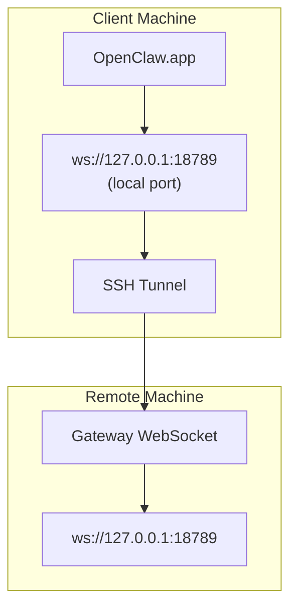

<Note>
此内容现在位于 [远程访问](/zh-CN/gateway/remote#macos-persistent-ssh-tunnel-via-launchagent)。请使用该页面查看当前指南；本页保留为重定向目标。
</Note>

# 使用远程 Gateway 网关运行 OpenClaw.app

OpenClaw.app 通过 SSH 隧道访问远程 Gateway 网关：SSH `LocalForward` 会将本地端口映射到远程主机上的 Gateway 网关 WebSocket 端口。

## 设置

1. 添加一个带有 `LocalForward 18789 127.0.0.1:18789` 的 SSH 配置条目（完整配置块见 [远程访问](/zh-CN/gateway/remote#macos-persistent-ssh-tunnel-via-launchagent)）。
2. 使用 `ssh-copy-id` 将你的 SSH 密钥复制到远程主机。
3. 通过 `openclaw config set gateway.remote.token "<your-token>"` 设置 `gateway.remote.token`（或 `gateway.remote.password`）。
4. 启动隧道：`ssh -N remote-gateway &`。
5. 退出并重新打开 OpenClaw.app。

如果需要在重启后仍然保留并自动重连的隧道，请使用 [远程访问](/zh-CN/gateway/remote#macos-persistent-ssh-tunnel-via-launchagent) 页面上的 LaunchAgent 设置，而不是手动运行 `ssh -N`。

## 工作原理

| 组件                                 | 作用                                                          |
| ------------------------------------ | ------------------------------------------------------------- |
| `LocalForward 18789 127.0.0.1:18789` | 将本地端口 18789 转发到远程端口 18789                        |
| `ssh -N`                             | 不执行远程命令的 SSH（仅用于端口转发）                       |
| `KeepAlive`                          | 如果隧道崩溃，则自动重启隧道（LaunchAgent）                  |
| `RunAtLoad`                          | 在 LaunchAgent 加载时启动隧道（LaunchAgent）                 |

OpenClaw.app 会连接到客户端上的 `ws://127.0.0.1:18789`。隧道会将该连接转发到运行 Gateway 网关的远程主机上的 18789 端口。

## 相关内容

- [远程访问](/zh-CN/gateway/remote)
- [Tailscale](/zh-CN/gateway/tailscale)
