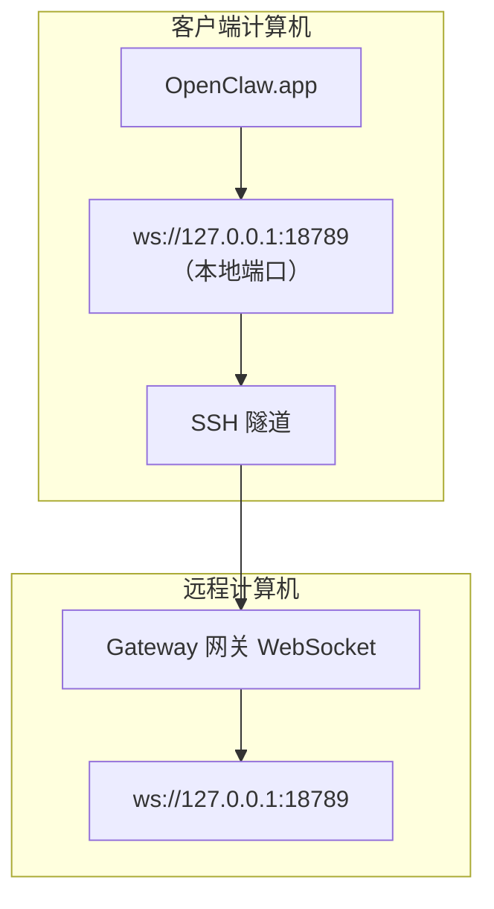

<Note>
此内容现已迁移至[远程访问](/zh-CN/gateway/remote#macos-persistent-ssh-tunnel-via-launchagent)。请在该页面查看最新指南；本页面保留为重定向目标。
</Note>

# 通过远程 Gateway 网关运行 OpenClaw.app

OpenClaw.app 通过 SSH 隧道连接远程 Gateway 网关：SSH `LocalForward` 将本地端口映射到远程主机上的 Gateway 网关 WebSocket 端口。

## 设置

1. 添加包含 `LocalForward 18789 127.0.0.1:18789` 的 SSH 配置项（完整配置块请参阅[远程访问](/zh-CN/gateway/remote#macos-persistent-ssh-tunnel-via-launchagent)）。
2. 使用 `ssh-copy-id` 将 SSH 密钥复制到远程主机。
3. 通过 `openclaw config set gateway.remote.token "<your-token>"` 设置 `gateway.remote.token`（或 `gateway.remote.password`）。
4. 启动隧道：`ssh -N remote-gateway &`。
5. 退出并重新打开 OpenClaw.app。

如果需要隧道在重启后继续运行并自动重新连接，请使用[远程访问](/zh-CN/gateway/remote#macos-persistent-ssh-tunnel-via-launchagent)页面上的 LaunchAgent 设置，而不是手动运行 `ssh -N`。

## 工作原理

| 组件                                 | 作用                                                     |
| ------------------------------------ | -------------------------------------------------------- |
| `LocalForward 18789 127.0.0.1:18789` | 将本地端口 18789 转发到远程端口 18789                    |
| `ssh -N`                             | 不执行远程命令的 SSH（仅进行端口转发）                   |
| `KeepAlive`                          | 隧道崩溃时自动重启隧道（LaunchAgent）                    |
| `RunAtLoad`                          | LaunchAgent 加载时启动隧道（LaunchAgent）                |

OpenClaw.app 连接客户端上的 `ws://127.0.0.1:18789`。隧道将该连接转发到运行 Gateway 网关的远程主机上的 18789 端口。

## 相关内容

- [远程访问](/zh-CN/gateway/remote)
- [Tailscale](/zh-CN/gateway/tailscale)
